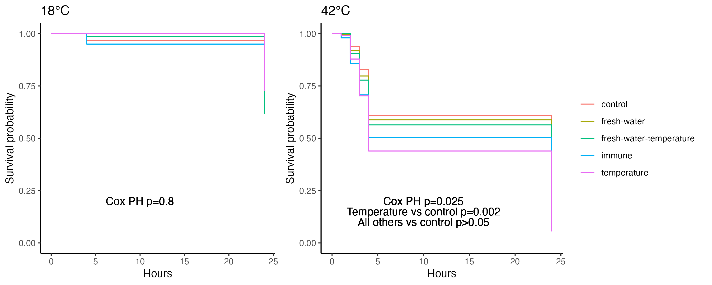

# Outplant Growth and Survival Analysis - 10K Seed Hardening Project

**Author:** AS Huffmyer  
**Date:** October 16, 2025  
**Analysis Date:** August 20, 2025

## Project Summary

The 10K Seed Hardening Project investigates the effects of different hardening treatments on Pacific oyster (*Crassostrea gigas*) seed resilience and performance. This project aims to evaluate whether pre-conditioning juvenile oysters through various stress exposures (temperature, salinity, immune challenge) can improve their survival and growth when outplanted to field conditions.

### Experimental Design

Approximately 10,000 Pacific oyster seed were divided into five treatment groups:

1. **Control** - No hardening treatment
2. **35C** - Temperature hardening (35°C exposure)
3. **FW** - Fresh water (salinity stress) hardening
4. **FW 35C** - Combined fresh water and temperature hardening
5. **Immune** - Immune challenge hardening

Each treatment group consisted of 6 replicate bags, with 150 oysters initially placed in each bag. Oysters were outplanted to field conditions and monitored for growth and survival over time.

## Growth Analysis

### Methods

Growth measurements were conducted on August 20, 2025. For each bag, multiple oysters were measured for:
- Length (mm)
- Width (mm)

Since depth measurements were not available, volume was estimated using a polynomial regression model trained on data from the same source population at Goose Point, where length, width, and depth were all measured. The volume calculation used the ellipsoid formula:

**Volume = (4/3) × π × (length/2) × (width/2) × (depth/2)**

The polynomial model was:
```
volume ~ poly(length.mm, 2) + poly(width.mm, 2) + length.mm:width.mm
```

### Data Quality Control

Several quality control steps were implemented:
- Bag 12 was identified as an outlier (much larger than all others) and removed from analysis
- Observations resulting in negative predicted volumes were removed
- Upper outliers (volume > 125,000 mm³) were filtered out
- Standardized residuals were checked for outliers (threshold = 3 standard deviations)

### Statistical Analysis

A linear mixed effects model was used to test for treatment effects on growth:

```r
model <- lmer(sqrt(Predicted_Volume_Poly) ~ treatment + (1|purple.tag:treatment), data=data)
```

The model used:
- **Fixed effect:** Treatment group
- **Random effect:** Bag nested within treatment (purple.tag:treatment)
- **Transformation:** Square root transformation of predicted volume to improve normality

### Results


*Figure 1: Predicted oyster volume (mm³) by bag, colored by treatment. Each point represents an individual oyster measurement.*


*Figure 2: Predicted oyster volume (mm³) by treatment group. No significant differences were observed among treatments.*

**Key Finding:** There were **no significant differences in growth** among treatment groups (p > 0.05). All hardening treatments resulted in similar final sizes when outplanted to field conditions.

The lack of treatment effects suggests that:
1. The hardening treatments did not negatively impact growth capacity
2. Field conditions may override any growth advantages conferred by pre-conditioning
3. All oysters, regardless of treatment, were able to grow similarly under field conditions

## Survival Analysis

### Methods

Survival was assessed by counting the number of alive oysters in each bag on August 20, 2025. Survival rate was calculated as:

**Survival = (Number alive on 8/20/25) / (Starting number of oysters)**

Each bag started with 150 oysters. A non-parametric Kruskal-Wallis test was used to compare survival among treatments due to non-normal distribution of the data.

### Results

The survival analysis revealed interesting patterns:

**Statistical Test:**
```r
kruskal.test(survival~treatment, data=data)
```

Result: **Non-significant** (p > 0.05), but there was a trend for lower survival in the immune-challenged oysters.

**Survival by Treatment (approximate means):**
- Control: ~50-70%
- 35C: ~40-70%
- FW: ~40-75%
- FW 35C: ~50-65%
- Immune: ~20-40% (notably lower trend)


*Figure 3: Kaplan-Meier survival curves showing survival probability over time for different hardening treatments.*

**Key Finding:** While not statistically significant at the α = 0.05 level, there was a **trend for reduced survival in immune-challenged oysters** compared to other treatment groups.

## Interpretation and Conclusions

### Growth Performance

The absence of treatment effects on growth is both informative and encouraging:

1. **No negative impacts:** None of the hardening treatments resulted in reduced growth, suggesting that the stress exposures did not cause lasting growth depression or metabolic costs that persisted into the field phase.

2. **Field conditions dominate:** Once deployed to the field, environmental conditions (food availability, water quality, temperature) appear to be the primary drivers of growth, superseding any metabolic or physiological differences induced by pre-conditioning.

3. **Phenotypic plasticity:** Pacific oysters demonstrated remarkable plasticity, with all groups converging on similar growth trajectories regardless of their conditioning history.

### Survival Patterns

The survival results present a more nuanced picture:

1. **Immune challenge concern:** The trend toward lower survival in immune-challenged oysters warrants attention. This could indicate:
   - The immune challenge may have caused lasting physiological stress
   - Potential trade-offs between immune activation and other fitness components
   - Possible delayed mortality effects from the immune stimulation

2. **Other treatments maintained survival:** Temperature and salinity hardening treatments showed survival comparable to controls, suggesting these stress exposures did not compromise field performance.

3. **High variability:** The wide range of survival within treatments (e.g., Immune group ranged from 0% to ~33%) suggests that individual bag-level factors (microenvironment, handling, stocking quality) may be as important as treatment effects.

### Overall Assessment

**Positive findings:**
- No growth penalties from hardening treatments
- Temperature and salinity hardening do not reduce survival
- Oysters show strong adaptive capacity

**Areas of concern:**
- Immune challenge treatment may reduce survival
- High mortality overall across some bags suggests field conditions were challenging

**Recommendations for future work:**
1. Increase sample sizes and replication to detect subtle survival differences
2. Monitor oysters over longer time periods to assess delayed treatment effects
3. Investigate the mechanisms underlying potential immune challenge effects
4. Consider dose-response studies for immune challenge intensity
5. Evaluate cost-benefit of hardening protocols in commercial settings

### Study Limitations

1. **Volume estimation:** Growth measurements were limited to length and width; depth was predicted using a model rather than directly measured, potentially introducing error.

2. **Single time point:** Growth was assessed at only one time point, limiting our ability to assess growth trajectories over time.

3. **Initial size unknown:** The analysis examined final size but did not normalize to initial size, which could mask treatment effects on growth rates.

4. **Bag-level losses:** Several bags had very low oyster numbers or were lost entirely, reducing effective sample size.

5. **Field variability:** Unmeasured environmental variation in the field (e.g., localized food availability, predation, sedimentation) may have obscured treatment effects.

## Data and Code Availability

- **Analysis script:** `scripts/outplant-growth.Rmd`
- **Survival script:** `scripts/outplant-survival.Rmd`
- **Growth data:** `data/outplant/outplant-growth.csv`
- **Survival data:** `data/outplant/outplant-survival.csv`
- **Metadata:** `data/outplant/outplant-metadata.csv`

## Acknowledgments

This work is part of the 10K Seed Hardening Project at Roberts Lab. Data collection and analysis conducted by AS Huffmyer.

---

*Last updated: October 16, 2025*
