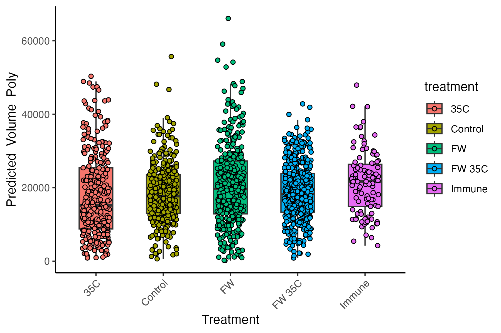
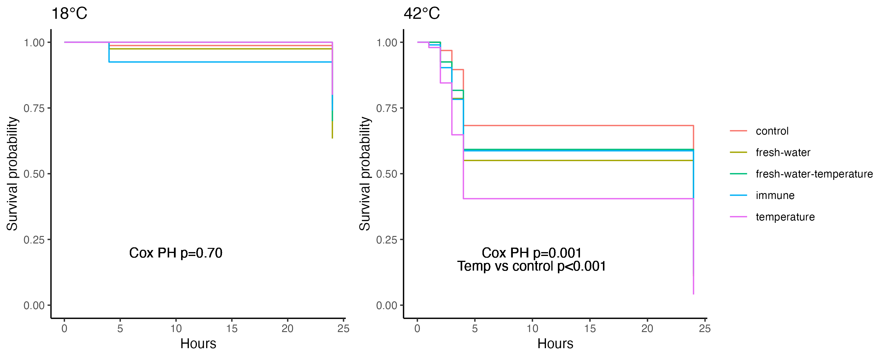
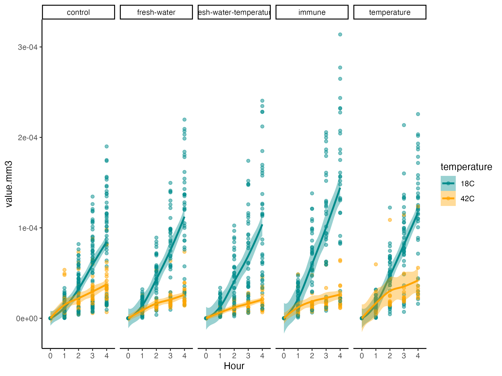

# 10K Seed Hardening Project - Grant Reporting Summary

**Project Title:** Effects of Hardening Treatments on Pacific Oyster Seed Field Performance  
**Species:** Pacific oyster (*Crassostrea gigas*)  
**Principal Investigator:** Roberts Lab  
**Report Date:** November 2025  

---

## Project Overview

The 10K Seed Hardening Project investigated whether pre-conditioning (also referred to as "priming" or "hardening") juvenile Pacific oyster seed through various stress exposures could improve their survival, growth, and physiological resilience when outplanted to field conditions. This project evaluated five different treatment protocols, comparing them to control oysters that received no hardening treatment.

### Research Question
Can controlled stress exposures prior to field deployment enhance oyster performance and survival under natural field conditions?

---

## Materials and Methods

### Experimental Animals

**Source and Initial Conditions:**
- Approximately **10,000 Pacific oyster (*Crassostrea gigas*) seed** were used in this study
- Oysters were juvenile seed at the start of the experiment (July 2024)
- Initial size measurements (July 22-29, 2024):
  - Length: 13.5 - 33.4 mm (mean ~20-25 mm)
  - Width: 13.6 - 21.6 mm (mean ~15-19 mm)
  - These measurements represent small juvenile/spat stage oysters

**Experimental Design:**
- Five treatment groups with two bags per treatment (2 replicate bags)
- Each bag initially contained **150 oysters**
- Total bags: 10 bags (5 treatments × 2 bags)
- Additional bags used for replication in second conditioning round

### Conditioning/Priming Treatments

All oysters underwent two rounds of conditioning treatments:

#### **Round 1: Initial Short-Term Conditioning (June 28 - July 15, 2024)**

**1. Control Treatment**
   - **Bags:** 36, 37
   - **Procedure:** No hardening treatment applied
   - **Purpose:** Baseline comparison group maintained under ambient hatchery conditions

**2. Temperature Hardening (35C)**
   - **Bags:** 47, 30
   - **Procedure:** 
     - Exposure to 35°C seawater
     - Duration: 1 hour per exposure
     - Frequency: Daily exposures from June 28 to July 15, 2024 (approximately 7 exposures over 17 days)
   - **Rationale:** Pre-condition oysters to elevated temperatures to enhance thermal tolerance

**3. Fresh Water Hardening (FW)**
   - **Bags:** 66, 56
   - **Procedure:** 
     - Exposure to fresh water (salinity stress)
     - Duration: 1 hour per exposure
     - Frequency: Daily exposures from June 28 to July 15, 2024 (approximately 7 exposures over 17 days)
   - **Rationale:** Enhance osmoregulatory capacity and stress response

**4. Combined Fresh Water + Temperature Hardening (FW 35C)**
   - **Bags:** 75, 76
   - **Procedure:** 
     - Simultaneous exposure to fresh water AND 35°C temperature
     - Duration: 1 hour per exposure
     - Frequency: Daily exposures from June 28 to July 15, 2024 (approximately 7 exposures over 17 days)
   - **Rationale:** Test synergistic effects of multiple stressors

**5. Immune Challenge Hardening (Immune)**
   - **Bags:** 50, 49
   - **Procedure:** 
     - Immune stimulation treatment
     - Duration: 1.5 hours per exposure
     - Frequency: Exposures on July 12 and July 15, 2024 (2 exposures)
   - **Rationale:** Prime immune system for enhanced disease resistance

#### **Round 2: Extended Conditioning (September 13 - October 15, 2024)**

After the initial conditioning, oysters were maintained under standard conditions, then received a second, more intensive round of conditioning:

**1. Control Treatment**
   - **Procedure:** Continued maintenance under ambient conditions with no hardening treatment

**2. Temperature Hardening (35C)**
   - **Bags:** Transferred to new bags 93, 90
   - **Procedure:** 
     - Exposure to 35°C seawater
     - Duration: 6 hours daily
     - Frequency: Daily from September 13-20, 2024 (8 consecutive days)

**3. Fresh Water Hardening (FW)**
   - **Bags:** Transferred to new bags 70, 89
   - **Procedure:** 
     - Exposure to fresh water
     - Duration: 2 hours per exposure
     - Frequency: 3 times per week (September 13, 15, 17, 20, 2024)

**4. Combined Fresh Water + Temperature Hardening (FW 35C)**
   - **Bags:** Transferred to new bags 72, 59
   - **Procedure:** 
     - Temperature: 6 hours daily at 35°C from September 13-20, 2024
     - Fresh water: 2 hours, 3 times per week (combined with temperature exposures)

**5. Immune Challenge Hardening (Immune)**
   - **Bags:** Transferred to new bags 55, 74
   - **Procedure:** 
     - Duration: 1.5 hours per exposure
     - Frequency: Three exposures on October 7, 10, and 15, 2024

### Field Outplanting

Following the second round of conditioning treatments, oysters were outplanted to field conditions to assess whether the hardening treatments improved field performance.

**Outplanting Details:**
- Oysters were placed in mesh bags at a field site
- Each replicate bag was assigned a color-coded purple tag for tracking (tags 1-30)
- Bags were deployed in the field and monitored over time
- Field monitoring date: August 20, 2025

### Assessment Methods

#### **1. Field Growth Assessment**

**Measurement Date:** August 20, 2025

**Procedure:**
- Multiple oysters from each bag were measured for shell dimensions
- **Length (mm):** Maximum anterior-posterior shell length
- **Width (mm):** Maximum dorsal-ventral shell width
- **Volume estimation:** Since depth measurements were not available in the field, oyster volume was calculated using a polynomial regression model trained on oysters from the same source population at Goose Point where all three dimensions (length, width, depth) were measured
- Volume formula: V = (4/3) × π × (length/2) × (width/2) × (depth/2)
- Prediction model: `volume ~ poly(length.mm, 2) + poly(width.mm, 2) + length.mm:width.mm`

**Quality Control:**
- Bag 12 identified as outlier and removed from analysis
- Observations with negative predicted volumes removed
- Upper outliers (volume > 125,000 mm³) filtered out
- Standardized residuals checked (threshold = 3 standard deviations)

**Statistical Analysis:**
- Linear mixed effects model: `lmer(sqrt(Predicted_Volume_Poly) ~ treatment + (1|purple.tag:treatment), data=data)`
- **Fixed effect:** Treatment group
- **Random effect:** Bag nested within treatment
- **Transformation:** Square root transformation of predicted volume for normality

#### **2. Field Survival Assessment**

**Measurement Date:** August 20, 2025

**Procedure:**
- Number of live oysters counted in each bag
- Survival calculated as: (Number alive on 8/20/25) / (Starting number: 150) × 100%
- Several bags had complete loss or very low numbers (<10 oysters) and were noted but excluded from re-bagging

**Statistical Analysis:**
- Non-parametric Kruskal-Wallis test used due to non-normal distribution
- Test formula: `kruskal.test(survival~treatment, data=data)`

#### **3. Laboratory Metabolic Assessment (Resazurin Assay)**

Prior to field deployment, a subset of oysters from each treatment was evaluated for metabolic performance using a resazurin fluorescence assay.

**Assay Dates:** July 24-29, 2024

**Sample Size:**
- Approximately 40 oysters per bag per assay temperature
- Control temperature: 18°C (ambient)
- Stress temperature: 42°C (acute heat stress)

**Procedure:**
1. Individual oysters placed in wells with resazurin solution
2. Fluorescence measured at multiple time points: 0, 1, 2, 3, and 4 hours
3. Oysters monitored for survival at 4 hours and 24 hours post-assay
4. Shell dimensions (length, width) measured for each oyster
5. Fluorescence normalized to initial time point (time 0)
6. Metabolic rate calculated as change in fluorescence over time
7. Rates normalized to oyster size (volume) calculated from length and width measurements

**Statistical Analysis:**
- Linear mixed effects models with repeated measures
- Model structure: `lmer(sqrt(value.mm3) ~ time * temperature * hardening + (1|bag) + (1|date:bag:sample), data)`
- Post-hoc comparisons using emmeans with Tukey adjustment
- Logistic regression to assess metabolic rate as predictor of mortality
- ROC curve analysis for mortality risk prediction

---

## Results

### 1. Growth Performance

**Overall Finding:** No significant differences in growth among treatment groups (p > 0.05)

**Final Oyster Sizes (August 20, 2025):**
All treatment groups showed similar shell dimensions and estimated volumes after field deployment:
- Mean estimated volumes ranged from approximately 20,000-100,000 mm³ across all treatments
- High variability within treatments but no systematic differences between treatments

**Key Observations:**
- All hardening treatments resulted in similar final sizes when outplanted to field conditions
- No treatment showed growth advantages or penalties compared to controls
- Field conditions (food availability, temperature, water quality) appear to be the primary drivers of growth
- Pacific oysters demonstrated strong phenotypic plasticity, with all groups converging on similar growth trajectories

**Interpretation:**
The absence of treatment effects on growth is encouraging, indicating that:
1. The hardening treatments did not cause lasting growth depression or metabolic costs
2. All oysters maintained their growth capacity regardless of conditioning history
3. Environmental conditions in the field override any physiological differences from pre-conditioning

*Figure 1: Predicted oyster volume by treatment group showing no significant differences among treatments.*

### 2. Survival Performance

**Statistical Result:** Non-significant overall (Kruskal-Wallis test, p > 0.05), but notable trends observed

**Survival Rates by Treatment (approximate ranges):**

| Treatment | Mean Survival | Range | Number of Bags |
|-----------|---------------|-------|----------------|
| Control | 50-70% | 12-102 oysters alive | 3 bags (1 lost) |
| 35C (Temperature) | 40-70% | 22-101 oysters alive | 6 bags |
| FW (Fresh Water) | 40-75% | 6-113 oysters alive | 3 bags (3 lost) |
| FW 35C (Combined) | 50-65% | 46-94 oysters alive | 6 bags |
| Immune Challenge | **20-40%** | 0-49 oysters alive | 3 bags (3 lost) |

**Detailed Survival Counts:**

*Control:*
- Bag 26 (37): 102/150 (68%)
- Bag 27 (37): 19/150 (13%)
- Bag 28 (36): 98/150 (65%)
- Bag 29 (36): 86/150 (57%)
- Bag 30 (36): 18/150 (12%)
- Bag 25 (37): Lost (bag open)

*35C Temperature:*
- Bag 7 (47): 69/150 (46%)
- Bag 8 (47): 52/150 (35%)
- Bag 9 (47): 101/150 (67%)
- Bag 10 (30): 22/150 (15%)
- Bag 11 (30): 47/150 (31%)
- Bag 12 (30): 83/150 (55%)

*FW Fresh Water:*
- Bag 19 (66): 6/150 (4%) - not re-bagged
- Bag 20 (66): 113/150 (75%)
- Bag 21 (66): 6/150 (4%) - not re-bagged
- Bag 22 (56): 79/150 (53%)
- Bag 23 (56): 71/150 (47%)
- Bag 24 (56): 86/150 (57%)

*FW 35C Combined:*
- Bag 1 (75): 78/150 (52%)
- Bag 2 (75): 88/150 (59%)
- Bag 3 (75): 46/150 (31%)
- Bag 4 (76): 78/150 (52%)
- Bag 5 (76): 67/150 (45%)
- Bag 6 (76): 94/150 (63%)

*Immune Challenge:*
- Bag 13 (49): 7/150 (5%) - not re-bagged
- Bag 14 (49): 38/150 (25%)
- Bag 15 (49): 7/150 (5%)
- Bag 16 (50): 4/150 (3%) - not re-bagged
- Bag 17 (50): 0/150 (0%) - empty
- Bag 18 (50): 49/150 (33%)

**Key Findings:**

1. **Immune Challenge Concern:** The immune-challenged group showed a trend toward lower survival (though not statistically significant). Several bags in this treatment had critically low numbers (<10 oysters) or complete loss.

2. **Temperature and Salinity Hardening:** Both 35C and FW treatments showed survival rates comparable to controls, suggesting these conditioning protocols did not compromise field performance.

3. **High Within-Treatment Variability:** Survival ranged widely even within treatments (e.g., Control: 12-68%, Immune: 0-33%), suggesting that bag-level factors (microenvironment, handling, initial stocking quality) may be as important as treatment effects.

4. **Overall Mortality:** Substantial mortality occurred across all groups, indicating challenging field conditions.

*Figure 2: Kaplan-Meier survival curves showing survival probability for different hardening treatments.*

### 3. Metabolic Rate Performance (Laboratory Resazurin Assay)

The resazurin assay provided insights into how hardening treatments affected oyster physiology and stress response.

**Sample Sizes:**
- Approximately 480 individual oyster measurements across all treatments and conditions
- 40 oysters per bag per temperature treatment (18°C and 42°C)

**Key Findings:**

**A. Effects of Hardening Treatment on Metabolic Rate:**
- **Minimal differences** between hardening treatments at ambient temperature (18°C)
- Immune-challenged group showed **slightly higher metabolic rates** at ambient temperature compared to other treatments
- No significant differences in metabolic rates among treatments when exposed to heat stress (42°C)

**B. Temperature Effects on Metabolism:**
- **Strong temperature effect:** Metabolic rates significantly different between 18°C and 42°C
- At 18°C (ambient): Higher sustained metabolic rates over the 4-hour incubation
- At 42°C (stress): Variable responses, with some oysters showing elevated rates and others suppressed metabolism

**C. Relationship Between Metabolism and Survival:**
- Metabolic rates at 4 hours **predicted survival at 24 hours** under heat stress
- Oysters that **died by 4 hours** showed different metabolic trajectories than those that **survived** the 4-hour incubation
- Metabolic rate can serve as an **early predictor of mortality** under acute stress
- ROC curve analysis confirmed that metabolic measurements have predictive power for identifying at-risk individuals

**D. Survival During Laboratory Stress Test:**
- No differences in survival among hardening treatments during the 24-hour stress test
- All treatments showed similar mortality rates when exposed to acute 42°C heat stress
- This suggests hardening treatments did not confer improved acute heat tolerance at the 42°C extreme temperature

**Statistical Details:**
- Significant three-way interaction: time × temperature × hardening (p < 0.05)
- This indicates that metabolic rate trajectories over time differed between temperatures and were modulated by hardening treatment
- Post-hoc pairwise comparisons showed:
  - Time 2-4: Most treatments had higher metabolic rates at 18°C than 42°C
  - Within temperature groups: Few significant differences among hardening treatments

*Figure 3: Metabolic rates over time for different hardening treatments at ambient (18°C) and stress (42°C) temperatures.*

---

## Summary of Treatment Effects: Conditioned vs. Control

### Growth (Field Performance)
- **35C Treatment:** No difference from control
- **FW Treatment:** No difference from control
- **FW 35C Treatment:** No difference from control
- **Immune Treatment:** No difference from control
- **Conclusion:** All treatments resulted in equivalent growth rates under field conditions

### Survival (Field Performance)
- **35C Treatment:** Comparable to control (no significant difference)
- **FW Treatment:** Comparable to control (no significant difference)
- **FW 35C Treatment:** Comparable to control (no significant difference)
- **Immune Treatment:** Trend toward lower survival (not statistically significant, but notable pattern)
- **Conclusion:** Temperature and salinity hardening did not reduce survival; immune challenge showed concerning trend

### Metabolic Rate (Laboratory Assessment)
- **35C Treatment:** Similar to control at both temperatures
- **FW Treatment:** Similar to control at both temperatures
- **FW 35C Treatment:** Similar to control at both temperatures
- **Immune Treatment:** Slightly elevated metabolic rates at ambient temperature
- **Conclusion:** Minimal metabolic differences among treatments; immune treatment showed slight elevation suggesting potential metabolic cost

### Metrics Assessed

**Growth Metrics:**
- Shell length (mm)
- Shell width (mm)
- Estimated volume (mm³) calculated from length and width
- Statistical comparison using linear mixed effects models

**Mortality Metrics:**
- Survival counts in field bags
- Survival rates calculated as (alive/initial) × 100%
- Kaplan-Meier survival analysis
- Statistical comparison using non-parametric Kruskal-Wallis test

**Metabolic Metrics:**
- Resazurin fluorescence over time (0-4 hours)
- Metabolic rate normalized to oyster size
- Survival during acute stress (42°C exposure)
- Mortality at 4 hours and 24 hours post-stress
- ROC curve analysis for mortality prediction

---

## Conclusions and Implications

### Positive Findings

1. **No Growth Penalties:** None of the hardening treatments resulted in reduced growth, indicating that controlled stress exposures do not cause lasting physiological costs that impair growth capacity.

2. **Maintained Survival (Most Treatments):** Temperature and fresh water hardening treatments showed survival comparable to controls, demonstrating these protocols are safe to implement.

3. **Oyster Resilience:** Pacific oysters demonstrated remarkable phenotypic plasticity, adapting well to field conditions regardless of their conditioning history.

4. **Metabolic Assessment Tool Validated:** The resazurin assay successfully detected differences in metabolic state and predicted mortality, providing a useful tool for future physiological assessments.

### Areas of Concern

1. **Immune Challenge Effects:** The trend toward reduced survival in immune-challenged oysters warrants caution. Potential explanations include:
   - Lasting physiological stress from immune activation
   - Trade-offs between immune function and other fitness components
   - Delayed mortality effects from the immune stimulation protocol

2. **Overall High Mortality:** Substantial mortality across all groups (including controls) indicates that field conditions at this site were challenging, potentially masking subtle treatment benefits.

3. **No Demonstrable Benefits:** While hardening treatments were safe (no growth/survival penalties), they also did not confer measurable advantages in the field.

### Study Limitations

1. **Volume Estimation:** Growth measurements relied on predicted volume from length and width rather than direct depth measurements, potentially introducing error.

2. **Single Time Point:** Growth assessed at only one time point, limiting ability to evaluate growth trajectories over time.

3. **Initial Size Unknown:** Analysis examined final size but did not normalize to initial size, which could mask treatment effects on growth rates.

4. **Bag-Level Losses:** Several bags had very low oyster numbers or complete loss, reducing effective sample size and statistical power.

5. **Unmeasured Environmental Variation:** Localized differences in the field (food availability, predation, sedimentation, water flow) may have obscured treatment effects.

6. **No Intermediate Assessment:** Lack of measurements between outplanting and final assessment means we cannot determine when mortality occurred or if treatment effects existed earlier.

### Recommendations for Future Work

1. **Refine Immune Challenge Protocol:** Investigate optimal dose, timing, and nature of immune stimulation to avoid potential negative effects while still priming immune defenses.

2. **Increase Sample Sizes and Replication:** Larger sample sizes and more replicate bags would increase statistical power to detect subtle survival differences.

3. **Extended Monitoring Period:** Track oysters over longer time periods (multiple seasons) to assess whether treatment effects emerge over time or under specific environmental conditions.

4. **Multiple Time Points:** Measure growth and survival at multiple intervals to understand trajectories and identify when mortality occurs.

5. **Condition-Specific Testing:** Deploy hardened oysters to sites with specific stressors (e.g., heat stress events, disease pressure) where hardening benefits might be more apparent.

6. **Mechanistic Studies:** Investigate the physiological mechanisms underlying treatment effects through molecular and cellular analyses.

7. **Cost-Benefit Analysis:** Evaluate economic feasibility of hardening protocols in commercial hatchery settings.

8. **Normalize to Initial Size:** Measure initial size at outplanting to normalize growth rates and account for size-dependent effects.

9. **Environmental Monitoring:** Track field site conditions (temperature, salinity, food availability) to understand environmental context and timing of mortality events.

### Overall Assessment

This comprehensive study demonstrated that **temperature and salinity hardening treatments are safe to implement** without negative consequences for juvenile Pacific oyster growth or survival. However, **no clear benefits were observed** under the field conditions tested. The **immune challenge treatment showed concerning trends** and requires protocol refinement before implementation.

The lack of measurable benefits may reflect:
- Field conditions that were not limiting or stressful enough to reveal hardening advantages
- Hardening protocols that require optimization for intensity, duration, or timing
- High phenotypic plasticity of Pacific oysters that allows rapid acclimation without prior conditioning

Future work should focus on testing hardened oysters under more challenging or specific stress conditions where benefits might be more apparent, refining the immune challenge protocol, and investigating whether cumulative or long-term advantages emerge over multiple growing seasons.

---

## Data and Code Availability

All data and analysis code for this project are available in this repository:

**Analysis Scripts:**
- `scripts/outplant-growth.Rmd` - Field growth analysis
- `scripts/outplant-survival.Rmd` - Field survival analysis  
- `scripts/resazurin.Rmd` - Metabolic rate analysis
- `scripts/survival.Rmd` - Survival curve analysis
- `scripts/loggers.Rmd` - Environmental logger data

**Data Files:**
- `data/metadata.csv` - Treatment schedule and bag tracking
- `data/outplant/outplant-growth.csv` - Field growth measurements
- `data/outplant/outplant-survival.csv` - Field survival counts
- `data/outplant/outplant-metadata.csv` - Field bag metadata
- `data/resazurin/resazurin_data.csv` - Metabolic assay fluorescence data
- `data/resazurin/resazurin-size.csv` - Oyster sizes for metabolic assay
- `data/survival/` - Survival data from stress tests

**Figures:**
- `figures/growth/` - Growth analysis figures
- `figures/survival/` - Survival analysis figures
- `figures/resazurin/` - Metabolic rate analysis figures
- `figures/environmental/` - Environmental monitoring figures

**Notebooks:**
- `notebooks/outplant-sizes/20251016-outplant-growth-survival-analysis.md` - Comprehensive analysis summary

---

## Acknowledgments

This work was conducted at the Roberts Lab. Data collection, analysis, and interpretation by AS Huffmyer and team. Special thanks to field site collaborators and hatchery staff who facilitated the conditioning treatments and field deployment.

---

*Report prepared: November 2025*  
*Project timeline: June 2024 - October 2025*  
*Repository: RobertsLab/10K-seed-Cgigas*
