10K seed resazurin metabolic rate analysis
================
AS Huffmyer
2024

Interpretations tl;dr: - Survival was not different between hardening
treatments - Minimal differences in hardening treatment metabolic
rates - immune group at ambient temperature had slightly higher rates -
Metabolic rates are different in stressed oysters - Metabolic rates are
different in those that died vs those that survived under stress by 4
h - We can measure changes in metabolism using resazurin assay -
Metabolic rates can predict mortality at subsequent time point

# Set up

Set up workspace, set options, and load required packages.

``` r
knitr::opts_chunk$set(echo = TRUE, warning = FALSE, message = FALSE)
```

Load libraries.

``` r
library(MASS) 
library(tidyverse)
library(ggplot2)
library(readxl)
library(cowplot)
library(lme4)
library(lmerTest)
library(car)
library(effects)
library(emmeans)
library(RColorBrewer)
library(pROC)
```

# Load data

Read in resazurin data

``` r
#read in files
main_data <- read_csv("data/resazurin/resazurin_data.csv")

main_data<-main_data%>%
  pivot_longer(names_to="time", values_to="fluorescence", cols=`0`:`4`)%>%
  mutate(time=as.numeric(time))
```

Read in survival data

``` r
surv<-read_excel("data/survival/survival_resazurin.xlsx")

surv<-surv%>%
  pivot_longer(names_to="time", values_to="status", cols=`0`:`24`)%>%
  mutate(time=as.numeric(time))%>%
  rename(date=date.resazurin, sample=oyster)%>%
  mutate(sample=as.character(sample))
```

Read in size data

``` r
size <- read_csv("data/resazurin/resazurin-size.csv")%>%select(!notes)%>%mutate(sample=as.character(sample))
```

Combine data

``` r
main_data<-left_join(main_data, surv)

main_data<-left_join(main_data,size)
```

Add in final mortality status

``` r
final<-surv%>%
  filter(time==24)%>%
  rename(final.mortality=status)%>%
  select(!time)

main_data<-left_join(main_data, final)
```

We now have resazurin and survival data in the data frame.

``` r
main_data<-main_data%>%
  mutate(final.mortality = case_when(
    final.mortality == 0 ~ "alive",
    final.mortality == 1 ~ "dead",
    TRUE ~ as.character(final.mortality)  # To handle any other values
  ))

#add a column for mortality at the 4 hour time point 
main_data<-main_data%>%
  mutate(incubation.mortality = case_when(
    time == 4 & status == 0 ~ "alive", 
    time == 4 & status == 1 ~ "dead",
  ))%>%
  group_by(date, bag, sample) %>% # Group by sample to fill within each sample
  fill(incubation.mortality, .direction = "downup") %>% # Fill both downward and upward
  ungroup()
```

# Data preparation

Plot the data.

``` r
main_data%>%
  ggplot(aes(x=time, y=fluorescence, colour=temperature, group=sample))+
  facet_wrap(~bag*date)+
  geom_point()+
  geom_line()+
  theme_classic()
```

<!-- -->

Calculate fluorescence at each time point normalized to the starting
value at time 0.

``` r
main_data<-main_data%>%
  group_by(date, bag, sample, width.mm, length.mm)%>%
  arrange(date, bag, sample)%>%
  mutate(fluorescence.norm=fluorescence/first(fluorescence))
```

Plot again

``` r
main_data%>%
  ggplot(aes(x=time, y=fluorescence.norm, colour=temperature, group=sample))+
  facet_wrap(~bag*date)+
  geom_point()+
  geom_line()+
  theme_classic()
```

<!-- -->

View blanks

``` r
main_data%>%
  filter(type=="blank")%>%
  ggplot(aes(x=time, y=fluorescence.norm, colour=temperature, group=sample))+
  facet_wrap(~bag*date)+
  geom_point()+
  geom_line()+
  theme_classic()
```

<!-- -->

Calculate mean change in blank at each time point.

``` r
blanks<-main_data%>%
  filter(type=="blank")%>%
  group_by(date, bag, temperature, time)%>%
  summarise(mean_blank=mean(fluorescence.norm))
```

View summarized blank data.

``` r
blanks%>%
  ggplot(aes(x=time, y=mean_blank, colour=temperature))+
  facet_wrap(~bag*date)+
  geom_point()+
  geom_line()+
  theme_classic()
```

<!-- -->

Subtract blank values from fluorescence values for oysters.

``` r
main_data<-left_join(main_data, blanks)

main_data<-main_data%>%
  filter(!type=="blank")%>%
  mutate(value=fluorescence.norm-mean_blank)
```

Plot again.

``` r
main_data%>%
  ggplot(aes(x=time, y=value, colour=temperature, group=sample))+
  facet_wrap(~bag*date*hardening)+
  geom_point()+
  geom_line()+
  theme_classic()
```

<!-- -->

Remove unnecessary columns.

``` r
main_data<-main_data%>%
  select(!type)%>%
  select(!fluorescence.norm)%>%
  select(!mean_blank)%>%
  select(!fluorescence)
```

Normalize blank corrected fluorescence to oyster size by dividing
fluorescence value (normalized to starting value and blank corrected) by
oyster size. Calculate volume by using length and width.

``` r
main_data$volume.mm3<-(4/3) * pi * ((main_data$length.mm/2) * (main_data$width.mm/2))^2

main_data$value.mm3<-main_data$value/main_data$volume.mm3
```

Plot size normalized resazurin response.

``` r
main_data%>%
  ggplot(aes(x=time, y=value.mm3, colour=temperature, group=sample))+
  facet_wrap(~bag*date*hardening)+
  geom_point()+
  geom_line()+
  theme_classic()
```

<!-- -->

Plot against final mortality.

``` r
main_data%>%
  filter(time==4)%>%
  filter(temperature=="42C")%>%
  
  ggplot(aes(x=final.mortality, y=value.mm3, colour=final.mortality))+
  geom_violin()+
  ggtitle("final mortality")+
  theme_classic()
```

<!-- -->

``` r
main_data%>%
  filter(time==4)%>%
  filter(temperature=="42C")%>%
  
  ggplot(aes(x=incubation.mortality, y=value.mm3, colour=incubation.mortality))+
  geom_violin()+
  ggtitle("incubation mortality")+
  theme_classic()
```

<!-- -->

``` r
main_data%>%
  filter(time==4)%>%
  filter(temperature=="18C")%>%
  
  ggplot(aes(x=final.mortality, y=value.mm3, colour=final.mortality))+
  geom_violin()+
  ggtitle("final mortality")+
  theme_classic()
```

<!-- -->

``` r
main_data%>%
  filter(time==4)%>%
  filter(temperature=="18C")%>%
  
  ggplot(aes(x=incubation.mortality, y=value.mm3, colour=incubation.mortality))+
  geom_violin()+
  ggtitle("incubation mortality")+
  theme_classic()
```

<!-- -->

Plot size and mortality relationships.

``` r
main_data%>%
  filter(time==4)%>%
  
  ggplot(aes(x=volume.mm3, y=final.mortality, colour=final.mortality))+
  geom_violin()+
  ggtitle("final mortality")+
  theme_classic()
```

<!-- -->

``` r
main_data%>%
  filter(time==4)%>%
  
  ggplot(aes(x=volume.mm3, y=incubation.mortality, colour=incubation.mortality))+
  geom_violin()+
  ggtitle("incubation mortality")+
  theme_classic()
```

<!-- -->

Set time as a factor.

``` r
main_data$time<-as.factor(main_data$time)
```

# Analysis: Effects of hardening treatments

## Examine size effects

View size range.

``` r
hist(main_data$volume.mm3)
```

<!-- -->

Remove the two outlier oysters.

``` r
main_data<-main_data%>%
  filter(volume.mm3<150000)

hist(main_data$volume.mm3)
```

<!-- -->

View metabolic rates over time as a function of size and temperature
treatment using the non-size normalized fluorescence values. Include
repeated measures for each individual.

``` r
model.size<-lmer(sqrt(value) ~ time * temperature * scale(volume.mm3) + (1|bag) + (1|date:bag:sample), data=main_data)

summary(model.size)
```

    ## Linear mixed model fit by REML. t-tests use Satterthwaite's method [
    ## lmerModLmerTest]
    ## Formula: sqrt(value) ~ time * temperature * scale(volume.mm3) + (1 | bag) +  
    ##     (1 | date:bag:sample)
    ##    Data: main_data
    ## 
    ## REML criterion at convergence: 1469
    ## 
    ## Scaled residuals: 
    ##     Min      1Q  Median      3Q     Max 
    ## -4.0114 -0.5143  0.0249  0.5714  3.0118 
    ## 
    ## Random effects:
    ##  Groups          Name        Variance Std.Dev.
    ##  date:bag:sample (Intercept) 0.11279  0.3358  
    ##  bag             (Intercept) 0.01934  0.1391  
    ##  Residual                    0.07001  0.2646  
    ## Number of obs: 2190, groups:  date:bag:sample, 438; bag, 10
    ## 
    ## Fixed effects:
    ##                                          Estimate Std. Error         df t value
    ## (Intercept)                             6.625e-03  5.350e-02  1.455e+01   0.124
    ## time1                                   7.467e-01  2.637e-02  1.736e+03  28.318
    ## time2                                   1.289e+00  2.637e-02  1.736e+03  48.888
    ## time3                                   1.711e+00  2.637e-02  1.736e+03  64.878
    ## time4                                   2.051e+00  2.637e-02  1.736e+03  77.788
    ## temperature42C                         -3.693e-03  4.239e-02  8.419e+02  -0.087
    ## scale(volume.mm3)                       3.612e-03  3.424e-02  8.305e+02   0.106
    ## time1:temperature42C                    1.656e-01  3.703e-02  1.736e+03   4.471
    ## time2:temperature42C                   -1.022e-01  3.703e-02  1.736e+03  -2.759
    ## time3:temperature42C                   -3.301e-01  3.703e-02  1.736e+03  -8.914
    ## time4:temperature42C                   -5.191e-01  3.703e-02  1.736e+03 -14.018
    ## time1:scale(volume.mm3)                 5.468e-02  2.939e-02  1.736e+03   1.860
    ## time2:scale(volume.mm3)                 1.008e-01  2.939e-02  1.736e+03   3.431
    ## time3:scale(volume.mm3)                 1.676e-01  2.939e-02  1.736e+03   5.704
    ## time4:scale(volume.mm3)                 1.914e-01  2.939e-02  1.736e+03   6.512
    ## temperature42C:scale(volume.mm3)        5.911e-03  4.338e-02  8.409e+02   0.136
    ## time1:temperature42C:scale(volume.mm3)  5.321e-02  3.781e-02  1.736e+03   1.407
    ## time2:temperature42C:scale(volume.mm3)  1.715e-02  3.781e-02  1.736e+03   0.453
    ## time3:temperature42C:scale(volume.mm3) -3.717e-02  3.781e-02  1.736e+03  -0.983
    ## time4:temperature42C:scale(volume.mm3) -5.499e-02  3.781e-02  1.736e+03  -1.454
    ##                                        Pr(>|t|)    
    ## (Intercept)                            0.903140    
    ## time1                                   < 2e-16 ***
    ## time2                                   < 2e-16 ***
    ## time3                                   < 2e-16 ***
    ## time4                                   < 2e-16 ***
    ## temperature42C                         0.930607    
    ## scale(volume.mm3)                      0.915995    
    ## time1:temperature42C                   8.30e-06 ***
    ## time2:temperature42C                   0.005861 ** 
    ## time3:temperature42C                    < 2e-16 ***
    ## time4:temperature42C                    < 2e-16 ***
    ## time1:scale(volume.mm3)                0.062998 .  
    ## time2:scale(volume.mm3)                0.000616 ***
    ## time3:scale(volume.mm3)                1.37e-08 ***
    ## time4:scale(volume.mm3)                9.70e-11 ***
    ## temperature42C:scale(volume.mm3)       0.891650    
    ## time1:temperature42C:scale(volume.mm3) 0.159565    
    ## time2:temperature42C:scale(volume.mm3) 0.650298    
    ## time3:temperature42C:scale(volume.mm3) 0.325815    
    ## time4:temperature42C:scale(volume.mm3) 0.146035    
    ## ---
    ## Signif. codes:  0 '***' 0.001 '**' 0.01 '*' 0.05 '.' 0.1 ' ' 1

``` r
anova(model.size)
```

    ## Type III Analysis of Variance Table with Satterthwaite's method
    ##                                    Sum Sq Mean Sq NumDF   DenDF   F value
    ## time                               807.56 201.890     4 1736.00 2883.8631
    ## temperature                          1.45   1.451     1  425.66   20.7208
    ## scale(volume.mm3)                    2.28   2.279     1  432.84   32.5475
    ## time:temperature                    29.90   7.474     4 1736.00  106.7574
    ## time:scale(volume.mm3)               6.63   1.657     4 1736.00   23.6748
    ## temperature:scale(volume.mm3)        0.00   0.000     1  426.51    0.0018
    ## time:temperature:scale(volume.mm3)   0.73   0.182     4 1736.00    2.6001
    ##                                       Pr(>F)    
    ## time                               < 2.2e-16 ***
    ## temperature                        6.944e-06 ***
    ## scale(volume.mm3)                  2.159e-08 ***
    ## time:temperature                   < 2.2e-16 ***
    ## time:scale(volume.mm3)             < 2.2e-16 ***
    ## temperature:scale(volume.mm3)        0.96586    
    ## time:temperature:scale(volume.mm3)   0.03456 *  
    ## ---
    ## Signif. codes:  0 '***' 0.001 '**' 0.01 '*' 0.05 '.' 0.1 ' ' 1

``` r
rand(model.size)
```

    ## ANOVA-like table for random-effects: Single term deletions
    ## 
    ## Model:
    ## sqrt(value) ~ time + temperature + scale(volume.mm3) + (1 | bag) + (1 | date:bag:sample) + time:temperature + time:scale(volume.mm3) + temperature:scale(volume.mm3) + time:temperature:scale(volume.mm3)
    ##                       npar   logLik    AIC     LRT Df Pr(>Chisq)    
    ## <none>                  23  -734.50 1515.0                          
    ## (1 | bag)               22  -751.84 1547.7   34.69  1  3.874e-09 ***
    ## (1 | date:bag:sample)   22 -1292.12 2628.2 1115.24  1  < 2.2e-16 ***
    ## ---
    ## Signif. codes:  0 '***' 0.001 '**' 0.01 '*' 0.05 '.' 0.1 ' ' 1

``` r
qqPlot(residuals(model.size))
```

<!-- -->

    ## [1] 1046 1026

``` r
plot(Effect(c("volume.mm3"), model.size))
```

<!-- -->

There is a significant effect of time and size as well as interactions
between time-temperature, time-size, and time-temperature-size. This
indicates that metabolic scaling is different between temperatures.

Plot metabolic rates (y) over time (x) with a gradient of color for
size.

``` r
main_data%>%
  ggplot(aes(x=time, y=sqrt(value), colour=scale(volume.mm3), group=paste(date, bag, sample)))+
  facet_wrap(~temperature)+
  scale_colour_gradientn(colours=c("blue", "lightblue", "white","pink", "red"))+
  geom_point()+
  geom_line()+
  theme_classic()
```

<!-- -->

In general there are higher rates for larger sizes.

Model using the final time point to quantify size effects on total
fluorescence change.

``` r
final<-main_data%>%
  filter(time=="4")
```

``` r
model.size2<-lmer(sqrt(value) ~ temperature * scale(volume.mm3) + (1|bag), data=main_data)

summary(model.size2)
```

    ## Linear mixed model fit by REML. t-tests use Satterthwaite's method [
    ## lmerModLmerTest]
    ## Formula: sqrt(value) ~ temperature * scale(volume.mm3) + (1 | bag)
    ##    Data: main_data
    ## 
    ## REML criterion at convergence: 5094.9
    ## 
    ## Scaled residuals: 
    ##     Min      1Q  Median      3Q     Max 
    ## -1.9936 -0.6613 -0.0292  0.7316  3.1762 
    ## 
    ## Random effects:
    ##  Groups   Name        Variance Std.Dev.
    ##  bag      (Intercept) 0.01957  0.1399  
    ##  Residual             0.58951  0.7678  
    ## Number of obs: 2190, groups:  bag, 10
    ## 
    ## Fixed effects:
    ##                                    Estimate Std. Error         df t value
    ## (Intercept)                       1.166e+00  5.061e-02  1.165e+01  23.042
    ## temperature42C                   -1.609e-01  3.408e-02  2.180e+03  -4.721
    ## scale(volume.mm3)                 1.065e-01  2.773e-02  2.178e+03   3.842
    ## temperature42C:scale(volume.mm3)  1.619e-03  3.490e-02  2.183e+03   0.046
    ##                                  Pr(>|t|)    
    ## (Intercept)                      4.40e-11 ***
    ## temperature42C                   2.49e-06 ***
    ## scale(volume.mm3)                0.000125 ***
    ## temperature42C:scale(volume.mm3) 0.962998    
    ## ---
    ## Signif. codes:  0 '***' 0.001 '**' 0.01 '*' 0.05 '.' 0.1 ' ' 1
    ## 
    ## Correlation of Fixed Effects:
    ##             (Intr) tmp42C sc(.3)
    ## tempertr42C -0.345              
    ## scl(vlm.m3)  0.146 -0.212       
    ## tmp42C:(.3) -0.108  0.057 -0.769

``` r
anova(model.size2)
```

    ## Type III Analysis of Variance Table with Satterthwaite's method
    ##                                Sum Sq Mean Sq NumDF  DenDF F value    Pr(>F)
    ## temperature                   13.1405 13.1405     1 2180.1 22.2904 2.493e-06
    ## scale(volume.mm3)             20.6361 20.6361     1 2149.5 35.0053 3.816e-09
    ## temperature:scale(volume.mm3)  0.0013  0.0013     1 2183.1  0.0022     0.963
    ##                                  
    ## temperature                   ***
    ## scale(volume.mm3)             ***
    ## temperature:scale(volume.mm3)    
    ## ---
    ## Signif. codes:  0 '***' 0.001 '**' 0.01 '*' 0.05 '.' 0.1 ' ' 1

``` r
rand(model.size2)
```

    ## ANOVA-like table for random-effects: Single term deletions
    ## 
    ## Model:
    ## sqrt(value) ~ temperature + scale(volume.mm3) + (1 | bag) + temperature:scale(volume.mm3)
    ##           npar  logLik    AIC    LRT Df Pr(>Chisq)    
    ## <none>       6 -2547.4 5106.9                         
    ## (1 | bag)    5 -2568.2 5146.3 41.437  1  1.217e-10 ***
    ## ---
    ## Signif. codes:  0 '***' 0.001 '**' 0.01 '*' 0.05 '.' 0.1 ' ' 1

``` r
qqPlot(residuals(model.size2))
```

<!-- -->

    ## [1] 1050 1030

``` r
plot(Effect(c("volume.mm3"), model.size2))
```

<!-- -->

Temperature and size affect metabolic rate.

Plot metabolic rates (y) over size range (x).

``` r
final%>%
  
  ggplot(aes(x=volume.mm3, y=sqrt(value)))+
  #facet_wrap(~temperature)+
  geom_point()+
  geom_smooth(method="lm")+
  theme_classic()
```

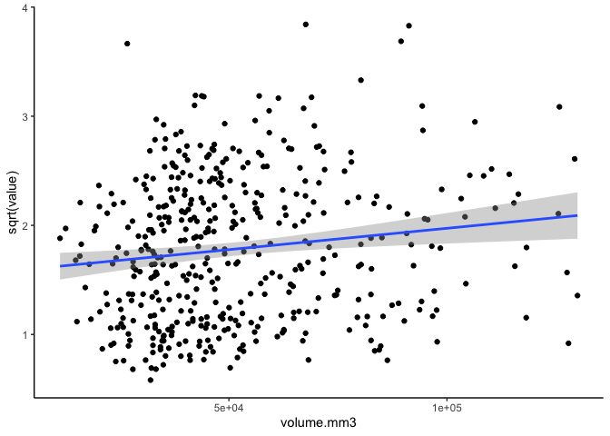<!-- -->

There is a positive relationship between metabolic rate and size, but it
is not particularly strong.

Plot correlation plot.

18°C

``` r
correlation18C <- lm(sqrt(value) ~ volume.mm3, data = final%>%filter(temperature=="18C"))

corrplot18C<-ggplot(final%>%filter(temperature=="18C"), aes(x = volume.mm3, y = sqrt(value))) +
      geom_point() + 
      geom_smooth(method = "lm", se = TRUE) + 
      theme_classic()+
      labs(title = "y=8.101e-06 + 1.631 (18°C)");corrplot18C
```

<!-- -->

``` r
correlation42C <- lm(sqrt(value) ~ volume.mm3, data = final%>%filter(temperature=="42C"))

corrplot42C<-ggplot(final%>%filter(temperature=="42C"), aes(x = volume.mm3, y = sqrt(value))) +
      geom_point() + 
      geom_smooth(method = "lm", se = TRUE) + 
      theme_classic()+
      labs(title = "y=5.773e-06 + 1.233 (42°C)");corrplot42C
```

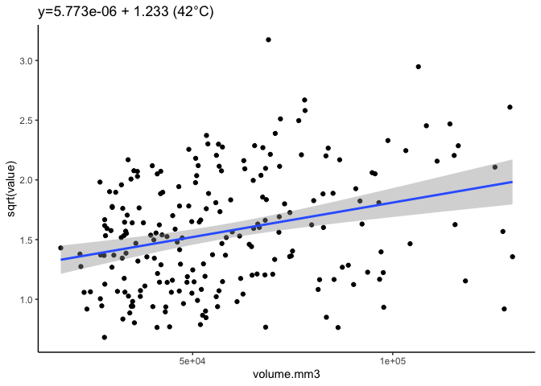<!-- -->

Size is important to consider, so we will normalize metabolic rates to
size using value.mm3 generated above.

## Analysis of metabolic rates in oysters that lived through the 4 h trial

``` r
alive_4h_data<-main_data%>%
  filter(incubation.mortality=="alive")%>%
  ungroup()%>%
  dplyr::select(!c(value, volume.mm3, width.mm, length.mm))

#view sample size 
alive_4h_data%>%
  group_by(time, temperature, hardening)%>%
  dplyr::summarise(length(value.mm3))%>%
  print(n=100)
```

    ## # A tibble: 50 × 4
    ## # Groups:   time, temperature [10]
    ##    time  temperature hardening               `length(value.mm3)`
    ##    <fct> <chr>       <chr>                                 <int>
    ##  1 0     18C         control                                  55
    ##  2 0     18C         fresh-water                              39
    ##  3 0     18C         fresh-water-temperature                  39
    ##  4 0     18C         immune                                   36
    ##  5 0     18C         temperature                              40
    ##  6 0     42C         control                                  28
    ##  7 0     42C         fresh-water                              19
    ##  8 0     42C         fresh-water-temperature                  18
    ##  9 0     42C         immune                                   17
    ## 10 0     42C         temperature                              10
    ## 11 1     18C         control                                  55
    ## 12 1     18C         fresh-water                              39
    ## 13 1     18C         fresh-water-temperature                  39
    ## 14 1     18C         immune                                   36
    ## 15 1     18C         temperature                              40
    ## 16 1     42C         control                                  28
    ## 17 1     42C         fresh-water                              19
    ## 18 1     42C         fresh-water-temperature                  18
    ## 19 1     42C         immune                                   17
    ## 20 1     42C         temperature                              10
    ## 21 2     18C         control                                  55
    ## 22 2     18C         fresh-water                              39
    ## 23 2     18C         fresh-water-temperature                  39
    ## 24 2     18C         immune                                   36
    ## 25 2     18C         temperature                              40
    ## 26 2     42C         control                                  28
    ## 27 2     42C         fresh-water                              19
    ## 28 2     42C         fresh-water-temperature                  18
    ## 29 2     42C         immune                                   17
    ## 30 2     42C         temperature                              10
    ## 31 3     18C         control                                  55
    ## 32 3     18C         fresh-water                              39
    ## 33 3     18C         fresh-water-temperature                  39
    ## 34 3     18C         immune                                   36
    ## 35 3     18C         temperature                              40
    ## 36 3     42C         control                                  28
    ## 37 3     42C         fresh-water                              19
    ## 38 3     42C         fresh-water-temperature                  18
    ## 39 3     42C         immune                                   17
    ## 40 3     42C         temperature                              10
    ## 41 4     18C         control                                  55
    ## 42 4     18C         fresh-water                              39
    ## 43 4     18C         fresh-water-temperature                  39
    ## 44 4     18C         immune                                   36
    ## 45 4     18C         temperature                              40
    ## 46 4     42C         control                                  28
    ## 47 4     42C         fresh-water                              19
    ## 48 4     42C         fresh-water-temperature                  18
    ## 49 4     42C         immune                                   17
    ## 50 4     42C         temperature                              10

We have n\>10 for all groups at all time point of oysters that lived
through the 4 hour trial.

### Detect outliers

Build a model including all predictors.

``` r
model<-lmer(sqrt(value.mm3) ~ time * temperature * hardening + (1|bag) + (1|date:bag:sample), data=alive_4h_data)

qqPlot(residuals(model))
```

<!-- -->

    ## [1] 950 960

``` r
hist(alive_4h_data$value.mm3)
```

<!-- -->

Identify using standardized residuals.

``` r
# Extract raw residuals
alive_4h_data$raw_resid <- residuals(model)

# Standardize residuals
alive_4h_data$std_resid <- alive_4h_data$raw_resid / sd(alive_4h_data$raw_resid)

# Flag potential outliers
outlier_threshold <- 3
alive_4h_data$outlier_flag <- abs(alive_4h_data$std_resid) > outlier_threshold

# Filter rows flagged as outliers
outliers <- alive_4h_data %>% filter(outlier_flag == TRUE)
print(outliers)
```

    ## # A tibble: 9 × 13
    ##       date   bag sample hardening   temperature time  status final.mortality
    ##      <dbl> <dbl> <chr>  <chr>       <chr>       <fct>  <dbl> <chr>          
    ## 1 20240805    50 12     immune      18C         4          0 alive          
    ## 2 20240805    50 17     immune      18C         4          0 alive          
    ## 3 20240807    47 7      temperature 18C         0          0 alive          
    ## 4 20240807    47 7      temperature 18C         4          0 alive          
    ## 5 20240807    47 9      temperature 18C         4          0 dead           
    ## 6 20240813    49 11     immune      18C         0          0 alive          
    ## 7 20240813    49 11     immune      18C         4          0 alive          
    ## 8 20240813    49 17     immune      18C         0          0 alive          
    ## 9 20240813    49 3      immune      18C         4          0 alive          
    ## # ℹ 5 more variables: incubation.mortality <chr>, value.mm3 <dbl>,
    ## #   raw_resid <dbl>, std_resid <dbl>, outlier_flag <lgl>

``` r
# Plot standardized residuals
ggplot(alive_4h_data, aes(x = seq_along(std_resid), y = std_resid)) +
  geom_point(aes(color = outlier_flag), size = 2) +
  geom_hline(yintercept = c(-outlier_threshold, outlier_threshold), linetype = "dashed", color = "red") +
  labs(title = "Standardized Residuals with Outliers", x = "Index", y = "Standardized Residual") +
  theme_minimal()
```

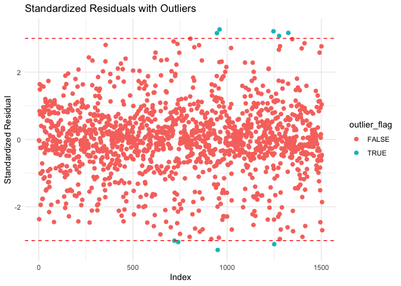<!-- -->

Remove identified outliers.

``` r
alive_4h_data<-alive_4h_data%>%
  filter(!outlier_flag==TRUE)
```

``` r
hist(alive_4h_data$value.mm3)
```

<!-- -->

### Analyze model

Plot raw data.

``` r
alive_4h_data%>%
  ggplot(aes(x=time, y=value.mm3, colour=temperature, group=sample))+
  facet_wrap(~bag*date*hardening)+
  geom_point()+
  geom_line()+
  theme_classic()
```

<!-- -->

``` r
model<-lmer(sqrt(value.mm3) ~ time * temperature * hardening + (1|bag) + (1|date:bag:sample), data=alive_4h_data)

summary(model)
```

    ## Linear mixed model fit by REML. t-tests use Satterthwaite's method [
    ## lmerModLmerTest]
    ## Formula: sqrt(value.mm3) ~ time * temperature * hardening + (1 | bag) +  
    ##     (1 | date:bag:sample)
    ##    Data: alive_4h_data
    ## 
    ## REML criterion at convergence: -14413.8
    ## 
    ## Scaled residuals: 
    ##      Min       1Q   Median       3Q      Max 
    ## -2.76143 -0.39795  0.00535  0.47178  2.94843 
    ## 
    ## Random effects:
    ##  Groups          Name        Variance  Std.Dev. 
    ##  date:bag:sample (Intercept) 2.438e-06 0.0015616
    ##  bag             (Intercept) 6.468e-07 0.0008042
    ##  Residual                    1.574e-06 0.0012547
    ## Number of obs: 1496, groups:  date:bag:sample, 301; bag, 10
    ## 
    ## Fixed effects:
    ##                                                         Estimate Std. Error
    ## (Intercept)                                            2.876e-05  6.321e-04
    ## time1                                                  3.151e-03  2.393e-04
    ## time2                                                  5.316e-03  2.393e-04
    ## time3                                                  7.199e-03  2.393e-04
    ## time4                                                  8.626e-03  2.393e-04
    ## temperature42C                                         1.112e-05  4.656e-04
    ## hardeningfresh-water                                  -2.395e-05  9.088e-04
    ## hardeningfresh-water-temperature                      -5.719e-05  9.088e-04
    ## hardeningimmune                                       -2.500e-04  9.153e-04
    ## hardeningtemperature                                  -1.220e-04  9.081e-04
    ## time1:temperature42C                                   3.968e-04  4.119e-04
    ## time2:temperature42C                                  -8.585e-04  4.119e-04
    ## time3:temperature42C                                  -2.006e-03  4.119e-04
    ## time4:temperature42C                                  -2.745e-03  4.119e-04
    ## time1:hardeningfresh-water                             4.136e-04  3.714e-04
    ## time2:hardeningfresh-water                             9.381e-04  3.714e-04
    ## time3:hardeningfresh-water                             1.084e-03  3.714e-04
    ## time4:hardeningfresh-water                             1.484e-03  3.714e-04
    ## time1:hardeningfresh-water-temperature                 1.796e-04  3.714e-04
    ## time2:hardeningfresh-water-temperature                 5.837e-04  3.714e-04
    ## time3:hardeningfresh-water-temperature                 5.490e-04  3.714e-04
    ## time4:hardeningfresh-water-temperature                 9.243e-04  3.714e-04
    ## time1:hardeningimmune                                  1.343e-03  3.846e-04
    ## time2:hardeningimmune                                  2.152e-03  3.846e-04
    ## time3:hardeningimmune                                  2.367e-03  3.846e-04
    ## time4:hardeningimmune                                  2.785e-03  3.924e-04
    ## time1:hardeningtemperature                             6.614e-04  3.705e-04
    ## time2:hardeningtemperature                             1.341e-03  3.705e-04
    ## time3:hardeningtemperature                             1.498e-03  3.705e-04
    ## time4:hardeningtemperature                             1.827e-03  3.732e-04
    ## temperature42C:hardeningfresh-water                    1.365e-05  7.291e-04
    ## temperature42C:hardeningfresh-water-temperature        1.731e-05  7.366e-04
    ## temperature42C:hardeningimmune                         1.496e-04  7.548e-04
    ## temperature42C:hardeningtemperature                    8.212e-05  8.483e-04
    ## time1:temperature42C:hardeningfresh-water             -1.048e-03  6.451e-04
    ## time2:temperature42C:hardeningfresh-water             -1.448e-03  6.451e-04
    ## time3:temperature42C:hardeningfresh-water             -1.832e-03  6.451e-04
    ## time4:temperature42C:hardeningfresh-water             -2.395e-03  6.451e-04
    ## time1:temperature42C:hardeningfresh-water-temperature -1.302e-03  6.522e-04
    ## time2:temperature42C:hardeningfresh-water-temperature -1.682e-03  6.522e-04
    ## time3:temperature42C:hardeningfresh-water-temperature -1.831e-03  6.522e-04
    ## time4:temperature42C:hardeningfresh-water-temperature -2.418e-03  6.522e-04
    ## time1:temperature42C:hardeningimmune                  -1.676e-03  6.675e-04
    ## time2:temperature42C:hardeningimmune                  -2.468e-03  6.675e-04
    ## time3:temperature42C:hardeningimmune                  -3.010e-03  6.675e-04
    ## time4:temperature42C:hardeningimmune                  -3.722e-03  6.720e-04
    ## time1:temperature42C:hardeningtemperature             -4.616e-04  7.514e-04
    ## time2:temperature42C:hardeningtemperature             -6.662e-04  7.514e-04
    ## time3:temperature42C:hardeningtemperature             -1.060e-03  7.514e-04
    ## time4:temperature42C:hardeningtemperature             -1.500e-03  7.527e-04
    ##                                                               df t value
    ## (Intercept)                                            5.753e+00   0.045
    ## time1                                                  1.153e+03  13.172
    ## time2                                                  1.153e+03  22.219
    ## time3                                                  1.153e+03  30.091
    ## time4                                                  1.153e+03  36.052
    ## temperature42C                                         5.723e+02   0.024
    ## hardeningfresh-water                                   6.150e+00  -0.026
    ## hardeningfresh-water-temperature                       6.150e+00  -0.063
    ## hardeningimmune                                        6.328e+00  -0.273
    ## hardeningtemperature                                   6.131e+00  -0.134
    ## time1:temperature42C                                   1.153e+03   0.963
    ## time2:temperature42C                                   1.153e+03  -2.084
    ## time3:temperature42C                                   1.153e+03  -4.871
    ## time4:temperature42C                                   1.153e+03  -6.663
    ## time1:hardeningfresh-water                             1.153e+03   1.114
    ## time2:hardeningfresh-water                             1.153e+03   2.525
    ## time3:hardeningfresh-water                             1.153e+03   2.917
    ## time4:hardeningfresh-water                             1.153e+03   3.996
    ## time1:hardeningfresh-water-temperature                 1.153e+03   0.484
    ## time2:hardeningfresh-water-temperature                 1.153e+03   1.571
    ## time3:hardeningfresh-water-temperature                 1.153e+03   1.478
    ## time4:hardeningfresh-water-temperature                 1.153e+03   2.488
    ## time1:hardeningimmune                                  1.154e+03   3.491
    ## time2:hardeningimmune                                  1.154e+03   5.595
    ## time3:hardeningimmune                                  1.154e+03   6.155
    ## time4:hardeningimmune                                  1.155e+03   7.096
    ## time1:hardeningtemperature                             1.153e+03   1.785
    ## time2:hardeningtemperature                             1.153e+03   3.620
    ## time3:hardeningtemperature                             1.153e+03   4.042
    ## time4:hardeningtemperature                             1.153e+03   4.897
    ## temperature42C:hardeningfresh-water                    5.723e+02   0.019
    ## temperature42C:hardeningfresh-water-temperature        5.726e+02   0.024
    ## temperature42C:hardeningimmune                         5.766e+02   0.198
    ## temperature42C:hardeningtemperature                    5.743e+02   0.097
    ## time1:temperature42C:hardeningfresh-water              1.153e+03  -1.624
    ## time2:temperature42C:hardeningfresh-water              1.153e+03  -2.245
    ## time3:temperature42C:hardeningfresh-water              1.153e+03  -2.840
    ## time4:temperature42C:hardeningfresh-water              1.153e+03  -3.713
    ## time1:temperature42C:hardeningfresh-water-temperature  1.153e+03  -1.996
    ## time2:temperature42C:hardeningfresh-water-temperature  1.153e+03  -2.580
    ## time3:temperature42C:hardeningfresh-water-temperature  1.153e+03  -2.808
    ## time4:temperature42C:hardeningfresh-water-temperature  1.153e+03  -3.707
    ## time1:temperature42C:hardeningimmune                   1.153e+03  -2.512
    ## time2:temperature42C:hardeningimmune                   1.153e+03  -3.697
    ## time3:temperature42C:hardeningimmune                   1.153e+03  -4.509
    ## time4:temperature42C:hardeningimmune                   1.154e+03  -5.539
    ## time1:temperature42C:hardeningtemperature              1.153e+03  -0.614
    ## time2:temperature42C:hardeningtemperature              1.153e+03  -0.887
    ## time3:temperature42C:hardeningtemperature              1.153e+03  -1.411
    ## time4:temperature42C:hardeningtemperature              1.153e+03  -1.993
    ##                                                       Pr(>|t|)    
    ## (Intercept)                                           0.965255    
    ## time1                                                  < 2e-16 ***
    ## time2                                                  < 2e-16 ***
    ## time3                                                  < 2e-16 ***
    ## time4                                                  < 2e-16 ***
    ## temperature42C                                        0.980960    
    ## hardeningfresh-water                                  0.979806    
    ## hardeningfresh-water-temperature                      0.951823    
    ## hardeningimmune                                       0.793480    
    ## hardeningtemperature                                  0.897439    
    ## time1:temperature42C                                  0.335607    
    ## time2:temperature42C                                  0.037365 *  
    ## time3:temperature42C                                  1.27e-06 ***
    ## time4:temperature42C                                  4.15e-11 ***
    ## time1:hardeningfresh-water                            0.265689    
    ## time2:hardeningfresh-water                            0.011687 *  
    ## time3:hardeningfresh-water                            0.003598 ** 
    ## time4:hardeningfresh-water                            6.85e-05 ***
    ## time1:hardeningfresh-water-temperature                0.628779    
    ## time2:hardeningfresh-water-temperature                0.116357    
    ## time3:hardeningfresh-water-temperature                0.139704    
    ## time4:hardeningfresh-water-temperature                0.012976 *  
    ## time1:hardeningimmune                                 0.000499 ***
    ## time2:hardeningimmune                                 2.76e-08 ***
    ## time3:hardeningimmune                                 1.03e-09 ***
    ## time4:hardeningimmune                                 2.23e-12 ***
    ## time1:hardeningtemperature                            0.074464 .  
    ## time2:hardeningtemperature                            0.000308 ***
    ## time3:hardeningtemperature                            5.64e-05 ***
    ## time4:hardeningtemperature                            1.11e-06 ***
    ## temperature42C:hardeningfresh-water                   0.985070    
    ## temperature42C:hardeningfresh-water-temperature       0.981256    
    ## temperature42C:hardeningimmune                        0.842954    
    ## temperature42C:hardeningtemperature                   0.922918    
    ## time1:temperature42C:hardeningfresh-water             0.104585    
    ## time2:temperature42C:hardeningfresh-water             0.024950 *  
    ## time3:temperature42C:hardeningfresh-water             0.004590 ** 
    ## time4:temperature42C:hardeningfresh-water             0.000214 ***
    ## time1:temperature42C:hardeningfresh-water-temperature 0.046195 *  
    ## time2:temperature42C:hardeningfresh-water-temperature 0.010009 *  
    ## time3:temperature42C:hardeningfresh-water-temperature 0.005072 ** 
    ## time4:temperature42C:hardeningfresh-water-temperature 0.000219 ***
    ## time1:temperature42C:hardeningimmune                  0.012153 *  
    ## time2:temperature42C:hardeningimmune                  0.000229 ***
    ## time3:temperature42C:hardeningimmune                  7.18e-06 ***
    ## time4:temperature42C:hardeningimmune                  3.77e-08 ***
    ## time1:temperature42C:hardeningtemperature             0.539133    
    ## time2:temperature42C:hardeningtemperature             0.375435    
    ## time3:temperature42C:hardeningtemperature             0.158414    
    ## time4:temperature42C:hardeningtemperature             0.046524 *  
    ## ---
    ## Signif. codes:  0 '***' 0.001 '**' 0.01 '*' 0.05 '.' 0.1 ' ' 1

``` r
anova(model)
```

    ## Type III Analysis of Variance Table with Satterthwaite's method
    ##                               Sum Sq    Mean Sq NumDF   DenDF   F value
    ## time                       0.0084157 0.00210392     4 1152.80 1336.5134
    ## temperature                0.0001506 0.00015058     1  283.50   95.6557
    ## hardening                  0.0000023 0.00000057     4    5.26    0.3632
    ## time:temperature           0.0009391 0.00023478     4 1152.80  149.1403
    ## time:hardening             0.0000466 0.00000291    16 1152.78    1.8512
    ## temperature:hardening      0.0000201 0.00000502     4  283.49    3.1880
    ## time:temperature:hardening 0.0000660 0.00000413    16 1152.78    2.6206
    ##                               Pr(>F)    
    ## time                       < 2.2e-16 ***
    ## temperature                < 2.2e-16 ***
    ## hardening                  0.8262745    
    ## time:temperature           < 2.2e-16 ***
    ## time:hardening             0.0212413 *  
    ## temperature:hardening      0.0138909 *  
    ## time:temperature:hardening 0.0004789 ***
    ## ---
    ## Signif. codes:  0 '***' 0.001 '**' 0.01 '*' 0.05 '.' 0.1 ' ' 1

``` r
rand(model)
```

    ## ANOVA-like table for random-effects: Single term deletions
    ## 
    ## Model:
    ## sqrt(value.mm3) ~ time + temperature + hardening + (1 | bag) + (1 | date:bag:sample) + time:temperature + time:hardening + temperature:hardening + time:temperature:hardening
    ##                       npar logLik    AIC    LRT Df Pr(>Chisq)    
    ## <none>                  53 7206.9 -14308                         
    ## (1 | bag)               52 7196.3 -14289  21.26  1  4.019e-06 ***
    ## (1 | date:bag:sample)   52 6858.6 -13613 696.68  1  < 2.2e-16 ***
    ## ---
    ## Signif. codes:  0 '***' 0.001 '**' 0.01 '*' 0.05 '.' 0.1 ' ' 1

``` r
qqPlot(residuals(model))
```

<!-- -->

    ## [1] 1337  748

Significant effects of time x temperature x hardening, indicating
different slopes in metabolic rate between temperatures modulated by
hardening treatment in those that lived through the 4 h incubation.

Return to troubleshooting residuals for this model.

### Plot data

Plot mean response for each hardening treatment across time at 18°C and
42°C in those that were alive through the 4 hour incubation.

Plot first with individual points with geom smooth lines.

``` r
plot1<-alive_4h_data%>%

  ggplot(aes(x=time, y=value.mm3, color=temperature, fill=temperature))+
  facet_grid(~hardening)+
  geom_point(alpha=0.5)+
  geom_smooth(aes(group=temperature))+
  scale_colour_manual(values=c("cyan4", "orange"))+
  scale_fill_manual(values=c("cyan4", "orange"))+
  theme_classic()+
  xlab("Hour");plot1
```

<!-- -->

``` r
ggsave(plot1, filename="figures/resazurin/hardening_temperature_alive4h_oysters.png", width=8, height=6)

plot1a<-alive_4h_data%>%

  ggplot(aes(x=time, y=value.mm3, color=hardening, fill=hardening))+
  facet_grid(~temperature)+
  geom_point(alpha=0.5)+
  geom_smooth(aes(group=hardening))+
  scale_colour_brewer(palette=c("Dark2"))+
  scale_fill_brewer(palette=c("Dark2"))+
  theme_classic()+
  xlab("Hour");plot1a
```

<!-- -->

``` r
ggsave(plot1a, filename="figures/resazurin/hardening_temperature_alive4h_oysters-2.png", width=8, height=6)
```

Next plot with mean and sem for each group.

``` r
plot2<-alive_4h_data%>%
  group_by(temperature, hardening, time)%>%
  summarize(mean=mean(value.mm3, na.rm=TRUE), se=sd(value.mm3, na.rm=TRUE)/sqrt(length(value.mm3)))%>%

  ggplot(aes(x=time, y=mean, color=temperature, fill=temperature))+
  facet_grid(~hardening)+
  geom_point(alpha=0.5)+
  geom_errorbar(aes(ymin=mean-se, ymax=mean+se), width=0.1)+
  geom_line(aes(group=temperature))+
  scale_colour_manual(values=c("cyan4", "orange"))+
  scale_fill_manual(values=c("cyan4", "orange"))+
  theme_classic()+
  xlab("Hour");plot2
```

<!-- -->

``` r
plot2a<-alive_4h_data%>%
  group_by(temperature, hardening, time)%>%
  summarise(mean=mean(value.mm3, na.rm=TRUE), se=sd(value.mm3, na.rm=TRUE)/sqrt(length(value.mm3)))%>%

  ggplot(aes(x=time, y=mean, color=hardening, fill=hardening))+
  facet_grid(~temperature)+
  geom_errorbar(aes(ymin=mean-se, ymax=mean+se), width=0.1)+
  geom_point(alpha=0.5)+
  geom_line(aes(group=hardening))+
  #scale_colour_manual(values=c("cyan4", "orange"))+
  #scale_fill_manual(values=c("cyan4", "orange"))+
  theme_classic()+
  xlab("Hour");plot2a
```

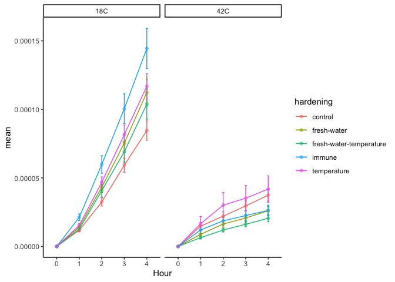<!-- -->

### Conduct post hoc tests

#### Effects of hardening treatment within temperature

``` r
anova(model)
```

    ## Type III Analysis of Variance Table with Satterthwaite's method
    ##                               Sum Sq    Mean Sq NumDF   DenDF   F value
    ## time                       0.0084157 0.00210392     4 1152.80 1336.5134
    ## temperature                0.0001506 0.00015058     1  283.50   95.6557
    ## hardening                  0.0000023 0.00000057     4    5.26    0.3632
    ## time:temperature           0.0009391 0.00023478     4 1152.80  149.1403
    ## time:hardening             0.0000466 0.00000291    16 1152.78    1.8512
    ## temperature:hardening      0.0000201 0.00000502     4  283.49    3.1880
    ## time:temperature:hardening 0.0000660 0.00000413    16 1152.78    2.6206
    ##                               Pr(>F)    
    ## time                       < 2.2e-16 ***
    ## temperature                < 2.2e-16 ***
    ## hardening                  0.8262745    
    ## time:temperature           < 2.2e-16 ***
    ## time:hardening             0.0212413 *  
    ## temperature:hardening      0.0138909 *  
    ## time:temperature:hardening 0.0004789 ***
    ## ---
    ## Signif. codes:  0 '***' 0.001 '**' 0.01 '*' 0.05 '.' 0.1 ' ' 1

``` r
emm<-emmeans(model, ~hardening|temperature|time, adjust = "tukey")
pairs(emm)
```

    ## temperature = 18C, time = 0:
    ##  contrast                                   estimate       SE    df t.ratio
    ##  control - (fresh-water)                    2.40e-05 0.000909  6.17   0.026
    ##  control - (fresh-water-temperature)        5.72e-05 0.000909  6.17   0.063
    ##  control - immune                           2.50e-04 0.000915  6.34   0.273
    ##  control - temperature                      1.22e-04 0.000908  6.15   0.134
    ##  (fresh-water) - (fresh-water-temperature)  3.32e-05 0.000923  6.58   0.036
    ##  (fresh-water) - immune                     2.26e-04 0.000930  6.76   0.243
    ##  (fresh-water) - temperature                9.80e-05 0.000923  6.56   0.106
    ##  (fresh-water-temperature) - immune         1.93e-04 0.000930  6.76   0.207
    ##  (fresh-water-temperature) - temperature    6.48e-05 0.000923  6.56   0.070
    ##  immune - temperature                      -1.28e-04 0.000929  6.74  -0.138
    ##  p.value
    ##   1.0000
    ##   1.0000
    ##   0.9984
    ##   0.9999
    ##   1.0000
    ##   0.9990
    ##   1.0000
    ##   0.9995
    ##   1.0000
    ##   0.9999
    ## 
    ## temperature = 42C, time = 0:
    ##  contrast                                   estimate       SE    df t.ratio
    ##  control - (fresh-water)                    1.03e-05 0.001005  9.17   0.010
    ##  control - (fresh-water-temperature)        3.99e-05 0.001010  9.37   0.039
    ##  control - immune                           1.00e-04 0.001017  9.64   0.099
    ##  control - temperature                      3.99e-05 0.001095 12.92   0.036
    ##  (fresh-water) - (fresh-water-temperature)  2.96e-05 0.001040 10.57   0.028
    ##  (fresh-water) - immune                     9.00e-05 0.001047 10.85   0.086
    ##  (fresh-water) - temperature                2.96e-05 0.001123 14.31   0.026
    ##  (fresh-water-temperature) - immune         6.05e-05 0.001052 11.07   0.057
    ##  (fresh-water-temperature) - temperature    0.00e+00 0.001127 14.56   0.000
    ##  immune - temperature                      -6.05e-05 0.001134 14.88  -0.053
    ##  p.value
    ##   1.0000
    ##   1.0000
    ##   1.0000
    ##   1.0000
    ##   1.0000
    ##   1.0000
    ##   1.0000
    ##   1.0000
    ##   1.0000
    ##   1.0000
    ## 
    ## temperature = 18C, time = 1:
    ##  contrast                                   estimate       SE    df t.ratio
    ##  control - (fresh-water)                   -3.90e-04 0.000909  6.17  -0.429
    ##  control - (fresh-water-temperature)       -1.22e-04 0.000909  6.17  -0.135
    ##  control - immune                          -1.09e-03 0.000914  6.30  -1.196
    ##  control - temperature                     -5.39e-04 0.000908  6.13  -0.594
    ##  (fresh-water) - (fresh-water-temperature)  2.67e-04 0.000923  6.58   0.289
    ##  (fresh-water) - immune                    -7.03e-04 0.000928  6.71  -0.758
    ##  (fresh-water) - temperature               -1.50e-04 0.000922  6.54  -0.162
    ##  (fresh-water-temperature) - immune        -9.70e-04 0.000928  6.71  -1.046
    ##  (fresh-water-temperature) - temperature   -4.17e-04 0.000922  6.54  -0.452
    ##  immune - temperature                       5.53e-04 0.000927  6.67   0.597
    ##  p.value
    ##   0.9912
    ##   0.9999
    ##   0.7547
    ##   0.9711
    ##   0.9981
    ##   0.9348
    ##   0.9998
    ##   0.8273
    ##   0.9893
    ##   0.9710
    ## 
    ## temperature = 42C, time = 1:
    ##  contrast                                   estimate       SE    df t.ratio
    ##  control - (fresh-water)                    6.44e-04 0.001005  9.17   0.641
    ##  control - (fresh-water-temperature)        1.16e-03 0.001010  9.37   1.150
    ##  control - immune                           4.34e-04 0.001017  9.64   0.427
    ##  control - temperature                     -1.60e-04 0.001095 12.92  -0.146
    ##  (fresh-water) - (fresh-water-temperature)  5.17e-04 0.001040 10.57   0.497
    ##  (fresh-water) - immune                    -2.10e-04 0.001047 10.85  -0.201
    ##  (fresh-water) - temperature               -8.04e-04 0.001123 14.31  -0.717
    ##  (fresh-water-temperature) - immune        -7.28e-04 0.001052 11.07  -0.692
    ##  (fresh-water-temperature) - temperature   -1.32e-03 0.001127 14.56  -1.172
    ##  immune - temperature                      -5.94e-04 0.001134 14.88  -0.524
    ##  p.value
    ##   0.9641
    ##   0.7776
    ##   0.9919
    ##   0.9999
    ##   0.9859
    ##   0.9996
    ##   0.9493
    ##   0.9542
    ##   0.7663
    ##   0.9835
    ## 
    ## temperature = 18C, time = 2:
    ##  contrast                                   estimate       SE    df t.ratio
    ##  control - (fresh-water)                   -9.14e-04 0.000909  6.17  -1.006
    ##  control - (fresh-water-temperature)       -5.27e-04 0.000909  6.17  -0.579
    ##  control - immune                          -1.90e-03 0.000914  6.30  -2.081
    ##  control - temperature                     -1.22e-03 0.000908  6.13  -1.343
    ##  (fresh-water) - (fresh-water-temperature)  3.88e-04 0.000923  6.58   0.420
    ##  (fresh-water) - immune                    -9.88e-04 0.000928  6.71  -1.064
    ##  (fresh-water) - temperature               -3.05e-04 0.000922  6.54  -0.331
    ##  (fresh-water-temperature) - immune        -1.38e-03 0.000928  6.71  -1.482
    ##  (fresh-water-temperature) - temperature   -6.92e-04 0.000922  6.54  -0.751
    ##  immune - temperature                       6.83e-04 0.000927  6.67   0.737
    ##  p.value
    ##   0.8446
    ##   0.9736
    ##   0.3307
    ##   0.6787
    ##   0.9919
    ##   0.8188
    ##   0.9967
    ##   0.6035
    ##   0.9365
    ##   0.9405
    ## 
    ## temperature = 42C, time = 2:
    ##  contrast                                   estimate       SE    df t.ratio
    ##  control - (fresh-water)                    5.20e-04 0.001005  9.17   0.518
    ##  control - (fresh-water-temperature)        1.14e-03 0.001010  9.37   1.127
    ##  control - immune                           4.16e-04 0.001017  9.64   0.409
    ##  control - temperature                     -6.35e-04 0.001095 12.92  -0.580
    ##  (fresh-water) - (fresh-water-temperature)  6.18e-04 0.001040 10.57   0.594
    ##  (fresh-water) - immune                    -1.04e-04 0.001047 10.85  -0.100
    ##  (fresh-water) - temperature               -1.16e-03 0.001123 14.31  -1.029
    ##  (fresh-water-temperature) - immune        -7.22e-04 0.001052 11.07  -0.686
    ##  (fresh-water-temperature) - temperature   -1.77e-03 0.001127 14.56  -1.573
    ##  immune - temperature                      -1.05e-03 0.001134 14.88  -0.927
    ##  p.value
    ##   0.9833
    ##   0.7892
    ##   0.9931
    ##   0.9758
    ##   0.9730
    ##   1.0000
    ##   0.8380
    ##   0.9554
    ##   0.5355
    ##   0.8820
    ## 
    ## temperature = 18C, time = 3:
    ##  contrast                                   estimate       SE    df t.ratio
    ##  control - (fresh-water)                   -1.06e-03 0.000909  6.17  -1.166
    ##  control - (fresh-water-temperature)       -4.92e-04 0.000909  6.17  -0.541
    ##  control - immune                          -2.12e-03 0.000914  6.30  -2.317
    ##  control - temperature                     -1.38e-03 0.000908  6.13  -1.516
    ##  (fresh-water) - (fresh-water-temperature)  5.68e-04 0.000923  6.58   0.615
    ##  (fresh-water) - immune                    -1.06e-03 0.000928  6.71  -1.140
    ##  (fresh-water) - temperature               -3.16e-04 0.000922  6.54  -0.343
    ##  (fresh-water-temperature) - immune        -1.63e-03 0.000928  6.71  -1.751
    ##  (fresh-water-temperature) - temperature   -8.84e-04 0.000922  6.54  -0.959
    ##  immune - temperature                       7.42e-04 0.000927  6.67   0.800
    ##  p.value
    ##   0.7698
    ##   0.9793
    ##   0.2528
    ##   0.5882
    ##   0.9677
    ##   0.7827
    ##   0.9963
    ##   0.4663
    ##   0.8648
    ##   0.9222
    ## 
    ## temperature = 42C, time = 3:
    ##  contrast                                   estimate       SE    df t.ratio
    ##  control - (fresh-water)                    7.59e-04 0.001005  9.17   0.755
    ##  control - (fresh-water-temperature)        1.32e-03 0.001010  9.37   1.309
    ##  control - immune                           7.43e-04 0.001017  9.64   0.730
    ##  control - temperature                     -3.97e-04 0.001095 12.92  -0.363
    ##  (fresh-water) - (fresh-water-temperature)  5.63e-04 0.001040 10.57   0.542
    ##  (fresh-water) - immune                    -1.59e-05 0.001047 10.85  -0.015
    ##  (fresh-water) - temperature               -1.16e-03 0.001123 14.31  -1.030
    ##  (fresh-water-temperature) - immune        -5.79e-04 0.001052 11.07  -0.550
    ##  (fresh-water-temperature) - temperature   -1.72e-03 0.001127 14.56  -1.525
    ##  immune - temperature                      -1.14e-03 0.001134 14.88  -1.005
    ##  p.value
    ##   0.9374
    ##   0.6927
    ##   0.9442
    ##   0.9958
    ##   0.9807
    ##   1.0000
    ##   0.8377
    ##   0.9796
    ##   0.5635
    ##   0.8489
    ## 
    ## temperature = 18C, time = 4:
    ##  contrast                                   estimate       SE    df t.ratio
    ##  control - (fresh-water)                   -1.46e-03 0.000909  6.17  -1.607
    ##  control - (fresh-water-temperature)       -8.67e-04 0.000909  6.17  -0.954
    ##  control - immune                          -2.53e-03 0.000917  6.40  -2.763
    ##  control - temperature                     -1.71e-03 0.000909  6.17  -1.876
    ##  (fresh-water) - (fresh-water-temperature)  5.93e-04 0.000923  6.58   0.643
    ##  (fresh-water) - immune                    -1.07e-03 0.000932  6.82  -1.153
    ##  (fresh-water) - temperature               -2.45e-04 0.000923  6.58  -0.265
    ##  (fresh-water-temperature) - immune        -1.67e-03 0.000932  6.82  -1.790
    ##  (fresh-water-temperature) - temperature   -8.38e-04 0.000923  6.58  -0.908
    ##  immune - temperature                       8.30e-04 0.000932  6.82   0.890
    ##  p.value
    ##   0.5414
    ##   0.8663
    ##   0.1478
    ##   0.4144
    ##   0.9624
    ##   0.7760
    ##   0.9986
    ##   0.4472
    ##   0.8849
    ##   0.8917
    ## 
    ## temperature = 42C, time = 4:
    ##  contrast                                   estimate       SE    df t.ratio
    ##  control - (fresh-water)                    9.21e-04 0.001005  9.17   0.917
    ##  control - (fresh-water-temperature)        1.53e-03 0.001010  9.37   1.518
    ##  control - immune                           1.04e-03 0.001017  9.64   1.020
    ##  control - temperature                     -2.88e-04 0.001095 12.92  -0.263
    ##  (fresh-water) - (fresh-water-temperature)  6.12e-04 0.001040 10.57   0.588
    ##  (fresh-water) - immune                     1.16e-04 0.001047 10.85   0.111
    ##  (fresh-water) - temperature               -1.21e-03 0.001123 14.31  -1.077
    ##  (fresh-water-temperature) - immune        -4.96e-04 0.001052 11.07  -0.471
    ##  (fresh-water-temperature) - temperature   -1.82e-03 0.001127 14.56  -1.615
    ##  immune - temperature                      -1.33e-03 0.001134 14.88  -1.169
    ##  p.value
    ##   0.8835
    ##   0.5756
    ##   0.8405
    ##   0.9988
    ##   0.9739
    ##   1.0000
    ##   0.8154
    ##   0.9885
    ##   0.5112
    ##   0.7683
    ## 
    ## Note: contrasts are still on the sqrt scale 
    ## Degrees-of-freedom method: kenward-roger 
    ## P value adjustment: tukey method for comparing a family of 5 estimates

No differences between treatments within time are significant.

#### Effects of temperature treatment within hardening

``` r
emm<-emmeans(model, ~temperature|hardening|time, adjust = "tukey")
pairs(emm)
```

    ## hardening = control, time = 0:
    ##  contrast   estimate       SE  df t.ratio p.value
    ##  18C - 42C -1.11e-05 0.000466 576  -0.024  0.9810
    ## 
    ## hardening = fresh-water, time = 0:
    ##  contrast   estimate       SE  df t.ratio p.value
    ##  18C - 42C -2.48e-05 0.000561 576  -0.044  0.9648
    ## 
    ## hardening = fresh-water-temperature, time = 0:
    ##  contrast   estimate       SE  df t.ratio p.value
    ##  18C - 42C -2.84e-05 0.000571 577  -0.050  0.9603
    ## 
    ## hardening = immune, time = 0:
    ##  contrast   estimate       SE  df t.ratio p.value
    ##  18C - 42C -1.61e-04 0.000594 583  -0.270  0.7869
    ## 
    ## hardening = temperature, time = 0:
    ##  contrast   estimate       SE  df t.ratio p.value
    ##  18C - 42C -9.32e-05 0.000709 579  -0.131  0.8954
    ## 
    ## hardening = control, time = 1:
    ##  contrast   estimate       SE  df t.ratio p.value
    ##  18C - 42C -4.08e-04 0.000466 576  -0.876  0.3814
    ## 
    ## hardening = fresh-water, time = 1:
    ##  contrast   estimate       SE  df t.ratio p.value
    ##  18C - 42C  6.26e-04 0.000561 576   1.116  0.2649
    ## 
    ## hardening = fresh-water-temperature, time = 1:
    ##  contrast   estimate       SE  df t.ratio p.value
    ##  18C - 42C  8.76e-04 0.000571 577   1.535  0.1253
    ## 
    ## hardening = immune, time = 1:
    ##  contrast   estimate       SE  df t.ratio p.value
    ##  18C - 42C  1.12e-03 0.000592 575   1.891  0.0592
    ## 
    ## hardening = temperature, time = 1:
    ##  contrast   estimate       SE  df t.ratio p.value
    ##  18C - 42C -2.85e-05 0.000708 577  -0.040  0.9679
    ## 
    ## hardening = control, time = 2:
    ##  contrast   estimate       SE  df t.ratio p.value
    ##  18C - 42C  8.47e-04 0.000466 576   1.820  0.0693
    ## 
    ## hardening = fresh-water, time = 2:
    ##  contrast   estimate       SE  df t.ratio p.value
    ##  18C - 42C  2.28e-03 0.000561 576   4.067  0.0001
    ## 
    ## hardening = fresh-water-temperature, time = 2:
    ##  contrast   estimate       SE  df t.ratio p.value
    ##  18C - 42C  2.51e-03 0.000571 577   4.402  <.0001
    ## 
    ## hardening = immune, time = 2:
    ##  contrast   estimate       SE  df t.ratio p.value
    ##  18C - 42C  3.17e-03 0.000592 575   5.348  <.0001
    ## 
    ## hardening = temperature, time = 2:
    ##  contrast   estimate       SE  df t.ratio p.value
    ##  18C - 42C  1.43e-03 0.000708 577   2.021  0.0437
    ## 
    ## hardening = control, time = 3:
    ##  contrast   estimate       SE  df t.ratio p.value
    ##  18C - 42C  2.00e-03 0.000466 576   4.285  <.0001
    ## 
    ## hardening = fresh-water, time = 3:
    ##  contrast   estimate       SE  df t.ratio p.value
    ##  18C - 42C  3.81e-03 0.000561 576   6.796  <.0001
    ## 
    ## hardening = fresh-water-temperature, time = 3:
    ##  contrast   estimate       SE  df t.ratio p.value
    ##  18C - 42C  3.81e-03 0.000571 577   6.673  <.0001
    ## 
    ## hardening = immune, time = 3:
    ##  contrast   estimate       SE  df t.ratio p.value
    ##  18C - 42C  4.86e-03 0.000592 575   8.204  <.0001
    ## 
    ## hardening = temperature, time = 3:
    ##  contrast   estimate       SE  df t.ratio p.value
    ##  18C - 42C  2.97e-03 0.000708 577   4.199  <.0001
    ## 
    ## hardening = control, time = 4:
    ##  contrast   estimate       SE  df t.ratio p.value
    ##  18C - 42C  2.73e-03 0.000466 576   5.871  <.0001
    ## 
    ## hardening = fresh-water, time = 4:
    ##  contrast   estimate       SE  df t.ratio p.value
    ##  18C - 42C  5.12e-03 0.000561 576   9.115  <.0001
    ## 
    ## hardening = fresh-water-temperature, time = 4:
    ##  contrast   estimate       SE  df t.ratio p.value
    ##  18C - 42C  5.13e-03 0.000571 577   8.994  <.0001
    ## 
    ## hardening = immune, time = 4:
    ##  contrast   estimate       SE  df t.ratio p.value
    ##  18C - 42C  6.31e-03 0.000597 593  10.555  <.0001
    ## 
    ## hardening = temperature, time = 4:
    ##  contrast   estimate       SE  df t.ratio p.value
    ##  18C - 42C  4.15e-03 0.000710 581   5.847  <.0001
    ## 
    ## Note: contrasts are still on the sqrt scale 
    ## Degrees-of-freedom method: kenward-roger

Significant effects:

- Time 2: All treatments higher at 18°C than 42°C in all treatments
  except control
- Time 3: All treatments higher at 18°C
- Time 4: All treatments higher at 18°C

## Analysis of metabolic rates between those that died during the 4 h trial

``` r
dead_4h_data<-main_data%>%
  filter(incubation.mortality=="dead")%>%
  ungroup()%>%
  dplyr::select(!c(value, volume.mm3, width.mm, length.mm))

#view sample size 
dead_4h_data%>%
  group_by(time, temperature, hardening)%>%
  dplyr::summarise(length(value.mm3))%>%
  print(n=100)
```

    ## # A tibble: 45 × 4
    ## # Groups:   time, temperature [10]
    ##    time  temperature hardening               `length(value.mm3)`
    ##    <fct> <chr>       <chr>                                 <int>
    ##  1 0     18C         control                                   4
    ##  2 0     18C         fresh-water                               1
    ##  3 0     18C         fresh-water-temperature                   1
    ##  4 0     18C         immune                                    4
    ##  5 0     42C         control                                  32
    ##  6 0     42C         fresh-water                              20
    ##  7 0     42C         fresh-water-temperature                  22
    ##  8 0     42C         immune                                   23
    ##  9 0     42C         temperature                              30
    ## 10 1     18C         control                                   4
    ## 11 1     18C         fresh-water                               1
    ## 12 1     18C         fresh-water-temperature                   1
    ## 13 1     18C         immune                                    4
    ## 14 1     42C         control                                  32
    ## 15 1     42C         fresh-water                              20
    ## 16 1     42C         fresh-water-temperature                  22
    ## 17 1     42C         immune                                   23
    ## 18 1     42C         temperature                              30
    ## 19 2     18C         control                                   4
    ## 20 2     18C         fresh-water                               1
    ## 21 2     18C         fresh-water-temperature                   1
    ## 22 2     18C         immune                                    4
    ## 23 2     42C         control                                  32
    ## 24 2     42C         fresh-water                              20
    ## 25 2     42C         fresh-water-temperature                  22
    ## 26 2     42C         immune                                   23
    ## 27 2     42C         temperature                              30
    ## 28 3     18C         control                                   4
    ## 29 3     18C         fresh-water                               1
    ## 30 3     18C         fresh-water-temperature                   1
    ## 31 3     18C         immune                                    4
    ## 32 3     42C         control                                  32
    ## 33 3     42C         fresh-water                              20
    ## 34 3     42C         fresh-water-temperature                  22
    ## 35 3     42C         immune                                   23
    ## 36 3     42C         temperature                              30
    ## 37 4     18C         control                                   4
    ## 38 4     18C         fresh-water                               1
    ## 39 4     18C         fresh-water-temperature                   1
    ## 40 4     18C         immune                                    4
    ## 41 4     42C         control                                  32
    ## 42 4     42C         fresh-water                              20
    ## 43 4     42C         fresh-water-temperature                  22
    ## 44 4     42C         immune                                   23
    ## 45 4     42C         temperature                              30

We have n\>10 for all groups at 42°C, but with \<n=5 for those that
lived. Proceeding only with those at 42°C.

``` r
dead_4h_data<-dead_4h_data%>%
  filter(temperature=="42C")
```

### Detect outliers

Build a model including all predictors.

``` r
model<-lmer(sqrt(value.mm3) ~ time * hardening + (1|bag) + (1|date:bag:sample), data=dead_4h_data)

qqPlot(residuals(model))
```

<!-- -->

    ## [1] 141  40

``` r
hist(dead_4h_data$value.mm3)
```

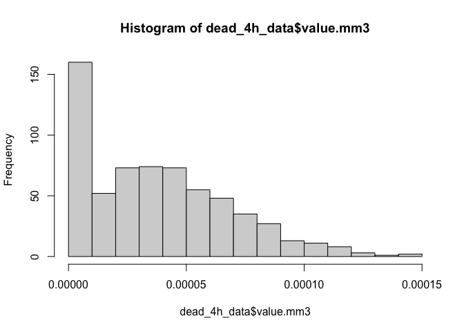<!-- -->

Identify using standardized residuals.

``` r
# Extract raw residuals
dead_4h_data$raw_resid <- residuals(model)

# Standardize residuals
dead_4h_data$std_resid <- dead_4h_data$raw_resid / sd(dead_4h_data$raw_resid)

# Flag potential outliers
outlier_threshold <- 3
dead_4h_data$outlier_flag <- abs(dead_4h_data$std_resid) > outlier_threshold

# Filter rows flagged as outliers
outliers <- dead_4h_data %>% filter(outlier_flag == TRUE)
print(outliers)
```

    ## # A tibble: 6 × 13
    ##       date   bag sample hardening       temperature time  status final.mortality
    ##      <dbl> <dbl> <chr>  <chr>           <chr>       <fct>  <dbl> <chr>          
    ## 1 20240725    66 22     fresh-water     42C         4          1 dead           
    ## 2 20240729    37 30     control         42C         0          0 dead           
    ## 3 20240729    37 34     control         42C         0          0 dead           
    ## 4 20240801    75 22     fresh-water-te… 42C         0          0 dead           
    ## 5 20240812    36 21     control         42C         0          0 dead           
    ## 6 20240812    36 28     control         42C         0          0 dead           
    ## # ℹ 5 more variables: incubation.mortality <chr>, value.mm3 <dbl>,
    ## #   raw_resid <dbl>, std_resid <dbl>, outlier_flag <lgl>

``` r
# Plot standardized residuals
ggplot(dead_4h_data, aes(x = seq_along(std_resid), y = std_resid)) +
  geom_point(aes(color = outlier_flag), size = 2) +
  geom_hline(yintercept = c(-outlier_threshold, outlier_threshold), linetype = "dashed", color = "red") +
  labs(title = "Standardized Residuals with Outliers", x = "Index", y = "Standardized Residual") +
  theme_minimal()
```

<!-- -->

Remove identified outliers.

``` r
dead_4h_data<-dead_4h_data%>%
  filter(!outlier_flag==TRUE)
```

``` r
hist(dead_4h_data$value.mm3)
```

<!-- -->

### Analyze model

Plot raw data.

``` r
dead_4h_data%>%
  ggplot(aes(x=time, y=value.mm3, colour=temperature, group=sample))+
  facet_wrap(~bag*date*hardening)+
  geom_point()+
  geom_line()+
  theme_classic()
```

<!-- -->

``` r
model2<-lmer(sqrt(value.mm3) ~ time * hardening + (1|bag) + (1|date:bag:sample), data=dead_4h_data)

summary(model2)
```

    ## Linear mixed model fit by REML. t-tests use Satterthwaite's method [
    ## lmerModLmerTest]
    ## Formula: sqrt(value.mm3) ~ time * hardening + (1 | bag) + (1 | date:bag:sample)
    ##    Data: dead_4h_data
    ## 
    ## REML criterion at convergence: -6598.7
    ## 
    ## Scaled residuals: 
    ##      Min       1Q   Median       3Q      Max 
    ## -2.92111 -0.52906 -0.00578  0.57778  2.84719 
    ## 
    ## Random effects:
    ##  Groups          Name        Variance  Std.Dev. 
    ##  date:bag:sample (Intercept) 1.454e-06 0.0012057
    ##  bag             (Intercept) 8.925e-08 0.0002987
    ##  Residual                    5.360e-07 0.0007321
    ## Number of obs: 629, groups:  date:bag:sample, 127; bag, 10
    ## 
    ## Fixed effects:
    ##                                          Estimate Std. Error         df t value
    ## (Intercept)                             2.421e-04  3.336e-04  5.426e+00   0.726
    ## time1                                   4.220e-03  1.909e-04  4.823e+02  22.107
    ## time2                                   5.488e-03  1.909e-04  4.823e+02  28.748
    ## time3                                   6.554e-03  1.909e-04  4.823e+02  34.334
    ## time4                                   7.178e-03  1.909e-04  4.823e+02  37.600
    ## hardeningfresh-water                   -2.590e-04  5.065e-04  7.222e+00  -0.511
    ## hardeningfresh-water-temperature       -9.657e-05  4.978e-04  6.850e+00  -0.194
    ## hardeningimmune                        -2.238e-04  4.928e-04  6.541e+00  -0.454
    ## hardeningtemperature                   -2.421e-04  4.714e-04  5.510e+00  -0.514
    ## time1:hardeningfresh-water              1.107e-03  3.001e-04  4.815e+02   3.690
    ## time2:hardeningfresh-water              1.252e-03  3.001e-04  4.815e+02   4.172
    ## time3:hardeningfresh-water              1.318e-03  3.001e-04  4.815e+02   4.393
    ## time4:hardeningfresh-water              1.409e-03  3.030e-04  4.818e+02   4.652
    ## time1:hardeningfresh-water-temperature -1.065e-03  2.943e-04  4.818e+02  -3.620
    ## time2:hardeningfresh-water-temperature -7.653e-04  2.943e-04  4.818e+02  -2.601
    ## time3:hardeningfresh-water-temperature -7.032e-04  2.943e-04  4.818e+02  -2.390
    ## time4:hardeningfresh-water-temperature -3.715e-04  2.943e-04  4.818e+02  -1.263
    ## time1:hardeningimmune                   1.700e-03  2.882e-04  4.815e+02   5.900
    ## time2:hardeningimmune                   1.656e-03  2.882e-04  4.815e+02   5.745
    ## time3:hardeningimmune                   1.592e-03  2.882e-04  4.815e+02   5.525
    ## time4:hardeningimmune                   1.578e-03  2.882e-04  4.815e+02   5.475
    ## time1:hardeningtemperature              6.011e-04  2.687e-04  4.816e+02   2.237
    ## time2:hardeningtemperature              8.247e-04  2.687e-04  4.816e+02   3.070
    ## time3:hardeningtemperature              8.124e-04  2.687e-04  4.816e+02   3.024
    ## time4:hardeningtemperature              1.018e-03  2.687e-04  4.816e+02   3.791
    ##                                        Pr(>|t|)    
    ## (Intercept)                            0.498061    
    ## time1                                   < 2e-16 ***
    ## time2                                   < 2e-16 ***
    ## time3                                   < 2e-16 ***
    ## time4                                   < 2e-16 ***
    ## hardeningfresh-water                   0.624300    
    ## hardeningfresh-water-temperature       0.851799    
    ## hardeningimmune                        0.664364    
    ## hardeningtemperature                   0.627465    
    ## time1:hardeningfresh-water             0.000250 ***
    ## time2:hardeningfresh-water             3.58e-05 ***
    ## time3:hardeningfresh-water             1.37e-05 ***
    ## time4:hardeningfresh-water             4.25e-06 ***
    ## time1:hardeningfresh-water-temperature 0.000326 ***
    ## time2:hardeningfresh-water-temperature 0.009591 ** 
    ## time3:hardeningfresh-water-temperature 0.017243 *  
    ## time4:hardeningfresh-water-temperature 0.207362    
    ## time1:hardeningimmune                  6.85e-09 ***
    ## time2:hardeningimmune                  1.63e-08 ***
    ## time3:hardeningimmune                  5.40e-08 ***
    ## time4:hardeningimmune                  7.06e-08 ***
    ## time1:hardeningtemperature             0.025711 *  
    ## time2:hardeningtemperature             0.002263 ** 
    ## time3:hardeningtemperature             0.002628 ** 
    ## time4:hardeningtemperature             0.000169 ***
    ## ---
    ## Signif. codes:  0 '***' 0.001 '**' 0.01 '*' 0.05 '.' 0.1 ' ' 1

``` r
anova(model2)
```

    ## Type III Analysis of Variance Table with Satterthwaite's method
    ##                   Sum Sq    Mean Sq NumDF  DenDF   F value  Pr(>F)    
    ## time           0.0046769 0.00116922     4 481.12 2181.2934 < 2e-16 ***
    ## hardening      0.0000088 0.00000220     4   5.09    4.1092 0.07507 .  
    ## time:hardening 0.0000709 0.00000443    16 481.12    8.2653 < 2e-16 ***
    ## ---
    ## Signif. codes:  0 '***' 0.001 '**' 0.01 '*' 0.05 '.' 0.1 ' ' 1

``` r
rand(model2)
```

    ## ANOVA-like table for random-effects: Single term deletions
    ## 
    ## Model:
    ## sqrt(value.mm3) ~ time + hardening + (1 | bag) + (1 | date:bag:sample) + time:hardening
    ##                       npar logLik     AIC    LRT Df Pr(>Chisq)    
    ## <none>                  28 3299.4 -6542.7                         
    ## (1 | bag)               27 3298.9 -6543.8   0.90  1     0.3435    
    ## (1 | date:bag:sample)   27 3080.7 -6107.5 437.29  1     <2e-16 ***
    ## ---
    ## Signif. codes:  0 '***' 0.001 '**' 0.01 '*' 0.05 '.' 0.1 ' ' 1

``` r
qqPlot(residuals(model2))
```

<!-- -->

    ## [1] 322 397

Significant effects of time x hardening in oysters that died within the
4 h incubation.

### Plot data

Plot mean response for each hardening treatment across time at 42°C in
those that died during the 4 hour incubation.

Plot first with individual points with geom smooth lines.

``` r
plot1a<-dead_4h_data%>%

  ggplot(aes(x=time, y=value.mm3, color=hardening, fill=hardening))+
  facet_grid(~temperature)+
  geom_point(alpha=0.5)+
  geom_smooth(aes(group=hardening))+
  scale_colour_brewer(palette=c("Dark2"))+
  scale_fill_brewer(palette=c("Dark2"))+
  theme_classic()+
  xlab("Hour");plot1a
```

<!-- -->

``` r
ggsave(plot1a, filename="figures/resazurin/hardening_42C_dead4h.png", width=6, height=4)
```

Next plot with mean and sem for each group.

``` r
plot2a<-dead_4h_data%>%
  group_by(temperature, hardening, time)%>%
  summarise(mean=mean(value.mm3, na.rm=TRUE), se=sd(value.mm3, na.rm=TRUE)/sqrt(length(value.mm3)))%>%

  ggplot(aes(x=time, y=mean, color=hardening, fill=hardening))+
  facet_grid(~temperature)+
  geom_errorbar(aes(ymin=mean-se, ymax=mean+se), width=0.1)+
  geom_point(alpha=0.5)+
  geom_line(aes(group=hardening))+
  #scale_colour_manual(values=c("cyan4", "orange"))+
  #scale_fill_manual(values=c("cyan4", "orange"))+
  theme_classic()+
  xlab("Hour");plot2a
```

<!-- -->

### Conduct post hoc tests

#### Effects of hardening treatment within temperature

``` r
anova(model2)
```

    ## Type III Analysis of Variance Table with Satterthwaite's method
    ##                   Sum Sq    Mean Sq NumDF  DenDF   F value  Pr(>F)    
    ## time           0.0046769 0.00116922     4 481.12 2181.2934 < 2e-16 ***
    ## hardening      0.0000088 0.00000220     4   5.09    4.1092 0.07507 .  
    ## time:hardening 0.0000709 0.00000443    16 481.12    8.2653 < 2e-16 ***
    ## ---
    ## Signif. codes:  0 '***' 0.001 '**' 0.01 '*' 0.05 '.' 0.1 ' ' 1

``` r
emm<-emmeans(model2, ~hardening|time, adjust = "tukey")
pairs(emm)
```

    ## time = 0:
    ##  contrast                                   estimate       SE   df t.ratio
    ##  control - (fresh-water)                    2.59e-04 0.000510 6.81   0.508
    ##  control - (fresh-water-temperature)        9.66e-05 0.000500 6.46   0.193
    ##  control - immune                           2.24e-04 0.000495 6.17   0.452
    ##  control - temperature                      2.42e-04 0.000473 5.20   0.511
    ##  (fresh-water) - (fresh-water-temperature) -1.62e-04 0.000532 8.37  -0.305
    ##  (fresh-water) - immune                    -3.52e-05 0.000528 8.03  -0.067
    ##  (fresh-water) - temperature               -1.69e-05 0.000507 6.92  -0.033
    ##  (fresh-water-temperature) - immune         1.27e-04 0.000518 7.66   0.246
    ##  (fresh-water-temperature) - temperature    1.46e-04 0.000497 6.56   0.293
    ##  immune - temperature                       1.83e-05 0.000493 6.27   0.037
    ##  p.value
    ##   0.9837
    ##   0.9996
    ##   0.9893
    ##   0.9825
    ##   0.9977
    ##   1.0000
    ##   1.0000
    ##   0.9990
    ##   0.9980
    ##   1.0000
    ## 
    ## time = 1:
    ##  contrast                                   estimate       SE   df t.ratio
    ##  control - (fresh-water)                   -8.48e-04 0.000507 6.66  -1.674
    ##  control - (fresh-water-temperature)        1.16e-03 0.000495 6.24   2.346
    ##  control - immune                          -1.48e-03 0.000492 6.02  -3.000
    ##  control - temperature                     -3.59e-04 0.000470 5.06  -0.764
    ##  (fresh-water) - (fresh-water-temperature)  2.01e-03 0.000531 8.28   3.788
    ##  (fresh-water) - immune                    -6.28e-04 0.000528 8.03  -1.190
    ##  (fresh-water) - temperature                4.89e-04 0.000507 6.92   0.964
    ##  (fresh-water-temperature) - immune        -2.64e-03 0.000517 7.58  -5.104
    ##  (fresh-water-temperature) - temperature   -1.52e-03 0.000496 6.49  -3.066
    ##  immune - temperature                       1.12e-03 0.000493 6.27   2.267
    ##  p.value
    ##   0.5043
    ##   0.2452
    ##   0.1167
    ##   0.9311
    ##   0.0303
    ##   0.7571
    ##   0.8629
    ##   0.0069
    ##   0.1014
    ##   0.2684
    ## 
    ## time = 2:
    ##  contrast                                   estimate       SE   df t.ratio
    ##  control - (fresh-water)                   -9.93e-04 0.000507 6.66  -1.960
    ##  control - (fresh-water-temperature)        8.62e-04 0.000495 6.24   1.741
    ##  control - immune                          -1.43e-03 0.000492 6.02  -2.909
    ##  control - temperature                     -5.83e-04 0.000470 5.06  -1.239
    ##  (fresh-water) - (fresh-water-temperature)  1.85e-03 0.000531 8.28   3.495
    ##  (fresh-water) - immune                    -4.39e-04 0.000528 8.03  -0.831
    ##  (fresh-water) - temperature                4.10e-04 0.000507 6.92   0.809
    ##  (fresh-water-temperature) - immune        -2.29e-03 0.000517 7.58  -4.437
    ##  (fresh-water-temperature) - temperature   -1.44e-03 0.000496 6.49  -2.912
    ##  immune - temperature                       8.49e-04 0.000493 6.27   1.722
    ##  p.value
    ##   0.3738
    ##   0.4753
    ##   0.1296
    ##   0.7340
    ##   0.0454
    ##   0.9135
    ##   0.9199
    ##   0.0152
    ##   0.1222
    ##   0.4837
    ## 
    ## time = 3:
    ##  contrast                                   estimate       SE   df t.ratio
    ##  control - (fresh-water)                   -1.06e-03 0.000507 6.66  -2.091
    ##  control - (fresh-water-temperature)        8.00e-04 0.000495 6.24   1.615
    ##  control - immune                          -1.37e-03 0.000492 6.02  -2.780
    ##  control - temperature                     -5.70e-04 0.000470 5.06  -1.213
    ##  (fresh-water) - (fresh-water-temperature)  1.86e-03 0.000531 8.28   3.503
    ##  (fresh-water) - immune                    -3.09e-04 0.000528 8.03  -0.586
    ##  (fresh-water) - temperature                4.89e-04 0.000507 6.92   0.964
    ##  (fresh-water-temperature) - immune        -2.17e-03 0.000517 7.58  -4.195
    ##  (fresh-water-temperature) - temperature   -1.37e-03 0.000496 6.49  -2.762
    ##  immune - temperature                       7.98e-04 0.000493 6.27   1.619
    ##  p.value
    ##   0.3227
    ##   0.5366
    ##   0.1506
    ##   0.7470
    ##   0.0449
    ##   0.9735
    ##   0.8631
    ##   0.0206
    ##   0.1466
    ##   0.5346
    ## 
    ## time = 4:
    ##  contrast                                   estimate       SE   df t.ratio
    ##  control - (fresh-water)                   -1.15e-03 0.000508 6.75  -2.263
    ##  control - (fresh-water-temperature)        4.68e-04 0.000495 6.24   0.945
    ##  control - immune                          -1.35e-03 0.000492 6.02  -2.751
    ##  control - temperature                     -7.76e-04 0.000470 5.06  -1.651
    ##  (fresh-water) - (fresh-water-temperature)  1.62e-03 0.000532 8.39   3.041
    ##  (fresh-water) - immune                    -2.04e-04 0.000529 8.13  -0.385
    ##  (fresh-water) - temperature                3.74e-04 0.000509 7.02   0.734
    ##  (fresh-water-temperature) - immune        -1.82e-03 0.000517 7.58  -3.525
    ##  (fresh-water-temperature) - temperature   -1.24e-03 0.000496 6.49  -2.509
    ##  immune - temperature                       5.78e-04 0.000493 6.27   1.172
    ##  p.value
    ##   0.2629
    ##   0.8699
    ##   0.1558
    ##   0.5284
    ##   0.0847
    ##   0.9944
    ##   0.9414
    ##   0.0485
    ##   0.1991
    ##   0.7669
    ## 
    ## Note: contrasts are still on the sqrt scale 
    ## Degrees-of-freedom method: kenward-roger 
    ## P value adjustment: tukey method for comparing a family of 5 estimates

No differences between treatments within time are significant.

## Analysis of metabolic differences in live vs dead oysters during the 4 h trial at 42°C

``` r
high_4h_data<-main_data%>%
  filter(temperature=="42C")%>%
  ungroup()%>%
  dplyr::select(!c(value, volume.mm3, width.mm, length.mm))

#view sample size 
high_4h_data%>%
  group_by(time, temperature, hardening)%>%
  dplyr::summarise(length(value.mm3))%>%
  print(n=100)
```

    ## # A tibble: 25 × 4
    ## # Groups:   time, temperature [5]
    ##    time  temperature hardening               `length(value.mm3)`
    ##    <fct> <chr>       <chr>                                 <int>
    ##  1 0     42C         control                                  60
    ##  2 0     42C         fresh-water                              39
    ##  3 0     42C         fresh-water-temperature                  40
    ##  4 0     42C         immune                                   40
    ##  5 0     42C         temperature                              40
    ##  6 1     42C         control                                  60
    ##  7 1     42C         fresh-water                              39
    ##  8 1     42C         fresh-water-temperature                  40
    ##  9 1     42C         immune                                   40
    ## 10 1     42C         temperature                              40
    ## 11 2     42C         control                                  60
    ## 12 2     42C         fresh-water                              39
    ## 13 2     42C         fresh-water-temperature                  40
    ## 14 2     42C         immune                                   40
    ## 15 2     42C         temperature                              40
    ## 16 3     42C         control                                  60
    ## 17 3     42C         fresh-water                              39
    ## 18 3     42C         fresh-water-temperature                  40
    ## 19 3     42C         immune                                   40
    ## 20 3     42C         temperature                              40
    ## 21 4     42C         control                                  60
    ## 22 4     42C         fresh-water                              39
    ## 23 4     42C         fresh-water-temperature                  40
    ## 24 4     42C         immune                                   40
    ## 25 4     42C         temperature                              40

Using only 42°C, because we only had 1-4 oysters that died at 18°C,
making alive vs dead comparisons at 18°C not possible. This is expected
since we do not expect mortality at 18°C.

### Detect outliers

Build a model including all predictors.

``` r
model3<-lmer(sqrt(value.mm3) ~ time * hardening * incubation.mortality + (1|bag) + (1|date:bag:sample), data=high_4h_data)

qqPlot(residuals(model3))
```

<!-- -->

    ## [1] 646 266

``` r
hist(high_4h_data$value.mm3)
```

<!-- -->

Identify using standardized residuals.

``` r
# Extract raw residuals
high_4h_data$raw_resid <- residuals(model3)

# Standardize residuals
high_4h_data$std_resid <- high_4h_data$raw_resid / sd(high_4h_data$raw_resid)

# Flag potential outliers
outlier_threshold <- 3
high_4h_data$outlier_flag <- abs(high_4h_data$std_resid) > outlier_threshold

# Filter rows flagged as outliers
outliers <- high_4h_data %>% filter(outlier_flag == TRUE)
print(outliers)
```

    ## # A tibble: 15 × 13
    ##        date   bag sample hardening      temperature time  status final.mortality
    ##       <dbl> <dbl> <chr>  <chr>          <chr>       <fct>  <dbl> <chr>          
    ##  1 20240724    36 23     control        42C         0          0 alive          
    ##  2 20240724    36 26     control        42C         0          0 alive          
    ##  3 20240725    66 22     fresh-water    42C         4          1 dead           
    ##  4 20240725    66 25     fresh-water    42C         0          0 dead           
    ##  5 20240729    37 30     control        42C         0          0 dead           
    ##  6 20240729    37 31     control        42C         4          0 dead           
    ##  7 20240729    37 34     control        42C         0          0 dead           
    ##  8 20240801    75 22     fresh-water-t… 42C         0          0 dead           
    ##  9 20240805    50 23     immune         42C         0          0 dead           
    ## 10 20240805    50 28     immune         42C         0          0 alive          
    ## 11 20240805    50 37     immune         42C         0          0 dead           
    ## 12 20240807    47 30     temperature    42C         0          0 alive          
    ## 13 20240807    47 39     temperature    42C         0          0 dead           
    ## 14 20240812    36 21     control        42C         0          0 dead           
    ## 15 20240812    36 28     control        42C         0          0 dead           
    ## # ℹ 5 more variables: incubation.mortality <chr>, value.mm3 <dbl>,
    ## #   raw_resid <dbl>, std_resid <dbl>, outlier_flag <lgl>

``` r
# Plot standardized residuals
ggplot(high_4h_data, aes(x = seq_along(std_resid), y = std_resid)) +
  geom_point(aes(color = outlier_flag), size = 2) +
  geom_hline(yintercept = c(-outlier_threshold, outlier_threshold), linetype = "dashed", color = "red") +
  labs(title = "Standardized Residuals with Outliers", x = "Index", y = "Standardized Residual") +
  theme_minimal()
```

<!-- -->

Remove identified outliers.

``` r
high_4h_data<-high_4h_data%>%
  filter(!outlier_flag==TRUE)
```

``` r
hist(high_4h_data$value.mm3)
```

<!-- -->

### Analyze model

Plot raw data.

``` r
high_4h_data%>%
  ggplot(aes(x=time, y=value.mm3, colour=temperature, group=sample))+
  facet_wrap(~bag*date*hardening)+
  geom_point()+
  geom_line()+
  theme_classic()
```

<!-- -->

``` r
model3<-lmer(sqrt(value.mm3) ~ time * hardening * incubation.mortality + (1|bag) + (1|date:bag:sample), data=high_4h_data)

summary(model3)
```

    ## Linear mixed model fit by REML. t-tests use Satterthwaite's method [
    ## lmerModLmerTest]
    ## Formula: sqrt(value.mm3) ~ time * hardening * incubation.mortality + (1 |  
    ##     bag) + (1 | date:bag:sample)
    ##    Data: high_4h_data
    ## 
    ## REML criterion at convergence: -11460.9
    ## 
    ## Scaled residuals: 
    ##     Min      1Q  Median      3Q     Max 
    ## -3.5818 -0.4594 -0.0273  0.5074  3.9228 
    ## 
    ## Random effects:
    ##  Groups          Name        Variance  Std.Dev. 
    ##  date:bag:sample (Intercept) 1.410e-06 0.0011873
    ##  bag             (Intercept) 1.446e-07 0.0003802
    ##  Residual                    4.122e-07 0.0006420
    ## Number of obs: 1080, groups:  date:bag:sample, 219; bag, 10
    ## 
    ## Fixed effects:
    ##                                                                   Estimate
    ## (Intercept)                                                      2.007e-04
    ## time1                                                            3.288e-03
    ## time2                                                            4.197e-03
    ## time3                                                            4.933e-03
    ## time4                                                            5.518e-03
    ## hardeningfresh-water                                            -7.984e-06
    ## hardeningfresh-water-temperature                                -2.007e-04
    ## hardeningimmune                                                  1.361e-04
    ## hardeningtemperature                                             2.964e-04
    ## incubation.mortalitydead                                         6.364e-06
    ## time1:hardeningfresh-water                                      -5.378e-04
    ## time2:hardeningfresh-water                                      -4.138e-04
    ## time3:hardeningfresh-water                                      -6.521e-04
    ## time4:hardeningfresh-water                                      -7.115e-04
    ## time1:hardeningfresh-water-temperature                          -8.617e-04
    ## time2:hardeningfresh-water-temperature                          -8.385e-04
    ## time3:hardeningfresh-water-temperature                          -1.022e-03
    ## time4:hardeningfresh-water-temperature                          -1.130e-03
    ## time1:hardeningimmune                                           -4.645e-04
    ## time2:hardeningimmune                                           -4.467e-04
    ## time3:hardeningimmune                                           -7.732e-04
    ## time4:hardeningimmune                                           -9.651e-04
    ## time1:hardeningtemperature                                      -3.690e-05
    ## time2:hardeningtemperature                                       4.380e-04
    ## time3:hardeningtemperature                                       2.004e-04
    ## time4:hardeningtemperature                                       1.937e-04
    ## time1:incubation.mortalitydead                                   9.284e-04
    ## time2:incubation.mortalitydead                                   1.287e-03
    ## time3:incubation.mortalitydead                                   1.618e-03
    ## time4:incubation.mortalitydead                                   1.656e-03
    ## hardeningfresh-water:incubation.mortalitydead                   -2.354e-04
    ## hardeningfresh-water-temperature:incubation.mortalitydead        1.422e-04
    ## hardeningimmune:incubation.mortalitydead                        -1.810e-04
    ## hardeningtemperature:incubation.mortalitydead                   -5.930e-04
    ## time1:hardeningfresh-water:incubation.mortalitydead              1.649e-03
    ## time2:hardeningfresh-water:incubation.mortalitydead              1.670e-03
    ## time3:hardeningfresh-water:incubation.mortalitydead              1.974e-03
    ## time4:hardeningfresh-water:incubation.mortalitydead              2.124e-03
    ## time1:hardeningfresh-water-temperature:incubation.mortalitydead -2.028e-04
    ## time2:hardeningfresh-water-temperature:incubation.mortalitydead  7.401e-05
    ## time3:hardeningfresh-water-temperature:incubation.mortalitydead  3.195e-04
    ## time4:hardeningfresh-water-temperature:incubation.mortalitydead  7.595e-04
    ## time1:hardeningimmune:incubation.mortalitydead                   2.047e-03
    ## time2:hardeningimmune:incubation.mortalitydead                   1.984e-03
    ## time3:hardeningimmune:incubation.mortalitydead                   2.247e-03
    ## time4:hardeningimmune:incubation.mortalitydead                   2.425e-03
    ## time1:hardeningtemperature:incubation.mortalitydead              7.314e-04
    ## time2:hardeningtemperature:incubation.mortalitydead              4.802e-04
    ## time3:hardeningtemperature:incubation.mortalitydead              7.054e-04
    ## time4:hardeningtemperature:incubation.mortalitydead              9.182e-04
    ##                                                                 Std. Error
    ## (Intercept)                                                      3.774e-04
    ## time1                                                            1.756e-04
    ## time2                                                            1.756e-04
    ## time3                                                            1.756e-04
    ## time4                                                            1.776e-04
    ## hardeningfresh-water                                             5.592e-04
    ## hardeningfresh-water-temperature                                 5.621e-04
    ## hardeningimmune                                                  5.715e-04
    ## hardeningtemperature                                             6.345e-04
    ## incubation.mortalitydead                                         3.553e-04
    ## time1:hardeningfresh-water                                       2.752e-04
    ## time2:hardeningfresh-water                                       2.752e-04
    ## time3:hardeningfresh-water                                       2.752e-04
    ## time4:hardeningfresh-water                                       2.764e-04
    ## time1:hardeningfresh-water-temperature                           2.768e-04
    ## time2:hardeningfresh-water-temperature                           2.768e-04
    ## time3:hardeningfresh-water-temperature                           2.768e-04
    ## time4:hardeningfresh-water-temperature                           2.781e-04
    ## time1:hardeningimmune                                            2.887e-04
    ## time2:hardeningimmune                                            2.887e-04
    ## time3:hardeningimmune                                            2.887e-04
    ## time4:hardeningimmune                                            2.899e-04
    ## time1:hardeningtemperature                                       3.449e-04
    ## time2:hardeningtemperature                                       3.449e-04
    ## time3:hardeningtemperature                                       3.449e-04
    ## time4:hardeningtemperature                                       3.459e-04
    ## time1:incubation.mortalitydead                                   2.426e-04
    ## time2:incubation.mortalitydead                                   2.426e-04
    ## time3:incubation.mortalitydead                                   2.426e-04
    ## time4:incubation.mortalitydead                                   2.441e-04
    ## hardeningfresh-water:incubation.mortalitydead                    5.640e-04
    ## hardeningfresh-water-temperature:incubation.mortalitydead        5.580e-04
    ## hardeningimmune:incubation.mortalitydead                         5.656e-04
    ## hardeningtemperature:incubation.mortalitydead                    6.127e-04
    ## time1:hardeningfresh-water:incubation.mortalitydead              3.808e-04
    ## time2:hardeningfresh-water:incubation.mortalitydead              3.808e-04
    ## time3:hardeningfresh-water:incubation.mortalitydead              3.808e-04
    ## time4:hardeningfresh-water:incubation.mortalitydead              3.834e-04
    ## time1:hardeningfresh-water-temperature:incubation.mortalitydead  3.785e-04
    ## time2:hardeningfresh-water-temperature:incubation.mortalitydead  3.785e-04
    ## time3:hardeningfresh-water-temperature:incubation.mortalitydead  3.785e-04
    ## time4:hardeningfresh-water-temperature:incubation.mortalitydead  3.794e-04
    ## time1:hardeningimmune:incubation.mortalitydead                   3.850e-04
    ## time2:hardeningimmune:incubation.mortalitydead                   3.850e-04
    ## time3:hardeningimmune:incubation.mortalitydead                   3.850e-04
    ## time4:hardeningimmune:incubation.mortalitydead                   3.859e-04
    ## time1:hardeningtemperature:incubation.mortalitydead              4.184e-04
    ## time2:hardeningtemperature:incubation.mortalitydead              4.184e-04
    ## time3:hardeningtemperature:incubation.mortalitydead              4.184e-04
    ## time4:hardeningtemperature:incubation.mortalitydead              4.192e-04
    ##                                                                         df
    ## (Intercept)                                                      8.208e+00
    ## time1                                                            8.196e+02
    ## time2                                                            8.196e+02
    ## time3                                                            8.196e+02
    ## time4                                                            8.202e+02
    ## hardeningfresh-water                                             9.991e+00
    ## hardeningfresh-water-temperature                                 1.023e+01
    ## hardeningimmune                                                  1.089e+01
    ## hardeningtemperature                                             1.649e+01
    ## incubation.mortalitydead                                         3.139e+02
    ## time1:hardeningfresh-water                                       8.195e+02
    ## time2:hardeningfresh-water                                       8.195e+02
    ## time3:hardeningfresh-water                                       8.195e+02
    ## time4:hardeningfresh-water                                       8.197e+02
    ## time1:hardeningfresh-water-temperature                           8.190e+02
    ## time2:hardeningfresh-water-temperature                           8.190e+02
    ## time3:hardeningfresh-water-temperature                           8.190e+02
    ## time4:hardeningfresh-water-temperature                           8.192e+02
    ## time1:hardeningimmune                                            8.200e+02
    ## time2:hardeningimmune                                            8.200e+02
    ## time3:hardeningimmune                                            8.200e+02
    ## time4:hardeningimmune                                            8.202e+02
    ## time1:hardeningtemperature                                       8.199e+02
    ## time2:hardeningtemperature                                       8.199e+02
    ## time3:hardeningtemperature                                       8.199e+02
    ## time4:hardeningtemperature                                       8.201e+02
    ## time1:incubation.mortalitydead                                   8.200e+02
    ## time2:incubation.mortalitydead                                   8.200e+02
    ## time3:incubation.mortalitydead                                   8.200e+02
    ## time4:incubation.mortalitydead                                   8.203e+02
    ## hardeningfresh-water:incubation.mortalitydead                    3.084e+02
    ## hardeningfresh-water-temperature:incubation.mortalitydead        3.056e+02
    ## hardeningimmune:incubation.mortalitydead                         3.138e+02
    ## hardeningtemperature:incubation.mortalitydead                    3.119e+02
    ## time1:hardeningfresh-water:incubation.mortalitydead              8.194e+02
    ## time2:hardeningfresh-water:incubation.mortalitydead              8.194e+02
    ## time3:hardeningfresh-water:incubation.mortalitydead              8.194e+02
    ## time4:hardeningfresh-water:incubation.mortalitydead              8.197e+02
    ## time1:hardeningfresh-water-temperature:incubation.mortalitydead  8.194e+02
    ## time2:hardeningfresh-water-temperature:incubation.mortalitydead  8.194e+02
    ## time3:hardeningfresh-water-temperature:incubation.mortalitydead  8.194e+02
    ## time4:hardeningfresh-water-temperature:incubation.mortalitydead  8.195e+02
    ## time1:hardeningimmune:incubation.mortalitydead                   8.199e+02
    ## time2:hardeningimmune:incubation.mortalitydead                   8.199e+02
    ## time3:hardeningimmune:incubation.mortalitydead                   8.199e+02
    ## time4:hardeningimmune:incubation.mortalitydead                   8.200e+02
    ## time1:hardeningtemperature:incubation.mortalitydead              8.199e+02
    ## time2:hardeningtemperature:incubation.mortalitydead              8.199e+02
    ## time3:hardeningtemperature:incubation.mortalitydead              8.199e+02
    ## time4:hardeningtemperature:incubation.mortalitydead              8.200e+02
    ##                                                                 t value
    ## (Intercept)                                                       0.532
    ## time1                                                            18.723
    ## time2                                                            23.901
    ## time3                                                            28.088
    ## time4                                                            31.070
    ## hardeningfresh-water                                             -0.014
    ## hardeningfresh-water-temperature                                 -0.357
    ## hardeningimmune                                                   0.238
    ## hardeningtemperature                                              0.467
    ## incubation.mortalitydead                                          0.018
    ## time1:hardeningfresh-water                                       -1.955
    ## time2:hardeningfresh-water                                       -1.504
    ## time3:hardeningfresh-water                                       -2.370
    ## time4:hardeningfresh-water                                       -2.574
    ## time1:hardeningfresh-water-temperature                           -3.112
    ## time2:hardeningfresh-water-temperature                           -3.029
    ## time3:hardeningfresh-water-temperature                           -3.691
    ## time4:hardeningfresh-water-temperature                           -4.064
    ## time1:hardeningimmune                                            -1.609
    ## time2:hardeningimmune                                            -1.547
    ## time3:hardeningimmune                                            -2.679
    ## time4:hardeningimmune                                            -3.329
    ## time1:hardeningtemperature                                       -0.107
    ## time2:hardeningtemperature                                        1.270
    ## time3:hardeningtemperature                                        0.581
    ## time4:hardeningtemperature                                        0.560
    ## time1:incubation.mortalitydead                                    3.826
    ## time2:incubation.mortalitydead                                    5.304
    ## time3:incubation.mortalitydead                                    6.668
    ## time4:incubation.mortalitydead                                    6.786
    ## hardeningfresh-water:incubation.mortalitydead                    -0.417
    ## hardeningfresh-water-temperature:incubation.mortalitydead         0.255
    ## hardeningimmune:incubation.mortalitydead                         -0.320
    ## hardeningtemperature:incubation.mortalitydead                    -0.968
    ## time1:hardeningfresh-water:incubation.mortalitydead               4.331
    ## time2:hardeningfresh-water:incubation.mortalitydead               4.385
    ## time3:hardeningfresh-water:incubation.mortalitydead               5.185
    ## time4:hardeningfresh-water:incubation.mortalitydead               5.540
    ## time1:hardeningfresh-water-temperature:incubation.mortalitydead  -0.536
    ## time2:hardeningfresh-water-temperature:incubation.mortalitydead   0.196
    ## time3:hardeningfresh-water-temperature:incubation.mortalitydead   0.844
    ## time4:hardeningfresh-water-temperature:incubation.mortalitydead   2.002
    ## time1:hardeningimmune:incubation.mortalitydead                    5.316
    ## time2:hardeningimmune:incubation.mortalitydead                    5.154
    ## time3:hardeningimmune:incubation.mortalitydead                    5.838
    ## time4:hardeningimmune:incubation.mortalitydead                    6.284
    ## time1:hardeningtemperature:incubation.mortalitydead               1.748
    ## time2:hardeningtemperature:incubation.mortalitydead               1.148
    ## time3:hardeningtemperature:incubation.mortalitydead               1.686
    ## time4:hardeningtemperature:incubation.mortalitydead               2.190
    ##                                                                 Pr(>|t|)    
    ## (Intercept)                                                     0.609024    
    ## time1                                                            < 2e-16 ***
    ## time2                                                            < 2e-16 ***
    ## time3                                                            < 2e-16 ***
    ## time4                                                            < 2e-16 ***
    ## hardeningfresh-water                                            0.988890    
    ## hardeningfresh-water-temperature                                0.728352    
    ## hardeningimmune                                                 0.816158    
    ## hardeningtemperature                                            0.646499    
    ## incubation.mortalitydead                                        0.985722    
    ## time1:hardeningfresh-water                                      0.050981 .  
    ## time2:hardeningfresh-water                                      0.132981    
    ## time3:hardeningfresh-water                                      0.018037 *  
    ## time4:hardeningfresh-water                                      0.010228 *  
    ## time1:hardeningfresh-water-temperature                          0.001920 ** 
    ## time2:hardeningfresh-water-temperature                          0.002534 ** 
    ## time3:hardeningfresh-water-temperature                          0.000238 ***
    ## time4:hardeningfresh-water-temperature                          5.29e-05 ***
    ## time1:hardeningimmune                                           0.107946    
    ## time2:hardeningimmune                                           0.122157    
    ## time3:hardeningimmune                                           0.007541 ** 
    ## time4:hardeningimmune                                           0.000909 ***
    ## time1:hardeningtemperature                                      0.914811    
    ## time2:hardeningtemperature                                      0.204445    
    ## time3:hardeningtemperature                                      0.561297    
    ## time4:hardeningtemperature                                      0.575564    
    ## time1:incubation.mortalitydead                                  0.000140 ***
    ## time2:incubation.mortalitydead                                  1.46e-07 ***
    ## time3:incubation.mortalitydead                                  4.77e-11 ***
    ## time4:incubation.mortalitydead                                  2.20e-11 ***
    ## hardeningfresh-water:incubation.mortalitydead                   0.676692    
    ## hardeningfresh-water-temperature:incubation.mortalitydead       0.799064    
    ## hardeningimmune:incubation.mortalitydead                        0.749240    
    ## hardeningtemperature:incubation.mortalitydead                   0.333887    
    ## time1:hardeningfresh-water:incubation.mortalitydead             1.67e-05 ***
    ## time2:hardeningfresh-water:incubation.mortalitydead             1.31e-05 ***
    ## time3:hardeningfresh-water:incubation.mortalitydead             2.72e-07 ***
    ## time4:hardeningfresh-water:incubation.mortalitydead             4.07e-08 ***
    ## time1:hardeningfresh-water-temperature:incubation.mortalitydead 0.592201    
    ## time2:hardeningfresh-water-temperature:incubation.mortalitydead 0.845019    
    ## time3:hardeningfresh-water-temperature:incubation.mortalitydead 0.398812    
    ## time4:hardeningfresh-water-temperature:incubation.mortalitydead 0.045633 *  
    ## time1:hardeningimmune:incubation.mortalitydead                  1.37e-07 ***
    ## time2:hardeningimmune:incubation.mortalitydead                  3.20e-07 ***
    ## time3:hardeningimmune:incubation.mortalitydead                  7.63e-09 ***
    ## time4:hardeningimmune:incubation.mortalitydead                  5.37e-10 ***
    ## time1:hardeningtemperature:incubation.mortalitydead             0.080779 .  
    ## time2:hardeningtemperature:incubation.mortalitydead             0.251419    
    ## time3:hardeningtemperature:incubation.mortalitydead             0.092156 .  
    ## time4:hardeningtemperature:incubation.mortalitydead             0.028780 *  
    ## ---
    ## Signif. codes:  0 '***' 0.001 '**' 0.01 '*' 0.05 '.' 0.1 ' ' 1

``` r
anova(model3)
```

    ## Type III Analysis of Variance Table with Satterthwaite's method
    ##                                        Sum Sq    Mean Sq NumDF  DenDF   F value
    ## time                                0.0048747 0.00121866     4 819.01 2956.3652
    ## hardening                           0.0000037 0.00000093     4   4.98    2.2564
    ## incubation.mortality                0.0000403 0.00004032     1 203.20   97.8033
    ## time:hardening                      0.0000423 0.00000264    16 819.01    6.4140
    ## time:incubation.mortality           0.0002459 0.00006147     4 819.01  149.1187
    ## hardening:incubation.mortality      0.0000060 0.00000151     4 203.16    3.6559
    ## time:hardening:incubation.mortality 0.0000344 0.00000215    16 819.01    5.2167
    ##                                        Pr(>F)    
    ## time                                < 2.2e-16 ***
    ## hardening                            0.198346    
    ## incubation.mortality                < 2.2e-16 ***
    ## time:hardening                      1.015e-13 ***
    ## time:incubation.mortality           < 2.2e-16 ***
    ## hardening:incubation.mortality       0.006712 ** 
    ## time:hardening:incubation.mortality 1.560e-10 ***
    ## ---
    ## Signif. codes:  0 '***' 0.001 '**' 0.01 '*' 0.05 '.' 0.1 ' ' 1

``` r
rand(model3)
```

    ## ANOVA-like table for random-effects: Single term deletions
    ## 
    ## Model:
    ## sqrt(value.mm3) ~ time + hardening + incubation.mortality + (1 | bag) + (1 | date:bag:sample) + time:hardening + time:incubation.mortality + hardening:incubation.mortality + time:hardening:incubation.mortality
    ##                       npar logLik    AIC    LRT Df Pr(>Chisq)    
    ## <none>                  53 5730.4 -11355                         
    ## (1 | bag)               52 5728.4 -11353   4.11  1    0.04263 *  
    ## (1 | date:bag:sample)   52 5302.8 -10502 855.32  1    < 2e-16 ***
    ## ---
    ## Signif. codes:  0 '***' 0.001 '**' 0.01 '*' 0.05 '.' 0.1 ' ' 1

``` r
qqPlot(residuals(model3))
```

<!-- -->

    ## [1] 249 812

Significant effects of time x hardening x mortality in oysters during
the 4 h incubation.

### Plot data

Plot mean response for each hardening treatment across time in those
that died or remained alive during the 4 hour incubation.

Plot first with individual points with geom smooth lines.

``` r
plot1a<-high_4h_data%>%

  ggplot(aes(x=time, y=value.mm3, color=incubation.mortality, fill=incubation.mortality))+
  facet_grid(~hardening)+
  geom_point(alpha=0.5)+
  geom_smooth(aes(group=incubation.mortality))+
  scale_colour_manual(values=c("darkgray", "darkred"))+
  scale_fill_manual(values=c("darkgray", "darkred"))+
  theme_classic()+
  xlab("Hour");plot1a
```

<!-- -->

``` r
ggsave(plot1a, filename="figures/resazurin/hardening_42C_mortality_dead4h.png", width=8, height=4)
```

Next plot with mean and sem for each group.

``` r
plot2a<-high_4h_data%>%
  group_by(incubation.mortality, hardening, time)%>%
  summarise(mean=mean(value.mm3, na.rm=TRUE), se=sd(value.mm3, na.rm=TRUE)/sqrt(length(value.mm3)))%>%

  ggplot(aes(x=time, y=mean, color=incubation.mortality, fill=incubation.mortality))+
  facet_grid(~hardening)+
  geom_errorbar(aes(ymin=mean-se, ymax=mean+se), width=0.1)+
  geom_point(alpha=0.5)+
  geom_line(aes(group=incubation.mortality))+
  scale_colour_manual(values=c("darkgray", "darkred"))+
  scale_fill_manual(values=c("darkgray", "darkred"))+
  theme_classic()+
  xlab("Hour");plot2a
```

<!-- -->

It appears that the temperature hardened group had less metabolic
plasticity.

### Conduct post hoc tests

#### Effects of mortality within hardening treatment and time

``` r
anova(model3)
```

    ## Type III Analysis of Variance Table with Satterthwaite's method
    ##                                        Sum Sq    Mean Sq NumDF  DenDF   F value
    ## time                                0.0048747 0.00121866     4 819.01 2956.3652
    ## hardening                           0.0000037 0.00000093     4   4.98    2.2564
    ## incubation.mortality                0.0000403 0.00004032     1 203.20   97.8033
    ## time:hardening                      0.0000423 0.00000264    16 819.01    6.4140
    ## time:incubation.mortality           0.0002459 0.00006147     4 819.01  149.1187
    ## hardening:incubation.mortality      0.0000060 0.00000151     4 203.16    3.6559
    ## time:hardening:incubation.mortality 0.0000344 0.00000215    16 819.01    5.2167
    ##                                        Pr(>F)    
    ## time                                < 2.2e-16 ***
    ## hardening                            0.198346    
    ## incubation.mortality                < 2.2e-16 ***
    ## time:hardening                      1.015e-13 ***
    ## time:incubation.mortality           < 2.2e-16 ***
    ## hardening:incubation.mortality       0.006712 ** 
    ## time:hardening:incubation.mortality 1.560e-10 ***
    ## ---
    ## Signif. codes:  0 '***' 0.001 '**' 0.01 '*' 0.05 '.' 0.1 ' ' 1

``` r
emm<-emmeans(model3, ~incubation.mortality|hardening|time, adjust = "tukey")
pairs(emm)
```

    ## hardening = control, time = 0:
    ##  contrast      estimate       SE  df t.ratio p.value
    ##  alive - dead -6.36e-06 0.000356 317  -0.018  0.9857
    ## 
    ## hardening = fresh-water, time = 0:
    ##  contrast      estimate       SE  df t.ratio p.value
    ##  alive - dead  2.29e-04 0.000440 308   0.521  0.6027
    ## 
    ## hardening = fresh-water-temperature, time = 0:
    ##  contrast      estimate       SE  df t.ratio p.value
    ##  alive - dead -1.49e-04 0.000430 303  -0.345  0.7302
    ## 
    ## hardening = immune, time = 0:
    ##  contrast      estimate       SE  df t.ratio p.value
    ##  alive - dead  1.75e-04 0.000441 317   0.396  0.6925
    ## 
    ## hardening = temperature, time = 0:
    ##  contrast      estimate       SE  df t.ratio p.value
    ##  alive - dead  5.87e-04 0.000499 314   1.175  0.2408
    ## 
    ## hardening = control, time = 1:
    ##  contrast      estimate       SE  df t.ratio p.value
    ##  alive - dead -9.35e-04 0.000351 301  -2.667  0.0081
    ## 
    ## hardening = fresh-water, time = 1:
    ##  contrast      estimate       SE  df t.ratio p.value
    ##  alive - dead -2.35e-03 0.000438 303  -5.364  <.0001
    ## 
    ## hardening = fresh-water-temperature, time = 1:
    ##  contrast      estimate       SE  df t.ratio p.value
    ##  alive - dead -8.74e-04 0.000429 300  -2.038  0.0425
    ## 
    ## hardening = immune, time = 1:
    ##  contrast      estimate       SE  df t.ratio p.value
    ##  alive - dead -2.80e-03 0.000436 302  -6.430  <.0001
    ## 
    ## hardening = temperature, time = 1:
    ##  contrast      estimate       SE  df t.ratio p.value
    ##  alive - dead -1.07e-03 0.000493 300  -2.178  0.0302
    ## 
    ## hardening = control, time = 2:
    ##  contrast      estimate       SE  df t.ratio p.value
    ##  alive - dead -1.29e-03 0.000351 301  -3.689  0.0003
    ## 
    ## hardening = fresh-water, time = 2:
    ##  contrast      estimate       SE  df t.ratio p.value
    ##  alive - dead -2.73e-03 0.000438 303  -6.231  <.0001
    ## 
    ## hardening = fresh-water-temperature, time = 2:
    ##  contrast      estimate       SE  df t.ratio p.value
    ##  alive - dead -1.51e-03 0.000429 300  -3.519  0.0005
    ## 
    ## hardening = immune, time = 2:
    ##  contrast      estimate       SE  df t.ratio p.value
    ##  alive - dead -3.10e-03 0.000436 302  -7.109  <.0001
    ## 
    ## hardening = temperature, time = 2:
    ##  contrast      estimate       SE  df t.ratio p.value
    ##  alive - dead -1.18e-03 0.000493 300  -2.395  0.0172
    ## 
    ## hardening = control, time = 3:
    ##  contrast      estimate       SE  df t.ratio p.value
    ##  alive - dead -1.62e-03 0.000351 301  -4.633  <.0001
    ## 
    ## hardening = fresh-water, time = 3:
    ##  contrast      estimate       SE  df t.ratio p.value
    ##  alive - dead -3.36e-03 0.000438 303  -7.682  <.0001
    ## 
    ## hardening = fresh-water-temperature, time = 3:
    ##  contrast      estimate       SE  df t.ratio p.value
    ##  alive - dead -2.09e-03 0.000429 300  -4.862  <.0001
    ## 
    ## hardening = immune, time = 3:
    ##  contrast      estimate       SE  df t.ratio p.value
    ##  alive - dead -3.69e-03 0.000436 302  -8.473  <.0001
    ## 
    ## hardening = temperature, time = 3:
    ##  contrast      estimate       SE  df t.ratio p.value
    ##  alive - dead -1.74e-03 0.000493 300  -3.524  0.0005
    ## 
    ## hardening = control, time = 4:
    ##  contrast      estimate       SE  df t.ratio p.value
    ##  alive - dead -1.66e-03 0.000352 304  -4.729  <.0001
    ## 
    ## hardening = fresh-water, time = 4:
    ##  contrast      estimate       SE  df t.ratio p.value
    ##  alive - dead -3.55e-03 0.000439 307  -8.086  <.0001
    ## 
    ## hardening = fresh-water-temperature, time = 4:
    ##  contrast      estimate       SE  df t.ratio p.value
    ##  alive - dead -2.56e-03 0.000429 300  -5.978  <.0001
    ## 
    ## hardening = immune, time = 4:
    ##  contrast      estimate       SE  df t.ratio p.value
    ##  alive - dead -3.91e-03 0.000436 302  -8.969  <.0001
    ## 
    ## hardening = temperature, time = 4:
    ##  contrast      estimate       SE  df t.ratio p.value
    ##  alive - dead -1.99e-03 0.000493 300  -4.033  0.0001
    ## 
    ## Note: contrasts are still on the sqrt scale 
    ## Degrees-of-freedom method: kenward-roger

- No differences at T0 as expected
- All treatments are different between alive and dead at T1-T4

### Calculate percent differences between groups

``` r
perc_data<-high_4h_data%>%
  group_by(incubation.mortality, hardening, time)%>%
  summarise(mean=mean(value.mm3, na.rm=TRUE))%>%
  pivot_wider(names_from=incubation.mortality, values_from=mean)%>%
  filter(!time==0)%>%
  mutate(perc_change=((dead-alive)/alive)*100);perc_data
```

    ## # A tibble: 20 × 5
    ## # Groups:   hardening [5]
    ##    hardening               time       alive      dead perc_change
    ##    <chr>                   <fct>      <dbl>     <dbl>       <dbl>
    ##  1 control                 1     0.0000148  0.0000229        54.9
    ##  2 control                 2     0.0000221  0.0000368        66.2
    ##  3 control                 3     0.0000295  0.0000497        68.3
    ##  4 control                 4     0.0000358  0.0000584        63.2
    ##  5 fresh-water             1     0.00000882 0.0000293       232. 
    ##  6 fresh-water             2     0.0000164  0.0000467       186. 
    ##  7 fresh-water             3     0.0000207  0.0000638       208. 
    ##  8 fresh-water             4     0.0000260  0.0000767       195. 
    ##  9 fresh-water-temperature 1     0.00000642 0.0000125        94.7
    ## 10 fresh-water-temperature 2     0.0000120  0.0000256       114. 
    ## 11 fresh-water-temperature 3     0.0000161  0.0000378       134. 
    ## 12 fresh-water-temperature 4     0.0000206  0.0000502       143. 
    ## 13 immune                  1     0.0000121  0.0000374       210. 
    ## 14 immune                  2     0.0000187  0.0000532       185. 
    ## 15 immune                  3     0.0000225  0.0000685       204. 
    ## 16 immune                  4     0.0000263  0.0000785       199. 
    ## 17 temperature             1     0.0000166  0.0000251        51.5
    ## 18 temperature             2     0.0000301  0.0000420        39.5
    ## 19 temperature             3     0.0000352  0.0000566        60.8
    ## 20 temperature             4     0.0000419  0.0000696        66.3

Next, plot the percent change in metabolic rates across time for each
group.

``` r
plot3a<-perc_data%>%

  ggplot(aes(x=time, y=perc_change, color=hardening, fill=hardening))+
  geom_point(alpha=0.5)+
  geom_line(aes(group=hardening))+
  theme_classic()+
  ggtitle("Percent reduction in metabolic rates in alive oysters compared to those that died")+
  xlab("Hour");plot3a
```

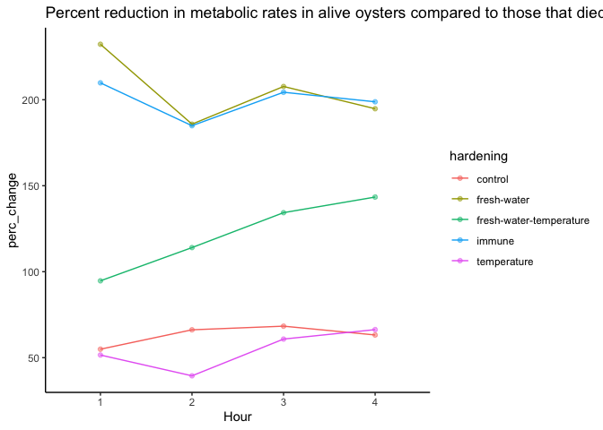<!-- -->

## Analysis of 4 h mortality risk based on metabolic rate under high temperature in 4 h trial between hardening treatments at 42C

Predict mortality at next time point based on metabolic rate at
preceding time point.

``` r
# Create a lagged status column
model_data <- high_4h_data %>%
  group_by(paste(date, bag, sample)) %>%
  mutate(next_status = lead(status)) %>%
  ungroup()

#if final mortality at time point 4 = dead, then add 1 to the "next_status" column and if final.mortality = alive, then add 0 to the "next status" column 

model_data <- model_data%>%
  filter(!is.na(next_status))%>%
  select(!c("raw_resid", "std_resid", "outlier_flag"))

# Logistic regression model
model4 <- glmer(next_status ~ scale(value.mm3) * hardening + (1|bag:sample), family = binomial(link = "logit"), data = model_data)

# Summary of the model
summary(model4)
```

    ## Generalized linear mixed model fit by maximum likelihood (Laplace
    ##   Approximation) [glmerMod]
    ##  Family: binomial  ( logit )
    ## Formula: next_status ~ scale(value.mm3) * hardening + (1 | bag:sample)
    ##    Data: model_data
    ## 
    ##      AIC      BIC   logLik deviance df.resid 
    ##    542.1    594.5   -260.1    520.1      850 
    ## 
    ## Scaled residuals: 
    ##     Min      1Q  Median      3Q     Max 
    ## -1.8800 -0.0602 -0.0081  0.0081 20.0561 
    ## 
    ## Random effects:
    ##  Groups     Name        Variance Std.Dev.
    ##  bag:sample (Intercept) 46.04    6.785   
    ## Number of obs: 861, groups:  bag:sample, 199
    ## 
    ## Fixed effects:
    ##                                                   Estimate Std. Error z value
    ## (Intercept)                                        -3.5309     1.1617  -3.040
    ## scale(value.mm3)                                    7.0077     1.2204   5.742
    ## hardeningfresh-water                               -0.8831     1.5893  -0.556
    ## hardeningfresh-water-temperature                    6.2529     2.2012   2.841
    ## hardeningimmune                                     1.4393     1.5660   0.919
    ## hardeningtemperature                                1.8863     1.6531   1.141
    ## scale(value.mm3):hardeningfresh-water               0.6735     1.6641   0.405
    ## scale(value.mm3):hardeningfresh-water-temperature   7.5740     3.1011   2.442
    ## scale(value.mm3):hardeningimmune                   -0.3562     1.3556  -0.263
    ## scale(value.mm3):hardeningtemperature              -0.8701     1.1909  -0.731
    ##                                                   Pr(>|z|)    
    ## (Intercept)                                        0.00237 ** 
    ## scale(value.mm3)                                  9.34e-09 ***
    ## hardeningfresh-water                               0.57846    
    ## hardeningfresh-water-temperature                   0.00450 ** 
    ## hardeningimmune                                    0.35806    
    ## hardeningtemperature                               0.25384    
    ## scale(value.mm3):hardeningfresh-water              0.68567    
    ## scale(value.mm3):hardeningfresh-water-temperature  0.01459 *  
    ## scale(value.mm3):hardeningimmune                   0.79275    
    ## scale(value.mm3):hardeningtemperature              0.46501    
    ## ---
    ## Signif. codes:  0 '***' 0.001 '**' 0.01 '*' 0.05 '.' 0.1 ' ' 1
    ## 
    ## Correlation of Fixed Effects:
    ##                     (Intr) sc(.3) hrdnn- hrdn-- hrdnngm hrdnngt sc(.3):-
    ## scl(vl.mm3)         -0.307                                              
    ## hrdnngfrsh-         -0.601 -0.036                                       
    ## hrdnngfrs--         -0.601  0.307  0.292                                
    ## hardenngmmn         -0.671  0.087  0.470  0.366                         
    ## hrdnngtmprt         -0.652  0.114  0.439  0.365  0.464                  
    ## scl(vl.3):-          0.016 -0.316 -0.003  0.010 -0.030  -0.024          
    ## scl(v.3):--         -0.155  0.157 -0.079  0.645  0.011   0.034   0.194  
    ## scl(vl.mm3):hrdnngm  0.029 -0.406 -0.052  0.002  0.027  -0.032   0.347  
    ## scl(vl.mm3):hrdnngt  0.065 -0.526 -0.048 -0.034 -0.048   0.041   0.387  
    ##                     s(.3):-- scl(vl.mm3):hrdnngm
    ## scl(vl.mm3)                                     
    ## hrdnngfrsh-                                     
    ## hrdnngfrs--                                     
    ## hardenngmmn                                     
    ## hrdnngtmprt                                     
    ## scl(vl.3):-                                     
    ## scl(v.3):--                                     
    ## scl(vl.mm3):hrdnngm  0.225                      
    ## scl(vl.mm3):hrdnngt  0.208    0.475             
    ## optimizer (Nelder_Mead) convergence code: 4 (failure to converge in 10000 evaluations)
    ## Model failed to converge with max|grad| = 2.36238 (tol = 0.002, component 1)
    ## failure to converge in 10000 evaluations

``` r
Anova(model4)
```

    ## Analysis of Deviance Table (Type II Wald chisquare tests)
    ## 
    ## Response: next_status
    ##                              Chisq Df Pr(>Chisq)    
    ## scale(value.mm3)           36.4846  1  1.539e-09 ***
    ## hardening                   4.4667  4    0.34651    
    ## scale(value.mm3):hardening  7.8861  4    0.09584 .  
    ## ---
    ## Signif. codes:  0 '***' 0.001 '**' 0.01 '*' 0.05 '.' 0.1 ' ' 1

``` r
plot(Effect(c("hardening"), model4))
```

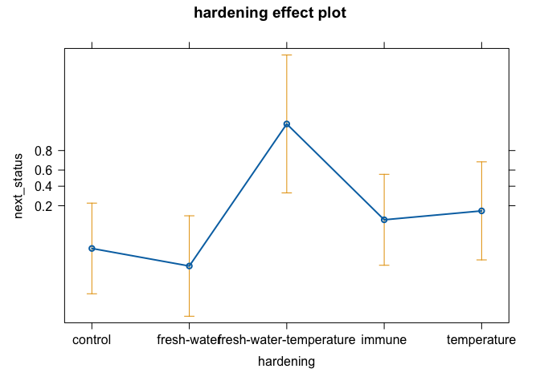<!-- -->

``` r
plot(Effect(c("value.mm3"), model4))
```

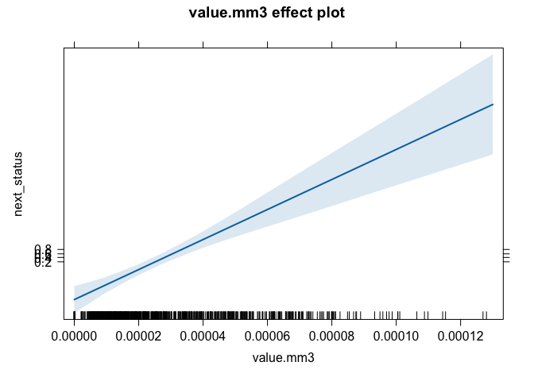<!-- -->

Higher metabolic rate increases mortality risk.

``` r
plot(Effect(c("value.mm3", "hardening"), model4))
```

<!-- -->

### Plot data

Plot effects on next mortality status.

``` r
# Logistic regression model for predictions
model_pred1 <- glmer(next_status ~ scale(value.mm3) * hardening + (1|bag:sample), family = binomial(link = "logit"), data = model_data)

# Generate predicted probabilities
model_data$predicted_mortality <- predict(model_pred1, type = "response")

# Compute AUC
roc_curve <- roc(model_data$next_status, model_data$predicted_mortality)
auc_value <- auc(roc_curve)
print(paste("AUC:", round(auc_value, 3)))
```

    ## [1] "AUC: 0.996"

``` r
# Compute accuracy with a threshold of 0.5
model_data$predicted_class <- ifelse(model_data$predicted_mortality > 0.5, 1, 0)
accuracy <- mean(model_data$predicted_class == model_data$next_status)
print(paste("Accuracy:", round(accuracy, 3)))
```

    ## [1] "Accuracy: 0.985"

``` r
# Plot the ROC curve
roc_plot <- ggroc(roc_curve) +
  labs(title = "ROC Curve", x = "False Positive Rate", y = "True Positive Rate") +
  theme_classic();roc_plot
```

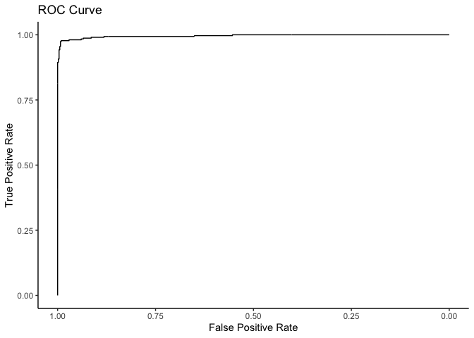<!-- -->

``` r
# Add confidence intervals for ROC curve
ci_auc <- ci.auc(roc_curve)
print(paste("AUC 95% CI:", round(ci_auc[1], 3), "-", round(ci_auc[3], 3)))
```

    ## [1] "AUC 95% CI: 0.992 - 1"

``` r
# Plot
plot12<-ggplot(model_data, aes(x = value.mm3, y = predicted_mortality, color = hardening, fill = hardening)) +
  geom_point(aes(y = next_status), alpha = 0.6, position = position_jitter(height = 0.03)) +
  geom_smooth(method = "glm", method.args = list(family = "binomial"), se = TRUE) +
  scale_colour_brewer(palette=c("Dark2"))+
  scale_fill_brewer(palette=c("Dark2"))+
  labs(
    title = "Incubation Mortality Risk [4 h]",
    x = expression(paste(Delta, " Fluorescence")),
    y = "Probability of Mortality",
    color = "Hardening",
    fill = "Hardening"
  ) +
  theme_classic();plot12
```

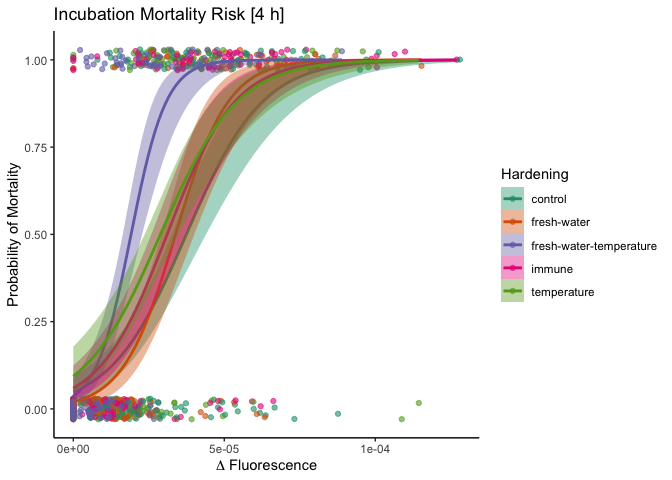<!-- -->

``` r
ggsave(plot12, filename="figures/resazurin/hardening_mortality-risk_42C_dead4h.png", width=8, height=4)
```

Fresh water temperature hardened oysters may have been more
metabolically susceptible to stress.

## Analysis of metabolic rates in oysters that lived through the entire 24 h trial

``` r
alive_24h_data<-main_data%>%
  filter(final.mortality=="alive")%>%
  ungroup()%>%
  dplyr::select(!c(value, volume.mm3, width.mm, length.mm))

#view sample size 
alive_24h_data%>%
  group_by(time, temperature, hardening)%>%
  dplyr::summarise(length(value.mm3))%>%
  print(n=100)
```

    ## # A tibble: 50 × 4
    ## # Groups:   time, temperature [10]
    ##    time  temperature hardening               `length(value.mm3)`
    ##    <fct> <chr>       <chr>                                 <int>
    ##  1 0     18C         control                                  45
    ##  2 0     18C         fresh-water                              29
    ##  3 0     18C         fresh-water-temperature                  25
    ##  4 0     18C         immune                                   31
    ##  5 0     18C         temperature                              29
    ##  6 0     42C         control                                  12
    ##  7 0     42C         fresh-water                               7
    ##  8 0     42C         fresh-water-temperature                  11
    ##  9 0     42C         immune                                   11
    ## 10 0     42C         temperature                               5
    ## 11 1     18C         control                                  45
    ## 12 1     18C         fresh-water                              29
    ## 13 1     18C         fresh-water-temperature                  25
    ## 14 1     18C         immune                                   31
    ## 15 1     18C         temperature                              29
    ## 16 1     42C         control                                  12
    ## 17 1     42C         fresh-water                               7
    ## 18 1     42C         fresh-water-temperature                  11
    ## 19 1     42C         immune                                   11
    ## 20 1     42C         temperature                               5
    ## 21 2     18C         control                                  45
    ## 22 2     18C         fresh-water                              29
    ## 23 2     18C         fresh-water-temperature                  25
    ## 24 2     18C         immune                                   31
    ## 25 2     18C         temperature                              29
    ## 26 2     42C         control                                  12
    ## 27 2     42C         fresh-water                               7
    ## 28 2     42C         fresh-water-temperature                  11
    ## 29 2     42C         immune                                   11
    ## 30 2     42C         temperature                               5
    ## 31 3     18C         control                                  45
    ## 32 3     18C         fresh-water                              29
    ## 33 3     18C         fresh-water-temperature                  25
    ## 34 3     18C         immune                                   31
    ## 35 3     18C         temperature                              29
    ## 36 3     42C         control                                  12
    ## 37 3     42C         fresh-water                               7
    ## 38 3     42C         fresh-water-temperature                  11
    ## 39 3     42C         immune                                   11
    ## 40 3     42C         temperature                               5
    ## 41 4     18C         control                                  45
    ## 42 4     18C         fresh-water                              29
    ## 43 4     18C         fresh-water-temperature                  25
    ## 44 4     18C         immune                                   31
    ## 45 4     18C         temperature                              29
    ## 46 4     42C         control                                  12
    ## 47 4     42C         fresh-water                               7
    ## 48 4     42C         fresh-water-temperature                  11
    ## 49 4     42C         immune                                   11
    ## 50 4     42C         temperature                               5

We have n\>5 for all groups at all time point of oysters that lived
through the 24 hour trial. High variation in sample size.

### Detect outliers

Build a model including all predictors.

``` r
model5<-lmer(sqrt(value.mm3) ~ time * temperature * hardening + (1|bag) + (1|date:bag:sample), data=alive_24h_data)

qqPlot(residuals(model5))
```

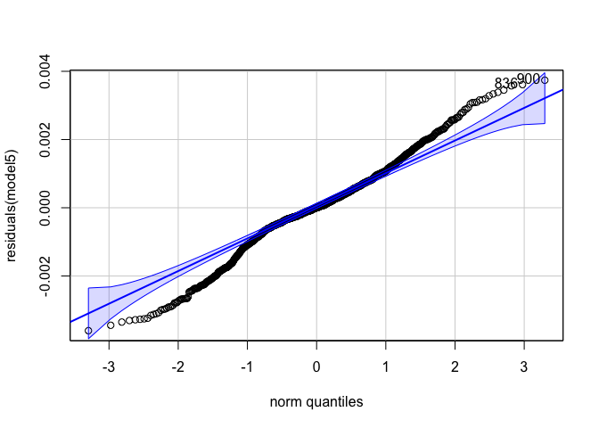<!-- -->

    ## [1] 900 836

``` r
hist(alive_24h_data$value.mm3)
```

<!-- -->

Identify using standardized residuals.

``` r
# Extract raw residuals
alive_24h_data$raw_resid <- residuals(model5)

# Standardize residuals
alive_24h_data$std_resid <- alive_24h_data$raw_resid / sd(alive_24h_data$raw_resid)

# Flag potential outliers
outlier_threshold <- 3
alive_24h_data$outlier_flag <- abs(alive_24h_data$std_resid) > outlier_threshold

# Filter rows flagged as outliers
outliers <- alive_24h_data %>% filter(outlier_flag == TRUE)
print(outliers)
```

    ## # A tibble: 1 × 13
    ##       date   bag sample hardening temperature time  status final.mortality
    ##      <dbl> <dbl> <chr>  <chr>     <chr>       <fct>  <dbl> <chr>          
    ## 1 20240813    49 3      immune    18C         4          0 alive          
    ## # ℹ 5 more variables: incubation.mortality <chr>, value.mm3 <dbl>,
    ## #   raw_resid <dbl>, std_resid <dbl>, outlier_flag <lgl>

``` r
# Plot standardized residuals
ggplot(alive_24h_data, aes(x = seq_along(std_resid), y = std_resid)) +
  geom_point(aes(color = outlier_flag), size = 2) +
  geom_hline(yintercept = c(-outlier_threshold, outlier_threshold), linetype = "dashed", color = "red") +
  labs(title = "Standardized Residuals with Outliers", x = "Index", y = "Standardized Residual") +
  theme_minimal()
```

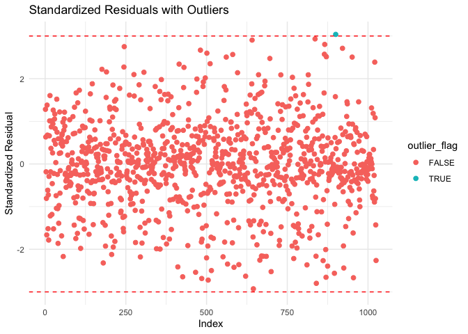<!-- -->

Remove identified outliers.

``` r
alive_24h_data<-alive_24h_data%>%
  filter(!outlier_flag==TRUE)
```

``` r
hist(alive_24h_data$value.mm3)
```

<!-- -->

### Analyze model

Plot raw data.

``` r
alive_24h_data%>%
  ggplot(aes(x=time, y=value.mm3, colour=temperature, group=sample))+
  facet_wrap(~bag*date*hardening)+
  geom_point()+
  geom_line()+
  theme_classic()
```

<!-- -->

``` r
model5<-lmer(sqrt(value.mm3) ~ time * temperature * hardening + (1|bag) + (1|date:bag:sample), data=alive_24h_data)

summary(model5)
```

    ## Linear mixed model fit by REML. t-tests use Satterthwaite's method [
    ## lmerModLmerTest]
    ## Formula: sqrt(value.mm3) ~ time * temperature * hardening + (1 | bag) +  
    ##     (1 | date:bag:sample)
    ##    Data: alive_24h_data
    ## 
    ## REML criterion at convergence: -9484.8
    ## 
    ## Scaled residuals: 
    ##      Min       1Q   Median       3Q      Max 
    ## -2.60104 -0.42428 -0.00382  0.50536  2.58640 
    ## 
    ## Random effects:
    ##  Groups          Name        Variance  Std.Dev. 
    ##  date:bag:sample (Intercept) 3.026e-06 0.0017396
    ##  bag             (Intercept) 4.519e-07 0.0006722
    ##  Residual                    1.920e-06 0.0013856
    ## Number of obs: 1024, groups:  date:bag:sample, 205; bag, 10
    ## 
    ## Fixed effects:
    ##                                                         Estimate Std. Error
    ## (Intercept)                                            5.505e-05  5.834e-04
    ## time1                                                  3.095e-03  2.921e-04
    ## time2                                                  5.120e-03  2.921e-04
    ## time3                                                  6.897e-03  2.921e-04
    ## time4                                                  8.299e-03  2.921e-04
    ## temperature42C                                         7.198e-05  7.279e-04
    ## hardeningfresh-water                                  -4.029e-05  8.588e-04
    ## hardeningfresh-water-temperature                      -1.557e-04  8.747e-04
    ## hardeningimmune                                       -6.187e-05  8.520e-04
    ## hardeningtemperature                                  -6.214e-05  8.589e-04
    ## time1:temperature42C                                   9.168e-04  6.366e-04
    ## time2:temperature42C                                  -2.065e-04  6.366e-04
    ## time3:temperature42C                                  -1.508e-03  6.366e-04
    ## time4:temperature42C                                  -2.544e-03  6.366e-04
    ## time1:hardeningfresh-water                             2.936e-04  4.666e-04
    ## time2:hardeningfresh-water                             9.557e-04  4.666e-04
    ## time3:hardeningfresh-water                             1.214e-03  4.666e-04
    ## time4:hardeningfresh-water                             1.745e-03  4.666e-04
    ## time1:hardeningfresh-water-temperature                 1.823e-04  4.888e-04
    ## time2:hardeningfresh-water-temperature                 7.775e-04  4.888e-04
    ## time3:hardeningfresh-water-temperature                 8.354e-04  4.888e-04
    ## time4:hardeningfresh-water-temperature                 1.167e-03  4.888e-04
    ## time1:hardeningimmune                                  1.074e-03  4.574e-04
    ## time2:hardeningimmune                                  1.961e-03  4.574e-04
    ## time3:hardeningimmune                                  2.251e-03  4.574e-04
    ## time4:hardeningimmune                                  2.244e-03  4.601e-04
    ## time1:hardeningtemperature                             6.655e-04  4.666e-04
    ## time2:hardeningtemperature                             1.236e-03  4.666e-04
    ## time3:hardeningtemperature                             1.446e-03  4.666e-04
    ## time4:hardeningtemperature                             1.834e-03  4.666e-04
    ## temperature42C:hardeningfresh-water                   -1.071e-04  1.188e-03
    ## temperature42C:hardeningfresh-water-temperature        2.575e-04  1.090e-03
    ## temperature42C:hardeningimmune                        -4.594e-05  1.068e-03
    ## temperature42C:hardeningtemperature                   -5.119e-05  1.302e-03
    ## time1:temperature42C:hardeningfresh-water             -1.537e-03  1.042e-03
    ## time2:temperature42C:hardeningfresh-water             -1.968e-03  1.042e-03
    ## time3:temperature42C:hardeningfresh-water             -2.262e-03  1.042e-03
    ## time4:temperature42C:hardeningfresh-water             -2.719e-03  1.042e-03
    ## time1:temperature42C:hardeningfresh-water-temperature -1.774e-03  9.529e-04
    ## time2:temperature42C:hardeningfresh-water-temperature -2.355e-03  9.529e-04
    ## time3:temperature42C:hardeningfresh-water-temperature -2.356e-03  9.529e-04
    ## time4:temperature42C:hardeningfresh-water-temperature -2.692e-03  9.529e-04
    ## time1:temperature42C:hardeningimmune                  -2.002e-03  9.371e-04
    ## time2:temperature42C:hardeningimmune                  -2.776e-03  9.371e-04
    ## time3:temperature42C:hardeningimmune                  -3.127e-03  9.371e-04
    ## time4:temperature42C:hardeningimmune                  -3.051e-03  9.385e-04
    ## time1:temperature42C:hardeningtemperature             -9.216e-04  1.143e-03
    ## time2:temperature42C:hardeningtemperature             -6.865e-04  1.143e-03
    ## time3:temperature42C:hardeningtemperature             -8.528e-04  1.143e-03
    ## time4:temperature42C:hardeningtemperature             -1.105e-03  1.143e-03
    ##                                                               df t value
    ## (Intercept)                                            5.536e+00   0.094
    ## time1                                                  7.789e+02  10.596
    ## time2                                                  7.789e+02  17.529
    ## time3                                                  7.789e+02  23.612
    ## time4                                                  7.789e+02  28.411
    ## temperature42C                                         3.806e+02   0.099
    ## hardeningfresh-water                                   6.524e+00  -0.047
    ## hardeningfresh-water-temperature                       7.018e+00  -0.178
    ## hardeningimmune                                        6.325e+00  -0.073
    ## hardeningtemperature                                   6.524e+00  -0.072
    ## time1:temperature42C                                   7.789e+02   1.440
    ## time2:temperature42C                                   7.789e+02  -0.324
    ## time3:temperature42C                                   7.789e+02  -2.369
    ## time4:temperature42C                                   7.789e+02  -3.996
    ## time1:hardeningfresh-water                             7.789e+02   0.629
    ## time2:hardeningfresh-water                             7.789e+02   2.048
    ## time3:hardeningfresh-water                             7.789e+02   2.601
    ## time4:hardeningfresh-water                             7.789e+02   3.740
    ## time1:hardeningfresh-water-temperature                 7.789e+02   0.373
    ## time2:hardeningfresh-water-temperature                 7.789e+02   1.591
    ## time3:hardeningfresh-water-temperature                 7.789e+02   1.709
    ## time4:hardeningfresh-water-temperature                 7.789e+02   2.387
    ## time1:hardeningimmune                                  7.789e+02   2.347
    ## time2:hardeningimmune                                  7.789e+02   4.288
    ## time3:hardeningimmune                                  7.789e+02   4.922
    ## time4:hardeningimmune                                  7.794e+02   4.876
    ## time1:hardeningtemperature                             7.789e+02   1.426
    ## time2:hardeningtemperature                             7.789e+02   2.648
    ## time3:hardeningtemperature                             7.789e+02   3.100
    ## time4:hardeningtemperature                             7.789e+02   3.930
    ## temperature42C:hardeningfresh-water                    3.808e+02  -0.090
    ## temperature42C:hardeningfresh-water-temperature        3.811e+02   0.236
    ## temperature42C:hardeningimmune                         3.806e+02  -0.043
    ## temperature42C:hardeningtemperature                    3.809e+02  -0.039
    ## time1:temperature42C:hardeningfresh-water              7.789e+02  -1.475
    ## time2:temperature42C:hardeningfresh-water              7.789e+02  -1.888
    ## time3:temperature42C:hardeningfresh-water              7.789e+02  -2.170
    ## time4:temperature42C:hardeningfresh-water              7.789e+02  -2.609
    ## time1:temperature42C:hardeningfresh-water-temperature  7.789e+02  -1.862
    ## time2:temperature42C:hardeningfresh-water-temperature  7.789e+02  -2.471
    ## time3:temperature42C:hardeningfresh-water-temperature  7.789e+02  -2.472
    ## time4:temperature42C:hardeningfresh-water-temperature  7.789e+02  -2.825
    ## time1:temperature42C:hardeningimmune                   7.789e+02  -2.136
    ## time2:temperature42C:hardeningimmune                   7.789e+02  -2.962
    ## time3:temperature42C:hardeningimmune                   7.789e+02  -3.337
    ## time4:temperature42C:hardeningimmune                   7.790e+02  -3.251
    ## time1:temperature42C:hardeningtemperature              7.789e+02  -0.807
    ## time2:temperature42C:hardeningtemperature              7.789e+02  -0.601
    ## time3:temperature42C:hardeningtemperature              7.789e+02  -0.746
    ## time4:temperature42C:hardeningtemperature              7.789e+02  -0.967
    ##                                                       Pr(>|t|)    
    ## (Intercept)                                           0.928153    
    ## time1                                                  < 2e-16 ***
    ## time2                                                  < 2e-16 ***
    ## time3                                                  < 2e-16 ***
    ## time4                                                  < 2e-16 ***
    ## temperature42C                                        0.921274    
    ## hardeningfresh-water                                  0.963986    
    ## hardeningfresh-water-temperature                      0.863737    
    ## hardeningimmune                                       0.944358    
    ## hardeningtemperature                                  0.944493    
    ## time1:temperature42C                                  0.150263    
    ## time2:temperature42C                                  0.745777    
    ## time3:temperature42C                                  0.018079 *  
    ## time4:temperature42C                                  7.05e-05 ***
    ## time1:hardeningfresh-water                            0.529336    
    ## time2:hardeningfresh-water                            0.040874 *  
    ## time3:hardeningfresh-water                            0.009471 ** 
    ## time4:hardeningfresh-water                            0.000198 ***
    ## time1:hardeningfresh-water-temperature                0.709311    
    ## time2:hardeningfresh-water-temperature                0.112074    
    ## time3:hardeningfresh-water-temperature                0.087838 .  
    ## time4:hardeningfresh-water-temperature                0.017214 *  
    ## time1:hardeningimmune                                 0.019167 *  
    ## time2:hardeningimmune                                 2.03e-05 ***
    ## time3:hardeningimmune                                 1.04e-06 ***
    ## time4:hardeningimmune                                 1.31e-06 ***
    ## time1:hardeningtemperature                            0.154183    
    ## time2:hardeningtemperature                            0.008254 ** 
    ## time3:hardeningtemperature                            0.002006 ** 
    ## time4:hardeningtemperature                            9.23e-05 ***
    ## temperature42C:hardeningfresh-water                   0.928196    
    ## temperature42C:hardeningfresh-water-temperature       0.813356    
    ## temperature42C:hardeningimmune                        0.965700    
    ## temperature42C:hardeningtemperature                   0.968669    
    ## time1:temperature42C:hardeningfresh-water             0.140704    
    ## time2:temperature42C:hardeningfresh-water             0.059343 .  
    ## time3:temperature42C:hardeningfresh-water             0.030274 *  
    ## time4:temperature42C:hardeningfresh-water             0.009257 ** 
    ## time1:temperature42C:hardeningfresh-water-temperature 0.063005 .  
    ## time2:temperature42C:hardeningfresh-water-temperature 0.013672 *  
    ## time3:temperature42C:hardeningfresh-water-temperature 0.013639 *  
    ## time4:temperature42C:hardeningfresh-water-temperature 0.004853 ** 
    ## time1:temperature42C:hardeningimmune                  0.032982 *  
    ## time2:temperature42C:hardeningimmune                  0.003146 ** 
    ## time3:temperature42C:hardeningimmune                  0.000887 ***
    ## time4:temperature42C:hardeningimmune                  0.001199 ** 
    ## time1:temperature42C:hardeningtemperature             0.420163    
    ## time2:temperature42C:hardeningtemperature             0.548132    
    ## time3:temperature42C:hardeningtemperature             0.455705    
    ## time4:temperature42C:hardeningtemperature             0.333695    
    ## ---
    ## Signif. codes:  0 '***' 0.001 '**' 0.01 '*' 0.05 '.' 0.1 ' ' 1

``` r
anova(model5)
```

    ## Type III Analysis of Variance Table with Satterthwaite's method
    ##                               Sum Sq    Mean Sq NumDF  DenDF  F value    Pr(>F)
    ## time                       0.0044820 0.00112049     4 778.93 583.6491 < 2.2e-16
    ## temperature                0.0000633 0.00006329     1 191.28  32.9663 3.632e-08
    ## hardening                  0.0000028 0.00000070     4   6.02   0.3640    0.8264
    ## time:temperature           0.0004657 0.00011642     4 778.93  60.6403 < 2.2e-16
    ## time:hardening             0.0000295 0.00000184    16 778.93   0.9601    0.4993
    ## temperature:hardening      0.0000146 0.00000365     4 191.35   1.8990    0.1122
    ## time:temperature:hardening 0.0000398 0.00000249    16 778.93   1.2965    0.1921
    ##                               
    ## time                       ***
    ## temperature                ***
    ## hardening                     
    ## time:temperature           ***
    ## time:hardening                
    ## temperature:hardening         
    ## time:temperature:hardening    
    ## ---
    ## Signif. codes:  0 '***' 0.001 '**' 0.01 '*' 0.05 '.' 0.1 ' ' 1

``` r
rand(model5)
```

    ## ANOVA-like table for random-effects: Single term deletions
    ## 
    ## Model:
    ## sqrt(value.mm3) ~ time + temperature + hardening + (1 | bag) + (1 | date:bag:sample) + time:temperature + time:hardening + temperature:hardening + time:temperature:hardening
    ##                       npar logLik     AIC    LRT Df Pr(>Chisq)    
    ## <none>                  53 4742.4 -9378.8                         
    ## (1 | bag)               52 4739.7 -9375.4   5.39  1     0.0202 *  
    ## (1 | date:bag:sample)   52 4498.0 -8892.0 488.85  1     <2e-16 ***
    ## ---
    ## Signif. codes:  0 '***' 0.001 '**' 0.01 '*' 0.05 '.' 0.1 ' ' 1

``` r
qqPlot(residuals(model5))
```

<!-- -->

    ## [1] 645 836

### Plot data

Plot mean response for each hardening treatment across time at 18°C and
42°C in those that were alive through the entire 24 hour trial

Plot first with individual points with geom smooth lines.

``` r
plot1<-alive_24h_data%>%

  ggplot(aes(x=time, y=value.mm3, color=temperature, fill=temperature))+
  facet_grid(~hardening)+
  geom_point(alpha=0.5)+
  geom_smooth(aes(group=temperature))+
  scale_colour_manual(values=c("cyan4", "orange"))+
  scale_fill_manual(values=c("cyan4", "orange"))+
  theme_classic()+
  xlab("Hour");plot1
```

<!-- -->

``` r
ggsave(plot1, filename="figures/resazurin/hardening_temperature_alive24h.png", width=8, height=4)

plot1a<-alive_24h_data%>%

  ggplot(aes(x=time, y=value.mm3, color=hardening, fill=hardening))+
  facet_grid(~temperature)+
  geom_point(alpha=0.5)+
  geom_smooth(aes(group=hardening))+
  scale_colour_brewer(palette=c("Dark2"))+
  scale_fill_brewer(palette=c("Dark2"))+
  theme_classic()+
  xlab("Hour");plot1a
```

<!-- -->

``` r
ggsave(plot1a, filename="figures/resazurin/hardening_temperature_alive24h-2.png", width=8, height=4)
```

Next plot with mean and sem for each group.

``` r
plot2<-alive_24h_data%>%
  group_by(temperature, hardening, time)%>%
  summarize(mean=mean(value.mm3, na.rm=TRUE), se=sd(value.mm3, na.rm=TRUE)/sqrt(length(value.mm3)))%>%

  ggplot(aes(x=time, y=mean, color=temperature, fill=temperature))+
  facet_grid(~hardening)+
  geom_point(alpha=0.5)+
  geom_errorbar(aes(ymin=mean-se, ymax=mean+se), width=0.1)+
  geom_line(aes(group=temperature))+
  scale_colour_manual(values=c("cyan4", "orange"))+
  scale_fill_manual(values=c("cyan4", "orange"))+
  theme_classic()+
  xlab("Hour");plot2
```

<!-- -->

``` r
plot2a<-alive_24h_data%>%
  group_by(temperature, hardening, time)%>%
  summarise(mean=mean(value.mm3, na.rm=TRUE), se=sd(value.mm3, na.rm=TRUE)/sqrt(length(value.mm3)))%>%

  ggplot(aes(x=time, y=mean, color=hardening, fill=hardening))+
  facet_grid(~temperature)+
  geom_errorbar(aes(ymin=mean-se, ymax=mean+se), width=0.1)+
  geom_point(alpha=0.5)+
  geom_line(aes(group=hardening))+
  #scale_colour_manual(values=c("cyan4", "orange"))+
  #scale_fill_manual(values=c("cyan4", "orange"))+
  theme_classic()+
  xlab("Hour");plot2a
```

<!-- -->

### Conduct post hoc tests

#### Effects of hardening treatment within temperature

``` r
anova(model5)
```

    ## Type III Analysis of Variance Table with Satterthwaite's method
    ##                               Sum Sq    Mean Sq NumDF  DenDF  F value    Pr(>F)
    ## time                       0.0044820 0.00112049     4 778.93 583.6491 < 2.2e-16
    ## temperature                0.0000633 0.00006329     1 191.28  32.9663 3.632e-08
    ## hardening                  0.0000028 0.00000070     4   6.02   0.3640    0.8264
    ## time:temperature           0.0004657 0.00011642     4 778.93  60.6403 < 2.2e-16
    ## time:hardening             0.0000295 0.00000184    16 778.93   0.9601    0.4993
    ## temperature:hardening      0.0000146 0.00000365     4 191.35   1.8990    0.1122
    ## time:temperature:hardening 0.0000398 0.00000249    16 778.93   1.2965    0.1921
    ##                               
    ## time                       ***
    ## temperature                ***
    ## hardening                     
    ## time:temperature           ***
    ## time:hardening                
    ## temperature:hardening         
    ## time:temperature:hardening    
    ## ---
    ## Signif. codes:  0 '***' 0.001 '**' 0.01 '*' 0.05 '.' 0.1 ' ' 1

``` r
emm<-emmeans(model5, ~hardening|temperature|time, adjust = "tukey")
pairs(emm)
```

    ## temperature = 18C, time = 0:
    ##  contrast                                   estimate       SE    df t.ratio
    ##  control - (fresh-water)                    4.03e-05 0.000860  6.81   0.047
    ##  control - (fresh-water-temperature)        1.56e-04 0.000876  7.33   0.178
    ##  control - immune                           6.19e-05 0.000853  6.61   0.073
    ##  control - temperature                      6.21e-05 0.000860  6.81   0.072
    ##  (fresh-water) - (fresh-water-temperature)  1.15e-04 0.000907  8.49   0.127
    ##  (fresh-water) - immune                     2.16e-05 0.000885  7.71   0.024
    ##  (fresh-water) - temperature                2.18e-05 0.000892  7.93   0.025
    ##  (fresh-water-temperature) - immune        -9.39e-05 0.000900  8.26  -0.104
    ##  (fresh-water-temperature) - temperature   -9.36e-05 0.000907  8.49  -0.103
    ##  immune - temperature                       2.70e-07 0.000885  7.71   0.000
    ##  p.value
    ##   1.0000
    ##   0.9997
    ##   1.0000
    ##   1.0000
    ##   0.9999
    ##   1.0000
    ##   1.0000
    ##   1.0000
    ##   1.0000
    ##   1.0000
    ## 
    ## temperature = 42C, time = 0:
    ##  contrast                                   estimate       SE    df t.ratio
    ##  control - (fresh-water)                    1.47e-04 0.001266 30.45   0.116
    ##  control - (fresh-water-temperature)       -1.02e-04 0.001163 21.71  -0.088
    ##  control - immune                           1.08e-04 0.001160 21.70   0.093
    ##  control - temperature                      1.13e-04 0.001374 41.40   0.082
    ##  (fresh-water) - (fresh-water-temperature) -2.49e-04 0.001272 31.69  -0.196
    ##  (fresh-water) - immune                    -3.96e-05 0.001269 31.71  -0.031
    ##  (fresh-water) - temperature               -3.41e-05 0.001467 54.24  -0.023
    ##  (fresh-water-temperature) - immune         2.10e-04 0.001166 22.70   0.180
    ##  (fresh-water-temperature) - temperature    2.15e-04 0.001379 42.91   0.156
    ##  immune - temperature                       5.51e-06 0.001377 42.97   0.004
    ##  p.value
    ##   1.0000
    ##   1.0000
    ##   1.0000
    ##   1.0000
    ##   0.9997
    ##   1.0000
    ##   1.0000
    ##   0.9997
    ##   0.9999
    ##   1.0000
    ## 
    ## temperature = 18C, time = 1:
    ##  contrast                                   estimate       SE    df t.ratio
    ##  control - (fresh-water)                   -2.53e-04 0.000860  6.81  -0.295
    ##  control - (fresh-water-temperature)       -2.66e-05 0.000876  7.33  -0.030
    ##  control - immune                          -1.01e-03 0.000853  6.61  -1.186
    ##  control - temperature                     -6.03e-04 0.000860  6.81  -0.702
    ##  (fresh-water) - (fresh-water-temperature)  2.27e-04 0.000907  8.49   0.250
    ##  (fresh-water) - immune                    -7.58e-04 0.000885  7.71  -0.857
    ##  (fresh-water) - temperature               -3.50e-04 0.000892  7.93  -0.393
    ##  (fresh-water-temperature) - immune        -9.85e-04 0.000900  8.26  -1.094
    ##  (fresh-water-temperature) - temperature   -5.77e-04 0.000907  8.49  -0.636
    ##  immune - temperature                       4.08e-04 0.000885  7.71   0.461
    ##  p.value
    ##   0.9979
    ##   1.0000
    ##   0.7594
    ##   0.9495
    ##   0.9990
    ##   0.9046
    ##   0.9939
    ##   0.8053
    ##   0.9649
    ##   0.9888
    ## 
    ## temperature = 42C, time = 1:
    ##  contrast                                   estimate       SE    df t.ratio
    ##  control - (fresh-water)                    1.39e-03 0.001266 30.45   1.098
    ##  control - (fresh-water-temperature)        1.49e-03 0.001163 21.71   1.282
    ##  control - immune                           1.04e-03 0.001160 21.70   0.893
    ##  control - temperature                      3.69e-04 0.001374 41.40   0.269
    ##  (fresh-water) - (fresh-water-temperature)  9.93e-05 0.001272 31.69   0.078
    ##  (fresh-water) - immune                    -3.55e-04 0.001269 31.71  -0.279
    ##  (fresh-water) - temperature               -1.02e-03 0.001467 54.24  -0.696
    ##  (fresh-water-temperature) - immune        -4.54e-04 0.001166 22.70  -0.389
    ##  (fresh-water-temperature) - temperature   -1.12e-03 0.001379 42.91  -0.813
    ##  immune - temperature                      -6.67e-04 0.001377 42.97  -0.484
    ##  p.value
    ##   0.8061
    ##   0.7048
    ##   0.8963
    ##   0.9988
    ##   1.0000
    ##   0.9986
    ##   0.9565
    ##   0.9948
    ##   0.9253
    ##   0.9884
    ## 
    ## temperature = 18C, time = 2:
    ##  contrast                                   estimate       SE    df t.ratio
    ##  control - (fresh-water)                   -9.15e-04 0.000860  6.81  -1.065
    ##  control - (fresh-water-temperature)       -6.22e-04 0.000876  7.33  -0.710
    ##  control - immune                          -1.90e-03 0.000853  6.61  -2.227
    ##  control - temperature                     -1.17e-03 0.000860  6.81  -1.365
    ##  (fresh-water) - (fresh-water-temperature)  2.94e-04 0.000907  8.49   0.324
    ##  (fresh-water) - immune                    -9.84e-04 0.000885  7.71  -1.112
    ##  (fresh-water) - temperature               -2.58e-04 0.000892  7.93  -0.290
    ##  (fresh-water-temperature) - immune        -1.28e-03 0.000900  8.26  -1.419
    ##  (fresh-water-temperature) - temperature   -5.52e-04 0.000907  8.49  -0.608
    ##  immune - temperature                       7.26e-04 0.000885  7.71   0.820
    ##  p.value
    ##   0.8186
    ##   0.9479
    ##   0.2763
    ##   0.6656
    ##   0.9971
    ##   0.7966
    ##   0.9981
    ##   0.6334
    ##   0.9699
    ##   0.9169
    ## 
    ## temperature = 42C, time = 2:
    ##  contrast                                   estimate       SE    df t.ratio
    ##  control - (fresh-water)                    1.16e-03 0.001266 30.45   0.916
    ##  control - (fresh-water-temperature)        1.48e-03 0.001163 21.71   1.269
    ##  control - immune                           9.23e-04 0.001160 21.70   0.796
    ##  control - temperature                     -4.36e-04 0.001374 41.40  -0.317
    ##  (fresh-water) - (fresh-water-temperature)  3.16e-04 0.001272 31.69   0.248
    ##  (fresh-water) - immune                    -2.37e-04 0.001269 31.71  -0.187
    ##  (fresh-water) - temperature               -1.60e-03 0.001467 54.24  -1.087
    ##  (fresh-water-temperature) - immune        -5.53e-04 0.001166 22.70  -0.474
    ##  (fresh-water-temperature) - temperature   -1.91e-03 0.001379 42.91  -1.386
    ##  immune - temperature                      -1.36e-03 0.001377 42.97  -0.987
    ##  p.value
    ##   0.8886
    ##   0.7120
    ##   0.9291
    ##   0.9977
    ##   0.9991
    ##   0.9997
    ##   0.8122
    ##   0.9890
    ##   0.6396
    ##   0.8597
    ## 
    ## temperature = 18C, time = 3:
    ##  contrast                                   estimate       SE    df t.ratio
    ##  control - (fresh-water)                   -1.17e-03 0.000860  6.81  -1.365
    ##  control - (fresh-water-temperature)       -6.80e-04 0.000876  7.33  -0.776
    ##  control - immune                          -2.19e-03 0.000853  6.61  -2.567
    ##  control - temperature                     -1.38e-03 0.000860  6.81  -1.610
    ##  (fresh-water) - (fresh-water-temperature)  4.94e-04 0.000907  8.49   0.544
    ##  (fresh-water) - immune                    -1.02e-03 0.000885  7.71  -1.148
    ##  (fresh-water) - temperature               -2.11e-04 0.000892  7.93  -0.237
    ##  (fresh-water-temperature) - immune        -1.51e-03 0.000900  8.26  -1.677
    ##  (fresh-water-temperature) - temperature   -7.05e-04 0.000907  8.49  -0.777
    ##  immune - temperature                       8.05e-04 0.000885  7.71   0.910
    ##  p.value
    ##   0.6657
    ##   0.9301
    ##   0.1839
    ##   0.5359
    ##   0.9798
    ##   0.7785
    ##   0.9991
    ##   0.4941
    ##   0.9308
    ##   0.8852
    ## 
    ## temperature = 42C, time = 3:
    ##  contrast                                   estimate       SE    df t.ratio
    ##  control - (fresh-water)                    1.20e-03 0.001266 30.45   0.944
    ##  control - (fresh-water-temperature)        1.42e-03 0.001163 21.71   1.220
    ##  control - immune                           9.84e-04 0.001160 21.70   0.848
    ##  control - temperature                     -4.80e-04 0.001374 41.40  -0.350
    ##  (fresh-water) - (fresh-water-temperature)  2.23e-04 0.001272 31.69   0.175
    ##  (fresh-water) - immune                    -2.12e-04 0.001269 31.71  -0.167
    ##  (fresh-water) - temperature               -1.68e-03 0.001467 54.24  -1.142
    ##  (fresh-water-temperature) - immune        -4.35e-04 0.001166 22.70  -0.373
    ##  (fresh-water-temperature) - temperature   -1.90e-03 0.001379 42.91  -1.377
    ##  immune - temperature                      -1.46e-03 0.001377 42.97  -1.063
    ##  p.value
    ##   0.8772
    ##   0.7400
    ##   0.9124
    ##   0.9967
    ##   0.9998
    ##   0.9998
    ##   0.7834
    ##   0.9956
    ##   0.6453
    ##   0.8239
    ## 
    ## temperature = 18C, time = 4:
    ##  contrast                                   estimate       SE    df t.ratio
    ##  control - (fresh-water)                   -1.70e-03 0.000860  6.81  -1.983
    ##  control - (fresh-water-temperature)       -1.01e-03 0.000876  7.33  -1.155
    ##  control - immune                          -2.18e-03 0.000854  6.65  -2.554
    ##  control - temperature                     -1.77e-03 0.000860  6.81  -2.061
    ##  (fresh-water) - (fresh-water-temperature)  6.94e-04 0.000907  8.49   0.765
    ##  (fresh-water) - immune                    -4.77e-04 0.000886  7.76  -0.538
    ##  (fresh-water) - temperature               -6.71e-05 0.000892  7.93  -0.075
    ##  (fresh-water-temperature) - immune        -1.17e-03 0.000902  8.31  -1.298
    ##  (fresh-water-temperature) - temperature   -7.61e-04 0.000907  8.49  -0.839
    ##  immune - temperature                       4.10e-04 0.000886  7.76   0.462
    ##  p.value
    ##   0.3628
    ##   0.7753
    ##   0.1863
    ##   0.3321
    ##   0.9343
    ##   0.9804
    ##   1.0000
    ##   0.6996
    ##   0.9114
    ##   0.9888
    ## 
    ## temperature = 42C, time = 4:
    ##  contrast                                   estimate       SE    df t.ratio
    ##  control - (fresh-water)                    1.12e-03 0.001266 30.45   0.886
    ##  control - (fresh-water-temperature)        1.42e-03 0.001163 21.71   1.224
    ##  control - immune                           9.15e-04 0.001160 21.70   0.789
    ##  control - temperature                     -6.15e-04 0.001374 41.40  -0.448
    ##  (fresh-water) - (fresh-water-temperature)  3.02e-04 0.001272 31.69   0.237
    ##  (fresh-water) - immune                    -2.06e-04 0.001269 31.71  -0.163
    ##  (fresh-water) - temperature               -1.74e-03 0.001467 54.24  -1.184
    ##  (fresh-water-temperature) - immune        -5.08e-04 0.001166 22.70  -0.436
    ##  (fresh-water-temperature) - temperature   -2.04e-03 0.001379 42.91  -1.478
    ##  immune - temperature                      -1.53e-03 0.001377 42.97  -1.112
    ##  p.value
    ##   0.9000
    ##   0.7379
    ##   0.9311
    ##   0.9914
    ##   0.9993
    ##   0.9998
    ##   0.7606
    ##   0.9920
    ##   0.5818
    ##   0.7994
    ## 
    ## Note: contrasts are still on the sqrt scale 
    ## Degrees-of-freedom method: kenward-roger 
    ## P value adjustment: tukey method for comparing a family of 5 estimates

No differences between treatments within time are significant.

#### Effects of temperature treatment within hardening

``` r
emm<-emmeans(model5, ~temperature|hardening|time, adjust = "tukey")
pairs(emm)
```

    ## hardening = control, time = 0:
    ##  contrast   estimate       SE  df t.ratio p.value
    ##  18C - 42C -7.20e-05 0.000729 381  -0.099  0.9214
    ## 
    ## hardening = fresh-water, time = 0:
    ##  contrast   estimate       SE  df t.ratio p.value
    ##  18C - 42C  3.51e-05 0.000939 381   0.037  0.9702
    ## 
    ## hardening = fresh-water-temperature, time = 0:
    ##  contrast   estimate       SE  df t.ratio p.value
    ##  18C - 42C -3.29e-04 0.000813 382  -0.405  0.6856
    ## 
    ## hardening = immune, time = 0:
    ##  contrast   estimate       SE  df t.ratio p.value
    ##  18C - 42C -2.60e-05 0.000781 381  -0.033  0.9734
    ## 
    ## hardening = temperature, time = 0:
    ##  contrast   estimate       SE  df t.ratio p.value
    ##  18C - 42C -2.08e-05 0.001081 382  -0.019  0.9847
    ## 
    ## hardening = control, time = 1:
    ##  contrast   estimate       SE  df t.ratio p.value
    ##  18C - 42C -9.89e-04 0.000729 381  -1.355  0.1761
    ## 
    ## hardening = fresh-water, time = 1:
    ##  contrast   estimate       SE  df t.ratio p.value
    ##  18C - 42C  6.55e-04 0.000939 381   0.698  0.4859
    ## 
    ## hardening = fresh-water-temperature, time = 1:
    ##  contrast   estimate       SE  df t.ratio p.value
    ##  18C - 42C  5.28e-04 0.000813 382   0.649  0.5168
    ## 
    ## hardening = immune, time = 1:
    ##  contrast   estimate       SE  df t.ratio p.value
    ##  18C - 42C  1.06e-03 0.000781 381   1.355  0.1761
    ## 
    ## hardening = temperature, time = 1:
    ##  contrast   estimate       SE  df t.ratio p.value
    ##  18C - 42C -1.59e-05 0.001081 382  -0.015  0.9882
    ## 
    ## hardening = control, time = 2:
    ##  contrast   estimate       SE  df t.ratio p.value
    ##  18C - 42C  1.34e-04 0.000729 381   0.184  0.8538
    ## 
    ## hardening = fresh-water, time = 2:
    ##  contrast   estimate       SE  df t.ratio p.value
    ##  18C - 42C  2.21e-03 0.000939 381   2.352  0.0192
    ## 
    ## hardening = fresh-water-temperature, time = 2:
    ##  contrast   estimate       SE  df t.ratio p.value
    ##  18C - 42C  2.23e-03 0.000813 382   2.744  0.0064
    ## 
    ## hardening = immune, time = 2:
    ##  contrast   estimate       SE  df t.ratio p.value
    ##  18C - 42C  2.96e-03 0.000781 381   3.784  0.0002
    ## 
    ## hardening = temperature, time = 2:
    ##  contrast   estimate       SE  df t.ratio p.value
    ##  18C - 42C  8.72e-04 0.001081 382   0.807  0.4202
    ## 
    ## hardening = control, time = 3:
    ##  contrast   estimate       SE  df t.ratio p.value
    ##  18C - 42C  1.44e-03 0.000729 381   1.969  0.0497
    ## 
    ## hardening = fresh-water, time = 3:
    ##  contrast   estimate       SE  df t.ratio p.value
    ##  18C - 42C  3.81e-03 0.000939 381   4.051  0.0001
    ## 
    ## hardening = fresh-water-temperature, time = 3:
    ##  contrast   estimate       SE  df t.ratio p.value
    ##  18C - 42C  3.53e-03 0.000813 382   4.345  <.0001
    ## 
    ## hardening = immune, time = 3:
    ##  contrast   estimate       SE  df t.ratio p.value
    ##  18C - 42C  4.61e-03 0.000781 381   5.900  <.0001
    ## 
    ## hardening = temperature, time = 3:
    ##  contrast   estimate       SE  df t.ratio p.value
    ##  18C - 42C  2.34e-03 0.001081 382   2.165  0.0310
    ## 
    ## hardening = control, time = 4:
    ##  contrast   estimate       SE  df t.ratio p.value
    ##  18C - 42C  2.47e-03 0.000729 381   3.389  0.0008
    ## 
    ## hardening = fresh-water, time = 4:
    ##  contrast   estimate       SE  df t.ratio p.value
    ##  18C - 42C  5.30e-03 0.000939 381   5.640  <.0001
    ## 
    ## hardening = fresh-water-temperature, time = 4:
    ##  contrast   estimate       SE  df t.ratio p.value
    ##  18C - 42C  4.91e-03 0.000813 382   6.032  <.0001
    ## 
    ## hardening = immune, time = 4:
    ##  contrast   estimate       SE  df t.ratio p.value
    ##  18C - 42C  5.57e-03 0.000783 384   7.113  <.0001
    ## 
    ## hardening = temperature, time = 4:
    ##  contrast   estimate       SE  df t.ratio p.value
    ##  18C - 42C  3.63e-03 0.001081 382   3.357  0.0009
    ## 
    ## Note: contrasts are still on the sqrt scale 
    ## Degrees-of-freedom method: kenward-roger

Significant effects:

- At time 2, control and temperature were NOT different by temperature
- At time 3, control was not different
- At time 4, all were different

## Analysis of metabolic rates in oysters that lived through the 4h incubation but died by 24 h

``` r
dead_24h_data<-main_data%>%
  filter(final.mortality=="dead" & incubation.mortality=="alive")%>%
  ungroup()%>%
  dplyr::select(!c(value, volume.mm3, width.mm, length.mm))

#view sample size 
dead_24h_data%>%
  group_by(time, temperature, hardening)%>%
  dplyr::summarise(length(value.mm3))%>%
  print(n=100)
```

    ## # A tibble: 50 × 4
    ## # Groups:   time, temperature [10]
    ##    time  temperature hardening               `length(value.mm3)`
    ##    <fct> <chr>       <chr>                                 <int>
    ##  1 0     18C         control                                  10
    ##  2 0     18C         fresh-water                              10
    ##  3 0     18C         fresh-water-temperature                  14
    ##  4 0     18C         immune                                    5
    ##  5 0     18C         temperature                              11
    ##  6 0     42C         control                                  16
    ##  7 0     42C         fresh-water                              12
    ##  8 0     42C         fresh-water-temperature                   7
    ##  9 0     42C         immune                                    6
    ## 10 0     42C         temperature                               5
    ## 11 1     18C         control                                  10
    ## 12 1     18C         fresh-water                              10
    ## 13 1     18C         fresh-water-temperature                  14
    ## 14 1     18C         immune                                    5
    ## 15 1     18C         temperature                              11
    ## 16 1     42C         control                                  16
    ## 17 1     42C         fresh-water                              12
    ## 18 1     42C         fresh-water-temperature                   7
    ## 19 1     42C         immune                                    6
    ## 20 1     42C         temperature                               5
    ## 21 2     18C         control                                  10
    ## 22 2     18C         fresh-water                              10
    ## 23 2     18C         fresh-water-temperature                  14
    ## 24 2     18C         immune                                    5
    ## 25 2     18C         temperature                              11
    ## 26 2     42C         control                                  16
    ## 27 2     42C         fresh-water                              12
    ## 28 2     42C         fresh-water-temperature                   7
    ## 29 2     42C         immune                                    6
    ## 30 2     42C         temperature                               5
    ## 31 3     18C         control                                  10
    ## 32 3     18C         fresh-water                              10
    ## 33 3     18C         fresh-water-temperature                  14
    ## 34 3     18C         immune                                    5
    ## 35 3     18C         temperature                              11
    ## 36 3     42C         control                                  16
    ## 37 3     42C         fresh-water                              12
    ## 38 3     42C         fresh-water-temperature                   7
    ## 39 3     42C         immune                                    6
    ## 40 3     42C         temperature                               5
    ## 41 4     18C         control                                  10
    ## 42 4     18C         fresh-water                              10
    ## 43 4     18C         fresh-water-temperature                  14
    ## 44 4     18C         immune                                    5
    ## 45 4     18C         temperature                              11
    ## 46 4     42C         control                                  16
    ## 47 4     42C         fresh-water                              12
    ## 48 4     42C         fresh-water-temperature                   7
    ## 49 4     42C         immune                                    6
    ## 50 4     42C         temperature                               5

We have n\>5 for all groups at all time point of oysters. High variation
in sample size.

### Detect outliers

Build a model including all predictors.

``` r
model6<-lmer(sqrt(value.mm3) ~ time * temperature * hardening + (1|bag) + (1|date:bag:sample), data=dead_24h_data)

qqPlot(residuals(model6))
```

<!-- -->

    ## [1] 310 480

``` r
hist(dead_24h_data$value.mm3)
```

<!-- -->

Identify using standardized residuals.

``` r
# Extract raw residuals
dead_24h_data$raw_resid <- residuals(model6)

# Standardize residuals
dead_24h_data$std_resid <- dead_24h_data$raw_resid / sd(dead_24h_data$raw_resid)

# Flag potential outliers
outlier_threshold <- 3
dead_24h_data$outlier_flag <- abs(dead_24h_data$std_resid) > outlier_threshold

# Filter rows flagged as outliers
outliers <- dead_24h_data %>% filter(outlier_flag == TRUE)
print(outliers)
```

    ## # A tibble: 12 × 13
    ##        date   bag sample hardening      temperature time  status final.mortality
    ##       <dbl> <dbl> <chr>  <chr>          <chr>       <fct>  <dbl> <chr>          
    ##  1 20240725    66 18     fresh-water    18C         4          0 dead           
    ##  2 20240731    30 10     temperature    18C         0          0 dead           
    ##  3 20240731    30 10     temperature    18C         4          0 dead           
    ##  4 20240801    75 13     fresh-water-t… 18C         0          0 dead           
    ##  5 20240801    75 20     fresh-water-t… 18C         4          0 dead           
    ##  6 20240801    75 5      fresh-water-t… 18C         0          0 dead           
    ##  7 20240807    47 9      temperature    18C         0          0 dead           
    ##  8 20240807    47 9      temperature    18C         4          0 dead           
    ##  9 20240815    76 19     fresh-water-t… 18C         0          0 dead           
    ## 10 20240815    76 19     fresh-water-t… 18C         4          0 dead           
    ## 11 20240815    76 9      fresh-water-t… 18C         0          0 dead           
    ## 12 20240815    76 9      fresh-water-t… 18C         4          0 dead           
    ## # ℹ 5 more variables: incubation.mortality <chr>, value.mm3 <dbl>,
    ## #   raw_resid <dbl>, std_resid <dbl>, outlier_flag <lgl>

``` r
# Plot standardized residuals
ggplot(dead_24h_data, aes(x = seq_along(std_resid), y = std_resid)) +
  geom_point(aes(color = outlier_flag), size = 2) +
  geom_hline(yintercept = c(-outlier_threshold, outlier_threshold), linetype = "dashed", color = "red") +
  labs(title = "Standardized Residuals with Outliers", x = "Index", y = "Standardized Residual") +
  theme_minimal()
```

<!-- -->

Remove identified outliers.

``` r
dead_24h_data<-dead_24h_data%>%
  filter(!outlier_flag==TRUE)
```

``` r
hist(dead_24h_data$value.mm3)
```

<!-- -->

### Analyze model

Plot raw data.

``` r
dead_24h_data%>%
  ggplot(aes(x=time, y=value.mm3, colour=temperature, group=sample))+
  facet_wrap(~bag*date*hardening)+
  geom_point()+
  geom_line()+
  theme_classic()
```

<!-- -->

``` r
model6<-lmer(sqrt(value.mm3) ~ time * temperature * hardening + (1|bag) + (1|date:bag:sample), data=dead_24h_data)

summary(model6)
```

    ## Linear mixed model fit by REML. t-tests use Satterthwaite's method [
    ## lmerModLmerTest]
    ## Formula: sqrt(value.mm3) ~ time * temperature * hardening + (1 | bag) +  
    ##     (1 | date:bag:sample)
    ##    Data: dead_24h_data
    ## 
    ## REML criterion at convergence: -4376.6
    ## 
    ## Scaled residuals: 
    ##      Min       1Q   Median       3Q      Max 
    ## -3.10806 -0.34920 -0.01014  0.38481  2.82510 
    ## 
    ## Random effects:
    ##  Groups          Name        Variance  Std.Dev. 
    ##  date:bag:sample (Intercept) 1.224e-06 0.0011065
    ##  bag             (Intercept) 1.640e-06 0.0012807
    ##  Residual                    8.057e-07 0.0008976
    ## Number of obs: 468, groups:  date:bag:sample, 96; bag, 10
    ## 
    ## Fixed effects:
    ##                                                         Estimate Std. Error
    ## (Intercept)                                           -4.125e-05  1.016e-03
    ## time1                                                  3.405e-03  4.014e-04
    ## time2                                                  6.198e-03  4.014e-04
    ## time3                                                  8.559e-03  4.014e-04
    ## time4                                                  1.010e-02  4.014e-04
    ## temperature42C                                         1.547e-05  5.754e-04
    ## hardeningfresh-water                                  -4.276e-06  1.434e-03
    ## hardeningfresh-water-temperature                       2.646e-04  1.424e-03
    ## hardeningimmune                                        6.511e-04  1.523e-03
    ## hardeningtemperature                                  -1.214e-04  1.437e-03
    ## time1:temperature42C                                  -2.045e-04  5.117e-04
    ## time2:temperature42C                                  -2.082e-03  5.117e-04
    ## time3:temperature42C                                  -3.513e-03  5.117e-04
    ## time4:temperature42C                                  -4.120e-03  5.117e-04
    ## time1:hardeningfresh-water                             6.714e-04  5.677e-04
    ## time2:hardeningfresh-water                             5.734e-04  5.677e-04
    ## time3:hardeningfresh-water                             2.234e-04  5.677e-04
    ## time4:hardeningfresh-water                             5.681e-04  5.772e-04
    ## time1:hardeningfresh-water-temperature                 1.128e-05  5.521e-04
    ## time2:hardeningfresh-water-temperature                -3.049e-04  5.521e-04
    ## time3:hardeningfresh-water-temperature                -7.929e-04  5.521e-04
    ## time4:hardeningfresh-water-temperature                -1.592e-04  5.655e-04
    ## time1:hardeningimmune                                  1.378e-03  6.953e-04
    ## time2:hardeningimmune                                  1.937e-03  6.953e-04
    ## time3:hardeningimmune                                  1.870e-03  6.953e-04
    ## time4:hardeningimmune                                  2.294e-03  6.953e-04
    ## time1:hardeningtemperature                             2.080e-04  5.730e-04
    ## time2:hardeningtemperature                             9.156e-04  5.730e-04
    ## time3:hardeningtemperature                             7.320e-04  5.730e-04
    ## time4:hardeningtemperature                             8.648e-04  5.833e-04
    ## temperature42C:hardeningfresh-water                    1.059e-04  8.493e-04
    ## temperature42C:hardeningfresh-water-temperature       -8.772e-04  9.036e-04
    ## temperature42C:hardeningimmune                        -1.303e-03  1.160e-03
    ## temperature42C:hardeningtemperature                    2.654e-04  9.808e-04
    ## time1:temperature42C:hardeningfresh-water             -8.730e-04  7.465e-04
    ## time2:temperature42C:hardeningfresh-water             -7.146e-04  7.465e-04
    ## time3:temperature42C:hardeningfresh-water             -7.641e-04  7.465e-04
    ## time4:temperature42C:hardeningfresh-water             -1.463e-03  7.538e-04
    ## time1:temperature42C:hardeningfresh-water-temperature -7.757e-04  7.973e-04
    ## time2:temperature42C:hardeningfresh-water-temperature -4.165e-04  7.973e-04
    ## time3:temperature42C:hardeningfresh-water-temperature -2.761e-04  7.973e-04
    ## time4:temperature42C:hardeningfresh-water-temperature -1.182e-03  8.067e-04
    ## time1:temperature42C:hardeningimmune                  -1.124e-03  9.234e-04
    ## time2:temperature42C:hardeningimmune                  -1.832e-03  9.234e-04
    ## time3:temperature42C:hardeningimmune                  -2.296e-03  9.234e-04
    ## time4:temperature42C:hardeningimmune                  -3.333e-03  9.234e-04
    ## time1:temperature42C:hardeningtemperature              3.319e-04  8.668e-04
    ## time2:temperature42C:hardeningtemperature             -2.294e-04  8.668e-04
    ## time3:temperature42C:hardeningtemperature             -5.003e-04  8.668e-04
    ## time4:temperature42C:hardeningtemperature             -9.073e-04  8.736e-04
    ##                                                               df t value
    ## (Intercept)                                            6.128e+00  -0.041
    ## time1                                                  3.293e+02   8.482
    ## time2                                                  3.293e+02  15.439
    ## time3                                                  3.293e+02  21.320
    ## time4                                                  3.293e+02  25.149
    ## temperature42C                                         1.596e+02   0.027
    ## hardeningfresh-water                                   6.094e+00  -0.003
    ## hardeningfresh-water-temperature                       5.915e+00   0.186
    ## hardeningimmune                                        7.615e+00   0.428
    ## hardeningtemperature                                   6.129e+00  -0.084
    ## time1:temperature42C                                   3.293e+02  -0.400
    ## time2:temperature42C                                   3.293e+02  -4.069
    ## time3:temperature42C                                   3.293e+02  -6.864
    ## time4:temperature42C                                   3.293e+02  -8.051
    ## time1:hardeningfresh-water                             3.293e+02   1.183
    ## time2:hardeningfresh-water                             3.293e+02   1.010
    ## time3:hardeningfresh-water                             3.293e+02   0.393
    ## time4:hardeningfresh-water                             3.299e+02   0.984
    ## time1:hardeningfresh-water-temperature                 3.315e+02   0.020
    ## time2:hardeningfresh-water-temperature                 3.315e+02  -0.552
    ## time3:hardeningfresh-water-temperature                 3.315e+02  -1.436
    ## time4:hardeningfresh-water-temperature                 3.309e+02  -0.282
    ## time1:hardeningimmune                                  3.293e+02   1.982
    ## time2:hardeningimmune                                  3.293e+02   2.786
    ## time3:hardeningimmune                                  3.293e+02   2.689
    ## time4:hardeningimmune                                  3.293e+02   3.299
    ## time1:hardeningtemperature                             3.311e+02   0.363
    ## time2:hardeningtemperature                             3.311e+02   1.598
    ## time3:hardeningtemperature                             3.311e+02   1.277
    ## time4:hardeningtemperature                             3.293e+02   1.483
    ## temperature42C:hardeningfresh-water                    1.575e+02   0.125
    ## temperature42C:hardeningfresh-water-temperature        1.669e+02  -0.971
    ## temperature42C:hardeningimmune                         1.449e+02  -1.123
    ## temperature42C:hardeningtemperature                    1.642e+02   0.271
    ## time1:temperature42C:hardeningfresh-water              3.293e+02  -1.169
    ## time2:temperature42C:hardeningfresh-water              3.293e+02  -0.957
    ## time3:temperature42C:hardeningfresh-water              3.293e+02  -1.024
    ## time4:temperature42C:hardeningfresh-water              3.296e+02  -1.941
    ## time1:temperature42C:hardeningfresh-water-temperature  3.303e+02  -0.973
    ## time2:temperature42C:hardeningfresh-water-temperature  3.303e+02  -0.522
    ## time3:temperature42C:hardeningfresh-water-temperature  3.303e+02  -0.346
    ## time4:temperature42C:hardeningfresh-water-temperature  3.301e+02  -1.465
    ## time1:temperature42C:hardeningimmune                   3.293e+02  -1.217
    ## time2:temperature42C:hardeningimmune                   3.293e+02  -1.984
    ## time3:temperature42C:hardeningimmune                   3.293e+02  -2.487
    ## time4:temperature42C:hardeningimmune                   3.293e+02  -3.609
    ## time1:temperature42C:hardeningtemperature              3.301e+02   0.383
    ## time2:temperature42C:hardeningtemperature              3.301e+02  -0.265
    ## time3:temperature42C:hardeningtemperature              3.301e+02  -0.577
    ## time4:temperature42C:hardeningtemperature              3.293e+02  -1.039
    ##                                                       Pr(>|t|)    
    ## (Intercept)                                           0.968897    
    ## time1                                                 7.58e-16 ***
    ## time2                                                  < 2e-16 ***
    ## time3                                                  < 2e-16 ***
    ## time4                                                  < 2e-16 ***
    ## temperature42C                                        0.978585    
    ## hardeningfresh-water                                  0.997716    
    ## hardeningfresh-water-temperature                      0.858748    
    ## hardeningimmune                                       0.680769    
    ## hardeningtemperature                                  0.935357    
    ## time1:temperature42C                                  0.689641    
    ## time2:temperature42C                                  5.91e-05 ***
    ## time3:temperature42C                                  3.33e-11 ***
    ## time4:temperature42C                                  1.51e-14 ***
    ## time1:hardeningfresh-water                            0.237774    
    ## time2:hardeningfresh-water                            0.313201    
    ## time3:hardeningfresh-water                            0.694209    
    ## time4:hardeningfresh-water                            0.325695    
    ## time1:hardeningfresh-water-temperature                0.983707    
    ## time2:hardeningfresh-water-temperature                0.581174    
    ## time3:hardeningfresh-water-temperature                0.151868    
    ## time4:hardeningfresh-water-temperature                0.778490    
    ## time1:hardeningimmune                                 0.048322 *  
    ## time2:hardeningimmune                                 0.005652 ** 
    ## time3:hardeningimmune                                 0.007531 ** 
    ## time4:hardeningimmune                                 0.001078 ** 
    ## time1:hardeningtemperature                            0.716907    
    ## time2:hardeningtemperature                            0.111034    
    ## time3:hardeningtemperature                            0.202374    
    ## time4:hardeningtemperature                            0.139108    
    ## temperature42C:hardeningfresh-water                   0.900882    
    ## temperature42C:hardeningfresh-water-temperature       0.333042    
    ## temperature42C:hardeningimmune                        0.263213    
    ## temperature42C:hardeningtemperature                   0.787081    
    ## time1:temperature42C:hardeningfresh-water             0.243078    
    ## time2:temperature42C:hardeningfresh-water             0.339138    
    ## time3:temperature42C:hardeningfresh-water             0.306822    
    ## time4:temperature42C:hardeningfresh-water             0.053075 .  
    ## time1:temperature42C:hardeningfresh-water-temperature 0.331298    
    ## time2:temperature42C:hardeningfresh-water-temperature 0.601758    
    ## time3:temperature42C:hardeningfresh-water-temperature 0.729331    
    ## time4:temperature42C:hardeningfresh-water-temperature 0.143804    
    ## time1:temperature42C:hardeningimmune                  0.224410    
    ## time2:temperature42C:hardeningimmune                  0.048129 *  
    ## time3:temperature42C:hardeningimmune                  0.013383 *  
    ## time4:temperature42C:hardeningimmune                  0.000355 ***
    ## time1:temperature42C:hardeningtemperature             0.702026    
    ## time2:temperature42C:hardeningtemperature             0.791460    
    ## time3:temperature42C:hardeningtemperature             0.564209    
    ## time4:temperature42C:hardeningtemperature             0.299767    
    ## ---
    ## Signif. codes:  0 '***' 0.001 '**' 0.01 '*' 0.05 '.' 0.1 ' ' 1

``` r
anova(model6)
```

    ## Type III Analysis of Variance Table with Satterthwaite's method
    ##                                Sum Sq    Mean Sq NumDF  DenDF  F value  Pr(>F)
    ## time                       0.00315615 0.00078904     4 329.68 979.2753 < 2e-16
    ## temperature                0.00008876 0.00008876     1  82.01 110.1554 < 2e-16
    ## hardening                  0.00000090 0.00000023     4   4.72   0.2805 0.87854
    ## time:temperature           0.00043068 0.00010767     4 329.68 133.6292 < 2e-16
    ## time:hardening             0.00001782 0.00000111    16 329.68   1.3821 0.14798
    ## temperature:hardening      0.00000952 0.00000238     4  80.49   2.9532 0.02486
    ## time:temperature:hardening 0.00001498 0.00000094    16 329.68   1.1622 0.29711
    ##                               
    ## time                       ***
    ## temperature                ***
    ## hardening                     
    ## time:temperature           ***
    ## time:hardening                
    ## temperature:hardening      *  
    ## time:temperature:hardening    
    ## ---
    ## Signif. codes:  0 '***' 0.001 '**' 0.01 '*' 0.05 '.' 0.1 ' ' 1

``` r
rand(model6)
```

    ## ANOVA-like table for random-effects: Single term deletions
    ## 
    ## Model:
    ## sqrt(value.mm3) ~ time + temperature + hardening + (1 | bag) + (1 | date:bag:sample) + time:temperature + time:hardening + temperature:hardening + time:temperature:hardening
    ##                       npar logLik     AIC     LRT Df Pr(>Chisq)    
    ## <none>                  53 2188.3 -4270.6                          
    ## (1 | bag)               52 2176.0 -4248.0  24.572  1  7.158e-07 ***
    ## (1 | date:bag:sample)   52 2099.8 -4095.6 177.003  1  < 2.2e-16 ***
    ## ---
    ## Signif. codes:  0 '***' 0.001 '**' 0.01 '*' 0.05 '.' 0.1 ' ' 1

``` r
qqPlot(residuals(model6))
```

<!-- -->

    ## [1] 255 259

### Plot data

Plot mean response for each hardening treatment across time at 18°C and
42°C in those that were alive through the entire 24 hour trial

Plot first with individual points with geom smooth lines.

``` r
plot1<-dead_24h_data%>%

  ggplot(aes(x=time, y=value.mm3, color=temperature, fill=temperature))+
  facet_grid(~hardening)+
  geom_point(alpha=0.5)+
  geom_smooth(aes(group=temperature))+
  scale_colour_manual(values=c("cyan4", "orange"))+
  scale_fill_manual(values=c("cyan4", "orange"))+
  theme_classic()+
  xlab("Hour");plot1
```

<!-- -->

``` r
ggsave(plot1, filename="figures/resazurin/hardening_temperature_alive4h-dead24h.png", width=8, height=4)

plot1a<-dead_24h_data%>%

  ggplot(aes(x=time, y=value.mm3, color=hardening, fill=hardening))+
  facet_grid(~temperature)+
  geom_point(alpha=0.5)+
  geom_smooth(aes(group=hardening))+
  scale_colour_brewer(palette=c("Dark2"))+
  scale_fill_brewer(palette=c("Dark2"))+
  theme_classic()+
  xlab("Hour");plot1a
```

<!-- -->

``` r
ggsave(plot1a, filename="figures/resazurin/hardening_temperature_alive4h-dead24h-1.png", width=8, height=4)
```

Next plot with mean and sem for each group.

``` r
plot2<-dead_24h_data%>%
  group_by(temperature, hardening, time)%>%
  summarize(mean=mean(value.mm3, na.rm=TRUE), se=sd(value.mm3, na.rm=TRUE)/sqrt(length(value.mm3)))%>%

  ggplot(aes(x=time, y=mean, color=temperature, fill=temperature))+
  facet_grid(~hardening)+
  geom_point(alpha=0.5)+
  geom_errorbar(aes(ymin=mean-se, ymax=mean+se), width=0.1)+
  geom_line(aes(group=temperature))+
  scale_colour_manual(values=c("cyan4", "orange"))+
  scale_fill_manual(values=c("cyan4", "orange"))+
  theme_classic()+
  xlab("Hour");plot2
```

<!-- -->

``` r
plot2a<-dead_24h_data%>%
  group_by(temperature, hardening, time)%>%
  summarise(mean=mean(value.mm3, na.rm=TRUE), se=sd(value.mm3, na.rm=TRUE)/sqrt(length(value.mm3)))%>%

  ggplot(aes(x=time, y=mean, color=hardening, fill=hardening))+
  facet_grid(~temperature)+
  geom_errorbar(aes(ymin=mean-se, ymax=mean+se), width=0.1)+
  geom_point(alpha=0.5)+
  geom_line(aes(group=hardening))+
  #scale_colour_manual(values=c("cyan4", "orange"))+
  #scale_fill_manual(values=c("cyan4", "orange"))+
  theme_classic()+
  xlab("Hour");plot2a
```

<!-- -->

### Conduct post hoc tests

#### Effects of hardening treatment within temperature

``` r
anova(model6)
```

    ## Type III Analysis of Variance Table with Satterthwaite's method
    ##                                Sum Sq    Mean Sq NumDF  DenDF  F value  Pr(>F)
    ## time                       0.00315615 0.00078904     4 329.68 979.2753 < 2e-16
    ## temperature                0.00008876 0.00008876     1  82.01 110.1554 < 2e-16
    ## hardening                  0.00000090 0.00000023     4   4.72   0.2805 0.87854
    ## time:temperature           0.00043068 0.00010767     4 329.68 133.6292 < 2e-16
    ## time:hardening             0.00001782 0.00000111    16 329.68   1.3821 0.14798
    ## temperature:hardening      0.00000952 0.00000238     4  80.49   2.9532 0.02486
    ## time:temperature:hardening 0.00001498 0.00000094    16 329.68   1.1622 0.29711
    ##                               
    ## time                       ***
    ## temperature                ***
    ## hardening                     
    ## time:temperature           ***
    ## time:hardening                
    ## temperature:hardening      *  
    ## time:temperature:hardening    
    ## ---
    ## Signif. codes:  0 '***' 0.001 '**' 0.01 '*' 0.05 '.' 0.1 ' ' 1

``` r
emm<-emmeans(model6, ~hardening|temperature|time, adjust = "tukey")
pairs(emm)
```

    ## temperature = 18C, time = 0:
    ##  contrast                                   estimate      SE   df t.ratio
    ##  control - (fresh-water)                    4.28e-06 0.00143 6.29   0.003
    ##  control - (fresh-water-temperature)       -2.65e-04 0.00142 6.11  -0.186
    ##  control - immune                          -6.51e-04 0.00153 7.86  -0.427
    ##  control - temperature                      1.21e-04 0.00144 6.33   0.084
    ##  (fresh-water) - (fresh-water-temperature) -2.69e-04 0.00142 6.07  -0.189
    ##  (fresh-water) - immune                    -6.55e-04 0.00152 7.82  -0.430
    ##  (fresh-water) - temperature                1.17e-04 0.00143 6.29   0.082
    ##  (fresh-water-temperature) - immune        -3.86e-04 0.00151 7.62  -0.255
    ##  (fresh-water-temperature) - temperature    3.86e-04 0.00142 6.11   0.271
    ##  immune - temperature                       7.73e-04 0.00153 7.86   0.506
    ##  p.value
    ##   1.0000
    ##   0.9997
    ##   0.9917
    ##   1.0000
    ##   0.9996
    ##   0.9914
    ##   1.0000
    ##   0.9988
    ##   0.9985
    ##   0.9843
    ## 
    ## temperature = 42C, time = 0:
    ##  contrast                                   estimate      SE   df t.ratio
    ##  control - (fresh-water)                   -1.02e-04 0.00140 5.63  -0.073
    ##  control - (fresh-water-temperature)        6.13e-04 0.00144 6.38   0.425
    ##  control - immune                           6.52e-04 0.00148 6.96   0.440
    ##  control - temperature                     -1.44e-04 0.00148 7.06  -0.097
    ##  (fresh-water) - (fresh-water-temperature)  7.14e-04 0.00146 6.66   0.491
    ##  (fresh-water) - immune                     7.54e-04 0.00150 7.25   0.503
    ##  (fresh-water) - temperature               -4.23e-05 0.00149 7.36  -0.028
    ##  (fresh-water-temperature) - immune         3.93e-05 0.00154 8.08   0.026
    ##  (fresh-water-temperature) - temperature   -7.57e-04 0.00153 8.20  -0.493
    ##  immune - temperature                      -7.96e-04 0.00157 8.83  -0.506
    ##  p.value
    ##   1.0000
    ##   0.9915
    ##   0.9905
    ##   1.0000
    ##   0.9857
    ##   0.9845
    ##   1.0000
    ##   1.0000
    ##   0.9859
    ##   0.9846
    ## 
    ## temperature = 18C, time = 1:
    ##  contrast                                   estimate      SE   df t.ratio
    ##  control - (fresh-water)                   -6.67e-04 0.00143 6.29  -0.465
    ##  control - (fresh-water-temperature)       -2.76e-04 0.00141 5.94  -0.195
    ##  control - immune                          -2.03e-03 0.00153 7.86  -1.329
    ##  control - temperature                     -8.66e-05 0.00143 6.20  -0.061
    ##  (fresh-water) - (fresh-water-temperature)  3.91e-04 0.00141 5.90   0.277
    ##  (fresh-water) - immune                    -1.36e-03 0.00152 7.82  -0.894
    ##  (fresh-water) - temperature                5.81e-04 0.00143 6.16   0.407
    ##  (fresh-water-temperature) - immune        -1.75e-03 0.00150 7.43  -1.165
    ##  (fresh-water-temperature) - temperature    1.89e-04 0.00141 5.81   0.135
    ##  immune - temperature                       1.94e-03 0.00152 7.72   1.278
    ##  p.value
    ##   0.9881
    ##   0.9996
    ##   0.6830
    ##   1.0000
    ##   0.9983
    ##   0.8915
    ##   0.9927
    ##   0.7699
    ##   0.9999
    ##   0.7107
    ## 
    ## temperature = 42C, time = 1:
    ##  contrast                                   estimate      SE   df t.ratio
    ##  control - (fresh-water)                    9.99e-05 0.00140 5.63   0.072
    ##  control - (fresh-water-temperature)        1.38e-03 0.00144 6.38   0.956
    ##  control - immune                           3.98e-04 0.00148 6.96   0.268
    ##  control - temperature                     -6.84e-04 0.00148 7.06  -0.463
    ##  (fresh-water) - (fresh-water-temperature)  1.28e-03 0.00146 6.66   0.877
    ##  (fresh-water) - immune                     2.98e-04 0.00150 7.25   0.199
    ##  (fresh-water) - temperature               -7.84e-04 0.00149 7.36  -0.525
    ##  (fresh-water-temperature) - immune        -9.79e-04 0.00154 8.08  -0.636
    ##  (fresh-water-temperature) - temperature   -2.06e-03 0.00153 8.20  -1.344
    ##  immune - temperature                      -1.08e-03 0.00157 8.83  -0.687
    ##  p.value
    ##   1.0000
    ##   0.8656
    ##   0.9986
    ##   0.9885
    ##   0.8964
    ##   0.9996
    ##   0.9819
    ##   0.9646
    ##   0.6749
    ##   0.9542
    ## 
    ## temperature = 18C, time = 2:
    ##  contrast                                   estimate      SE   df t.ratio
    ##  control - (fresh-water)                   -5.69e-04 0.00143 6.29  -0.397
    ##  control - (fresh-water-temperature)        4.02e-05 0.00141 5.94   0.028
    ##  control - immune                          -2.59e-03 0.00153 7.86  -1.696
    ##  control - temperature                     -7.94e-04 0.00143 6.20  -0.556
    ##  (fresh-water) - (fresh-water-temperature)  6.09e-04 0.00141 5.90   0.432
    ##  (fresh-water) - immune                    -2.02e-03 0.00152 7.82  -1.325
    ##  (fresh-water) - temperature               -2.25e-04 0.00143 6.16  -0.158
    ##  (fresh-water-temperature) - immune        -2.63e-03 0.00150 7.43  -1.747
    ##  (fresh-water-temperature) - temperature   -8.34e-04 0.00141 5.81  -0.593
    ##  immune - temperature                       1.79e-03 0.00152 7.72   1.181
    ##  p.value
    ##   0.9934
    ##   1.0000
    ##   0.4865
    ##   0.9773
    ##   0.9909
    ##   0.6857
    ##   0.9998
    ##   0.4635
    ##   0.9710
    ##   0.7621
    ## 
    ## temperature = 42C, time = 2:
    ##  contrast                                   estimate      SE   df t.ratio
    ##  control - (fresh-water)                    3.95e-05 0.00140 5.63   0.028
    ##  control - (fresh-water-temperature)        1.33e-03 0.00144 6.38   0.926
    ##  control - immune                           5.47e-04 0.00148 6.96   0.369
    ##  control - temperature                     -8.30e-04 0.00148 7.06  -0.562
    ##  (fresh-water) - (fresh-water-temperature)  1.29e-03 0.00146 6.66   0.889
    ##  (fresh-water) - immune                     5.07e-04 0.00150 7.25   0.339
    ##  (fresh-water) - temperature               -8.70e-04 0.00149 7.36  -0.583
    ##  (fresh-water-temperature) - immune        -7.87e-04 0.00154 8.08  -0.511
    ##  (fresh-water-temperature) - temperature   -2.16e-03 0.00153 8.20  -1.411
    ##  immune - temperature                      -1.38e-03 0.00157 8.83  -0.875
    ##  p.value
    ##   1.0000
    ##   0.8776
    ##   0.9951
    ##   0.9767
    ##   0.8920
    ##   0.9965
    ##   0.9737
    ##   0.9838
    ##   0.6379
    ##   0.8990
    ## 
    ## temperature = 18C, time = 3:
    ##  contrast                                   estimate      SE   df t.ratio
    ##  control - (fresh-water)                   -2.19e-04 0.00143 6.29  -0.153
    ##  control - (fresh-water-temperature)        5.28e-04 0.00141 5.94   0.374
    ##  control - immune                          -2.52e-03 0.00153 7.86  -1.652
    ##  control - temperature                     -6.11e-04 0.00143 6.20  -0.427
    ##  (fresh-water) - (fresh-water-temperature)  7.47e-04 0.00141 5.90   0.530
    ##  (fresh-water) - immune                    -2.30e-03 0.00152 7.82  -1.510
    ##  (fresh-water) - temperature               -3.91e-04 0.00143 6.16  -0.274
    ##  (fresh-water-temperature) - immune        -3.05e-03 0.00150 7.43  -2.027
    ##  (fresh-water-temperature) - temperature   -1.14e-03 0.00141 5.81  -0.810
    ##  immune - temperature                       1.91e-03 0.00152 7.72   1.257
    ##  p.value
    ##   0.9998
    ##   0.9947
    ##   0.5091
    ##   0.9913
    ##   0.9807
    ##   0.5844
    ##   0.9984
    ##   0.3392
    ##   0.9182
    ##   0.7221
    ## 
    ## temperature = 42C, time = 3:
    ##  contrast                                   estimate      SE   df t.ratio
    ##  control - (fresh-water)                    4.39e-04 0.00140 5.63   0.315
    ##  control - (fresh-water-temperature)        1.68e-03 0.00144 6.38   1.168
    ##  control - immune                           1.08e-03 0.00148 6.96   0.728
    ##  control - temperature                     -3.76e-04 0.00148 7.06  -0.254
    ##  (fresh-water) - (fresh-water-temperature)  1.24e-03 0.00146 6.66   0.853
    ##  (fresh-water) - immune                     6.40e-04 0.00150 7.25   0.427
    ##  (fresh-water) - temperature               -8.15e-04 0.00149 7.36  -0.546
    ##  (fresh-water-temperature) - immune        -6.03e-04 0.00154 8.08  -0.392
    ##  (fresh-water-temperature) - temperature   -2.06e-03 0.00153 8.20  -1.341
    ##  immune - temperature                      -1.45e-03 0.00157 8.83  -0.924
    ##  p.value
    ##   0.9972
    ##   0.7688
    ##   0.9431
    ##   0.9988
    ##   0.9048
    ##   0.9915
    ##   0.9792
    ##   0.9940
    ##   0.6762
    ##   0.8805
    ## 
    ## temperature = 18C, time = 4:
    ##  contrast                                   estimate      SE   df t.ratio
    ##  control - (fresh-water)                   -5.64e-04 0.00144 6.36  -0.392
    ##  control - (fresh-water-temperature)       -1.05e-04 0.00142 6.05  -0.074
    ##  control - immune                          -2.94e-03 0.00153 7.86  -1.929
    ##  control - temperature                     -7.43e-04 0.00144 6.33  -0.517
    ##  (fresh-water) - (fresh-water-temperature)  4.58e-04 0.00142 6.08   0.322
    ##  (fresh-water) - immune                    -2.38e-03 0.00153 7.90  -1.559
    ##  (fresh-water) - temperature               -1.80e-04 0.00144 6.36  -0.125
    ##  (fresh-water-temperature) - immune        -2.84e-03 0.00151 7.56  -1.879
    ##  (fresh-water-temperature) - temperature   -6.38e-04 0.00142 6.05  -0.449
    ##  immune - temperature                       2.20e-03 0.00153 7.86   1.442
    ##  p.value
    ##   0.9937
    ##   1.0000
    ##   0.3760
    ##   0.9825
    ##   0.9970
    ##   0.5581
    ##   0.9999
    ##   0.4005
    ##   0.9895
    ##   0.6214
    ## 
    ## temperature = 42C, time = 4:
    ##  contrast                                   estimate      SE   df t.ratio
    ##  control - (fresh-water)                    7.93e-04 0.00140 5.63   0.569
    ##  control - (fresh-water-temperature)        1.95e-03 0.00144 6.38   1.357
    ##  control - immune                           1.69e-03 0.00148 6.96   1.141
    ##  control - temperature                     -1.01e-04 0.00148 7.06  -0.069
    ##  (fresh-water) - (fresh-water-temperature)  1.16e-03 0.00146 6.66   0.797
    ##  (fresh-water) - immune                     8.98e-04 0.00150 7.25   0.599
    ##  (fresh-water) - temperature               -8.95e-04 0.00149 7.36  -0.600
    ##  (fresh-water-temperature) - immune        -2.63e-04 0.00154 8.08  -0.171
    ##  (fresh-water-temperature) - temperature   -2.06e-03 0.00153 8.20  -1.340
    ##  immune - temperature                      -1.79e-03 0.00157 8.83  -1.139
    ##  p.value
    ##   0.9749
    ##   0.6709
    ##   0.7820
    ##   1.0000
    ##   0.9232
    ##   0.9709
    ##   0.9709
    ##   0.9998
    ##   0.6769
    ##   0.7832
    ## 
    ## Note: contrasts are still on the sqrt scale 
    ## Degrees-of-freedom method: kenward-roger 
    ## P value adjustment: tukey method for comparing a family of 5 estimates

No differences between treatments within time are significant.

#### Effects of temperature treatment within hardening

``` r
emm<-emmeans(model6, ~temperature|hardening|time, adjust = "tukey")
pairs(emm)
```

    ## hardening = control, time = 0:
    ##  contrast   estimate       SE  df t.ratio p.value
    ##  18C - 42C -1.55e-05 0.000575 164  -0.027  0.9786
    ## 
    ## hardening = fresh-water, time = 0:
    ##  contrast   estimate       SE  df t.ratio p.value
    ##  18C - 42C -1.21e-04 0.000626 160  -0.194  0.8464
    ## 
    ## hardening = fresh-water-temperature, time = 0:
    ##  contrast   estimate       SE  df t.ratio p.value
    ##  18C - 42C  8.62e-04 0.000698 176   1.235  0.2186
    ## 
    ## hardening = immune, time = 0:
    ##  contrast   estimate       SE  df t.ratio p.value
    ##  18C - 42C  1.29e-03 0.001030 141   1.250  0.2135
    ## 
    ## hardening = temperature, time = 0:
    ##  contrast   estimate       SE  df t.ratio p.value
    ##  18C - 42C -2.81e-04 0.000796 171  -0.353  0.7245
    ## 
    ## hardening = control, time = 1:
    ##  contrast   estimate       SE  df t.ratio p.value
    ##  18C - 42C  1.89e-04 0.000575 164   0.329  0.7429
    ## 
    ## hardening = fresh-water, time = 1:
    ##  contrast   estimate       SE  df t.ratio p.value
    ##  18C - 42C  9.56e-04 0.000626 160   1.528  0.1285
    ## 
    ## hardening = fresh-water-temperature, time = 1:
    ##  contrast   estimate       SE  df t.ratio p.value
    ##  18C - 42C  1.84e-03 0.000677 160   2.721  0.0072
    ## 
    ## hardening = immune, time = 1:
    ##  contrast   estimate       SE  df t.ratio p.value
    ##  18C - 42C  2.62e-03 0.001030 141   2.539  0.0122
    ## 
    ## hardening = temperature, time = 1:
    ##  contrast   estimate       SE  df t.ratio p.value
    ##  18C - 42C -4.08e-04 0.000782 162  -0.522  0.6023
    ## 
    ## hardening = control, time = 2:
    ##  contrast   estimate       SE  df t.ratio p.value
    ##  18C - 42C  2.07e-03 0.000575 164   3.591  0.0004
    ## 
    ## hardening = fresh-water, time = 2:
    ##  contrast   estimate       SE  df t.ratio p.value
    ##  18C - 42C  2.68e-03 0.000626 160   4.276  <.0001
    ## 
    ## hardening = fresh-water-temperature, time = 2:
    ##  contrast   estimate       SE  df t.ratio p.value
    ##  18C - 42C  3.36e-03 0.000677 160   4.964  <.0001
    ## 
    ## hardening = immune, time = 2:
    ##  contrast   estimate       SE  df t.ratio p.value
    ##  18C - 42C  5.20e-03 0.001030 141   5.049  <.0001
    ## 
    ## hardening = temperature, time = 2:
    ##  contrast   estimate       SE  df t.ratio p.value
    ##  18C - 42C  2.03e-03 0.000782 162   2.598  0.0102
    ## 
    ## hardening = control, time = 3:
    ##  contrast   estimate       SE  df t.ratio p.value
    ##  18C - 42C  3.50e-03 0.000575 164   6.077  <.0001
    ## 
    ## hardening = fresh-water, time = 3:
    ##  contrast   estimate       SE  df t.ratio p.value
    ##  18C - 42C  4.16e-03 0.000626 160   6.641  <.0001
    ## 
    ## hardening = fresh-water-temperature, time = 3:
    ##  contrast   estimate       SE  df t.ratio p.value
    ##  18C - 42C  4.65e-03 0.000677 160   6.869  <.0001
    ## 
    ## hardening = immune, time = 3:
    ##  contrast   estimate       SE  df t.ratio p.value
    ##  18C - 42C  7.10e-03 0.001030 141   6.888  <.0001
    ## 
    ## hardening = temperature, time = 3:
    ##  contrast   estimate       SE  df t.ratio p.value
    ##  18C - 42C  3.73e-03 0.000782 162   4.774  <.0001
    ## 
    ## hardening = control, time = 4:
    ##  contrast   estimate       SE  df t.ratio p.value
    ##  18C - 42C  4.10e-03 0.000575 164   7.132  <.0001
    ## 
    ## hardening = fresh-water, time = 4:
    ##  contrast   estimate       SE  df t.ratio p.value
    ##  18C - 42C  5.46e-03 0.000634 166   8.620  <.0001
    ## 
    ## hardening = fresh-water-temperature, time = 4:
    ##  contrast   estimate       SE  df t.ratio p.value
    ##  18C - 42C  6.16e-03 0.000691 170   8.925  <.0001
    ## 
    ## hardening = immune, time = 4:
    ##  contrast   estimate       SE  df t.ratio p.value
    ##  18C - 42C  8.74e-03 0.001030 141   8.484  <.0001
    ## 
    ## hardening = temperature, time = 4:
    ##  contrast   estimate       SE  df t.ratio p.value
    ##  18C - 42C  4.75e-03 0.000796 171   5.967  <.0001
    ## 
    ## Note: contrasts are still on the sqrt scale 
    ## Degrees-of-freedom method: kenward-roger

Significant effects:

- At time 1, Fresh water temp and immune were different between
  temperatures
- At time 2, 3, and 4, all were different

## Analysis of 24 h mortality risk based on metabolic rate under high temperature in 4 h trial between hardening treatments

``` r
# Create a lagged status column
data_lag <- main_data %>%
  group_by(paste(date, bag, sample)) %>%
  mutate(next_status = lead(status)) %>%
  ungroup()

#if final mortality at time point 4 = dead, then add 1 to the "next_status" column and if final.mortality = alive, then add 0 to the "next status" column 

data_lag <- data_lag%>%
  mutate(next_status = if_else(time=="4" & final.mortality =="dead", 1, 0))

# Logistic regression model
model7 <- glmer(next_status ~ scale(value.mm3) * temperature * hardening + (1|bag:sample), family = binomial(link = "logit"), data = data_lag)

# Summary of the model
summary(model7)
```

    ## Generalized linear mixed model fit by maximum likelihood (Laplace
    ##   Approximation) [glmerMod]
    ##  Family: binomial  ( logit )
    ## Formula: next_status ~ scale(value.mm3) * temperature * hardening + (1 |  
    ##     bag:sample)
    ##    Data: data_lag
    ## 
    ##      AIC      BIC   logLik deviance df.resid 
    ##   1189.3   1308.8   -573.7   1147.3     2169 
    ## 
    ## Scaled residuals: 
    ##     Min      1Q  Median      3Q     Max 
    ## -3.4414 -0.3060 -0.2045 -0.1358  6.8902 
    ## 
    ## Random effects:
    ##  Groups     Name        Variance  Std.Dev. 
    ##  bag:sample (Intercept) 3.038e-17 5.512e-09
    ## Number of obs: 2190, groups:  bag:sample, 398
    ## 
    ## Fixed effects:
    ##                                                                  Estimate
    ## (Intercept)                                                      -3.43928
    ## scale(value.mm3)                                                  1.04998
    ## temperature42C                                                    1.91393
    ## hardeningfresh-water                                              0.09718
    ## hardeningfresh-water-temperature                                  0.48144
    ## hardeningimmune                                                  -0.63202
    ## hardeningtemperature                                             -0.19815
    ## scale(value.mm3):temperature42C                                   0.61495
    ## scale(value.mm3):hardeningfresh-water                            -0.31126
    ## scale(value.mm3):hardeningfresh-water-temperature                -0.30658
    ## scale(value.mm3):hardeningimmune                                 -0.44632
    ## scale(value.mm3):hardeningtemperature                            -0.19417
    ## temperature42C:hardeningfresh-water                              -0.19775
    ## temperature42C:hardeningfresh-water-temperature                   0.13904
    ## temperature42C:hardeningimmune                                    0.10300
    ## temperature42C:hardeningtemperature                              -0.07522
    ## scale(value.mm3):temperature42C:hardeningfresh-water              0.51171
    ## scale(value.mm3):temperature42C:hardeningfresh-water-temperature  1.86749
    ## scale(value.mm3):temperature42C:hardeningimmune                   0.57722
    ## scale(value.mm3):temperature42C:hardeningtemperature              0.40793
    ##                                                                  Std. Error
    ## (Intercept)                                                         0.37024
    ## scale(value.mm3)                                                    0.25551
    ## temperature42C                                                      0.40833
    ## hardeningfresh-water                                                0.56254
    ## hardeningfresh-water-temperature                                    0.51070
    ## hardeningimmune                                                     0.67916
    ## hardeningtemperature                                                0.60802
    ## scale(value.mm3):temperature42C                                     0.38400
    ## scale(value.mm3):hardeningfresh-water                               0.34442
    ## scale(value.mm3):hardeningfresh-water-temperature                   0.31800
    ## scale(value.mm3):hardeningimmune                                    0.30496
    ## scale(value.mm3):hardeningtemperature                               0.34191
    ## temperature42C:hardeningfresh-water                                 0.63001
    ## temperature42C:hardeningfresh-water-temperature                     0.59864
    ## temperature42C:hardeningimmune                                      0.74664
    ## temperature42C:hardeningtemperature                                 0.67361
    ## scale(value.mm3):temperature42C:hardeningfresh-water                0.56712
    ## scale(value.mm3):temperature42C:hardeningfresh-water-temperature    0.71852
    ## scale(value.mm3):temperature42C:hardeningimmune                     0.54190
    ## scale(value.mm3):temperature42C:hardeningtemperature                0.56218
    ##                                                                  z value
    ## (Intercept)                                                       -9.289
    ## scale(value.mm3)                                                   4.109
    ## temperature42C                                                     4.687
    ## hardeningfresh-water                                               0.173
    ## hardeningfresh-water-temperature                                   0.943
    ## hardeningimmune                                                   -0.931
    ## hardeningtemperature                                              -0.326
    ## scale(value.mm3):temperature42C                                    1.601
    ## scale(value.mm3):hardeningfresh-water                             -0.904
    ## scale(value.mm3):hardeningfresh-water-temperature                 -0.964
    ## scale(value.mm3):hardeningimmune                                  -1.464
    ## scale(value.mm3):hardeningtemperature                             -0.568
    ## temperature42C:hardeningfresh-water                               -0.314
    ## temperature42C:hardeningfresh-water-temperature                    0.232
    ## temperature42C:hardeningimmune                                     0.138
    ## temperature42C:hardeningtemperature                               -0.112
    ## scale(value.mm3):temperature42C:hardeningfresh-water               0.902
    ## scale(value.mm3):temperature42C:hardeningfresh-water-temperature   2.599
    ## scale(value.mm3):temperature42C:hardeningimmune                    1.065
    ## scale(value.mm3):temperature42C:hardeningtemperature               0.726
    ##                                                                  Pr(>|z|)    
    ## (Intercept)                                                       < 2e-16 ***
    ## scale(value.mm3)                                                 3.97e-05 ***
    ## temperature42C                                                   2.77e-06 ***
    ## hardeningfresh-water                                              0.86285    
    ## hardeningfresh-water-temperature                                  0.34583    
    ## hardeningimmune                                                   0.35206    
    ## hardeningtemperature                                              0.74451    
    ## scale(value.mm3):temperature42C                                   0.10928    
    ## scale(value.mm3):hardeningfresh-water                             0.36615    
    ## scale(value.mm3):hardeningfresh-water-temperature                 0.33500    
    ## scale(value.mm3):hardeningimmune                                  0.14332    
    ## scale(value.mm3):hardeningtemperature                             0.57010    
    ## temperature42C:hardeningfresh-water                               0.75361    
    ## temperature42C:hardeningfresh-water-temperature                   0.81634    
    ## temperature42C:hardeningimmune                                    0.89027    
    ## temperature42C:hardeningtemperature                               0.91108    
    ## scale(value.mm3):temperature42C:hardeningfresh-water              0.36689    
    ## scale(value.mm3):temperature42C:hardeningfresh-water-temperature  0.00935 ** 
    ## scale(value.mm3):temperature42C:hardeningimmune                   0.28680    
    ## scale(value.mm3):temperature42C:hardeningtemperature              0.46807    
    ## ---
    ## Signif. codes:  0 '***' 0.001 '**' 0.01 '*' 0.05 '.' 0.1 ' ' 1
    ## optimizer (Nelder_Mead) convergence code: 0 (OK)
    ## boundary (singular) fit: see help('isSingular')

``` r
Anova(model7)
```

    ## Analysis of Deviance Table (Type II Wald chisquare tests)
    ## 
    ## Response: next_status
    ##                                           Chisq Df Pr(>Chisq)    
    ## scale(value.mm3)                       173.8076  1  < 2.2e-16 ***
    ## temperature                            135.6263  1  < 2.2e-16 ***
    ## hardening                               16.5686  4   0.002344 ** 
    ## scale(value.mm3):temperature            35.6373  1  2.377e-09 ***
    ## scale(value.mm3):hardening               1.5665  4   0.814801    
    ## temperature:hardening                    0.5134  4   0.972183    
    ## scale(value.mm3):temperature:hardening   6.8528  4   0.143876    
    ## ---
    ## Signif. codes:  0 '***' 0.001 '**' 0.01 '*' 0.05 '.' 0.1 ' ' 1

``` r
plot(Effect(c("temperature"), model7))
```

<!-- -->

Higher risk of mortality at 42°C.

``` r
plot(Effect(c("value.mm3"), model7))
```

<!-- -->

Higher metabolic rate increases mortality risk.

``` r
plot(Effect(c("value.mm3", "temperature"), model7))
```

<!-- -->

Risk of mortality is higher at eleveated metabolic rate in 42°C as
compared to 18°C.

``` r
plot(Effect(c("hardening"), model7))
```

<!-- -->

### Plot data

Plot effects on next mortality status.

``` r
# Logistic regression model for predictions
model_pred <- glmer(next_status ~ scale(value.mm3) * temperature * hardening + (1|bag:sample), family = binomial(link = "logit"), data = data_lag)

# Generate predicted probabilities
data_lag$predicted_mortality <- predict(model_pred, type = "response")

# Compute AUC
roc_curve <- roc(data_lag$next_status, data_lag$predicted_mortality)
auc_value <- auc(roc_curve)
print(paste("AUC:", round(auc_value, 3)))
```

    ## [1] "AUC: 0.845"

``` r
# Compute accuracy with a threshold of 0.5
data_lag$predicted_class <- ifelse(data_lag$predicted_mortality > 0.5, 1, 0)
accuracy <- mean(data_lag$predicted_class == data_lag$next_status)
print(paste("Accuracy:", round(accuracy, 3)))
```

    ## [1] "Accuracy: 0.898"

``` r
# Plot the ROC curve
roc_plot <- ggroc(roc_curve) +
  labs(title = "ROC Curve", x = "False Positive Rate", y = "True Positive Rate") +
  theme_classic();roc_plot
```

<!-- -->

``` r
# Add confidence intervals for ROC curve
ci_auc <- ci.auc(roc_curve)
print(paste("AUC 95% CI:", round(ci_auc[1], 3), "-", round(ci_auc[3], 3)))
```

    ## [1] "AUC 95% CI: 0.822 - 0.869"

``` r
# Plot
plot12<-ggplot(data_lag, aes(x = value.mm3, y = predicted_mortality, color = hardening, fill = hardening)) +
  facet_wrap(~temperature, scales="free_x")+
  geom_point(aes(y = next_status), alpha = 0.6, position = position_jitter(height = 0.03)) +
  geom_smooth(method = "glm", method.args = list(family = "binomial"), se = TRUE) +
  scale_colour_brewer(palette=c("Dark2"))+
  scale_fill_brewer(palette=c("Dark2"))+
  labs(
    title = "",
    x = expression(paste(Delta, " Fluorescence")),
    y = "Probability of Subsequent Mortality",
    color = "Hardening",
    fill = "Hardening"
  ) +
  theme_classic();plot12
```

<!-- -->

``` r
ggsave(plot12, filename="figures/resazurin/hardening_mortality-risk_dead24h.png", width=10, height=5)
```

# Analysis: Hardening as a random effect

Because sample sizes are low for certain mortality groups and effects of
hardening are minimal, analyze hardening as a random effect and examine
metabolic response to temperature and variation depending on time of
mortality.

## Analysis of metabolic rates in oysters that lived through the 4 h trial

``` r
alive_4h_data<-main_data%>%
  filter(incubation.mortality=="alive")%>%
  ungroup()%>%
  dplyr::select(!c(value, volume.mm3, width.mm, length.mm))

#view sample size 
alive_4h_data%>%
  group_by(time, temperature)%>%
  dplyr::summarise(length(value.mm3))%>%
  print(n=100)
```

    ## # A tibble: 10 × 3
    ## # Groups:   time [5]
    ##    time  temperature `length(value.mm3)`
    ##    <fct> <chr>                     <int>
    ##  1 0     18C                         209
    ##  2 0     42C                          92
    ##  3 1     18C                         209
    ##  4 1     42C                          92
    ##  5 2     18C                         209
    ##  6 2     42C                          92
    ##  7 3     18C                         209
    ##  8 3     42C                          92
    ##  9 4     18C                         209
    ## 10 4     42C                          92

We have n\>10 for all groups at all time point of oysters that lived
through the 4 hour trial.

### Detect outliers

Build a model including all predictors.

``` r
model<-lmer(sqrt(value.mm3) ~ time * temperature + (1|hardening) + (1|date:bag:sample), data=alive_4h_data)

qqPlot(residuals(model))
```

<!-- -->

    ## [1] 801 916

``` r
hist(alive_4h_data$value.mm3)
```

<!-- -->

Identify using standardized residuals.

``` r
# Extract raw residuals
alive_4h_data$raw_resid <- residuals(model)

# Standardize residuals
alive_4h_data$std_resid <- alive_4h_data$raw_resid / sd(alive_4h_data$raw_resid)

# Flag potential outliers
outlier_threshold <- 3
alive_4h_data$outlier_flag <- abs(alive_4h_data$std_resid) > outlier_threshold

# Filter rows flagged as outliers
outliers <- alive_4h_data %>% filter(outlier_flag == TRUE)
print(outliers)
```

    ## # A tibble: 8 × 13
    ##       date   bag sample hardening   temperature time  status final.mortality
    ##      <dbl> <dbl> <chr>  <chr>       <chr>       <fct>  <dbl> <chr>          
    ## 1 20240805    50 1      immune      18C         0          0 alive          
    ## 2 20240805    50 4      immune      18C         0          0 dead           
    ## 3 20240805    50 4      immune      18C         4          0 dead           
    ## 4 20240807    47 30     temperature 42C         0          0 alive          
    ## 5 20240807    47 9      temperature 18C         0          0 dead           
    ## 6 20240807    47 9      temperature 18C         4          0 dead           
    ## 7 20240813    49 3      immune      18C         0          0 alive          
    ## 8 20240813    49 3      immune      18C         4          0 alive          
    ## # ℹ 5 more variables: incubation.mortality <chr>, value.mm3 <dbl>,
    ## #   raw_resid <dbl>, std_resid <dbl>, outlier_flag <lgl>

``` r
# Plot standardized residuals
ggplot(alive_4h_data, aes(x = seq_along(std_resid), y = std_resid)) +
  geom_point(aes(color = outlier_flag), size = 2) +
  geom_hline(yintercept = c(-outlier_threshold, outlier_threshold), linetype = "dashed", color = "red") +
  labs(title = "Standardized Residuals with Outliers", x = "Index", y = "Standardized Residual") +
  theme_minimal()
```

<!-- -->

Remove identified outliers.

``` r
alive_4h_data<-alive_4h_data%>%
  filter(!outlier_flag==TRUE)
```

``` r
hist(alive_4h_data$value.mm3)
```

<!-- -->

### Analyze model

Plot raw data.

``` r
alive_4h_data%>%
  ggplot(aes(x=time, y=value.mm3, colour=temperature, group=paste(date, bag, sample)))+
  geom_point()+
  geom_line()+
  theme_classic()
```

<!-- -->

``` r
model<-lmer(sqrt(value.mm3) ~ time * temperature + (1|hardening) + (1|date:bag:sample), data=alive_4h_data)

summary(model)
```

    ## Linear mixed model fit by REML. t-tests use Satterthwaite's method [
    ## lmerModLmerTest]
    ## Formula: sqrt(value.mm3) ~ time * temperature + (1 | hardening) + (1 |  
    ##     date:bag:sample)
    ##    Data: alive_4h_data
    ## 
    ## REML criterion at convergence: -14863.5
    ## 
    ## Scaled residuals: 
    ##     Min      1Q  Median      3Q     Max 
    ## -2.8098 -0.4065 -0.0153  0.5002  2.6701 
    ## 
    ## Random effects:
    ##  Groups          Name        Variance  Std.Dev. 
    ##  date:bag:sample (Intercept) 2.925e-06 0.0017102
    ##  hardening       (Intercept) 1.163e-07 0.0003411
    ##  Residual                    1.622e-06 0.0012736
    ## Number of obs: 1497, groups:  date:bag:sample, 301; hardening, 5
    ## 
    ## Fixed effects:
    ##                        Estimate Std. Error         df t value Pr(>|t|)    
    ## (Intercept)           1.048e-04  2.130e-04  6.925e+00   0.492   0.6380    
    ## time1                 3.481e-03  1.254e-04  1.187e+03  27.767   <2e-16 ***
    ## time2                 6.088e-03  1.254e-04  1.187e+03  48.567   <2e-16 ***
    ## time3                 8.059e-03  1.254e-04  1.187e+03  64.291   <2e-16 ***
    ## time4                 9.671e-03  1.257e-04  1.186e+03  76.953   <2e-16 ***
    ## temperature42C        5.058e-06  2.683e-04  5.590e+02   0.019   0.9850    
    ## time1:temperature42C -3.780e-04  2.263e-04  1.186e+03  -1.670   0.0951 .  
    ## time2:temperature42C -1.991e-03  2.263e-04  1.186e+03  -8.798   <2e-16 ***
    ## time3:temperature42C -3.398e-03  2.263e-04  1.186e+03 -15.015   <2e-16 ***
    ## time4:temperature42C -4.463e-03  2.265e-04  1.186e+03 -19.707   <2e-16 ***
    ## ---
    ## Signif. codes:  0 '***' 0.001 '**' 0.01 '*' 0.05 '.' 0.1 ' ' 1
    ## 
    ## Correlation of Fixed Effects:
    ##             (Intr) time1  time2  time3  time4  tmp42C t1:42C t2:42C t3:42C
    ## time1       -0.298                                                        
    ## time2       -0.298  0.506                                                 
    ## time3       -0.298  0.506  0.506                                          
    ## time4       -0.296  0.503  0.503  0.503                                   
    ## tempertr42C -0.383  0.236  0.236  0.236  0.235                            
    ## tm1:tmpr42C  0.165 -0.554 -0.280 -0.280 -0.279 -0.425                     
    ## tm2:tmpr42C  0.165 -0.280 -0.554 -0.280 -0.279 -0.425  0.504              
    ## tm3:tmpr42C  0.165 -0.280 -0.280 -0.554 -0.279 -0.425  0.504  0.504       
    ## tm4:tmpr42C  0.164 -0.279 -0.279 -0.279 -0.555 -0.425  0.503  0.503  0.503

``` r
anova(model)
```

    ## Type III Analysis of Variance Table with Satterthwaite's method
    ##                     Sum Sq    Mean Sq NumDF   DenDF  F value    Pr(>F)    
    ## time             0.0086359 0.00215896     4 1186.07 1331.023 < 2.2e-16 ***
    ## temperature      0.0001318 0.00013183     1  294.61   81.272 < 2.2e-16 ***
    ## time:temperature 0.0009295 0.00023239     4 1186.07  143.269 < 2.2e-16 ***
    ## ---
    ## Signif. codes:  0 '***' 0.001 '**' 0.01 '*' 0.05 '.' 0.1 ' ' 1

``` r
rand(model)
```

    ## ANOVA-like table for random-effects: Single term deletions
    ## 
    ## Model:
    ## sqrt(value.mm3) ~ time + temperature + (1 | hardening) + (1 | date:bag:sample) + time:temperature
    ##                       npar logLik    AIC   LRT Df Pr(>Chisq)    
    ## <none>                  13 7431.7 -14838                        
    ## (1 | hardening)         12 7429.8 -14836   3.8  1    0.05121 .  
    ## (1 | date:bag:sample)   12 7022.2 -14020 819.1  1    < 2e-16 ***
    ## ---
    ## Signif. codes:  0 '***' 0.001 '**' 0.01 '*' 0.05 '.' 0.1 ' ' 1

``` r
qqPlot(residuals(model))
```

<!-- -->

    ## [1] 1265  813

Return to troubleshooting residuals for this model.

### Plot data

Plot mean response for each hardening treatment across time at 18°C and
42°C in those that were alive through the 4 hour incubation.

Plot first with individual points with geom smooth lines.

``` r
plot1<-alive_4h_data%>%

  ggplot(aes(x=time, y=value.mm3, color=temperature, fill=temperature, group=temperature))+
  geom_point(alpha=0.5)+
  stat_smooth(method="loess")+
  scale_colour_manual(values=c("cyan4", "orange"))+
  scale_fill_manual(values=c("cyan4", "orange"))+
  theme_classic()+
  xlab("Hour");plot1
```

<!-- -->

``` r
ggsave(plot1, filename="figures/resazurin/temperature_alive4h.png", width=5, height=4)
```

Next plot with mean and sem for each group.

``` r
plot2<-alive_4h_data%>%
  group_by(temperature, time)%>%
  summarize(mean=mean(value.mm3, na.rm=TRUE), se=sd(value.mm3, na.rm=TRUE)/sqrt(length(value.mm3)))%>%

  ggplot(aes(x=time, y=mean, color=temperature, fill=temperature))+
  geom_point(alpha=0.5)+
  geom_errorbar(aes(ymin=mean-se, ymax=mean+se), width=0.1)+
  geom_line(aes(group=temperature))+
  scale_colour_manual(values=c("cyan4", "orange"))+
  scale_fill_manual(values=c("cyan4", "orange"))+
  theme_classic()+
  xlab("Hour");plot2
```

<!-- -->

### Conduct post hoc tests

#### Effects of hardening treatment within temperature

``` r
anova(model)
```

    ## Type III Analysis of Variance Table with Satterthwaite's method
    ##                     Sum Sq    Mean Sq NumDF   DenDF  F value    Pr(>F)    
    ## time             0.0086359 0.00215896     4 1186.07 1331.023 < 2.2e-16 ***
    ## temperature      0.0001318 0.00013183     1  294.61   81.272 < 2.2e-16 ***
    ## time:temperature 0.0009295 0.00023239     4 1186.07  143.269 < 2.2e-16 ***
    ## ---
    ## Signif. codes:  0 '***' 0.001 '**' 0.01 '*' 0.05 '.' 0.1 ' ' 1

``` r
emm<-emmeans(model, ~temperature|time, adjust = "tukey")
pairs(emm)
```

    ## time = 0:
    ##  contrast   estimate       SE  df t.ratio p.value
    ##  18C - 42C -5.06e-06 0.000269 562  -0.019  0.9850
    ## 
    ## time = 1:
    ##  contrast   estimate       SE  df t.ratio p.value
    ##  18C - 42C  3.73e-04 0.000268 556   1.393  0.1643
    ## 
    ## time = 2:
    ##  contrast   estimate       SE  df t.ratio p.value
    ##  18C - 42C  1.99e-03 0.000268 556   7.415  <.0001
    ## 
    ## time = 3:
    ##  contrast   estimate       SE  df t.ratio p.value
    ##  18C - 42C  3.39e-03 0.000268 556  12.669  <.0001
    ## 
    ## time = 4:
    ##  contrast   estimate       SE  df t.ratio p.value
    ##  18C - 42C  4.46e-03 0.000268 558  16.631  <.0001
    ## 
    ## Note: contrasts are still on the sqrt scale 
    ## Degrees-of-freedom method: kenward-roger

Different after time point 2

## Analysis of metabolic rates between those that died during the 4 h trial

``` r
dead_4h_data<-main_data%>%
  filter(incubation.mortality=="dead")%>%
  ungroup()%>%
  dplyr::select(!c(value, volume.mm3, width.mm, length.mm))

#view sample size 
dead_4h_data%>%
  group_by(time, temperature)%>%
  dplyr::summarise(length(value.mm3))%>%
  print(n=100)
```

    ## # A tibble: 10 × 3
    ## # Groups:   time [5]
    ##    time  temperature `length(value.mm3)`
    ##    <fct> <chr>                     <int>
    ##  1 0     18C                          10
    ##  2 0     42C                         127
    ##  3 1     18C                          10
    ##  4 1     42C                         127
    ##  5 2     18C                          10
    ##  6 2     42C                         127
    ##  7 3     18C                          10
    ##  8 3     42C                         127
    ##  9 4     18C                          10
    ## 10 4     42C                         127

We have n\>10. Far more samples at 42C.

``` r
#dead_4h_data<-dead_4h_data%>%
#  filter(temperature=="42C")
```

### Detect outliers

Build a model including all predictors.

``` r
model<-lmer(sqrt(value.mm3) ~ time * temperature + (1|hardening) + (1|date:bag:sample), data=dead_4h_data)

qqPlot(residuals(model))
```

<!-- -->

    ## [1] 301 305

``` r
hist(dead_4h_data$value.mm3)
```

<!-- -->

Identify using standardized residuals.

``` r
# Extract raw residuals
dead_4h_data$raw_resid <- residuals(model)

# Standardize residuals
dead_4h_data$std_resid <- dead_4h_data$raw_resid / sd(dead_4h_data$raw_resid)

# Flag potential outliers
outlier_threshold <- 3
dead_4h_data$outlier_flag <- abs(dead_4h_data$std_resid) > outlier_threshold

# Filter rows flagged as outliers
outliers <- dead_4h_data %>% filter(outlier_flag == TRUE)
print(outliers)
```

    ## # A tibble: 5 × 13
    ##       date   bag sample hardening temperature time  status final.mortality
    ##      <dbl> <dbl> <chr>  <chr>     <chr>       <fct>  <dbl> <chr>          
    ## 1 20240805    50 19     immune    18C         0          0 dead           
    ## 2 20240805    50 19     immune    18C         3          0 dead           
    ## 3 20240805    50 19     immune    18C         4          1 dead           
    ## 4 20240805    50 20     immune    18C         0          0 dead           
    ## 5 20240805    50 37     immune    42C         0          0 dead           
    ## # ℹ 5 more variables: incubation.mortality <chr>, value.mm3 <dbl>,
    ## #   raw_resid <dbl>, std_resid <dbl>, outlier_flag <lgl>

``` r
# Plot standardized residuals
ggplot(dead_4h_data, aes(x = seq_along(std_resid), y = std_resid)) +
  geom_point(aes(color = outlier_flag), size = 2) +
  geom_hline(yintercept = c(-outlier_threshold, outlier_threshold), linetype = "dashed", color = "red") +
  labs(title = "Standardized Residuals with Outliers", x = "Index", y = "Standardized Residual") +
  theme_minimal()
```

<!-- -->

Remove identified outliers.

``` r
dead_4h_data<-dead_4h_data%>%
  filter(!outlier_flag==TRUE)
```

``` r
hist(dead_4h_data$value.mm3)
```

<!-- -->

### Analyze model

Plot raw data.

``` r
dead_4h_data%>%
  ggplot(aes(x=time, y=value.mm3, colour=temperature, group=paste(date,sample)))+
  geom_point()+
  geom_line()+
  theme_classic()
```

<!-- -->

``` r
model2<-lmer(sqrt(value.mm3) ~ time * temperature + (1|hardening) + (1|date:bag:sample), data=dead_4h_data)

summary(model2)
```

    ## Linear mixed model fit by REML. t-tests use Satterthwaite's method [
    ## lmerModLmerTest]
    ## Formula: sqrt(value.mm3) ~ time * temperature + (1 | hardening) + (1 |  
    ##     date:bag:sample)
    ##    Data: dead_4h_data
    ## 
    ## REML criterion at convergence: -7106.4
    ## 
    ## Scaled residuals: 
    ##     Min      1Q  Median      3Q     Max 
    ## -4.3335 -0.5163 -0.0061  0.5341  3.1812 
    ## 
    ## Random effects:
    ##  Groups          Name        Variance  Std.Dev. 
    ##  date:bag:sample (Intercept) 1.788e-06 0.0013372
    ##  hardening       (Intercept) 6.733e-07 0.0008206
    ##  Residual                    8.258e-07 0.0009087
    ## Number of obs: 680, groups:  date:bag:sample, 137; hardening, 5
    ## 
    ## Fixed effects:
    ##                        Estimate Std. Error         df t value Pr(>|t|)    
    ## (Intercept)           1.129e-03  6.569e-04  3.104e+01   1.719  0.09564 .  
    ## time1                 3.324e-03  4.383e-04  5.360e+02   7.583  1.5e-13 ***
    ## time2                 5.799e-03  4.383e-04  5.360e+02  13.229  < 2e-16 ***
    ## time3                 7.185e-03  4.445e-04  5.318e+02  16.165  < 2e-16 ***
    ## time4                 8.236e-03  4.445e-04  5.318e+02  18.530  < 2e-16 ***
    ## temperature42C       -1.072e-03  5.631e-04  2.537e+02  -1.904  0.05803 .  
    ## time1:temperature42C  1.393e-03  4.530e-04  5.357e+02   3.075  0.00221 ** 
    ## time2:temperature42C  3.056e-04  4.530e-04  5.357e+02   0.675  0.50019    
    ## time3:temperature42C -7.203e-06  4.589e-04  5.317e+02  -0.016  0.98748    
    ## time4:temperature42C -2.919e-04  4.589e-04  5.317e+02  -0.636  0.52500    
    ## ---
    ## Signif. codes:  0 '***' 0.001 '**' 0.01 '*' 0.05 '.' 0.1 ' ' 1
    ## 
    ## Correlation of Fixed Effects:
    ##             (Intr) time1  time2  time3  time4  tmp42C t1:42C t2:42C t3:42C
    ## time1       -0.380                                                        
    ## time2       -0.380  0.570                                                 
    ## time3       -0.362  0.543  0.543                                          
    ## time4       -0.362  0.543  0.543  0.536                                   
    ## tempertr42C -0.801  0.443  0.443  0.422  0.422                            
    ## tm1:tmpr42C  0.368 -0.968 -0.552 -0.526 -0.526 -0.454                     
    ## tm2:tmpr42C  0.368 -0.552 -0.968 -0.526 -0.526 -0.454  0.566              
    ## tm3:tmpr42C  0.351 -0.526 -0.526 -0.968 -0.519 -0.434  0.541  0.541       
    ## tm4:tmpr42C  0.351 -0.526 -0.526 -0.519 -0.968 -0.434  0.541  0.541  0.533

``` r
anova(model2)
```

    ## Type III Analysis of Variance Table with Satterthwaite's method
    ##                      Sum Sq    Mean Sq NumDF  DenDF  F value    Pr(>F)    
    ## time             0.00127982 0.00031995     4 533.22 387.4609 < 2.2e-16 ***
    ## temperature      0.00000233 0.00000233     1 130.11   2.8268  0.095099 .  
    ## time:temperature 0.00001504 0.00000376     4 533.23   4.5528  0.001268 ** 
    ## ---
    ## Signif. codes:  0 '***' 0.001 '**' 0.01 '*' 0.05 '.' 0.1 ' ' 1

``` r
rand(model2)
```

    ## ANOVA-like table for random-effects: Single term deletions
    ## 
    ## Model:
    ## sqrt(value.mm3) ~ time + temperature + (1 | hardening) + (1 | date:bag:sample) + time:temperature
    ##                       npar logLik     AIC    LRT Df Pr(>Chisq)    
    ## <none>                  13 3553.2 -7080.4                         
    ## (1 | hardening)         12 3542.0 -7059.9  22.49  1  2.111e-06 ***
    ## (1 | date:bag:sample)   12 3358.0 -6692.1 390.36  1  < 2.2e-16 ***
    ## ---
    ## Signif. codes:  0 '***' 0.001 '**' 0.01 '*' 0.05 '.' 0.1 ' ' 1

``` r
qqPlot(residuals(model2))
```

<!-- -->

    ## [1] 296 302

Significant effects of time x hardening in oysters that died within the
4 h incubation.

### Plot data

Plot mean response for each hardening treatment across time at 42°C in
those that died during the 4 hour incubation.

Plot first with individual points with geom smooth lines.

``` r
plot1a<-dead_4h_data%>%

  ggplot(aes(x=time, y=value.mm3, color=temperature, fill=temperature))+
  geom_point(alpha=0.5)+
  geom_smooth(aes(group=temperature))+
  scale_colour_manual(values=c("cyan4", "orange"))+
  scale_fill_manual(values=c("cyan4", "orange"))+
  theme_classic()+
  xlab("Hour");plot1a
```

<!-- -->

``` r
ggsave(filename="figures/resazurin/tempreature_dead4h.png", plot1a, width=5, height=4)
```

Next plot with mean and sem for each group.

``` r
plot2a<-dead_4h_data%>%
  group_by(temperature, time)%>%
  summarise(mean=mean(value.mm3, na.rm=TRUE), se=sd(value.mm3, na.rm=TRUE)/sqrt(length(value.mm3)))%>%

  ggplot(aes(x=time, y=mean, color=temperature, fill=temperature))+
  geom_errorbar(aes(ymin=mean-se, ymax=mean+se), width=0.1)+
  geom_point(alpha=0.5)+
  geom_line(aes(group=temperature))+
  scale_colour_manual(values=c("cyan4", "orange"))+
  scale_fill_manual(values=c("cyan4", "orange"))+
  theme_classic()+
  xlab("Hour");plot2a
```

<!-- -->

### Conduct post hoc tests

#### Effects of hardening treatment within temperature

``` r
anova(model2)
```

    ## Type III Analysis of Variance Table with Satterthwaite's method
    ##                      Sum Sq    Mean Sq NumDF  DenDF  F value    Pr(>F)    
    ## time             0.00127982 0.00031995     4 533.22 387.4609 < 2.2e-16 ***
    ## temperature      0.00000233 0.00000233     1 130.11   2.8268  0.095099 .  
    ## time:temperature 0.00001504 0.00000376     4 533.23   4.5528  0.001268 ** 
    ## ---
    ## Signif. codes:  0 '***' 0.001 '**' 0.01 '*' 0.05 '.' 0.1 ' ' 1

``` r
emm<-emmeans(model2, ~temperature|time, adjust = "tukey")
pairs(emm)
```

    ## time = 0:
    ##  contrast   estimate       SE  df t.ratio p.value
    ##  18C - 42C  0.001072 0.000564 261   1.901  0.0584
    ## 
    ## time = 1:
    ##  contrast   estimate       SE  df t.ratio p.value
    ##  18C - 42C -0.000321 0.000540 225  -0.594  0.5529
    ## 
    ## time = 2:
    ##  contrast   estimate       SE  df t.ratio p.value
    ##  18C - 42C  0.000767 0.000540 225   1.420  0.1570
    ## 
    ## time = 3:
    ##  contrast   estimate       SE  df t.ratio p.value
    ##  18C - 42C  0.001079 0.000551 242   1.957  0.0514
    ## 
    ## time = 4:
    ##  contrast   estimate       SE  df t.ratio p.value
    ##  18C - 42C  0.001364 0.000551 242   2.474  0.0141
    ## 
    ## Note: contrasts are still on the sqrt scale 
    ## Degrees-of-freedom method: kenward-roger

Different during time 3-4.

## Analysis of metabolic differences in live vs dead oysters during the 4 h trial at 42°C

Small sample size in 18°C of oysters that died within 4 hours. Use only
42C.

``` r
high_4h_data<-main_data%>%
  filter(temperature=="42C")%>%
  ungroup()%>%
  dplyr::select(!c(value, volume.mm3, width.mm, length.mm))

#view sample size 
high_4h_data%>%
  group_by(time, temperature, incubation.mortality)%>%
  dplyr::summarise(length(value.mm3))%>%
  print(n=100)
```

    ## # A tibble: 10 × 4
    ## # Groups:   time, temperature [5]
    ##    time  temperature incubation.mortality `length(value.mm3)`
    ##    <fct> <chr>       <chr>                              <int>
    ##  1 0     42C         alive                                 92
    ##  2 0     42C         dead                                 127
    ##  3 1     42C         alive                                 92
    ##  4 1     42C         dead                                 127
    ##  5 2     42C         alive                                 92
    ##  6 2     42C         dead                                 127
    ##  7 3     42C         alive                                 92
    ##  8 3     42C         dead                                 127
    ##  9 4     42C         alive                                 92
    ## 10 4     42C         dead                                 127

Using only 42°C, because we only had 1-4 oysters that died at 18°C,
making alive vs dead comparisons at 18°C not possible. This is expected
since we do not expect mortality at 18°C.

### Detect outliers

Build a model including all predictors.

``` r
model3<-lmer(sqrt(value.mm3) ~ time * incubation.mortality + (1|hardening) + (1|date:bag:sample), data=high_4h_data)

qqPlot(residuals(model3))
```

<!-- -->

    ## [1] 646  26

``` r
hist(high_4h_data$value.mm3)
```

<!-- -->

Identify using standardized residuals.

``` r
# Extract raw residuals
high_4h_data$raw_resid <- residuals(model3)

# Standardize residuals
high_4h_data$std_resid <- high_4h_data$raw_resid / sd(high_4h_data$raw_resid)

# Flag potential outliers
outlier_threshold <- 3
high_4h_data$outlier_flag <- abs(high_4h_data$std_resid) > outlier_threshold

# Filter rows flagged as outliers
outliers <- high_4h_data %>% filter(outlier_flag == TRUE)
print(outliers)
```

    ## # A tibble: 15 × 13
    ##        date   bag sample hardening      temperature time  status final.mortality
    ##       <dbl> <dbl> <chr>  <chr>          <chr>       <fct>  <dbl> <chr>          
    ##  1 20240724    36 23     control        42C         0          0 alive          
    ##  2 20240724    36 26     control        42C         0          0 alive          
    ##  3 20240724    36 32     control        42C         0          0 dead           
    ##  4 20240724    36 40     control        42C         0          0 dead           
    ##  5 20240725    66 22     fresh-water    42C         4          1 dead           
    ##  6 20240725    66 30     fresh-water    42C         4          1 dead           
    ##  7 20240729    37 30     control        42C         0          0 dead           
    ##  8 20240729    37 31     control        42C         4          0 dead           
    ##  9 20240729    37 34     control        42C         0          0 dead           
    ## 10 20240805    50 23     immune         42C         0          0 dead           
    ## 11 20240805    50 26     immune         42C         0          0 dead           
    ## 12 20240805    50 37     immune         42C         0          0 dead           
    ## 13 20240807    47 30     temperature    42C         0          0 alive          
    ## 14 20240812    36 27     control        42C         0          0 dead           
    ## 15 20240815    76 35     fresh-water-t… 42C         0          0 dead           
    ## # ℹ 5 more variables: incubation.mortality <chr>, value.mm3 <dbl>,
    ## #   raw_resid <dbl>, std_resid <dbl>, outlier_flag <lgl>

``` r
# Plot standardized residuals
ggplot(high_4h_data, aes(x = seq_along(std_resid), y = std_resid)) +
  geom_point(aes(color = outlier_flag), size = 2) +
  geom_hline(yintercept = c(-outlier_threshold, outlier_threshold), linetype = "dashed", color = "red") +
  labs(title = "Standardized Residuals with Outliers", x = "Index", y = "Standardized Residual") +
  theme_minimal()
```

<!-- -->

Remove identified outliers.

``` r
high_4h_data<-high_4h_data%>%
  filter(!outlier_flag==TRUE)
```

``` r
hist(high_4h_data$value.mm3)
```

<!-- -->

### Analyze model

Plot raw data.

``` r
high_4h_data%>%
  ggplot(aes(x=time, y=value.mm3, colour=incubation.mortality, group=paste(date,sample)))+
  geom_point()+
  geom_line()+
  theme_classic()
```

<!-- -->

``` r
model3<-lmer(sqrt(value.mm3) ~ time * incubation.mortality + (1|hardening) + (1|date:bag:sample), data=high_4h_data)

summary(model3)
```

    ## Linear mixed model fit by REML. t-tests use Satterthwaite's method [
    ## lmerModLmerTest]
    ## Formula: sqrt(value.mm3) ~ time * incubation.mortality + (1 | hardening) +  
    ##     (1 | date:bag:sample)
    ##    Data: high_4h_data
    ## 
    ## REML criterion at convergence: -11866.5
    ## 
    ## Scaled residuals: 
    ##     Min      1Q  Median      3Q     Max 
    ## -3.4238 -0.4567 -0.0176  0.5170  3.8988 
    ## 
    ## Random effects:
    ##  Groups          Name        Variance  Std.Dev. 
    ##  date:bag:sample (Intercept) 1.532e-06 0.0012377
    ##  hardening       (Intercept) 2.191e-07 0.0004680
    ##  Residual                    4.797e-07 0.0006926
    ## Number of obs: 1080, groups:  date:bag:sample, 219; hardening, 5
    ## 
    ## Fixed effects:
    ##                                  Estimate Std. Error         df t value
    ## (Intercept)                     2.425e-04  2.581e-04  6.537e+00   0.940
    ## time1                           2.942e-03  1.039e-04  8.515e+02  28.312
    ## time2                           3.936e-03  1.039e-04  8.515e+02  37.882
    ## time3                           4.501e-03  1.039e-04  8.515e+02  43.311
    ## time4                           5.013e-03  1.043e-04  8.516e+02  48.082
    ## incubation.mortalitydead       -2.698e-04  1.978e-04  3.268e+02  -1.364
    ## time1:incubation.mortalitydead  1.814e-03  1.365e-04  8.515e+02  13.295
    ## time2:incubation.mortalitydead  2.207e-03  1.365e-04  8.515e+02  16.174
    ## time3:incubation.mortalitydead  2.716e-03  1.365e-04  8.515e+02  19.904
    ## time4:incubation.mortalitydead  2.922e-03  1.370e-04  8.517e+02  21.323
    ##                                Pr(>|t|)    
    ## (Intercept)                       0.381    
    ## time1                            <2e-16 ***
    ## time2                            <2e-16 ***
    ## time3                            <2e-16 ***
    ## time4                            <2e-16 ***
    ## incubation.mortalitydead          0.173    
    ## time1:incubation.mortalitydead   <2e-16 ***
    ## time2:incubation.mortalitydead   <2e-16 ***
    ## time3:incubation.mortalitydead   <2e-16 ***
    ## time4:incubation.mortalitydead   <2e-16 ***
    ## ---
    ## Signif. codes:  0 '***' 0.001 '**' 0.01 '*' 0.05 '.' 0.1 ' ' 1
    ## 
    ## Correlation of Fixed Effects:
    ##             (Intr) time1  time2  time3  time4  incbt. tm1:n. tm2:n. tm3:n.
    ## time1       -0.208                                                        
    ## time2       -0.208  0.517                                                 
    ## time3       -0.208  0.517  0.517                                          
    ## time4       -0.208  0.515  0.515  0.515                                   
    ## incbtn.mrtl -0.447  0.272  0.272  0.272  0.271                            
    ## tm1:ncbtn.m  0.159 -0.761 -0.394 -0.394 -0.392 -0.357                     
    ## tm2:ncbtn.m  0.159 -0.394 -0.761 -0.394 -0.392 -0.357  0.517              
    ## tm3:ncbtn.m  0.159 -0.394 -0.394 -0.761 -0.392 -0.357  0.517  0.517       
    ## tm4:ncbtn.m  0.158 -0.392 -0.392 -0.392 -0.761 -0.356  0.515  0.515  0.515

``` r
anova(model3)
```

    ## Type III Analysis of Variance Table with Satterthwaite's method
    ##                              Sum Sq    Mean Sq NumDF  DenDF  F value    Pr(>F)
    ## time                      0.0053535 0.00133839     4 851.02 2790.036 < 2.2e-16
    ## incubation.mortality      0.0000423 0.00004234     1 212.32   88.273 < 2.2e-16
    ## time:incubation.mortality 0.0002747 0.00006868     4 851.03  143.167 < 2.2e-16
    ##                              
    ## time                      ***
    ## incubation.mortality      ***
    ## time:incubation.mortality ***
    ## ---
    ## Signif. codes:  0 '***' 0.001 '**' 0.01 '*' 0.05 '.' 0.1 ' ' 1

``` r
rand(model3)
```

    ## ANOVA-like table for random-effects: Single term deletions
    ## 
    ## Model:
    ## sqrt(value.mm3) ~ time + incubation.mortality + (1 | hardening) + (1 | date:bag:sample) + time:incubation.mortality
    ##                       npar logLik    AIC    LRT Df Pr(>Chisq)    
    ## <none>                  13 5933.2 -11840                         
    ## (1 | hardening)         12 5926.7 -11830  13.00  1  0.0003121 ***
    ## (1 | date:bag:sample)   12 5505.1 -10986 856.28  1  < 2.2e-16 ***
    ## ---
    ## Signif. codes:  0 '***' 0.001 '**' 0.01 '*' 0.05 '.' 0.1 ' ' 1

``` r
qqPlot(residuals(model3))
```

<!-- -->

    ## [1] 247 116

### Plot data

Plot mean response for each hardening treatment across time in those
that died or remained alive during the 4 hour incubation.

Plot first with individual points with geom smooth lines.

``` r
plot1a<-high_4h_data%>%

  ggplot(aes(x=time, y=value.mm3, color=incubation.mortality, fill=incubation.mortality))+
  geom_point(alpha=0.5)+
  geom_smooth(aes(group=incubation.mortality))+
  scale_colour_manual(values=c("darkgray", "darkred"))+
  scale_fill_manual(values=c("darkgray", "darkred"))+
  theme_classic()+
  xlab("Hour");plot1a
```

<!-- -->

``` r
ggsave(plot1a, filename="figures/resazurin/temperature_mortality_4h.png", width=5, height=4)
```

Next plot with mean and sem for each group.

``` r
plot2a<-high_4h_data%>%
  group_by(incubation.mortality, time)%>%
  summarise(mean=mean(value.mm3, na.rm=TRUE), se=sd(value.mm3, na.rm=TRUE)/sqrt(length(value.mm3)))%>%

  ggplot(aes(x=time, y=mean, color=incubation.mortality, fill=incubation.mortality))+
  geom_errorbar(aes(ymin=mean-se, ymax=mean+se), width=0.1)+
  geom_point(alpha=0.5)+
  geom_line(aes(group=incubation.mortality))+
  scale_colour_manual(values=c("darkgray", "darkred"))+
  scale_fill_manual(values=c("darkgray", "darkred"))+
  theme_classic()+
  xlab("Hour");plot2a
```

<!-- -->

Higher rates in those that died during 4 h incubation.

### Conduct post hoc tests

#### Effects of mortality within hardening treatment and time

``` r
anova(model3)
```

    ## Type III Analysis of Variance Table with Satterthwaite's method
    ##                              Sum Sq    Mean Sq NumDF  DenDF  F value    Pr(>F)
    ## time                      0.0053535 0.00133839     4 851.02 2790.036 < 2.2e-16
    ## incubation.mortality      0.0000423 0.00004234     1 212.32   88.273 < 2.2e-16
    ## time:incubation.mortality 0.0002747 0.00006868     4 851.03  143.167 < 2.2e-16
    ##                              
    ## time                      ***
    ## incubation.mortality      ***
    ## time:incubation.mortality ***
    ## ---
    ## Signif. codes:  0 '***' 0.001 '**' 0.01 '*' 0.05 '.' 0.1 ' ' 1

``` r
emm<-emmeans(model3, ~incubation.mortality|time, adjust = "tukey")
pairs(emm)
```

    ## time = 0:
    ##  contrast     estimate       SE  df t.ratio p.value
    ##  alive - dead  0.00027 0.000198 330   1.362  0.1741
    ## 
    ## time = 1:
    ##  contrast     estimate       SE  df t.ratio p.value
    ##  alive - dead -0.00154 0.000196 320  -7.862  <.0001
    ## 
    ## time = 2:
    ##  contrast     estimate       SE  df t.ratio p.value
    ##  alive - dead -0.00194 0.000196 320  -9.862  <.0001
    ## 
    ## time = 3:
    ##  contrast     estimate       SE  df t.ratio p.value
    ##  alive - dead -0.00245 0.000196 320 -12.454  <.0001
    ## 
    ## time = 4:
    ##  contrast     estimate       SE  df t.ratio p.value
    ##  alive - dead -0.00265 0.000197 322 -13.472  <.0001
    ## 
    ## Note: contrasts are still on the sqrt scale 
    ## Degrees-of-freedom method: kenward-roger

- Difference after T1

### Calculate percent differences between groups

``` r
perc_data<-high_4h_data%>%
  group_by(incubation.mortality, time)%>%
  summarise(mean=mean(value.mm3, na.rm=TRUE))%>%
  pivot_wider(names_from=incubation.mortality, values_from=mean)%>%
  filter(!time==0)%>%
  mutate(perc_change=((dead-alive)/alive)*100);perc_data
```

    ## # A tibble: 4 × 4
    ##   time      alive      dead perc_change
    ##   <fct>     <dbl>     <dbl>       <dbl>
    ## 1 1     0.0000116 0.0000253        118.
    ## 2 2     0.0000192 0.0000406        112.
    ## 3 3     0.0000244 0.0000549        125.
    ## 4 4     0.0000296 0.0000654        121.

## Analysis of 4 h mortality risk based on metabolic rate under high temperature in 4 h trial at 42C

Predict mortality at next time point based on metabolic rate at
preceding time point.

``` r
# Create a lagged status column
model_data <- high_4h_data %>%
  group_by(paste(date, bag, sample)) %>%
  mutate(next_status = lead(status)) %>%
  ungroup()

#if final mortality at time point 4 = dead, then add 1 to the "next_status" column and if final.mortality = alive, then add 0 to the "next status" column 

model_data <- model_data%>%
  filter(!is.na(next_status))%>%
  select(!c("raw_resid", "std_resid", "outlier_flag"))

# Logistic regression model
model4 <- glmer(next_status ~ scale(value.mm3) + (1|hardening) + (1|bag:sample), family = binomial(link = "logit"), data = model_data)

# Summary of the model
summary(model4)
```

    ## Generalized linear mixed model fit by maximum likelihood (Laplace
    ##   Approximation) [glmerMod]
    ##  Family: binomial  ( logit )
    ## Formula: next_status ~ scale(value.mm3) + (1 | hardening) + (1 | bag:sample)
    ##    Data: model_data
    ## 
    ##      AIC      BIC   logLik deviance df.resid 
    ##    547.2    566.2   -269.6    539.2      857 
    ## 
    ## Scaled residuals: 
    ##    Min     1Q Median     3Q    Max 
    ## -2.324 -0.036 -0.003  0.003 47.479 
    ## 
    ## Random effects:
    ##  Groups     Name        Variance Std.Dev.
    ##  bag:sample (Intercept) 90.85    9.531   
    ##  hardening  (Intercept)  0.00    0.000   
    ## Number of obs: 861, groups:  bag:sample, 199; hardening, 5
    ## 
    ## Fixed effects:
    ##                  Estimate Std. Error z value Pr(>|z|)    
    ## (Intercept)       -3.0335     0.7861  -3.859 0.000114 ***
    ## scale(value.mm3)   9.1269     1.4942   6.108 1.01e-09 ***
    ## ---
    ## Signif. codes:  0 '***' 0.001 '**' 0.01 '*' 0.05 '.' 0.1 ' ' 1
    ## 
    ## Correlation of Fixed Effects:
    ##             (Intr)
    ## scl(vl.mm3) -0.480
    ## optimizer (Nelder_Mead) convergence code: 0 (OK)
    ## boundary (singular) fit: see help('isSingular')

``` r
Anova(model4)
```

    ## Analysis of Deviance Table (Type II Wald chisquare tests)
    ## 
    ## Response: next_status
    ##                   Chisq Df Pr(>Chisq)    
    ## scale(value.mm3) 37.312  1  1.006e-09 ***
    ## ---
    ## Signif. codes:  0 '***' 0.001 '**' 0.01 '*' 0.05 '.' 0.1 ' ' 1

``` r
plot(Effect(c("value.mm3"), model4))
```

<!-- -->

Higher metabolic rate increases mortality risk.

### Plot data

Plot effects on next mortality status.

``` r
# Logistic regression model for predictions
model_pred1 <- glmer(next_status ~ scale(value.mm3) + (1|hardening) + (1|bag:sample), family = binomial(link = "logit"), data = model_data)

# Generate predicted probabilities
model_data$predicted_mortality <- predict(model_pred1, type = "response")

# Compute AUC
roc_curve <- roc(data_lag$next_status, data_lag$predicted_mortality)
auc_value <- auc(roc_curve)
print(paste("AUC:", round(auc_value, 3)))
```

    ## [1] "AUC: 0.845"

``` r
# Compute accuracy with a threshold of 0.5
data_lag$predicted_class <- ifelse(data_lag$predicted_mortality > 0.5, 1, 0)
accuracy <- mean(data_lag$predicted_class == data_lag$next_status)
print(paste("Accuracy:", round(accuracy, 3)))
```

    ## [1] "Accuracy: 0.898"

``` r
# Plot the ROC curve
roc_plot <- ggroc(roc_curve) +
  labs(title = "ROC Curve", x = "False Positive Rate", y = "True Positive Rate") +
  theme_classic();roc_plot
```

<!-- -->

``` r
# Add confidence intervals for ROC curve
ci_auc <- ci.auc(roc_curve)
print(paste("AUC 95% CI:", round(ci_auc[1], 3), "-", round(ci_auc[3], 3)))
```

    ## [1] "AUC 95% CI: 0.822 - 0.869"

``` r
# Plot
plot12<-ggplot(model_data, aes(x = value.mm3, y = predicted_mortality)) +
  geom_point(aes(y = next_status), alpha = 0.5, position = position_jitter(height = 0.03), colour="darkgray") +
  geom_smooth(method = "glm", method.args = list(family = "binomial"), se = TRUE, colour="black") +
  labs(
    title = "Incubation Mortality Risk [4 h]",
    x = expression(paste(Delta, " Fluorescence")),
    y = "Probability of Mortality"
  ) +
  theme_classic();plot12
```

<!-- -->

``` r
ggsave(plot12, filename="figures/resazurin/mortality_risk_metabolic_rate_42C_4h.png", width=5, height=4)
```

## Analysis of metabolic rates in oysters that lived through the entire 24 h trial

``` r
alive_24h_data<-main_data%>%
  filter(final.mortality=="alive")%>%
  ungroup()%>%
  dplyr::select(!c(value, volume.mm3, width.mm, length.mm))

#view sample size 
alive_24h_data%>%
  group_by(time, temperature)%>%
  dplyr::summarise(length(value.mm3))%>%
  print(n=100)
```

    ## # A tibble: 10 × 3
    ## # Groups:   time [5]
    ##    time  temperature `length(value.mm3)`
    ##    <fct> <chr>                     <int>
    ##  1 0     18C                         159
    ##  2 0     42C                          46
    ##  3 1     18C                         159
    ##  4 1     42C                          46
    ##  5 2     18C                         159
    ##  6 2     42C                          46
    ##  7 3     18C                         159
    ##  8 3     42C                          46
    ##  9 4     18C                         159
    ## 10 4     42C                          46

### Detect outliers

Build a model including all predictors.

``` r
model5<-lmer(sqrt(value.mm3) ~ time * temperature + (1|hardening) + (1|date:bag:sample), data=alive_24h_data)

qqPlot(residuals(model5))
```

<!-- -->

    ## [1] 621 900

``` r
hist(alive_24h_data$value.mm3)
```

<!-- -->

Identify using standardized residuals.

``` r
# Extract raw residuals
alive_24h_data$raw_resid <- residuals(model5)

# Standardize residuals
alive_24h_data$std_resid <- alive_24h_data$raw_resid / sd(alive_24h_data$raw_resid)

# Flag potential outliers
outlier_threshold <- 3
alive_24h_data$outlier_flag <- abs(alive_24h_data$std_resid) > outlier_threshold

# Filter rows flagged as outliers
outliers <- alive_24h_data %>% filter(outlier_flag == TRUE)
print(outliers)
```

    ## # A tibble: 4 × 13
    ##       date   bag sample hardening   temperature time  status final.mortality
    ##      <dbl> <dbl> <chr>  <chr>       <chr>       <fct>  <dbl> <chr>          
    ## 1 20240805    50 1      immune      18C         0          0 alive          
    ## 2 20240807    47 30     temperature 42C         0          0 alive          
    ## 3 20240813    49 3      immune      18C         0          0 alive          
    ## 4 20240813    49 3      immune      18C         4          0 alive          
    ## # ℹ 5 more variables: incubation.mortality <chr>, value.mm3 <dbl>,
    ## #   raw_resid <dbl>, std_resid <dbl>, outlier_flag <lgl>

``` r
# Plot standardized residuals
ggplot(alive_24h_data, aes(x = seq_along(std_resid), y = std_resid)) +
  geom_point(aes(color = outlier_flag), size = 2) +
  geom_hline(yintercept = c(-outlier_threshold, outlier_threshold), linetype = "dashed", color = "red") +
  labs(title = "Standardized Residuals with Outliers", x = "Index", y = "Standardized Residual") +
  theme_minimal()
```

<!-- -->

Remove identified outliers.

``` r
alive_24h_data<-alive_24h_data%>%
  filter(!outlier_flag==TRUE)
```

``` r
hist(alive_24h_data$value.mm3)
```

<!-- -->

### Analyze model

Plot raw data.

``` r
alive_24h_data%>%
  ggplot(aes(x=time, y=value.mm3, colour=temperature, group=paste(date,sample)))+
  geom_point()+
  geom_line()+
  theme_classic()
```

<!-- -->

``` r
model5<-lmer(sqrt(value.mm3) ~ time * temperature + (1|bag) + (1|date:bag:sample), data=alive_24h_data)

summary(model5)
```

    ## Linear mixed model fit by REML. t-tests use Satterthwaite's method [
    ## lmerModLmerTest]
    ## Formula: 
    ## sqrt(value.mm3) ~ time * temperature + (1 | bag) + (1 | date:bag:sample)
    ##    Data: alive_24h_data
    ## 
    ## REML criterion at convergence: -9938.8
    ## 
    ## Scaled residuals: 
    ##      Min       1Q   Median       3Q      Max 
    ## -2.62153 -0.43598 -0.02223  0.53297  2.54620 
    ## 
    ## Random effects:
    ##  Groups          Name        Variance  Std.Dev. 
    ##  date:bag:sample (Intercept) 3.214e-06 0.0017927
    ##  bag             (Intercept) 3.483e-07 0.0005902
    ##  Residual                    1.903e-06 0.0013795
    ## Number of obs: 1021, groups:  date:bag:sample, 205; bag, 10
    ## 
    ## Fixed effects:
    ##                        Estimate Std. Error         df t value Pr(>|t|)    
    ## (Intercept)           7.646e-05  2.607e-04  1.452e+01   0.293    0.773    
    ## time1                 3.453e-03  1.553e-04  8.073e+02  22.228  < 2e-16 ***
    ## time2                 5.969e-03  1.553e-04  8.073e+02  38.428  < 2e-16 ***
    ## time3                 7.898e-03  1.553e-04  8.073e+02  50.842  < 2e-16 ***
    ## time4                 9.521e-03  1.555e-04  8.070e+02  61.225  < 2e-16 ***
    ## temperature42C        1.498e-04  3.834e-04  3.842e+02   0.391    0.696    
    ## time1:temperature42C -3.712e-04  3.286e-04  8.074e+02  -1.130    0.259    
    ## time2:temperature42C -1.833e-03  3.286e-04  8.074e+02  -5.577 3.34e-08 ***
    ## time3:temperature42C -3.287e-03  3.286e-04  8.074e+02 -10.003  < 2e-16 ***
    ## time4:temperature42C -4.503e-03  3.287e-04  8.073e+02 -13.700  < 2e-16 ***
    ## ---
    ## Signif. codes:  0 '***' 0.001 '**' 0.01 '*' 0.05 '.' 0.1 ' ' 1
    ## 
    ## Correlation of Fixed Effects:
    ##             (Intr) time1  time2  time3  time4  tmp42C t1:42C t2:42C t3:42C
    ## time1       -0.300                                                        
    ## time2       -0.300  0.504                                                 
    ## time3       -0.300  0.504  0.504                                          
    ## time4       -0.299  0.502  0.502  0.502                                   
    ## tempertr42C -0.325  0.204  0.204  0.204  0.204                            
    ## tm1:tmpr42C  0.142 -0.473 -0.238 -0.238 -0.238 -0.434                     
    ## tm2:tmpr42C  0.142 -0.238 -0.473 -0.238 -0.238 -0.434  0.506              
    ## tm3:tmpr42C  0.142 -0.238 -0.238 -0.473 -0.238 -0.434  0.506  0.506       
    ## tm4:tmpr42C  0.142 -0.238 -0.238 -0.238 -0.473 -0.434  0.506  0.506  0.506

``` r
anova(model5)
```

    ## Type III Analysis of Variance Table with Satterthwaite's method
    ##                     Sum Sq    Mean Sq NumDF  DenDF F value    Pr(>F)    
    ## time             0.0046055 0.00115137     4 807.06 604.982 < 2.2e-16 ***
    ## temperature      0.0000632 0.00006318     1 197.00  33.195 3.169e-08 ***
    ## time:temperature 0.0005174 0.00012934     4 807.06  67.963 < 2.2e-16 ***
    ## ---
    ## Signif. codes:  0 '***' 0.001 '**' 0.01 '*' 0.05 '.' 0.1 ' ' 1

``` r
rand(model5)
```

    ## ANOVA-like table for random-effects: Single term deletions
    ## 
    ## Model:
    ## sqrt(value.mm3) ~ time + temperature + (1 | bag) + (1 | date:bag:sample) + time:temperature
    ##                       npar logLik     AIC    LRT Df Pr(>Chisq)    
    ## <none>                  13 4969.4 -9912.8                         
    ## (1 | bag)               12 4965.8 -9907.5   7.23  1   0.007183 ** 
    ## (1 | date:bag:sample)   12 4708.2 -9392.4 522.41  1  < 2.2e-16 ***
    ## ---
    ## Signif. codes:  0 '***' 0.001 '**' 0.01 '*' 0.05 '.' 0.1 ' ' 1

``` r
qqPlot(residuals(model5))
```

<!-- -->

    ## [1] 859 863

### Plot data

Plot mean response for each hardening treatment across time at 18°C and
42°C in those that were alive through the entire 24 hour trial

Plot first with individual points with geom smooth lines.

``` r
plot1<-alive_24h_data%>%

  ggplot(aes(x=time, y=value.mm3, color=temperature, fill=temperature))+
  geom_point(alpha=0.5)+
  geom_smooth(aes(group=temperature))+
  scale_colour_manual(values=c("cyan4", "orange"))+
  scale_fill_manual(values=c("cyan4", "orange"))+
  theme_classic()+
  xlab("Hour");plot1
```

<!-- -->

``` r
ggsave(plot1, filename="figures/resazurin/temperature_alive24h.png", width=5, height=4)
```

Next plot with mean and sem for each group.

``` r
plot2<-alive_24h_data%>%
  group_by(temperature, time)%>%
  summarize(mean=mean(value.mm3, na.rm=TRUE), se=sd(value.mm3, na.rm=TRUE)/sqrt(length(value.mm3)))%>%

  ggplot(aes(x=time, y=mean, color=temperature, fill=temperature))+
  geom_point(alpha=0.5)+
  geom_errorbar(aes(ymin=mean-se, ymax=mean+se), width=0.1)+
  geom_line(aes(group=temperature))+
  scale_colour_manual(values=c("cyan4", "orange"))+
  scale_fill_manual(values=c("cyan4", "orange"))+
  theme_classic()+
  xlab("Hour");plot2
```

<!-- -->

### Conduct post hoc tests

#### Effects of hardening treatment within temperature

``` r
anova(model5)
```

    ## Type III Analysis of Variance Table with Satterthwaite's method
    ##                     Sum Sq    Mean Sq NumDF  DenDF F value    Pr(>F)    
    ## time             0.0046055 0.00115137     4 807.06 604.982 < 2.2e-16 ***
    ## temperature      0.0000632 0.00006318     1 197.00  33.195 3.169e-08 ***
    ## time:temperature 0.0005174 0.00012934     4 807.06  67.963 < 2.2e-16 ***
    ## ---
    ## Signif. codes:  0 '***' 0.001 '**' 0.01 '*' 0.05 '.' 0.1 ' ' 1

``` r
emm<-emmeans(model5, ~temperature|time, adjust = "tukey")
pairs(emm)
```

    ## time = 0:
    ##  contrast   estimate       SE  df t.ratio p.value
    ##  18C - 42C -0.000150 0.000384 386  -0.390  0.6968
    ## 
    ## time = 1:
    ##  contrast   estimate       SE  df t.ratio p.value
    ##  18C - 42C  0.000221 0.000382 380   0.579  0.5627
    ## 
    ## time = 2:
    ##  contrast   estimate       SE  df t.ratio p.value
    ##  18C - 42C  0.001683 0.000382 380   4.402  <.0001
    ## 
    ## time = 3:
    ##  contrast   estimate       SE  df t.ratio p.value
    ##  18C - 42C  0.003137 0.000382 380   8.206  <.0001
    ## 
    ## time = 4:
    ##  contrast   estimate       SE  df t.ratio p.value
    ##  18C - 42C  0.004354 0.000382 380  11.384  <.0001
    ## 
    ## Note: contrasts are still on the sqrt scale 
    ## Degrees-of-freedom method: kenward-roger

Different starting at time point 2

## Analysis of metabolic rates in oysters that lived through the 4h incubation but died by 24 h

``` r
dead_24h_data<-main_data%>%
  filter(final.mortality=="dead" & incubation.mortality=="alive")%>%
  ungroup()%>%
  dplyr::select(!c(value, volume.mm3, width.mm, length.mm))

#view sample size 
dead_24h_data%>%
  group_by(time, temperature)%>%
  dplyr::summarise(length(value.mm3))%>%
  print(n=100)
```

    ## # A tibble: 10 × 3
    ## # Groups:   time [5]
    ##    time  temperature `length(value.mm3)`
    ##    <fct> <chr>                     <int>
    ##  1 0     18C                          50
    ##  2 0     42C                          46
    ##  3 1     18C                          50
    ##  4 1     42C                          46
    ##  5 2     18C                          50
    ##  6 2     42C                          46
    ##  7 3     18C                          50
    ##  8 3     42C                          46
    ##  9 4     18C                          50
    ## 10 4     42C                          46

### Detect outliers

Build a model including all predictors.

``` r
model6<-lmer(sqrt(value.mm3) ~ time * temperature + (1|hardening) + (1|date:bag:sample), data=dead_24h_data)

qqPlot(residuals(model6))
```

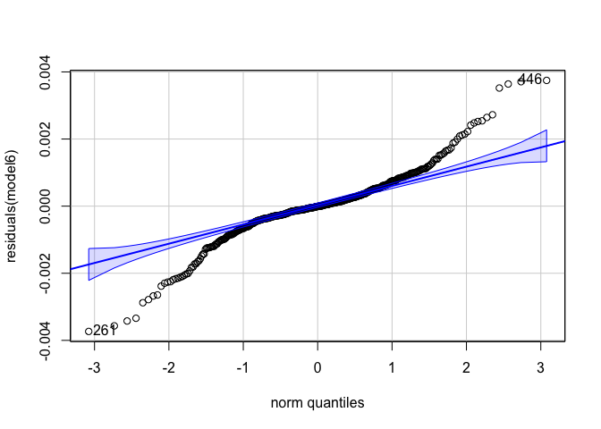<!-- -->

    ## [1] 446 261

``` r
hist(dead_24h_data$value.mm3)
```

<!-- -->

Identify using standardized residuals.

``` r
# Extract raw residuals
dead_24h_data$raw_resid <- residuals(model6)

# Standardize residuals
dead_24h_data$std_resid <- dead_24h_data$raw_resid / sd(dead_24h_data$raw_resid)

# Flag potential outliers
outlier_threshold <- 3
dead_24h_data$outlier_flag <- abs(dead_24h_data$std_resid) > outlier_threshold

# Filter rows flagged as outliers
outliers <- dead_24h_data %>% filter(outlier_flag == TRUE)
print(outliers)
```

    ## # A tibble: 9 × 13
    ##       date   bag sample hardening       temperature time  status final.mortality
    ##      <dbl> <dbl> <chr>  <chr>           <chr>       <fct>  <dbl> <chr>          
    ## 1 20240725    66 18     fresh-water     18C         4          0 dead           
    ## 2 20240805    50 4      immune          18C         0          0 dead           
    ## 3 20240805    50 4      immune          18C         4          0 dead           
    ## 4 20240807    47 9      temperature     18C         0          0 dead           
    ## 5 20240807    47 9      temperature     18C         4          0 dead           
    ## 6 20240815    76 19     fresh-water-te… 18C         0          0 dead           
    ## 7 20240815    76 19     fresh-water-te… 18C         4          0 dead           
    ## 8 20240815    76 9      fresh-water-te… 18C         0          0 dead           
    ## 9 20240815    76 9      fresh-water-te… 18C         4          0 dead           
    ## # ℹ 5 more variables: incubation.mortality <chr>, value.mm3 <dbl>,
    ## #   raw_resid <dbl>, std_resid <dbl>, outlier_flag <lgl>

``` r
# Plot standardized residuals
ggplot(dead_24h_data, aes(x = seq_along(std_resid), y = std_resid)) +
  geom_point(aes(color = outlier_flag), size = 2) +
  geom_hline(yintercept = c(-outlier_threshold, outlier_threshold), linetype = "dashed", color = "red") +
  labs(title = "Standardized Residuals with Outliers", x = "Index", y = "Standardized Residual") +
  theme_minimal()
```

<!-- -->

Remove identified outliers.

``` r
dead_24h_data<-dead_24h_data%>%
  filter(!outlier_flag==TRUE)
```

``` r
hist(dead_24h_data$value.mm3)
```

<!-- -->

### Analyze model

Plot raw data.

``` r
dead_24h_data%>%
  ggplot(aes(x=time, y=value.mm3, colour=temperature, group=paste(date,sample)))+
  geom_point()+
  geom_line()+
  theme_classic()
```

<!-- -->

``` r
model6<-lmer(sqrt(value.mm3) ~ time * temperature + (1|hardening) + (1|date:bag:sample), data=dead_24h_data)

summary(model6)
```

    ## Linear mixed model fit by REML. t-tests use Satterthwaite's method [
    ## lmerModLmerTest]
    ## Formula: sqrt(value.mm3) ~ time * temperature + (1 | hardening) + (1 |  
    ##     date:bag:sample)
    ##    Data: dead_24h_data
    ## 
    ## REML criterion at convergence: -4862.8
    ## 
    ## Scaled residuals: 
    ##      Min       1Q   Median       3Q      Max 
    ## -3.08670 -0.36654 -0.01146  0.43715  2.97935 
    ## 
    ## Random effects:
    ##  Groups          Name        Variance  Std.Dev. 
    ##  date:bag:sample (Intercept) 1.884e-06 0.0013727
    ##  hardening       (Intercept) 5.364e-08 0.0002316
    ##  Residual                    8.512e-07 0.0009226
    ## Number of obs: 471, groups:  date:bag:sample, 96; hardening, 5
    ## 
    ## Fixed effects:
    ##                        Estimate Std. Error         df t value Pr(>|t|)    
    ## (Intercept)           1.658e-05  2.608e-04  1.360e+01   0.064   0.9502    
    ## time1                 3.739e-03  1.896e-04  3.653e+02  19.719   <2e-16 ***
    ## time2                 6.636e-03  1.896e-04  3.653e+02  34.992   <2e-16 ***
    ## time3                 8.742e-03  1.896e-04  3.653e+02  46.103   <2e-16 ***
    ## time4                 1.054e-02  1.937e-04  3.642e+02  54.412   <2e-16 ***
    ## temperature42C       -9.177e-06  3.435e-04  1.600e+02  -0.027   0.9787    
    ## time1:temperature42C -6.158e-04  2.701e-04  3.647e+02  -2.280   0.0232 *  
    ## time2:temperature42C -2.578e-03  2.701e-04  3.647e+02  -9.545   <2e-16 ***
    ## time3:temperature42C -4.031e-03  2.701e-04  3.647e+02 -14.922   <2e-16 ***
    ## time4:temperature42C -5.141e-03  2.730e-04  3.641e+02 -18.833   <2e-16 ***
    ## ---
    ## Signif. codes:  0 '***' 0.001 '**' 0.01 '*' 0.05 '.' 0.1 ' ' 1
    ## 
    ## Correlation of Fixed Effects:
    ##             (Intr) time1  time2  time3  time4  tmp42C t1:42C t2:42C t3:42C
    ## time1       -0.383                                                        
    ## time2       -0.383  0.527                                                 
    ## time3       -0.383  0.527  0.527                                          
    ## time4       -0.366  0.504  0.504  0.504                                   
    ## tempertr42C -0.638  0.290  0.290  0.290  0.278                            
    ## tm1:tmpr42C  0.269 -0.702 -0.370 -0.370 -0.354 -0.403                     
    ## tm2:tmpr42C  0.269 -0.370 -0.702 -0.370 -0.354 -0.403  0.513              
    ## tm3:tmpr42C  0.269 -0.370 -0.370 -0.702 -0.354 -0.403  0.513  0.513       
    ## tm4:tmpr42C  0.260 -0.357 -0.357 -0.357 -0.709 -0.395  0.502  0.502  0.502

``` r
anova(model6)
```

    ## Type III Analysis of Variance Table with Satterthwaite's method
    ##                     Sum Sq    Mean Sq NumDF  DenDF  F value    Pr(>F)    
    ## time             0.0035875 0.00089688     4 364.45 1053.638 < 2.2e-16 ***
    ## temperature      0.0000597 0.00005968     1  91.01   70.111 6.427e-13 ***
    ## time:temperature 0.0004432 0.00011081     4 364.45  130.173 < 2.2e-16 ***
    ## ---
    ## Signif. codes:  0 '***' 0.001 '**' 0.01 '*' 0.05 '.' 0.1 ' ' 1

``` r
rand(model6)
```

    ## ANOVA-like table for random-effects: Single term deletions
    ## 
    ## Model:
    ## sqrt(value.mm3) ~ time + temperature + (1 | hardening) + (1 | date:bag:sample) + time:temperature
    ##                       npar logLik     AIC     LRT Df Pr(>Chisq)    
    ## <none>                  13 2431.4 -4836.8                          
    ## (1 | hardening)         12 2431.2 -4838.5   0.292  1     0.5887    
    ## (1 | date:bag:sample)   12 2297.6 -4571.2 267.622  1     <2e-16 ***
    ## ---
    ## Signif. codes:  0 '***' 0.001 '**' 0.01 '*' 0.05 '.' 0.1 ' ' 1

``` r
qqPlot(residuals(model6))
```

<!-- -->

    ## [1] 406 150

### Plot data

Plot mean response for each hardening treatment across time at 18°C and
42°C in those that were alive through the entire 24 hour trial

Plot first with individual points with geom smooth lines.

``` r
plot1<-dead_24h_data%>%

  ggplot(aes(x=time, y=value.mm3, color=temperature, fill=temperature))+
  geom_point(alpha=0.5)+
  geom_smooth(aes(group=temperature))+
  scale_colour_manual(values=c("cyan4", "orange"))+
  scale_fill_manual(values=c("cyan4", "orange"))+
  theme_classic()+
  xlab("Hour");plot1
```

<!-- -->

``` r
ggsave(plot1, filename="figures/resazurin/temperature_alive4h_dead24h.png", width=5, height=4)
```

Next plot with mean and sem for each group.

``` r
plot2<-dead_24h_data%>%
  group_by(temperature, time)%>%
  summarize(mean=mean(value.mm3, na.rm=TRUE), se=sd(value.mm3, na.rm=TRUE)/sqrt(length(value.mm3)))%>%

  ggplot(aes(x=time, y=mean, color=temperature, fill=temperature))+
  geom_point(alpha=0.5)+
  geom_errorbar(aes(ymin=mean-se, ymax=mean+se), width=0.1)+
  geom_line(aes(group=temperature))+
  scale_colour_manual(values=c("cyan4", "orange"))+
  scale_fill_manual(values=c("cyan4", "orange"))+
  theme_classic()+
  xlab("Hour");plot2
```

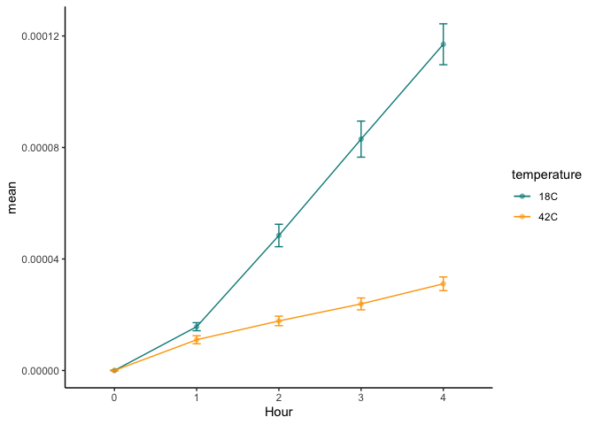<!-- -->

### Conduct post hoc tests

#### Effects of hardening treatment within temperature

``` r
anova(model6)
```

    ## Type III Analysis of Variance Table with Satterthwaite's method
    ##                     Sum Sq    Mean Sq NumDF  DenDF  F value    Pr(>F)    
    ## time             0.0035875 0.00089688     4 364.45 1053.638 < 2.2e-16 ***
    ## temperature      0.0000597 0.00005968     1  91.01   70.111 6.427e-13 ***
    ## time:temperature 0.0004432 0.00011081     4 364.45  130.173 < 2.2e-16 ***
    ## ---
    ## Signif. codes:  0 '***' 0.001 '**' 0.01 '*' 0.05 '.' 0.1 ' ' 1

``` r
emm<-emmeans(model6, ~temperature|time, adjust = "tukey")
pairs(emm)
```

    ## time = 0:
    ##  contrast  estimate       SE  df t.ratio p.value
    ##  18C - 42C 9.18e-06 0.000349 164   0.026  0.9791
    ## 
    ## time = 1:
    ##  contrast  estimate       SE  df t.ratio p.value
    ##  18C - 42C 6.25e-04 0.000347 160   1.801  0.0735
    ## 
    ## time = 2:
    ##  contrast  estimate       SE  df t.ratio p.value
    ##  18C - 42C 2.59e-03 0.000347 160   7.457  <.0001
    ## 
    ## time = 3:
    ##  contrast  estimate       SE  df t.ratio p.value
    ##  18C - 42C 4.04e-03 0.000347 160  11.643  <.0001
    ## 
    ## time = 4:
    ##  contrast  estimate       SE  df t.ratio p.value
    ##  18C - 42C 5.15e-03 0.000350 165  14.705  <.0001
    ## 
    ## Note: contrasts are still on the sqrt scale 
    ## Degrees-of-freedom method: kenward-roger

Different starting at time point 2.

## Analysis of 24 h mortality risk based on metabolic rate under high temperature in 4 h trial between hardening treatments

``` r
# Create a lagged status column
data_lag <- main_data %>%
  group_by(paste(date, bag, sample)) %>%
  mutate(next_status = lead(status)) %>%
  ungroup()

#if final mortality at time point 4 = dead, then add 1 to the "next_status" column and if final.mortality = alive, then add 0 to the "next status" column 

data_lag <- data_lag%>%
  mutate(next_status = if_else(time=="4" & final.mortality =="dead", 1, 0))

# Logistic regression model
model7 <- glmer(next_status ~ scale(value.mm3) * temperature + (1|hardening) + (1|bag:sample), family = binomial(link = "logit"), data = data_lag)

# Summary of the model
summary(model7)
```

    ## Generalized linear mixed model fit by maximum likelihood (Laplace
    ##   Approximation) [glmerMod]
    ##  Family: binomial  ( logit )
    ## Formula: next_status ~ scale(value.mm3) * temperature + (1 | hardening) +  
    ##     (1 | bag:sample)
    ##    Data: data_lag
    ## 
    ##      AIC      BIC   logLik deviance df.resid 
    ##   1182.7   1216.8   -585.3   1170.7     2184 
    ## 
    ## Scaled residuals: 
    ##     Min      1Q  Median      3Q     Max 
    ## -2.7521 -0.3058 -0.2104 -0.1486  6.2997 
    ## 
    ## Random effects:
    ##  Groups     Name        Variance  Std.Dev. 
    ##  bag:sample (Intercept) 3.117e-10 1.765e-05
    ##  hardening  (Intercept) 8.724e-02 2.954e-01
    ## Number of obs: 2190, groups:  bag:sample, 398; hardening, 5
    ## 
    ## Fixed effects:
    ##                                 Estimate Std. Error z value Pr(>|z|)    
    ## (Intercept)                     -3.41624    0.22497 -15.185  < 2e-16 ***
    ## scale(value.mm3)                 0.70745    0.08763   8.073 6.86e-16 ***
    ## temperature42C                   1.76094    0.20341   8.657  < 2e-16 ***
    ## scale(value.mm3):temperature42C  1.19855    0.17507   6.846 7.58e-12 ***
    ## ---
    ## Signif. codes:  0 '***' 0.001 '**' 0.01 '*' 0.05 '.' 0.1 ' ' 1
    ## 
    ## Correlation of Fixed Effects:
    ##             (Intr) sc(.3) tmp42C
    ## scl(vl.mm3) -0.514              
    ## tempertr42C -0.713  0.552       
    ## scl(.3):42C  0.222 -0.452 -0.328
    ## optimizer (Nelder_Mead) convergence code: 0 (OK)
    ## boundary (singular) fit: see help('isSingular')

``` r
Anova(model7)
```

    ## Analysis of Deviance Table (Type II Wald chisquare tests)
    ## 
    ## Response: next_status
    ##                                Chisq Df Pr(>Chisq)    
    ## scale(value.mm3)             156.818  1  < 2.2e-16 ***
    ## temperature                  133.129  1  < 2.2e-16 ***
    ## scale(value.mm3):temperature  46.871  1  7.582e-12 ***
    ## ---
    ## Signif. codes:  0 '***' 0.001 '**' 0.01 '*' 0.05 '.' 0.1 ' ' 1

``` r
plot(Effect(c("temperature"), model7))
```

<!-- -->

Higher risk of mortality at 42°C.

``` r
plot(Effect(c("value.mm3"), model7))
```

<!-- -->

Higher metabolic rate increases mortality risk.

``` r
plot(Effect(c("value.mm3", "temperature"), model7))
```

<!-- -->

Risk of mortality is higher at eleveated metabolic rate in 42°C as
compared to 18°C.

### Plot data

Plot effects on next mortality status.

``` r
# Logistic regression model for predictions
model_pred <- glmer(next_status ~ scale(value.mm3) * temperature + (1|hardening) + (1|bag:sample), family = binomial(link = "logit"), data = data_lag)

# Generate predicted probabilities
data_lag$predicted_mortality <- predict(model_pred, type = "response")

# Compute AUC
roc_curve <- roc(data_lag$next_status, data_lag$predicted_mortality)
auc_value <- auc(roc_curve)
print(paste("AUC:", round(auc_value, 3)))
```

    ## [1] "AUC: 0.842"

``` r
# Compute accuracy with a threshold of 0.5
data_lag$predicted_class <- ifelse(data_lag$predicted_mortality > 0.5, 1, 0)
accuracy <- mean(data_lag$predicted_class == data_lag$next_status)
print(paste("Accuracy:", round(accuracy, 3)))
```

    ## [1] "Accuracy: 0.898"

``` r
# Plot the ROC curve
roc_plot <- ggroc(roc_curve) +
  labs(title = "ROC Curve", x = "False Positive Rate", y = "True Positive Rate") +
  theme_classic();roc_plot
```

<!-- -->

``` r
# Add confidence intervals for ROC curve
ci_auc <- ci.auc(roc_curve)
print(paste("AUC 95% CI:", round(ci_auc[1], 3), "-", round(ci_auc[3], 3)))
```

    ## [1] "AUC 95% CI: 0.818 - 0.865"

``` r
# Plot
plot12<-ggplot(data_lag, aes(x = value.mm3, y = predicted_mortality, color = temperature, fill = temperature)) +
  geom_point(aes(y = next_status), alpha = 0.6, position = position_jitter(height = 0.03)) +
  geom_smooth(method = "glm", method.args = list(family = "binomial"), se = TRUE) +
    scale_colour_manual(values=c("cyan4", "orange"))+
  scale_fill_manual(values=c("cyan4", "orange"))+
  labs(
    title = "",
    x = expression(paste(Delta, " Fluorescence")),
    y = "Probability of Subsequent Mortality",
    color = "Temperature",
    fill = "Temperature"
  ) +
  theme_classic();plot12
```

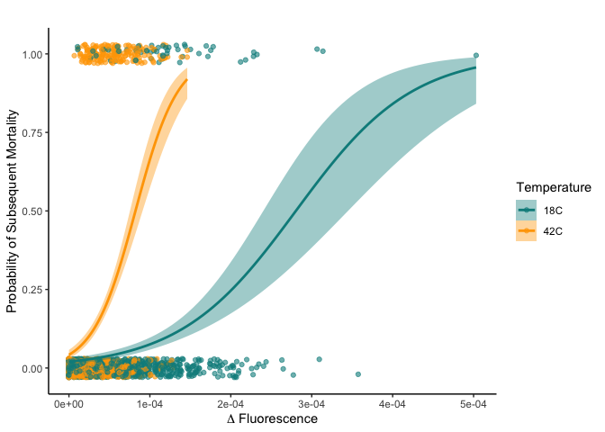<!-- -->

``` r
ggsave(plot12, filename="figures/resazurin/temperature_mortality-risk_alive4h_dead24h.png", width=5, height=4)
```

In those that died during the trial, elevated metabolism was a high
mortality risk.

# Analysis: Differentiation in metabolic rates between oysters that lived, died by 4 h, or died by 24 h

Prepare data frame for mortality under stress.

``` r
mortality_data<-main_data%>%
  filter(temperature=="42C")%>%
  ungroup()%>%
  dplyr::select(!c(width.mm, length.mm, value, volume.mm3))%>%
  mutate(mortality = case_when(
    final.mortality == "alive" ~ "alive", 
    incubation.mortality == "dead" ~ "dead_4h", 
    final.mortality == "dead" & incubation.mortality =="alive" ~ "dead_24h"
  ))
```

### Detect outliers

Build a model including all predictors.

``` r
model15<-lmer(sqrt(value.mm3) ~ time * mortality + (1|hardening) + (1|date:bag:sample), data=mortality_data)

qqPlot(residuals(model15))
```

<!-- -->

    ## [1] 646  26

``` r
hist(mortality_data$value.mm3)
```

<!-- -->

Identify using standardized residuals.

``` r
# Extract raw residuals
mortality_data$raw_resid <- residuals(model15)

# Standardize residuals
mortality_data$std_resid <- mortality_data$raw_resid / sd(mortality_data$raw_resid)

# Flag potential outliers
outlier_threshold <- 3
mortality_data$outlier_flag <- abs(mortality_data$std_resid) > outlier_threshold

# Filter rows flagged as outliers
outliers <- mortality_data %>% filter(outlier_flag == TRUE)
print(outliers)
```

    ## # A tibble: 15 × 14
    ##        date   bag sample hardening      temperature time  status final.mortality
    ##       <dbl> <dbl> <chr>  <chr>          <chr>       <fct>  <dbl> <chr>          
    ##  1 20240724    36 23     control        42C         0          0 alive          
    ##  2 20240724    36 26     control        42C         0          0 alive          
    ##  3 20240724    36 32     control        42C         0          0 dead           
    ##  4 20240724    36 40     control        42C         0          0 dead           
    ##  5 20240725    66 22     fresh-water    42C         4          1 dead           
    ##  6 20240725    66 30     fresh-water    42C         4          1 dead           
    ##  7 20240729    37 30     control        42C         0          0 dead           
    ##  8 20240729    37 31     control        42C         4          0 dead           
    ##  9 20240729    37 34     control        42C         0          0 dead           
    ## 10 20240805    50 23     immune         42C         0          0 dead           
    ## 11 20240805    50 26     immune         42C         0          0 dead           
    ## 12 20240805    50 37     immune         42C         0          0 dead           
    ## 13 20240807    47 30     temperature    42C         0          0 alive          
    ## 14 20240812    36 27     control        42C         0          0 dead           
    ## 15 20240815    76 35     fresh-water-t… 42C         0          0 dead           
    ## # ℹ 6 more variables: incubation.mortality <chr>, value.mm3 <dbl>,
    ## #   mortality <chr>, raw_resid <dbl>, std_resid <dbl>, outlier_flag <lgl>

``` r
# Plot standardized residuals
ggplot(mortality_data, aes(x = seq_along(std_resid), y = std_resid)) +
  geom_point(aes(color = outlier_flag), size = 2) +
  geom_hline(yintercept = c(-outlier_threshold, outlier_threshold), linetype = "dashed", color = "red") +
  labs(title = "Standardized Residuals with Outliers", x = "Index", y = "Standardized Residual") +
  theme_minimal()
```

<!-- -->

Remove identified outliers.

``` r
mortality_data<-mortality_data%>%
  filter(!outlier_flag==TRUE)
```

``` r
hist(mortality_data$value.mm3)
```

<!-- -->

### Analyze model

Plot raw data.

``` r
mortality_data%>%
  ggplot(aes(x=time, y=value.mm3, colour=mortality, group=paste(date, bag, sample)))+
  geom_point()+
  geom_line()+
  theme_classic()
```

<!-- -->

``` r
model15<-lmer(sqrt(value.mm3) ~ time * mortality + (1|hardening) + (1|date:bag:sample), data=mortality_data)

summary(model15)
```

    ## Linear mixed model fit by REML. t-tests use Satterthwaite's method [
    ## lmerModLmerTest]
    ## Formula: 
    ## sqrt(value.mm3) ~ time * mortality + (1 | hardening) + (1 | date:bag:sample)
    ##    Data: mortality_data
    ## 
    ## REML criterion at convergence: -11794.9
    ## 
    ## Scaled residuals: 
    ##     Min      1Q  Median      3Q     Max 
    ## -3.4626 -0.4459 -0.0123  0.5187  3.8368 
    ## 
    ## Random effects:
    ##  Groups          Name        Variance  Std.Dev. 
    ##  date:bag:sample (Intercept) 1.540e-06 0.0012411
    ##  hardening       (Intercept) 2.199e-07 0.0004689
    ##  Residual                    4.792e-07 0.0006923
    ## Number of obs: 1080, groups:  date:bag:sample, 219; hardening, 5
    ## 
    ## Fixed effects:
    ##                           Estimate Std. Error         df t value Pr(>|t|)    
    ## (Intercept)              3.403e-04  2.989e-04  1.160e+01   1.138   0.2779    
    ## time1                    2.895e-03  1.474e-04  8.476e+02  19.635   <2e-16 ***
    ## time2                    3.950e-03  1.474e-04  8.476e+02  26.792   <2e-16 ***
    ## time3                    4.424e-03  1.474e-04  8.476e+02  30.006   <2e-16 ***
    ## time4                    4.831e-03  1.474e-04  8.476e+02  32.770   <2e-16 ***
    ## mortalitydead_24h       -1.946e-04  3.010e-04  3.246e+02  -0.646   0.5185    
    ## mortalitydead_4h        -3.678e-04  2.487e-04  3.264e+02  -1.479   0.1401    
    ## time1:mortalitydead_24h  9.286e-05  2.077e-04  8.475e+02   0.447   0.6550    
    ## time2:mortalitydead_24h -2.847e-05  2.077e-04  8.475e+02  -0.137   0.8910    
    ## time3:mortalitydead_24h  1.522e-04  2.077e-04  8.475e+02   0.733   0.4640    
    ## time4:mortalitydead_24h  3.658e-04  2.084e-04  8.476e+02   1.755   0.0796 .  
    ## time1:mortalitydead_4h   1.862e-03  1.719e-04  8.476e+02  10.830   <2e-16 ***
    ## time2:mortalitydead_4h   2.194e-03  1.719e-04  8.476e+02  12.762   <2e-16 ***
    ## time3:mortalitydead_4h   2.793e-03  1.719e-04  8.476e+02  16.249   <2e-16 ***
    ## time4:mortalitydead_4h   3.104e-03  1.721e-04  8.477e+02  18.031   <2e-16 ***
    ## ---
    ## Signif. codes:  0 '***' 0.001 '**' 0.01 '*' 0.05 '.' 0.1 ' ' 1

``` r
anova(model15)
```

    ## Type III Analysis of Variance Table with Satterthwaite's method
    ##                   Sum Sq    Mean Sq NumDF  DenDF  F value    Pr(>F)    
    ## time           0.0037601 0.00094003     4 847.03 1961.505 < 2.2e-16 ***
    ## mortality      0.0000421 0.00002105     2 211.12   43.928 < 2.2e-16 ***
    ## time:mortality 0.0002770 0.00003462     8 847.04   72.241 < 2.2e-16 ***
    ## ---
    ## Signif. codes:  0 '***' 0.001 '**' 0.01 '*' 0.05 '.' 0.1 ' ' 1

``` r
rand(model15)
```

    ## ANOVA-like table for random-effects: Single term deletions
    ## 
    ## Model:
    ## sqrt(value.mm3) ~ time + mortality + (1 | hardening) + (1 | date:bag:sample) + time:mortality
    ##                       npar logLik    AIC    LRT Df Pr(>Chisq)    
    ## <none>                  18 5897.4 -11759                         
    ## (1 | hardening)         17 5891.0 -11748  12.96  1  0.0003181 ***
    ## (1 | date:bag:sample)   17 5469.5 -10905 855.89  1  < 2.2e-16 ***
    ## ---
    ## Signif. codes:  0 '***' 0.001 '**' 0.01 '*' 0.05 '.' 0.1 ' ' 1

``` r
qqPlot(residuals(model15))
```

<!-- -->

    ## [1] 247 525

### Plot data

Plot metabolic rates between temperatures by those that survived, died
within 4 h, and died within 24 h.

Plot first with individual points with geom smooth lines.

``` r
plot1<-mortality_data%>%

  ggplot(aes(x=time, y=value.mm3, color=mortality, fill=mortality))+
  geom_point(alpha=0.5)+
  geom_smooth(aes(group=mortality))+
  scale_colour_manual(values=c("darkgray", "darkred", "red"))+
  scale_fill_manual(values=c("darkgray", "darkred", "red"))+
  theme_classic()+
  xlab("Hour");plot1
```

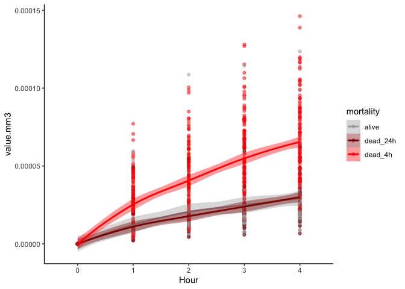<!-- -->

``` r
ggsave(plot1, filename="figures/resazurin/mortality_metabolic-rate_comparison_42C.png", width=5, height=4)
```

Next plot with mean and sem for each group.

``` r
plot2<-mortality_data%>%
  group_by(mortality, time)%>%
  summarize(mean=mean(value.mm3, na.rm=TRUE), se=sd(value.mm3, na.rm=TRUE)/sqrt(length(value.mm3)))%>%

  ggplot(aes(x=time, y=mean, color=mortality, fill=mortality))+
  geom_point(alpha=0.5)+
  geom_errorbar(aes(ymin=mean-se, ymax=mean+se), width=0.1)+
  geom_line(aes(group=mortality))+
  theme_classic()+
  xlab("Hour");plot2
```

<!-- -->

### Conduct post hoc tests

#### Effects of hardening treatment within temperature

``` r
anova(model15)
```

    ## Type III Analysis of Variance Table with Satterthwaite's method
    ##                   Sum Sq    Mean Sq NumDF  DenDF  F value    Pr(>F)    
    ## time           0.0037601 0.00094003     4 847.03 1961.505 < 2.2e-16 ***
    ## mortality      0.0000421 0.00002105     2 211.12   43.928 < 2.2e-16 ***
    ## time:mortality 0.0002770 0.00003462     8 847.04   72.241 < 2.2e-16 ***
    ## ---
    ## Signif. codes:  0 '***' 0.001 '**' 0.01 '*' 0.05 '.' 0.1 ' ' 1

``` r
emm<-emmeans(model15, ~mortality|time, adjust = "tukey")
pairs(emm)
```

    ## time = 0:
    ##  contrast            estimate       SE  df t.ratio p.value
    ##  alive - dead_24h    1.95e-04 0.000301 328   0.645  0.7951
    ##  alive - dead_4h     3.68e-04 0.000249 330   1.477  0.3033
    ##  dead_24h - dead_4h  1.73e-04 0.000249 326   0.695  0.7668
    ## 
    ## time = 1:
    ##  contrast            estimate       SE  df t.ratio p.value
    ##  alive - dead_24h    1.02e-04 0.000299 318   0.340  0.9382
    ##  alive - dead_4h    -1.49e-03 0.000247 318  -6.058  <.0001
    ##  dead_24h - dead_4h -1.60e-03 0.000248 318  -6.442  <.0001
    ## 
    ## time = 2:
    ##  contrast            estimate       SE  df t.ratio p.value
    ##  alive - dead_24h    2.23e-04 0.000299 318   0.746  0.7362
    ##  alive - dead_4h    -1.83e-03 0.000247 318  -7.405  <.0001
    ##  dead_24h - dead_4h -2.05e-03 0.000248 318  -8.273  <.0001
    ## 
    ## time = 3:
    ##  contrast            estimate       SE  df t.ratio p.value
    ##  alive - dead_24h    4.23e-05 0.000299 318   0.142  0.9890
    ##  alive - dead_4h    -2.43e-03 0.000247 318  -9.836  <.0001
    ##  dead_24h - dead_4h -2.47e-03 0.000248 318  -9.964  <.0001
    ## 
    ## time = 4:
    ##  contrast            estimate       SE  df t.ratio p.value
    ##  alive - dead_24h   -1.71e-04 0.000299 320  -0.572  0.8351
    ##  alive - dead_4h    -2.74e-03 0.000247 319 -11.088  <.0001
    ##  dead_24h - dead_4h -2.56e-03 0.000248 321 -10.324  <.0001
    ## 
    ## Note: contrasts are still on the sqrt scale 
    ## Degrees-of-freedom method: kenward-roger 
    ## P value adjustment: tukey method for comparing a family of 3 estimates

Significant effects:

- Those that died by 4 h had higher mortality rates than those that
  survived or survived until 24 h.

# Analysis: Survival and classification

Look at mortality effects over time.

``` r
surv<-read_excel("data/survival/survival_resazurin.xlsx")

surv_final<-surv%>%
  pivot_longer(names_to="time", values_to="status", cols=`0`:`24`)%>%
  mutate(time=as.numeric(time))%>%
  rename(date=date.resazurin, sample=oyster)%>%
  mutate(sample=as.character(sample))%>%
  filter(time=="24")
```

## Mortality by temperature

``` r
surv_data<-main_data%>%
  ungroup()%>%
  select(c(date, bag, sample, hardening, temperature, time, status))

#add 24 h survival data 
surv_data<-rbind(surv_final, surv_data)

surv_data<-surv_data%>%
  arrange(date, bag, sample)%>%
  mutate(time=as.numeric(as.character(time)))%>%
  arrange(date, bag, sample, time)

str(surv_data)
```

    ## tibble [2,630 × 7] (S3: tbl_df/tbl/data.frame)
    ##  $ date       : num [1:2630] 20240724 20240724 20240724 20240724 20240724 ...
    ##  $ bag        : num [1:2630] 36 36 36 36 36 36 36 36 36 36 ...
    ##  $ hardening  : chr [1:2630] "control" "control" "control" "control" ...
    ##  $ temperature: chr [1:2630] "18C" "18C" "18C" "18C" ...
    ##  $ sample     : chr [1:2630] "1" "1" "1" "1" ...
    ##  $ time       : num [1:2630] 0 1 2 3 4 24 0 1 2 3 ...
    ##  $ status     : num [1:2630] 0 0 0 0 0 1 0 0 0 0 ...

``` r
# Logistic regression model for predictions
model_surv <- glmer(status ~ time * temperature + (1|hardening/bag) + (1|bag:sample), family = binomial(link = "logit"), data = surv_data)

# Generate predicted probabilities
surv_data$predicted_mortality <- predict(model_surv, type = "response")

# Plot
plot3<-ggplot(surv_data, aes(x = as.numeric(time), y = predicted_mortality, color = temperature, fill = temperature)) +
  geom_point(aes(y = status), alpha = 0.6, position = position_jitter(height = 0.03)) +
  geom_smooth(method = "glm", method.args = list(family = "binomial"), se = TRUE) +
  scale_colour_manual(values=c("cyan4", "orange"))+
  scale_fill_manual(values=c("cyan4", "orange"))+
  labs(
    title = "",
    y = "Probability of Mortality",
  ) +
  theme_classic();plot3
```

<!-- -->

``` r
ggsave(plot3, filename="figures/resazurin/survival_temperature.png", width=5, height=4)
```

View model results

``` r
# Summary of the model
summary(model_surv)
```

    ## Generalized linear mixed model fit by maximum likelihood (Laplace
    ##   Approximation) [glmerMod]
    ##  Family: binomial  ( logit )
    ## Formula: status ~ time * temperature + (1 | hardening/bag) + (1 | bag:sample)
    ##    Data: surv_data
    ## 
    ##      AIC      BIC   logLik deviance df.resid 
    ##   1683.2   1724.4   -834.6   1669.2     2623 
    ## 
    ## Scaled residuals: 
    ##     Min      1Q  Median      3Q     Max 
    ## -4.3256 -0.2903 -0.0563 -0.0283  6.5448 
    ## 
    ## Random effects:
    ##  Groups        Name        Variance Std.Dev.
    ##  bag:sample    (Intercept) 3.445    1.856   
    ##  bag:hardening (Intercept) 0.000    0.000   
    ##  hardening     (Intercept) 0.000    0.000   
    ## Number of obs: 2630, groups:  bag:sample, 400; bag:hardening, 10; hardening, 5
    ## 
    ## Fixed effects:
    ##                     Estimate Std. Error z value Pr(>|z|)    
    ## (Intercept)         -6.71880    0.51352 -13.084   <2e-16 ***
    ## time                 0.21109    0.01997  10.570   <2e-16 ***
    ## temperature42C       4.75775    0.49656   9.581   <2e-16 ***
    ## time:temperature42C -0.01522    0.02267  -0.671    0.502    
    ## ---
    ## Signif. codes:  0 '***' 0.001 '**' 0.01 '*' 0.05 '.' 0.1 ' ' 1
    ## 
    ## Correlation of Fixed Effects:
    ##             (Intr) time   tmp42C
    ## time        -0.863              
    ## tempertr42C -0.923  0.824       
    ## tm:tmprt42C  0.533 -0.741 -0.654
    ## optimizer (Nelder_Mead) convergence code: 0 (OK)
    ## boundary (singular) fit: see help('isSingular')

``` r
Anova(model_surv)
```

    ## Analysis of Deviance Table (Type II Wald chisquare tests)
    ## 
    ## Response: status
    ##                     Chisq Df Pr(>Chisq)    
    ## time             225.0643  1     <2e-16 ***
    ## temperature      145.9354  1     <2e-16 ***
    ## time:temperature   0.4508  1      0.502    
    ## ---
    ## Signif. codes:  0 '***' 0.001 '**' 0.01 '*' 0.05 '.' 0.1 ' ' 1

Temperature and time affect mortality.

## Mortality by temperature and hardening

``` r
# Logistic regression model for predictions
model_surv_hard <- glmer(status ~ time + hardening * temperature + (1|bag) + (1|bag:sample), family = binomial(link = "logit"), data = surv_data)

# Generate predicted probabilities
surv_data$predicted_mortality <- predict(model_surv_hard, type = "response")

# Evaluate model performance: AUC and accuracy

# Compute AUC
roc_curve <- roc(surv_data$status, surv_data$predicted_mortality)
auc_value <- auc(roc_curve)
print(paste("AUC:", round(auc_value, 3)))
```

    ## [1] "AUC: 0.965"

``` r
# Compute accuracy with a threshold of 0.5
surv_data$predicted_class <- ifelse(surv_data$predicted_mortality > 0.5, 1, 0)
accuracy <- mean(surv_data$predicted_class == surv_data$status)
print(paste("Accuracy:", round(accuracy, 3)))
```

    ## [1] "Accuracy: 0.915"

``` r
# Plot the ROC curve
roc_plot <- ggroc(roc_curve) +
  labs(title = "ROC Curve", x = "False Positive Rate", y = "True Positive Rate") +
  theme_classic();roc_plot
```

<!-- -->

``` r
# Add confidence intervals for ROC curve
ci_auc <- ci.auc(roc_curve)
print(paste("AUC 95% CI:", round(ci_auc[1], 3), "-", round(ci_auc[3], 3)))
```

    ## [1] "AUC 95% CI: 0.958 - 0.971"

``` r
# Plot
plot3a<-ggplot(surv_data, aes(x = as.numeric(time), y = predicted_mortality, color = hardening, fill = hardening)) +
  facet_wrap(~temperature)+
  geom_point(aes(y = status), alpha = 0.6, position = position_jitter(height = 0.03)) +
  geom_smooth(method = "glm", method.args = list(family = "binomial"), se = TRUE) +
  scale_colour_brewer(palette="Dark2")+
  scale_fill_brewer(palette="Dark2")+
  labs(
    title = "",
    y = "Probability of Mortality",
  ) +
  theme_classic();plot3a
```

<!-- -->

``` r
ggsave(plot3a, filename="figures/resazurin/survival_hardening_temperature.png", width=8, height=4)
```

View model results

``` r
# Summary of the model
summary(model_surv_hard)
```

    ## Generalized linear mixed model fit by maximum likelihood (Laplace
    ##   Approximation) [glmerMod]
    ##  Family: binomial  ( logit )
    ## Formula: status ~ time + hardening * temperature + (1 | bag) + (1 | bag:sample)
    ##    Data: surv_data
    ## 
    ##      AIC      BIC   logLik deviance df.resid 
    ##   1689.3   1765.7   -831.6   1663.3     2617 
    ## 
    ## Scaled residuals: 
    ##     Min      1Q  Median      3Q     Max 
    ## -4.4568 -0.2931 -0.0609 -0.0307  6.2611 
    ## 
    ## Random effects:
    ##  Groups     Name        Variance  Std.Dev.
    ##  bag:sample (Intercept) 3.3292787 1.82463 
    ##  bag        (Intercept) 0.0001875 0.01369 
    ## Number of obs: 2630, groups:  bag:sample, 400; bag, 10
    ## 
    ## Fixed effects:
    ##                                                 Estimate Std. Error z value
    ## (Intercept)                                     -6.67225    0.59416 -11.230
    ## time                                             0.19995    0.01333  15.005
    ## hardeningfresh-water                             0.13483    0.67630   0.199
    ## hardeningfresh-water-temperature                 0.71651    0.65885   1.088
    ## hardeningimmune                                  0.07423    0.67453   0.110
    ## hardeningtemperature                             0.03975    0.68124   0.058
    ## temperature42C                                   4.54316    0.63565   7.147
    ## hardeningfresh-water:temperature42C             -0.22781    0.83379  -0.273
    ## hardeningfresh-water-temperature:temperature42C -0.90584    0.82406  -1.099
    ## hardeningimmune:temperature42C                   0.17598    0.82891   0.212
    ## hardeningtemperature:temperature42C              0.71211    0.83064   0.857
    ##                                                 Pr(>|z|)    
    ## (Intercept)                                      < 2e-16 ***
    ## time                                             < 2e-16 ***
    ## hardeningfresh-water                               0.842    
    ## hardeningfresh-water-temperature                   0.277    
    ## hardeningimmune                                    0.912    
    ## hardeningtemperature                               0.953    
    ## temperature42C                                  8.86e-13 ***
    ## hardeningfresh-water:temperature42C                0.785    
    ## hardeningfresh-water-temperature:temperature42C    0.272    
    ## hardeningimmune:temperature42C                     0.832    
    ## hardeningtemperature:temperature42C                0.391    
    ## ---
    ## Signif. codes:  0 '***' 0.001 '**' 0.01 '*' 0.05 '.' 0.1 ' ' 1
    ## 
    ## Correlation of Fixed Effects:
    ##             (Intr) time   hrdnn- hrdn-- hrdnngm hrdnngt tmp42C h-:42C h--:42
    ## time        -0.608                                                          
    ## hrdnngfrsh- -0.531  0.015                                                   
    ## hrdnngfrs-- -0.586  0.072  0.471                                            
    ## hardenngmmn -0.508 -0.011  0.458  0.469                                     
    ## hrdnngtmprt -0.529  0.013  0.455  0.468  0.455                              
    ## tempertr42C -0.845  0.428  0.494  0.537  0.477   0.492                      
    ## hrdnng-:42C  0.460 -0.049 -0.812 -0.386 -0.370  -0.370  -0.631              
    ## hrdnn--:42C  0.509 -0.109 -0.378 -0.805 -0.372  -0.376  -0.670  0.474       
    ## hrdnngm:42C  0.442 -0.025 -0.374 -0.385 -0.811  -0.371  -0.620  0.464  0.472
    ## hrdnngt:42C  0.430  0.000 -0.373 -0.384 -0.372  -0.820  -0.611  0.463  0.470
    ##             hrdnngm:42C
    ## time                   
    ## hrdnngfrsh-            
    ## hrdnngfrs--            
    ## hardenngmmn            
    ## hrdnngtmprt            
    ## tempertr42C            
    ## hrdnng-:42C            
    ## hrdnn--:42C            
    ## hrdnngm:42C            
    ## hrdnngt:42C  0.465     
    ## optimizer (Nelder_Mead) convergence code: 0 (OK)
    ## Model failed to converge with max|grad| = 0.422201 (tol = 0.002, component 1)

``` r
Anova(model_surv_hard)
```

    ## Analysis of Deviance Table (Type II Wald chisquare tests)
    ## 
    ## Response: status
    ##                          Chisq Df Pr(>Chisq)    
    ## time                  225.1384  1     <2e-16 ***
    ## hardening               2.4475  4     0.6541    
    ## temperature           146.6115  1     <2e-16 ***
    ## hardening:temperature   3.8534  4     0.4262    
    ## ---
    ## Signif. codes:  0 '***' 0.001 '**' 0.01 '*' 0.05 '.' 0.1 ' ' 1

Hardening does not affect survival.

``` r
# Plot
plot3b<-ggplot(surv_data, aes(x = as.numeric(time), y = predicted_mortality, color = temperature, fill = temperature)) +
  facet_wrap(~hardening)+
  geom_point(aes(y = status), alpha = 0.6, position = position_jitter(height = 0.03)) +
  geom_smooth(method = "glm", method.args = list(family = "binomial"), se = TRUE) +
  scale_colour_manual(values=c("cyan4", "orange"))+
  scale_fill_manual(values=c("cyan4", "orange"))+
  labs(
    title = "",
    y = "Probability of Mortality",
  ) +
  theme_classic();plot3b
```

<!-- -->

``` r
ggsave(plot3b, filename="figures/resazurin/survival_hardening_temperature2.png", width=8, height=4)
```

No effect of hardening on mortality.

There is an effect of temperature on mortality with highest mortality at
24 hours.
