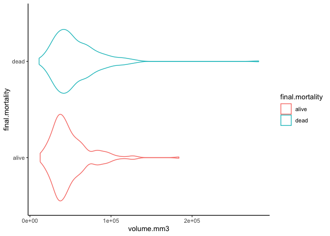
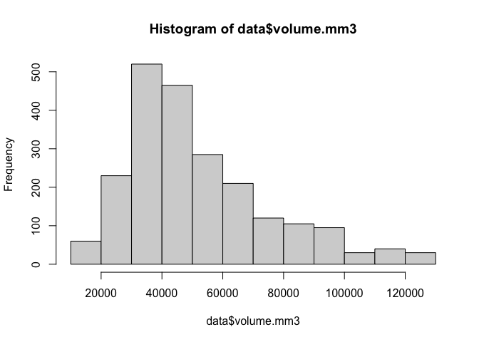
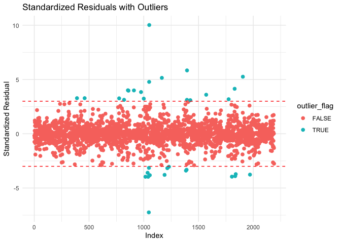
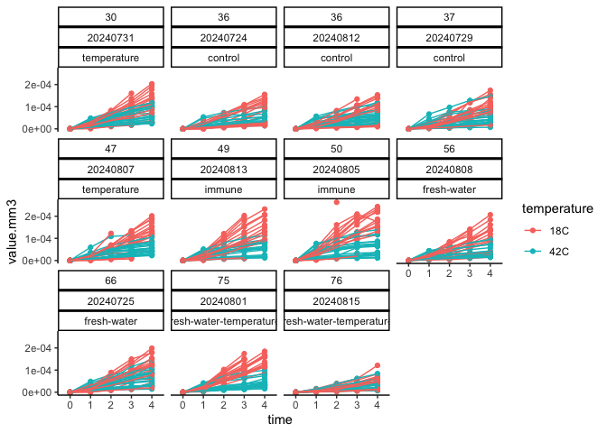
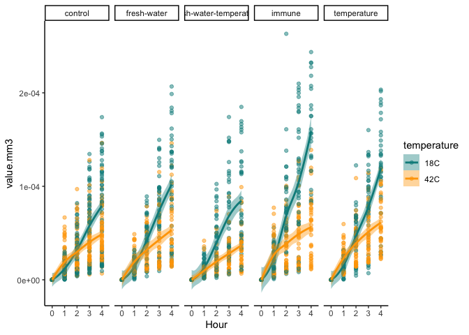
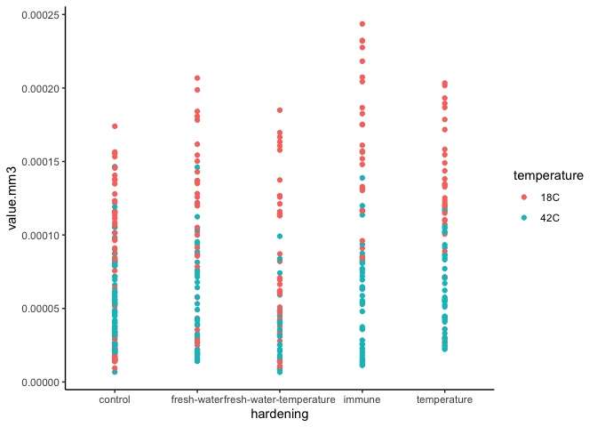
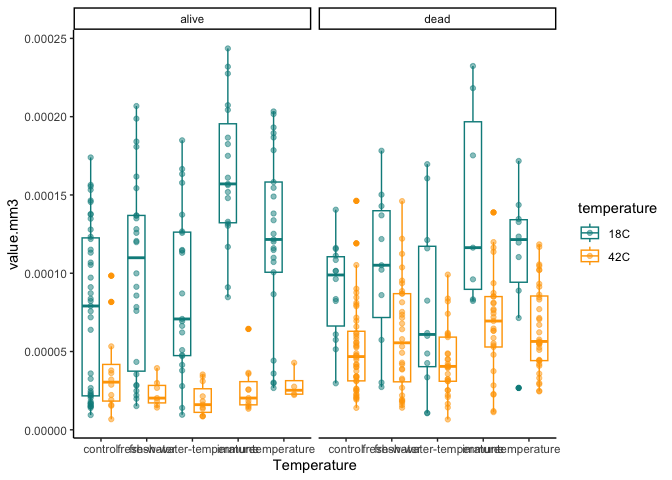
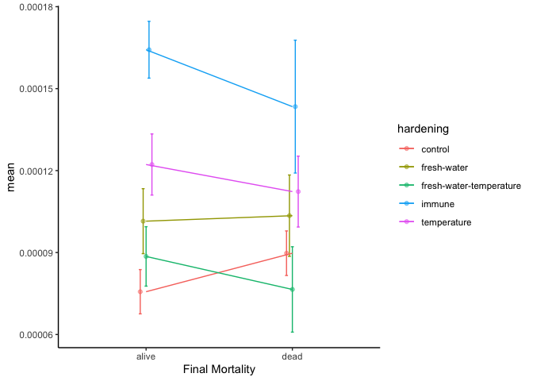
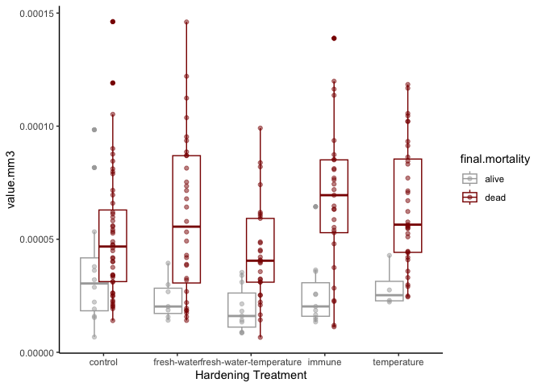

Interpretations tl;dr: - Temperature hardened oysters show less
metabolic plasticity and died more under stress - Metabolic rates are
different in stressed oysters - Metabolic rates are different in those
that died vs those that survived under stress - We can measure changes
in metabolism using resazurin assay

# Set up

Set up workspace, set options, and load required packages.

    knitr::opts_chunk$set(echo = TRUE, warning = FALSE, message = FALSE)

Load libraries.

    library(MASS) 
    library(tidyverse)
    library(ggplot2)
    library(readxl)
    library(cowplot)
    library(lme4)
    library(lmerTest)
    library(car)
    library(effects)
    library(emmeans)

# Load data

Read in resazurin data

    #read in files
    data <- read_csv("data/resazurin/resazurin_data.csv")

    data<-data%>%
      pivot_longer(names_to="time", values_to="fluorescence", cols=`0`:`4`)%>%
      mutate(time=as.numeric(time))

Read in survival data

    surv<-read_excel("data/survival/survival_resazurin.xlsx")

    surv<-surv%>%
      pivot_longer(names_to="time", values_to="status", cols=`0`:`24`)%>%
      mutate(time=as.numeric(time))%>%
      rename(date=date.resazurin, sample=oyster)%>%
      mutate(sample=as.character(sample))

Read in size data

    size <- read_csv("data/resazurin/resazurin-size.csv")%>%select(!notes)%>%mutate(sample=as.character(sample))

Combine data

    data<-left_join(data, surv)

    data<-left_join(data,size)

Add in final mortality status

    final<-surv%>%
      filter(time==24)%>%
      rename(final.mortality=status)%>%
      select(!time)

    data<-left_join(data, final)

We now have resazurin and survival data in the data frame.

    data<-data%>%
      mutate(final.mortality = case_when(
        final.mortality == 0 ~ "alive",
        final.mortality == 1 ~ "dead",
        TRUE ~ as.character(final.mortality)  # To handle any other values
      ))

# Data preparation

Plot the data.

    data%>%
      ggplot(aes(x=time, y=fluorescence, colour=temperature, group=sample))+
      facet_wrap(~bag*date)+
      geom_point()+
      geom_line()+
      theme_classic()

Calculate fluorescence at each time point normalized to the starting
value at time 0.

    data<-data%>%
      group_by(date, bag, sample, width.mm, length.mm)%>%
      arrange(date, bag, sample)%>%
      mutate(fluorescence.norm=fluorescence/first(fluorescence))

Plot again

    data%>%
      ggplot(aes(x=time, y=fluorescence.norm, colour=temperature, group=sample))+
      facet_wrap(~bag*date)+
      geom_point()+
      geom_line()+
      theme_classic()

View blanks

    data%>%
      filter(type=="blank")%>%
      ggplot(aes(x=time, y=fluorescence.norm, colour=temperature, group=sample))+
      facet_wrap(~bag*date)+
      geom_point()+
      geom_line()+
      theme_classic()

Calculate mean change in blank at each time point.

    blanks<-data%>%
      filter(type=="blank")%>%
      group_by(date, bag, temperature, time)%>%
      summarise(mean_blank=mean(fluorescence.norm))

View summarized blank data.

    blanks%>%
      ggplot(aes(x=time, y=mean_blank, colour=temperature))+
      facet_wrap(~bag*date)+
      geom_point()+
      geom_line()+
      theme_classic()

Subtract blank values from fluorescence values for oysters.

    data<-left_join(data, blanks)

    data<-data%>%
      filter(!type=="blank")%>%
      mutate(value=fluorescence.norm-mean_blank)

Plot again.

    data%>%
      ggplot(aes(x=time, y=value, colour=temperature, group=sample))+
      facet_wrap(~bag*date*hardening)+
      geom_point()+
      geom_line()+
      theme_classic()

Remove unnecessary columns.

    data<-data%>%
      select(!type)%>%
      select(!fluorescence.norm)%>%
      select(!mean_blank)%>%
      select(!fluorescence)

Normalize blank corrected fluorescence to oyster size by dividing
fluorescence value (normalized to starting value and blank corrected) by
oyster size. Calculate volume by using length and width.

    data$volume.mm3<-(4/3) * pi * ((data$length.mm/2) * (data$width.mm/2))^2

    data$value.mm3<-data$value/data$volume.mm3

Plot size normalized resazurin response.

    data%>%
      ggplot(aes(x=time, y=value.mm3, colour=temperature, group=sample))+
      facet_wrap(~bag*date*hardening)+
      geom_point()+
      geom_line()+
      theme_classic()

Plot against final mortality.

    data%>%
      filter(time==4)%>%
      filter(temperature=="42C")%>%
      
      ggplot(aes(x=final.mortality, y=value.mm3, colour=final.mortality))+
      geom_point()+
      theme_classic()

    data%>%
      filter(time==4)%>%
      filter(temperature=="18C")%>%
      
      ggplot(aes(x=final.mortality, y=value.mm3, colour=final.mortality))+
      geom_point()+
      theme_classic()

Under temperature stress, there appears to be a positive relationship
between fluorescence at 4 hrs and final mortality status. This does not
appear to show up at 18°C.

Plot size and mortality relationships.

    data%>%
      filter(time==4)%>%
      
      ggplot(aes(x=volume.mm3, y=final.mortality, colour=final.mortality))+
      geom_violin()+
      theme_classic()

 Not
much difference if any.

Set time as a factor.

    data$time<-as.factor(data$time)

# Analysis

## Examine size effects

View size range.

    hist(data$volume.mm3)

Remove the two outlier oysters.

    data<-data%>%
      filter(volume.mm3<150000)

    hist(data$volume.mm3)

View metabolic rates over time as a function of size and temperature
treatment using the non-size normalized fluorescence values. Include
repeated measures for each individual.

    model.size<-lmer(sqrt(value) ~ time * temperature * scale(volume.mm3) + (1|bag) + (1|date:bag:sample), data=data)

    summary(model.size)

    ## Linear mixed model fit by REML. t-tests use Satterthwaite's method [
    ## lmerModLmerTest]
    ## Formula: sqrt(value) ~ time * temperature * scale(volume.mm3) + (1 | bag) +  
    ##     (1 | date:bag:sample)
    ##    Data: data
    ## 
    ## REML criterion at convergence: 1469
    ## 
    ## Scaled residuals: 
    ##     Min      1Q  Median      3Q     Max 
    ## -4.0114 -0.5143  0.0249  0.5714  3.0118 
    ## 
    ## Random effects:
    ##  Groups          Name        Variance Std.Dev.
    ##  date:bag:sample (Intercept) 0.11279  0.3358  
    ##  bag             (Intercept) 0.01934  0.1391  
    ##  Residual                    0.07001  0.2646  
    ## Number of obs: 2190, groups:  date:bag:sample, 438; bag, 10
    ## 
    ## Fixed effects:
    ##                                          Estimate Std. Error         df t value
    ## (Intercept)                             6.625e-03  5.350e-02  1.455e+01   0.124
    ## time1                                   7.467e-01  2.637e-02  1.736e+03  28.318
    ## time2                                   1.289e+00  2.637e-02  1.736e+03  48.888
    ## time3                                   1.711e+00  2.637e-02  1.736e+03  64.878
    ## time4                                   2.051e+00  2.637e-02  1.736e+03  77.788
    ## temperature42C                         -3.693e-03  4.239e-02  8.419e+02  -0.087
    ## scale(volume.mm3)                       3.612e-03  3.424e-02  8.305e+02   0.106
    ## time1:temperature42C                    1.656e-01  3.703e-02  1.736e+03   4.471
    ## time2:temperature42C                   -1.022e-01  3.703e-02  1.736e+03  -2.759
    ## time3:temperature42C                   -3.301e-01  3.703e-02  1.736e+03  -8.914
    ## time4:temperature42C                   -5.191e-01  3.703e-02  1.736e+03 -14.018
    ## time1:scale(volume.mm3)                 5.468e-02  2.939e-02  1.736e+03   1.860
    ## time2:scale(volume.mm3)                 1.008e-01  2.939e-02  1.736e+03   3.431
    ## time3:scale(volume.mm3)                 1.676e-01  2.939e-02  1.736e+03   5.704
    ## time4:scale(volume.mm3)                 1.914e-01  2.939e-02  1.736e+03   6.512
    ## temperature42C:scale(volume.mm3)        5.911e-03  4.338e-02  8.409e+02   0.136
    ## time1:temperature42C:scale(volume.mm3)  5.321e-02  3.781e-02  1.736e+03   1.407
    ## time2:temperature42C:scale(volume.mm3)  1.715e-02  3.781e-02  1.736e+03   0.453
    ## time3:temperature42C:scale(volume.mm3) -3.717e-02  3.781e-02  1.736e+03  -0.983
    ## time4:temperature42C:scale(volume.mm3) -5.499e-02  3.781e-02  1.736e+03  -1.454
    ##                                        Pr(>|t|)    
    ## (Intercept)                            0.903140    
    ## time1                                   < 2e-16 ***
    ## time2                                   < 2e-16 ***
    ## time3                                   < 2e-16 ***
    ## time4                                   < 2e-16 ***
    ## temperature42C                         0.930607    
    ## scale(volume.mm3)                      0.915995    
    ## time1:temperature42C                   8.30e-06 ***
    ## time2:temperature42C                   0.005861 ** 
    ## time3:temperature42C                    < 2e-16 ***
    ## time4:temperature42C                    < 2e-16 ***
    ## time1:scale(volume.mm3)                0.062998 .  
    ## time2:scale(volume.mm3)                0.000616 ***
    ## time3:scale(volume.mm3)                1.37e-08 ***
    ## time4:scale(volume.mm3)                9.70e-11 ***
    ## temperature42C:scale(volume.mm3)       0.891650    
    ## time1:temperature42C:scale(volume.mm3) 0.159565    
    ## time2:temperature42C:scale(volume.mm3) 0.650298    
    ## time3:temperature42C:scale(volume.mm3) 0.325815    
    ## time4:temperature42C:scale(volume.mm3) 0.146035    
    ## ---
    ## Signif. codes:  0 '***' 0.001 '**' 0.01 '*' 0.05 '.' 0.1 ' ' 1

    anova(model.size)

    ## Type III Analysis of Variance Table with Satterthwaite's method
    ##                                    Sum Sq Mean Sq NumDF   DenDF   F value
    ## time                               807.56 201.890     4 1736.00 2883.8631
    ## temperature                          1.45   1.451     1  425.66   20.7208
    ## scale(volume.mm3)                    2.28   2.279     1  432.84   32.5475
    ## time:temperature                    29.90   7.474     4 1736.00  106.7574
    ## time:scale(volume.mm3)               6.63   1.657     4 1736.00   23.6748
    ## temperature:scale(volume.mm3)        0.00   0.000     1  426.51    0.0018
    ## time:temperature:scale(volume.mm3)   0.73   0.182     4 1736.00    2.6001
    ##                                       Pr(>F)    
    ## time                               < 2.2e-16 ***
    ## temperature                        6.944e-06 ***
    ## scale(volume.mm3)                  2.159e-08 ***
    ## time:temperature                   < 2.2e-16 ***
    ## time:scale(volume.mm3)             < 2.2e-16 ***
    ## temperature:scale(volume.mm3)        0.96586    
    ## time:temperature:scale(volume.mm3)   0.03456 *  
    ## ---
    ## Signif. codes:  0 '***' 0.001 '**' 0.01 '*' 0.05 '.' 0.1 ' ' 1

    rand(model.size)

    ## ANOVA-like table for random-effects: Single term deletions
    ## 
    ## Model:
    ## sqrt(value) ~ time + temperature + scale(volume.mm3) + (1 | bag) + (1 | date:bag:sample) + time:temperature + time:scale(volume.mm3) + temperature:scale(volume.mm3) + time:temperature:scale(volume.mm3)
    ##                       npar   logLik    AIC     LRT Df Pr(>Chisq)    
    ## <none>                  23  -734.50 1515.0                          
    ## (1 | bag)               22  -751.84 1547.7   34.69  1  3.874e-09 ***
    ## (1 | date:bag:sample)   22 -1292.12 2628.2 1115.24  1  < 2.2e-16 ***
    ## ---
    ## Signif. codes:  0 '***' 0.001 '**' 0.01 '*' 0.05 '.' 0.1 ' ' 1

    qqPlot(residuals(model.size))

    ## [1] 1046 1026

    plot(Effect(c("volume.mm3"), model.size))

There is a significant effect of time and size as well as interactions
between time-temperature, time-size, and time-temperature-size. This
indicates that metabolic scaling is different between temperatures.

Plot metabolic rates (y) over time (x) with a gradient of color for
size.

    data%>%
      ggplot(aes(x=time, y=sqrt(value), colour=scale(volume.mm3), group=paste(date, bag, sample)))+
      facet_wrap(~temperature)+
      scale_colour_gradientn(colours=c("blue", "lightblue", "white","pink", "red"))+
      geom_point()+
      geom_line()+
      theme_classic()

In general there are higher rates for larger sizes.

Model using the final time point to quantify size effects on total
fluorescence change.

    final<-data%>%
      filter(time=="4")

    model.size2<-lmer(sqrt(value) ~ temperature * scale(volume.mm3) + (1|bag), data=data)

    summary(model.size2)

    ## Linear mixed model fit by REML. t-tests use Satterthwaite's method [
    ## lmerModLmerTest]
    ## Formula: sqrt(value) ~ temperature * scale(volume.mm3) + (1 | bag)
    ##    Data: data
    ## 
    ## REML criterion at convergence: 5094.9
    ## 
    ## Scaled residuals: 
    ##     Min      1Q  Median      3Q     Max 
    ## -1.9936 -0.6613 -0.0292  0.7316  3.1762 
    ## 
    ## Random effects:
    ##  Groups   Name        Variance Std.Dev.
    ##  bag      (Intercept) 0.01957  0.1399  
    ##  Residual             0.58951  0.7678  
    ## Number of obs: 2190, groups:  bag, 10
    ## 
    ## Fixed effects:
    ##                                    Estimate Std. Error         df t value
    ## (Intercept)                       1.166e+00  5.061e-02  1.165e+01  23.042
    ## temperature42C                   -1.609e-01  3.408e-02  2.180e+03  -4.721
    ## scale(volume.mm3)                 1.065e-01  2.773e-02  2.178e+03   3.842
    ## temperature42C:scale(volume.mm3)  1.619e-03  3.490e-02  2.183e+03   0.046
    ##                                  Pr(>|t|)    
    ## (Intercept)                      4.40e-11 ***
    ## temperature42C                   2.49e-06 ***
    ## scale(volume.mm3)                0.000125 ***
    ## temperature42C:scale(volume.mm3) 0.962998    
    ## ---
    ## Signif. codes:  0 '***' 0.001 '**' 0.01 '*' 0.05 '.' 0.1 ' ' 1
    ## 
    ## Correlation of Fixed Effects:
    ##             (Intr) tmp42C sc(.3)
    ## tempertr42C -0.345              
    ## scl(vlm.m3)  0.146 -0.212       
    ## tmp42C:(.3) -0.108  0.057 -0.769

    anova(model.size2)

    ## Type III Analysis of Variance Table with Satterthwaite's method
    ##                                Sum Sq Mean Sq NumDF  DenDF F value    Pr(>F)
    ## temperature                   13.1405 13.1405     1 2180.1 22.2904 2.493e-06
    ## scale(volume.mm3)             20.6361 20.6361     1 2149.5 35.0053 3.816e-09
    ## temperature:scale(volume.mm3)  0.0013  0.0013     1 2183.1  0.0022     0.963
    ##                                  
    ## temperature                   ***
    ## scale(volume.mm3)             ***
    ## temperature:scale(volume.mm3)    
    ## ---
    ## Signif. codes:  0 '***' 0.001 '**' 0.01 '*' 0.05 '.' 0.1 ' ' 1

    rand(model.size2)

    ## ANOVA-like table for random-effects: Single term deletions
    ## 
    ## Model:
    ## sqrt(value) ~ temperature + scale(volume.mm3) + (1 | bag) + temperature:scale(volume.mm3)
    ##           npar  logLik    AIC    LRT Df Pr(>Chisq)    
    ## <none>       6 -2547.4 5106.9                         
    ## (1 | bag)    5 -2568.2 5146.3 41.437  1  1.217e-10 ***
    ## ---
    ## Signif. codes:  0 '***' 0.001 '**' 0.01 '*' 0.05 '.' 0.1 ' ' 1

    qqPlot(residuals(model.size2))

    ## [1] 1050 1030

    plot(Effect(c("volume.mm3"), model.size2))

Temperature and size affect metabolic rate.

Plot metabolic rates (y) over size range (x).

    final%>%
      
      ggplot(aes(x=volume.mm3, y=sqrt(value)))+
      #facet_wrap(~temperature)+
      geom_point()+
      geom_smooth(method="lm")+
      theme_classic()

There is a positive relationship between metabolic rate and size, but it
is not particularly strong.

Plot correlation plot.

18°C

    correlation18C <- lm(sqrt(value) ~ volume.mm3, data = final%>%filter(temperature=="18C"))

    corrplot18C<-ggplot(final%>%filter(temperature=="18C"), aes(x = volume.mm3, y = sqrt(value))) +
          geom_point() + 
          geom_smooth(method = "lm", se = TRUE) + 
          theme_classic()+
          labs(title = "y=8.101e-06 + 1.631 (18°C)");corrplot18C

    correlation42C <- lm(sqrt(value) ~ volume.mm3, data = final%>%filter(temperature=="42C"))

    corrplot42C<-ggplot(final%>%filter(temperature=="42C"), aes(x = volume.mm3, y = sqrt(value))) +
          geom_point() + 
          geom_smooth(method = "lm", se = TRUE) + 
          theme_classic()+
          labs(title = "y=5.773e-06 + 1.233 (42°C)");corrplot42C

Size is important to consider, so we will normalize metabolic rates to
size using value.mm3 generated above.

## Model effects of time, hardening, and temperature

### Detect outliers

Build a model including all predictors.

    model<-lmer(value.mm3 ~ time * temperature * hardening + (1|bag) + (1|date:bag:sample), data=data)

    qqPlot(residuals(model))

    ## [1] 1050 1046

    hist(data$value.mm3)

Identify using standardized residuals.

    # Extract raw residuals
    data$raw_resid <- residuals(model)

    # Standardize residuals
    data$std_resid <- data$raw_resid / sd(data$raw_resid)

    # Flag potential outliers
    outlier_threshold <- 3
    data$outlier_flag <- abs(data$std_resid) > outlier_threshold

    # Filter rows flagged as outliers
    outliers <- data %>% filter(outlier_flag == TRUE)
    print(outliers)

    ## # A tibble: 34 × 16
    ## # Groups:   date, bag, sample, width.mm, length.mm [29]
    ##        date   bag sample hardening   temperature time  status width.mm length.mm
    ##       <dbl> <dbl> <chr>  <chr>       <chr>       <fct>  <dbl>    <dbl>     <dbl>
    ##  1 20240725    66 7      fresh-water 18C         4          0     15.9      24.3
    ##  2 20240729    37 2      control     18C         4          0     15.4      22.4
    ##  3 20240731    30 5      temperature 18C         4          0     15.5      22.5
    ##  4 20240801    75 13     fresh-wate… 18C         4          0     17.7      21.4
    ##  5 20240801    75 2      fresh-wate… 18C         4          0     16.3      21.7
    ##  6 20240801    75 20     fresh-wate… 18C         4          0     16.7      24.6
    ##  7 20240801    75 3      fresh-wate… 18C         4          0     17.7      22.7
    ##  8 20240801    75 5      fresh-wate… 18C         4          0     16.8      23.9
    ##  9 20240805    50 1      immune      18C         4          0     16.8      21.3
    ## 10 20240805    50 12     immune      18C         4          0     18.2      30.2
    ## # ℹ 24 more rows
    ## # ℹ 7 more variables: final.mortality <chr>, value <dbl>, volume.mm3 <dbl>,
    ## #   value.mm3 <dbl>, raw_resid <dbl>, std_resid <dbl>, outlier_flag <lgl>

    # Plot standardized residuals
    ggplot(data, aes(x = seq_along(std_resid), y = std_resid)) +
      geom_point(aes(color = outlier_flag), size = 2) +
      geom_hline(yintercept = c(-outlier_threshold, outlier_threshold), linetype = "dashed", color = "red") +
      labs(title = "Standardized Residuals with Outliers", x = "Index", y = "Standardized Residual") +
      theme_minimal()

Remove identified outliers.

    data<-data%>%
      filter(!outlier_flag==TRUE)

    hist(data$value.mm3)

Manually remove outlier of 1 high observation in temperature hardened
oysters (alive) at 42°C at the final time point.

    data<-data%>%
      filter(!c(time=="4"& hardening=="temperature" & final.mortality=="alive" & temperature=="42C" & value.mm3>0.0001))

### Analyze model

Plot raw data.

    data%>%
      ggplot(aes(x=time, y=value.mm3, colour=temperature, group=sample))+
      facet_wrap(~bag*date*hardening)+
      geom_point()+
      geom_line()+
      theme_classic()

    model<-lmer(sqrt(value.mm3) ~ time * temperature * hardening + (1|hardening:bag) + (1|date:bag:sample), data=data)

    summary(model)

    ## Linear mixed model fit by REML. t-tests use Satterthwaite's method [
    ## lmerModLmerTest]
    ## Formula: 
    ## sqrt(value.mm3) ~ time * temperature * hardening + (1 | hardening:bag) +  
    ##     (1 | date:bag:sample)
    ##    Data: data
    ## 
    ## REML criterion at convergence: -21281.2
    ## 
    ## Scaled residuals: 
    ##      Min       1Q   Median       3Q      Max 
    ## -3.02057 -0.52313  0.01036  0.53184  2.90672 
    ## 
    ## Random effects:
    ##  Groups          Name        Variance  Std.Dev. 
    ##  date:bag:sample (Intercept) 2.323e-06 0.0015241
    ##  hardening:bag   (Intercept) 4.047e-07 0.0006362
    ##  Residual                    1.379e-06 0.0011744
    ## Number of obs: 2155, groups:  date:bag:sample, 438; hardening:bag, 10
    ## 
    ## Fixed effects:
    ##                                                         Estimate Std. Error
    ## (Intercept)                                            3.853e-05  5.176e-04
    ## time1                                                  3.164e-03  2.162e-04
    ## time2                                                  5.275e-03  2.162e-04
    ## time3                                                  7.115e-03  2.162e-04
    ## time4                                                  8.420e-03  2.185e-04
    ## temperature42C                                        -2.446e-06  3.528e-04
    ## hardeningfresh-water                                  -3.853e-05  7.502e-04
    ## hardeningfresh-water-temperature                      -3.853e-05  7.502e-04
    ## hardeningimmune                                        1.022e-04  7.512e-04
    ## hardeningtemperature                                   1.892e-05  7.510e-04
    ## time1:temperature42C                                   8.691e-04  3.045e-04
    ## time2:temperature42C                                  -1.411e-04  3.045e-04
    ## time3:temperature42C                                  -1.069e-03  3.045e-04
    ## time4:temperature42C                                  -1.721e-03  3.061e-04
    ## time1:hardeningfresh-water                             3.787e-04  3.402e-04
    ## time2:hardeningfresh-water                             8.970e-04  3.402e-04
    ## time3:hardeningfresh-water                             1.068e-03  3.402e-04
    ## time4:hardeningfresh-water                             1.312e-03  3.466e-04
    ## time1:hardeningfresh-water-temperature                 1.406e-04  3.402e-04
    ## time2:hardeningfresh-water-temperature                 5.346e-04  3.402e-04
    ## time3:hardeningfresh-water-temperature                 5.787e-04  3.402e-04
    ## time4:hardeningfresh-water-temperature                 5.957e-04  3.503e-04
    ## time1:hardeningimmune                                  1.210e-03  3.428e-04
    ## time2:hardeningimmune                                  2.260e-03  3.423e-04
    ## time3:hardeningimmune                                  2.427e-03  3.428e-04
    ## time4:hardeningimmune                                  3.417e-03  3.742e-04
    ## time1:hardeningtemperature                             4.978e-04  3.420e-04
    ## time2:hardeningtemperature                             1.231e-03  3.420e-04
    ## time3:hardeningtemperature                             1.334e-03  3.428e-04
    ## time4:hardeningtemperature                             2.024e-03  3.513e-04
    ## temperature42C:hardeningfresh-water                   -4.293e-06  5.585e-04
    ## temperature42C:hardeningfresh-water-temperature        2.446e-06  5.564e-04
    ## temperature42C:hardeningimmune                        -1.383e-04  5.577e-04
    ## temperature42C:hardeningtemperature                   -5.500e-05  5.575e-04
    ## time1:temperature42C:hardeningfresh-water             -2.605e-04  4.821e-04
    ## time2:temperature42C:hardeningfresh-water             -6.516e-04  4.821e-04
    ## time3:temperature42C:hardeningfresh-water             -9.117e-04  4.821e-04
    ## time4:temperature42C:hardeningfresh-water             -1.103e-03  4.866e-04
    ## time1:temperature42C:hardeningfresh-water-temperature -1.267e-03  4.803e-04
    ## time2:temperature42C:hardeningfresh-water-temperature -1.480e-03  4.803e-04
    ## time3:temperature42C:hardeningfresh-water-temperature -1.567e-03  4.803e-04
    ## time4:temperature42C:hardeningfresh-water-temperature -1.497e-03  4.875e-04
    ## time1:temperature42C:hardeningimmune                  -4.731e-04  4.821e-04
    ## time2:temperature42C:hardeningimmune                  -1.527e-03  4.818e-04
    ## time3:temperature42C:hardeningimmune                  -1.855e-03  4.821e-04
    ## time4:temperature42C:hardeningimmune                  -2.981e-03  5.049e-04
    ## time1:temperature42C:hardeningtemperature              2.172e-05  4.815e-04
    ## time2:temperature42C:hardeningtemperature             -3.477e-04  4.815e-04
    ## time3:temperature42C:hardeningtemperature             -4.476e-04  4.821e-04
    ## time4:temperature42C:hardeningtemperature             -1.049e-03  4.893e-04
    ##                                                               df t value
    ## (Intercept)                                            6.485e+00   0.074
    ## time1                                                  1.666e+03  14.635
    ## time2                                                  1.666e+03  24.397
    ## time3                                                  1.666e+03  32.907
    ## time4                                                  1.668e+03  38.534
    ## temperature42C                                         8.021e+02  -0.007
    ## hardeningfresh-water                                   7.165e+00  -0.051
    ## hardeningfresh-water-temperature                       7.165e+00  -0.051
    ## hardeningimmune                                        7.202e+00   0.136
    ## hardeningtemperature                                   7.196e+00   0.025
    ## time1:temperature42C                                   1.666e+03   2.854
    ## time2:temperature42C                                   1.666e+03  -0.463
    ## time3:temperature42C                                   1.666e+03  -3.512
    ## time4:temperature42C                                   1.667e+03  -5.621
    ## time1:hardeningfresh-water                             1.666e+03   1.113
    ## time2:hardeningfresh-water                             1.666e+03   2.637
    ## time3:hardeningfresh-water                             1.666e+03   3.140
    ## time4:hardeningfresh-water                             1.670e+03   3.785
    ## time1:hardeningfresh-water-temperature                 1.666e+03   0.413
    ## time2:hardeningfresh-water-temperature                 1.666e+03   1.571
    ## time3:hardeningfresh-water-temperature                 1.666e+03   1.701
    ## time4:hardeningfresh-water-temperature                 1.671e+03   1.700
    ## time1:hardeningimmune                                  1.666e+03   3.530
    ## time2:hardeningimmune                                  1.673e+03   6.604
    ## time3:hardeningimmune                                  1.666e+03   7.081
    ## time4:hardeningimmune                                  1.681e+03   9.131
    ## time1:hardeningtemperature                             1.669e+03   1.456
    ## time2:hardeningtemperature                             1.669e+03   3.600
    ## time3:hardeningtemperature                             1.666e+03   3.893
    ## time4:hardeningtemperature                             1.671e+03   5.763
    ## temperature42C:hardeningfresh-water                    8.021e+02  -0.008
    ## temperature42C:hardeningfresh-water-temperature        8.021e+02   0.004
    ## temperature42C:hardeningimmune                         8.071e+02  -0.248
    ## temperature42C:hardeningtemperature                    8.070e+02  -0.099
    ## time1:temperature42C:hardeningfresh-water              1.666e+03  -0.540
    ## time2:temperature42C:hardeningfresh-water              1.666e+03  -1.352
    ## time3:temperature42C:hardeningfresh-water              1.666e+03  -1.891
    ## time4:temperature42C:hardeningfresh-water              1.668e+03  -2.267
    ## time1:temperature42C:hardeningfresh-water-temperature  1.666e+03  -2.638
    ## time2:temperature42C:hardeningfresh-water-temperature  1.666e+03  -3.081
    ## time3:temperature42C:hardeningfresh-water-temperature  1.666e+03  -3.262
    ## time4:temperature42C:hardeningfresh-water-temperature  1.669e+03  -3.072
    ## time1:temperature42C:hardeningimmune                   1.666e+03  -0.981
    ## time2:temperature42C:hardeningimmune                   1.670e+03  -3.169
    ## time3:temperature42C:hardeningimmune                   1.666e+03  -3.847
    ## time4:temperature42C:hardeningimmune                   1.674e+03  -5.903
    ## time1:temperature42C:hardeningtemperature              1.668e+03   0.045
    ## time2:temperature42C:hardeningtemperature              1.668e+03  -0.722
    ## time3:temperature42C:hardeningtemperature              1.666e+03  -0.928
    ## time4:temperature42C:hardeningtemperature              1.669e+03  -2.144
    ##                                                       Pr(>|t|)    
    ## (Intercept)                                           0.942910    
    ## time1                                                  < 2e-16 ***
    ## time2                                                  < 2e-16 ***
    ## time3                                                  < 2e-16 ***
    ## time4                                                  < 2e-16 ***
    ## temperature42C                                        0.994470    
    ## hardeningfresh-water                                  0.960447    
    ## hardeningfresh-water-temperature                      0.960447    
    ## hardeningimmune                                       0.895516    
    ## hardeningtemperature                                  0.980589    
    ## time1:temperature42C                                  0.004368 ** 
    ## time2:temperature42C                                  0.643205    
    ## time3:temperature42C                                  0.000457 ***
    ## time4:temperature42C                                  2.22e-08 ***
    ## time1:hardeningfresh-water                            0.265766    
    ## time2:hardeningfresh-water                            0.008441 ** 
    ## time3:hardeningfresh-water                            0.001716 ** 
    ## time4:hardeningfresh-water                            0.000159 ***
    ## time1:hardeningfresh-water-temperature                0.679502    
    ## time2:hardeningfresh-water-temperature                0.116261    
    ## time3:hardeningfresh-water-temperature                0.089089 .  
    ## time4:hardeningfresh-water-temperature                0.089226 .  
    ## time1:hardeningimmune                                 0.000426 ***
    ## time2:hardeningimmune                                 5.35e-11 ***
    ## time3:hardeningimmune                                 2.10e-12 ***
    ## time4:hardeningimmune                                  < 2e-16 ***
    ## time1:hardeningtemperature                            0.145696    
    ## time2:hardeningtemperature                            0.000327 ***
    ## time3:hardeningtemperature                            0.000103 ***
    ## time4:hardeningtemperature                            9.83e-09 ***
    ## temperature42C:hardeningfresh-water                   0.993869    
    ## temperature42C:hardeningfresh-water-temperature       0.996493    
    ## temperature42C:hardeningimmune                        0.804249    
    ## temperature42C:hardeningtemperature                   0.921440    
    ## time1:temperature42C:hardeningfresh-water             0.589017    
    ## time2:temperature42C:hardeningfresh-water             0.176681    
    ## time3:temperature42C:hardeningfresh-water             0.058789 .  
    ## time4:temperature42C:hardeningfresh-water             0.023530 *  
    ## time1:temperature42C:hardeningfresh-water-temperature 0.008412 ** 
    ## time2:temperature42C:hardeningfresh-water-temperature 0.002098 ** 
    ## time3:temperature42C:hardeningfresh-water-temperature 0.001128 ** 
    ## time4:temperature42C:hardeningfresh-water-temperature 0.002163 ** 
    ## time1:temperature42C:hardeningimmune                  0.326529    
    ## time2:temperature42C:hardeningimmune                  0.001557 ** 
    ## time3:temperature42C:hardeningimmune                  0.000124 ***
    ## time4:temperature42C:hardeningimmune                  4.31e-09 ***
    ## time1:temperature42C:hardeningtemperature             0.964031    
    ## time2:temperature42C:hardeningtemperature             0.470400    
    ## time3:temperature42C:hardeningtemperature             0.353284    
    ## time4:temperature42C:hardeningtemperature             0.032160 *  
    ## ---
    ## Signif. codes:  0 '***' 0.001 '**' 0.01 '*' 0.05 '.' 0.1 ' ' 1

    anova(model)

    ## Type III Analysis of Variance Table with Satterthwaite's method
    ##                               Sum Sq   Mean Sq NumDF   DenDF   F value
    ## time                       0.0177775 0.0044444     4 1669.06 3222.3687
    ## temperature                0.0000746 0.0000746     1  413.27   54.0834
    ## hardening                  0.0000083 0.0000021     4    4.93    1.5128
    ## time:temperature           0.0008448 0.0002112     4 1669.07  153.1290
    ## time:hardening             0.0001694 0.0000106    16 1668.88    7.6747
    ## temperature:hardening      0.0000177 0.0000044     4  413.16    3.2056
    ## time:temperature:hardening 0.0000751 0.0000047    16 1668.88    3.4047
    ##                               Pr(>F)    
    ## time                       < 2.2e-16 ***
    ## temperature                1.041e-12 ***
    ## hardening                    0.32752    
    ## time:temperature           < 2.2e-16 ***
    ## time:hardening             < 2.2e-16 ***
    ## temperature:hardening        0.01308 *  
    ## time:temperature:hardening 5.528e-06 ***
    ## ---
    ## Signif. codes:  0 '***' 0.001 '**' 0.01 '*' 0.05 '.' 0.1 ' ' 1

    rand(model)

    ## ANOVA-like table for random-effects: Single term deletions
    ## 
    ## Model:
    ## sqrt(value.mm3) ~ time + temperature + hardening + (1 | hardening:bag) + (1 | date:bag:sample) + time:temperature + time:hardening + temperature:hardening + time:temperature:hardening
    ##                       npar logLik    AIC     LRT Df Pr(>Chisq)    
    ## <none>                  53  10641 -21175                          
    ## (1 | hardening:bag)     52  10630 -21157   20.16  1  7.123e-06 ***
    ## (1 | date:bag:sample)   52  10110 -20116 1061.65  1  < 2.2e-16 ***
    ## ---
    ## Signif. codes:  0 '***' 0.001 '**' 0.01 '*' 0.05 '.' 0.1 ' ' 1

    qqPlot(residuals(model))

    ## [1] 1775  529

Significant effects of time x temperature x hardening, indicating
different slopes in metabolic rate between temperatures modulated by
hardening treatment.

### Plot data

Plot mean response for each hardening treatment across time at 18°C and
42°C.

Plot first with individual points with geom smooth lines.

    plot1<-data%>%

      ggplot(aes(x=time, y=value.mm3, color=temperature, fill=temperature))+
      facet_grid(~hardening)+
      geom_point(alpha=0.5)+
      geom_smooth(aes(group=temperature))+
      scale_colour_manual(values=c("cyan4", "orange"))+
      scale_fill_manual(values=c("cyan4", "orange"))+
      theme_classic()+
      xlab("Hour");plot1

    plot1a<-data%>%

      ggplot(aes(x=time, y=value.mm3, color=hardening, fill=hardening))+
      facet_grid(~temperature)+
      geom_point(alpha=0.5)+
      geom_smooth(aes(group=hardening))+
      #scale_colour_manual(values=c("cyan4", "orange"))+
      #scale_fill_manual(values=c("cyan4", "orange"))+
      theme_classic()+
      xlab("Hour");plot1a

Next plot with mean and sem for each group.

    plot2<-data%>%
      group_by(temperature, hardening, time)%>%
      summarize(mean=mean(value.mm3, na.rm=TRUE), se=sd(value.mm3, na.rm=TRUE)/sqrt(length(value.mm3)))%>%

      ggplot(aes(x=time, y=mean, color=temperature, fill=temperature))+
      facet_grid(~hardening)+
      geom_point(alpha=0.5)+
      geom_errorbar(aes(ymin=mean-se, ymax=mean+se), width=0.1)+
      geom_line(aes(group=temperature))+
      scale_colour_manual(values=c("cyan4", "orange"))+
      scale_fill_manual(values=c("cyan4", "orange"))+
      theme_classic()+
      xlab("Hour");plot2

    plot2a<-data%>%
      group_by(temperature, hardening, time)%>%
      summarise(mean=mean(value.mm3, na.rm=TRUE), se=sd(value.mm3, na.rm=TRUE)/sqrt(length(value.mm3)))%>%

      ggplot(aes(x=time, y=mean, color=hardening, fill=hardening))+
      facet_grid(~temperature)+
      geom_errorbar(aes(ymin=mean-se, ymax=mean+se), width=0.1)+
      geom_point(alpha=0.5)+
      geom_line(aes(group=hardening))+
      #scale_colour_manual(values=c("cyan4", "orange"))+
      #scale_fill_manual(values=c("cyan4", "orange"))+
      theme_classic()+
      xlab("Hour");plot2a

### Conduct post hoc tests

#### Effects of hardening treatment within temperature

    anova(model)

    ## Type III Analysis of Variance Table with Satterthwaite's method
    ##                               Sum Sq   Mean Sq NumDF   DenDF   F value
    ## time                       0.0177775 0.0044444     4 1669.06 3222.3687
    ## temperature                0.0000746 0.0000746     1  413.27   54.0834
    ## hardening                  0.0000083 0.0000021     4    4.93    1.5128
    ## time:temperature           0.0008448 0.0002112     4 1669.07  153.1290
    ## time:hardening             0.0001694 0.0000106    16 1668.88    7.6747
    ## temperature:hardening      0.0000177 0.0000044     4  413.16    3.2056
    ## time:temperature:hardening 0.0000751 0.0000047    16 1668.88    3.4047
    ##                               Pr(>F)    
    ## time                       < 2.2e-16 ***
    ## temperature                1.041e-12 ***
    ## hardening                    0.32752    
    ## time:temperature           < 2.2e-16 ***
    ## time:hardening             < 2.2e-16 ***
    ## temperature:hardening        0.01308 *  
    ## time:temperature:hardening 5.528e-06 ***
    ## ---
    ## Signif. codes:  0 '***' 0.001 '**' 0.01 '*' 0.05 '.' 0.1 ' ' 1

    emm<-emmeans(model, ~hardening|temperature|time, adjust = "tukey")
    pairs(emm)

    ## temperature = 18C, time = 0:
    ##  contrast                                   estimate       SE   df t.ratio
    ##  control - (fresh-water)                    3.85e-05 0.000750 7.26   0.051
    ##  control - (fresh-water-temperature)        3.85e-05 0.000750 7.26   0.051
    ##  control - immune                          -1.02e-04 0.000751 7.29  -0.136
    ##  control - temperature                     -1.89e-05 0.000751 7.29  -0.025
    ##  (fresh-water) - (fresh-water-temperature)  0.00e+00 0.000768 7.98   0.000
    ##  (fresh-water) - immune                    -1.41e-04 0.000769 8.02  -0.183
    ##  (fresh-water) - temperature               -5.74e-05 0.000769 8.01  -0.075
    ##  (fresh-water-temperature) - immune        -1.41e-04 0.000769 8.02  -0.183
    ##  (fresh-water-temperature) - temperature   -5.74e-05 0.000769 8.01  -0.075
    ##  immune - temperature                       8.33e-05 0.000770 8.05   0.108
    ##  p.value
    ##   1.0000
    ##   1.0000
    ##   0.9999
    ##   1.0000
    ##   1.0000
    ##   0.9997
    ##   1.0000
    ##   0.9997
    ##   1.0000
    ##   1.0000
    ## 
    ## temperature = 42C, time = 0:
    ##  contrast                                   estimate       SE   df t.ratio
    ##  control - (fresh-water)                    4.28e-05 0.000751 7.28   0.057
    ##  control - (fresh-water-temperature)        3.61e-05 0.000749 7.22   0.048
    ##  control - immune                           3.61e-05 0.000749 7.22   0.048
    ##  control - temperature                      3.61e-05 0.000749 7.22   0.048
    ##  (fresh-water) - (fresh-water-temperature) -6.74e-06 0.000770 8.04  -0.009
    ##  (fresh-water) - immune                    -6.74e-06 0.000770 8.04  -0.009
    ##  (fresh-water) - temperature               -6.74e-06 0.000770 8.04  -0.009
    ##  (fresh-water-temperature) - immune         0.00e+00 0.000768 7.98   0.000
    ##  (fresh-water-temperature) - temperature    0.00e+00 0.000768 7.98   0.000
    ##  immune - temperature                       0.00e+00 0.000768 7.98   0.000
    ##  p.value
    ##   1.0000
    ##   1.0000
    ##   1.0000
    ##   1.0000
    ##   1.0000
    ##   1.0000
    ##   1.0000
    ##   1.0000
    ##   1.0000
    ##   1.0000
    ## 
    ## temperature = 18C, time = 1:
    ##  contrast                                   estimate       SE   df t.ratio
    ##  control - (fresh-water)                   -3.40e-04 0.000750 7.26  -0.453
    ##  control - (fresh-water-temperature)       -1.02e-04 0.000750 7.26  -0.136
    ##  control - immune                          -1.31e-03 0.000751 7.29  -1.747
    ##  control - temperature                     -5.17e-04 0.000750 7.26  -0.689
    ##  (fresh-water) - (fresh-water-temperature)  2.38e-04 0.000768 7.98   0.310
    ##  (fresh-water) - immune                    -9.72e-04 0.000769 8.02  -1.264
    ##  (fresh-water) - temperature               -1.77e-04 0.000768 7.98  -0.230
    ##  (fresh-water-temperature) - immune        -1.21e-03 0.000769 8.02  -1.574
    ##  (fresh-water-temperature) - temperature   -4.15e-04 0.000768 7.98  -0.540
    ##  immune - temperature                       7.96e-04 0.000769 8.02   1.035
    ##  p.value
    ##   0.9894
    ##   0.9999
    ##   0.4645
    ##   0.9530
    ##   0.9975
    ##   0.7181
    ##   0.9992
    ##   0.5494
    ##   0.9802
    ##   0.8331
    ## 
    ## temperature = 42C, time = 1:
    ##  contrast                                   estimate       SE   df t.ratio
    ##  control - (fresh-water)                   -7.54e-05 0.000751 7.28  -0.100
    ##  control - (fresh-water-temperature)        1.16e-03 0.000749 7.22   1.551
    ##  control - immune                          -7.01e-04 0.000749 7.22  -0.935
    ##  control - temperature                     -4.83e-04 0.000749 7.22  -0.645
    ##  (fresh-water) - (fresh-water-temperature)  1.24e-03 0.000770 8.04   1.609
    ##  (fresh-water) - immune                    -6.25e-04 0.000770 8.04  -0.813
    ##  (fresh-water) - temperature               -4.08e-04 0.000770 8.04  -0.530
    ##  (fresh-water-temperature) - immune        -1.86e-03 0.000768 7.98  -2.426
    ##  (fresh-water-temperature) - temperature   -1.65e-03 0.000768 7.98  -2.143
    ##  immune - temperature                       2.17e-04 0.000768 7.98   0.283
    ##  p.value
    ##   1.0000
    ##   0.5646
    ##   0.8749
    ##   0.9624
    ##   0.5308
    ##   0.9195
    ##   0.9815
    ##   0.2019
    ##   0.2900
    ##   0.9983
    ## 
    ## temperature = 18C, time = 2:
    ##  contrast                                   estimate       SE   df t.ratio
    ##  control - (fresh-water)                   -8.59e-04 0.000750 7.26  -1.144
    ##  control - (fresh-water-temperature)       -4.96e-04 0.000750 7.26  -0.661
    ##  control - immune                          -2.36e-03 0.000750 7.26  -3.149
    ##  control - temperature                     -1.25e-03 0.000750 7.26  -1.666
    ##  (fresh-water) - (fresh-water-temperature)  3.62e-04 0.000768 7.98   0.472
    ##  (fresh-water) - immune                    -1.50e-03 0.000768 7.98  -1.959
    ##  (fresh-water) - temperature               -3.92e-04 0.000768 7.98  -0.510
    ##  (fresh-water-temperature) - immune        -1.87e-03 0.000768 7.98  -2.431
    ##  (fresh-water-temperature) - temperature   -7.54e-04 0.000768 7.98  -0.982
    ##  immune - temperature                       1.11e-03 0.000768 7.98   1.449
    ##  p.value
    ##   0.7806
    ##   0.9591
    ##   0.0830
    ##   0.5048
    ##   0.9879
    ##   0.3625
    ##   0.9839
    ##   0.2008
    ##   0.8563
    ##   0.6176
    ## 
    ## temperature = 42C, time = 2:
    ##  contrast                                   estimate       SE   df t.ratio
    ##  control - (fresh-water)                   -2.03e-04 0.000751 7.28  -0.270
    ##  control - (fresh-water-temperature)        9.81e-04 0.000749 7.22   1.309
    ##  control - immune                          -6.98e-04 0.000749 7.22  -0.931
    ##  control - temperature                     -8.47e-04 0.000749 7.22  -1.131
    ##  (fresh-water) - (fresh-water-temperature)  1.18e-03 0.000770 8.04   1.538
    ##  (fresh-water) - immune                    -4.95e-04 0.000770 8.04  -0.643
    ##  (fresh-water) - temperature               -6.45e-04 0.000770 8.04  -0.838
    ##  (fresh-water-temperature) - immune        -1.68e-03 0.000768 7.98  -2.186
    ##  (fresh-water-temperature) - temperature   -1.83e-03 0.000768 7.98  -2.381
    ##  immune - temperature                      -1.50e-04 0.000768 7.98  -0.195
    ##  p.value
    ##   0.9985
    ##   0.6948
    ##   0.8766
    ##   0.7871
    ##   0.5685
    ##   0.9632
    ##   0.9113
    ##   0.2749
    ##   0.2142
    ##   0.9996
    ## 
    ## temperature = 18C, time = 3:
    ##  contrast                                   estimate       SE   df t.ratio
    ##  control - (fresh-water)                   -1.03e-03 0.000750 7.26  -1.372
    ##  control - (fresh-water-temperature)       -5.40e-04 0.000750 7.26  -0.720
    ##  control - immune                          -2.53e-03 0.000751 7.29  -3.366
    ##  control - temperature                     -1.35e-03 0.000751 7.29  -1.801
    ##  (fresh-water) - (fresh-water-temperature)  4.90e-04 0.000768 7.98   0.637
    ##  (fresh-water) - immune                    -1.50e-03 0.000769 8.02  -1.950
    ##  (fresh-water) - temperature               -3.23e-04 0.000769 8.01  -0.421
    ##  (fresh-water-temperature) - immune        -1.99e-03 0.000769 8.02  -2.587
    ##  (fresh-water-temperature) - temperature   -8.13e-04 0.000769 8.01  -1.058
    ##  immune - temperature                       1.18e-03 0.000770 8.05   1.528
    ##  p.value
    ##   0.6608
    ##   0.9454
    ##   0.0623
    ##   0.4383
    ##   0.9643
    ##   0.3658
    ##   0.9921
    ##   0.1629
    ##   0.8226
    ##   0.5740
    ## 
    ## temperature = 42C, time = 3:
    ##  contrast                                   estimate       SE   df t.ratio
    ##  control - (fresh-water)                   -1.14e-04 0.000751 7.28  -0.152
    ##  control - (fresh-water-temperature)        1.02e-03 0.000749 7.22   1.366
    ##  control - immune                          -5.36e-04 0.000749 7.22  -0.716
    ##  control - temperature                     -8.51e-04 0.000749 7.22  -1.135
    ##  (fresh-water) - (fresh-water-temperature)  1.14e-03 0.000770 8.04   1.479
    ##  (fresh-water) - immune                    -4.22e-04 0.000770 8.04  -0.549
    ##  (fresh-water) - temperature               -7.37e-04 0.000770 8.04  -0.957
    ##  (fresh-water-temperature) - immune        -1.56e-03 0.000768 7.98  -2.032
    ##  (fresh-water-temperature) - temperature   -1.87e-03 0.000768 7.98  -2.441
    ##  immune - temperature                      -3.14e-04 0.000768 7.98  -0.409
    ##  p.value
    ##   0.9999
    ##   0.6640
    ##   0.9465
    ##   0.7851
    ##   0.6010
    ##   0.9790
    ##   0.8666
    ##   0.3323
    ##   0.1981
    ##   0.9929
    ## 
    ## temperature = 18C, time = 4:
    ##  contrast                                   estimate       SE   df t.ratio
    ##  control - (fresh-water)                   -1.27e-03 0.000753 7.37  -1.690
    ##  control - (fresh-water-temperature)       -5.57e-04 0.000755 7.44  -0.738
    ##  control - immune                          -3.52e-03 0.000766 7.89  -4.592
    ##  control - temperature                     -2.04e-03 0.000755 7.44  -2.706
    ##  (fresh-water) - (fresh-water-temperature)  7.16e-04 0.000774 8.24   0.925
    ##  (fresh-water) - immune                    -2.25e-03 0.000785 8.71  -2.861
    ##  (fresh-water) - temperature               -7.70e-04 0.000774 8.24  -0.995
    ##  (fresh-water-temperature) - immune        -2.96e-03 0.000787 8.78  -3.765
    ##  (fresh-water-temperature) - temperature   -1.49e-03 0.000776 8.31  -1.915
    ##  immune - temperature                       1.48e-03 0.000787 8.79   1.875
    ##  p.value
    ##   0.4920
    ##   0.9409
    ##   0.0116
    ##   0.1449
    ##   0.8798
    ##   0.1063
    ##   0.8510
    ##   0.0288
    ##   0.3788
    ##   0.3939
    ## 
    ## temperature = 42C, time = 4:
    ##  contrast                                   estimate       SE   df t.ratio
    ##  control - (fresh-water)                   -1.66e-04 0.000751 7.28  -0.221
    ##  control - (fresh-water-temperature)        9.38e-04 0.000749 7.22   1.251
    ##  control - immune                          -4.00e-04 0.000749 7.22  -0.534
    ##  control - temperature                     -9.39e-04 0.000750 7.25  -1.252
    ##  (fresh-water) - (fresh-water-temperature)  1.10e-03 0.000770 8.04   1.434
    ##  (fresh-water) - immune                    -2.34e-04 0.000770 8.04  -0.304
    ##  (fresh-water) - temperature               -7.73e-04 0.000770 8.07  -1.004
    ##  (fresh-water-temperature) - immune        -1.34e-03 0.000768 7.98  -1.742
    ##  (fresh-water-temperature) - temperature   -1.88e-03 0.000769 8.01  -2.442
    ##  immune - temperature                      -5.39e-04 0.000769 8.01  -0.702
    ##  p.value
    ##   0.9993
    ##   0.7255
    ##   0.9808
    ##   0.7252
    ##   0.6254
    ##   0.9977
    ##   0.8468
    ##   0.4627
    ##   0.1976
    ##   0.9504
    ## 
    ## Note: contrasts are still on the sqrt scale 
    ## Degrees-of-freedom method: kenward-roger 
    ## P value adjustment: tukey method for comparing a family of 5 estimates

Significant effects:

-   Time 4 at 18°C: Immune higher than control and
    fresh-water-temperature.

No differences at 42°C are significant.

#### Effects of temperature treatment within hardening

    emm<-emmeans(model, ~temperature|hardening|time, adjust = "tukey")
    pairs(emm)

    ## hardening = control, time = 0:
    ##  contrast   estimate       SE  df t.ratio p.value
    ##  18C - 42C  2.45e-06 0.000353 817   0.007  0.9945
    ## 
    ## hardening = fresh-water, time = 0:
    ##  contrast   estimate       SE  df t.ratio p.value
    ##  18C - 42C  6.74e-06 0.000433 817   0.016  0.9876
    ## 
    ## hardening = fresh-water-temperature, time = 0:
    ##  contrast   estimate       SE  df t.ratio p.value
    ##  18C - 42C  0.00e+00 0.000430 818   0.000  1.0000
    ## 
    ## hardening = immune, time = 0:
    ##  contrast   estimate       SE  df t.ratio p.value
    ##  18C - 42C  1.41e-04 0.000432 826   0.326  0.7447
    ## 
    ## hardening = temperature, time = 0:
    ##  contrast   estimate       SE  df t.ratio p.value
    ##  18C - 42C  5.74e-05 0.000432 826   0.133  0.8942
    ## 
    ## hardening = control, time = 1:
    ##  contrast   estimate       SE  df t.ratio p.value
    ##  18C - 42C -8.67e-04 0.000353 817  -2.457  0.0142
    ## 
    ## hardening = fresh-water, time = 1:
    ##  contrast   estimate       SE  df t.ratio p.value
    ##  18C - 42C -6.02e-04 0.000433 817  -1.390  0.1649
    ## 
    ## hardening = fresh-water-temperature, time = 1:
    ##  contrast   estimate       SE  df t.ratio p.value
    ##  18C - 42C  3.98e-04 0.000430 818   0.925  0.3553
    ## 
    ## hardening = immune, time = 1:
    ##  contrast   estimate       SE  df t.ratio p.value
    ##  18C - 42C -2.55e-04 0.000432 826  -0.591  0.5547
    ## 
    ## hardening = temperature, time = 1:
    ##  contrast   estimate       SE  df t.ratio p.value
    ##  18C - 42C -8.33e-04 0.000430 818  -1.937  0.0531
    ## 
    ## hardening = control, time = 2:
    ##  contrast   estimate       SE  df t.ratio p.value
    ##  18C - 42C  1.44e-04 0.000353 817   0.407  0.6842
    ## 
    ## hardening = fresh-water, time = 2:
    ##  contrast   estimate       SE  df t.ratio p.value
    ##  18C - 42C  7.99e-04 0.000433 817   1.846  0.0652
    ## 
    ## hardening = fresh-water-temperature, time = 2:
    ##  contrast   estimate       SE  df t.ratio p.value
    ##  18C - 42C  1.62e-03 0.000430 818   3.767  0.0002
    ## 
    ## hardening = immune, time = 2:
    ##  contrast   estimate       SE  df t.ratio p.value
    ##  18C - 42C  1.81e-03 0.000430 818   4.204  <.0001
    ## 
    ## hardening = temperature, time = 2:
    ##  contrast   estimate       SE  df t.ratio p.value
    ##  18C - 42C  5.46e-04 0.000430 818   1.270  0.2046
    ## 
    ## hardening = control, time = 3:
    ##  contrast   estimate       SE  df t.ratio p.value
    ##  18C - 42C  1.07e-03 0.000353 817   3.038  0.0025
    ## 
    ## hardening = fresh-water, time = 3:
    ##  contrast   estimate       SE  df t.ratio p.value
    ##  18C - 42C  1.99e-03 0.000433 817   4.590  <.0001
    ## 
    ## hardening = fresh-water-temperature, time = 3:
    ##  contrast   estimate       SE  df t.ratio p.value
    ##  18C - 42C  2.64e-03 0.000430 818   6.127  <.0001
    ## 
    ## hardening = immune, time = 3:
    ##  contrast   estimate       SE  df t.ratio p.value
    ##  18C - 42C  3.06e-03 0.000432 826   7.096  <.0001
    ## 
    ## hardening = temperature, time = 3:
    ##  contrast   estimate       SE  df t.ratio p.value
    ##  18C - 42C  1.57e-03 0.000432 826   3.647  0.0003
    ## 
    ## hardening = control, time = 4:
    ##  contrast   estimate       SE  df t.ratio p.value
    ##  18C - 42C  1.72e-03 0.000354 828   4.865  <.0001
    ## 
    ## hardening = fresh-water, time = 4:
    ##  contrast   estimate       SE  df t.ratio p.value
    ##  18C - 42C  2.83e-03 0.000437 842   6.479  <.0001
    ## 
    ## hardening = fresh-water-temperature, time = 4:
    ##  contrast   estimate       SE  df t.ratio p.value
    ##  18C - 42C  3.22e-03 0.000437 861   7.362  <.0001
    ## 
    ## hardening = immune, time = 4:
    ##  contrast   estimate       SE  df t.ratio p.value
    ##  18C - 42C  4.84e-03 0.000456 981  10.615  <.0001
    ## 
    ## hardening = temperature, time = 4:
    ##  contrast   estimate       SE  df t.ratio p.value
    ##  18C - 42C  2.83e-03 0.000439 869   6.447  <.0001
    ## 
    ## Note: contrasts are still on the sqrt scale 
    ## Degrees-of-freedom method: kenward-roger

Significant effects:

-   Time 1: Control lower at 18°C
-   Time 2: Fresh-water-temperature and immune lower at 42°C
-   Time 3: All groups lower at 42°C
-   Time 4: All groups lower at 42°C

## Model at time final without mortality status

### Detect outliers

Build a model including all predictors.

    final<-data%>%
      filter(time==4)

    model2<-lmer(sqrt(value.mm3) ~ temperature * hardening + (1|hardening:bag), data=final)
    summary(model2)

    ## Linear mixed model fit by REML. t-tests use Satterthwaite's method [
    ## lmerModLmerTest]
    ## Formula: sqrt(value.mm3) ~ temperature * hardening + (1 | hardening:bag)
    ##    Data: final
    ## 
    ## REML criterion at convergence: -3627.4
    ## 
    ## Scaled residuals: 
    ##      Min       1Q   Median       3Q      Max 
    ## -2.38325 -0.72929  0.05586  0.74974  2.22629 
    ## 
    ## Random effects:
    ##  Groups        Name        Variance  Std.Dev. 
    ##  hardening:bag (Intercept) 8.629e-07 0.0009289
    ##  Residual                  5.737e-06 0.0023951
    ## Number of obs: 408, groups:  hardening:bag, 10
    ## 
    ## Fixed effects:
    ##                                                   Estimate Std. Error
    ## (Intercept)                                      8.491e-03  7.340e-04
    ## temperature42C                                  -1.680e-03  4.431e-04
    ## hardeningfresh-water                             1.115e-03  1.061e-03
    ## hardeningfresh-water-temperature                 3.488e-04  1.066e-03
    ## hardeningimmune                                  3.973e-03  1.092e-03
    ## hardeningtemperature                             2.124e-03  1.065e-03
    ## temperature42C:hardeningfresh-water             -1.032e-03  7.060e-04
    ## temperature42C:hardeningfresh-water-temperature -1.362e-03  7.106e-04
    ## temperature42C:hardeningimmune                  -3.648e-03  7.489e-04
    ## temperature42C:hardeningtemperature             -1.319e-03  7.124e-04
    ##                                                         df t value Pr(>|t|)    
    ## (Intercept)                                      5.604e+00  11.567 4.02e-05 ***
    ## temperature42C                                   3.930e+02  -3.792 0.000173 ***
    ## hardeningfresh-water                             6.122e+00   1.051 0.332858    
    ## hardeningfresh-water-temperature                 6.229e+00   0.327 0.754114    
    ## hardeningimmune                                  6.858e+00   3.640 0.008585 ** 
    ## hardeningtemperature                             6.222e+00   1.994 0.091541 .  
    ## temperature42C:hardeningfresh-water              3.930e+02  -1.462 0.144661    
    ## temperature42C:hardeningfresh-water-temperature  3.933e+02  -1.916 0.056085 .  
    ## temperature42C:hardeningimmune                   3.931e+02  -4.872 1.61e-06 ***
    ## temperature42C:hardeningtemperature              3.930e+02  -1.852 0.064830 .  
    ## ---
    ## Signif. codes:  0 '***' 0.001 '**' 0.01 '*' 0.05 '.' 0.1 ' ' 1
    ## 
    ## Correlation of Fixed Effects:
    ##                   (Intr) tmp42C hrdnn- hrdn-- hrdnngm hrdnngt tm42C:- t42C:--
    ## tempertr42C       -0.311                                                     
    ## hrdnngfrsh-       -0.692  0.215                                              
    ## hrdnngfrs--       -0.689  0.215  0.477                                       
    ## hardenngmmn       -0.673  0.209  0.465  0.463                                
    ## hrdnngtmprt       -0.689  0.215  0.477  0.475  0.463                         
    ## tmprtr42C:-        0.195 -0.628 -0.342 -0.135 -0.131  -0.135                 
    ## tmprt42C:--        0.194 -0.624 -0.134 -0.352 -0.131  -0.134   0.391         
    ## tmprtr42C:hrdnngm  0.184 -0.592 -0.127 -0.127 -0.394  -0.127   0.371   0.369 
    ## tmprtr42C:hrdnngt  0.194 -0.622 -0.134 -0.133 -0.130  -0.350   0.390   0.388 
    ##                   tmprtr42C:hrdnngm
    ## tempertr42C                        
    ## hrdnngfrsh-                        
    ## hrdnngfrs--                        
    ## hardenngmmn                        
    ## hrdnngtmprt                        
    ## tmprtr42C:-                        
    ## tmprt42C:--                        
    ## tmprtr42C:hrdnngm                  
    ## tmprtr42C:hrdnngt  0.368

    qqPlot(residuals(model2))

    ## [1]  74 260

    hist(final$value.mm3)

Identify using standardized residuals.

    # Extract raw residuals
    final$raw_resid <- residuals(model2)

    # Standardize residuals
    final$std_resid <- final$raw_resid / sd(final$raw_resid)

    # Flag potential outliers
    outlier_threshold <- 3
    final$outlier_flag <- abs(final$std_resid) > outlier_threshold

    # Filter rows flagged as outliers
    outliers <- final %>% filter(outlier_flag == TRUE)
    print(outliers)

    ## # A tibble: 0 × 16
    ## # Groups:   date, bag, sample, width.mm, length.mm [0]
    ## # ℹ 16 variables: date <dbl>, bag <dbl>, sample <chr>, hardening <chr>,
    ## #   temperature <chr>, time <fct>, status <dbl>, width.mm <dbl>,
    ## #   length.mm <dbl>, final.mortality <chr>, value <dbl>, volume.mm3 <dbl>,
    ## #   value.mm3 <dbl>, raw_resid <dbl>, std_resid <dbl>, outlier_flag <lgl>

    # Plot standardized residuals
    ggplot(final, aes(x = seq_along(std_resid), y = std_resid)) +
      geom_point(aes(color = outlier_flag), size = 2) +
      geom_hline(yintercept = c(-outlier_threshold, outlier_threshold), linetype = "dashed", color = "red") +
      labs(title = "Standardized Residuals with Outliers", x = "Index", y = "Standardized Residual") +
      theme_minimal()

No outliers detected.

    hist(final$value.mm3)

### Analyze model

Plot raw data.

    final%>%
      ggplot(aes(x=hardening, y=value.mm3, colour=temperature, group=sample))+
      geom_point()+
      theme_classic()

Analyze total change in fluorescence (fluorescence after 4 hours).

    model2<-lmer(sqrt(value.mm3) ~ temperature * hardening + (1|hardening:bag), data=final)

    summary(model2)

    ## Linear mixed model fit by REML. t-tests use Satterthwaite's method [
    ## lmerModLmerTest]
    ## Formula: sqrt(value.mm3) ~ temperature * hardening + (1 | hardening:bag)
    ##    Data: final
    ## 
    ## REML criterion at convergence: -3627.4
    ## 
    ## Scaled residuals: 
    ##      Min       1Q   Median       3Q      Max 
    ## -2.38325 -0.72929  0.05586  0.74974  2.22629 
    ## 
    ## Random effects:
    ##  Groups        Name        Variance  Std.Dev. 
    ##  hardening:bag (Intercept) 8.629e-07 0.0009289
    ##  Residual                  5.737e-06 0.0023951
    ## Number of obs: 408, groups:  hardening:bag, 10
    ## 
    ## Fixed effects:
    ##                                                   Estimate Std. Error
    ## (Intercept)                                      8.491e-03  7.340e-04
    ## temperature42C                                  -1.680e-03  4.431e-04
    ## hardeningfresh-water                             1.115e-03  1.061e-03
    ## hardeningfresh-water-temperature                 3.488e-04  1.066e-03
    ## hardeningimmune                                  3.973e-03  1.092e-03
    ## hardeningtemperature                             2.124e-03  1.065e-03
    ## temperature42C:hardeningfresh-water             -1.032e-03  7.060e-04
    ## temperature42C:hardeningfresh-water-temperature -1.362e-03  7.106e-04
    ## temperature42C:hardeningimmune                  -3.648e-03  7.489e-04
    ## temperature42C:hardeningtemperature             -1.319e-03  7.124e-04
    ##                                                         df t value Pr(>|t|)    
    ## (Intercept)                                      5.604e+00  11.567 4.02e-05 ***
    ## temperature42C                                   3.930e+02  -3.792 0.000173 ***
    ## hardeningfresh-water                             6.122e+00   1.051 0.332858    
    ## hardeningfresh-water-temperature                 6.229e+00   0.327 0.754114    
    ## hardeningimmune                                  6.858e+00   3.640 0.008585 ** 
    ## hardeningtemperature                             6.222e+00   1.994 0.091541 .  
    ## temperature42C:hardeningfresh-water              3.930e+02  -1.462 0.144661    
    ## temperature42C:hardeningfresh-water-temperature  3.933e+02  -1.916 0.056085 .  
    ## temperature42C:hardeningimmune                   3.931e+02  -4.872 1.61e-06 ***
    ## temperature42C:hardeningtemperature              3.930e+02  -1.852 0.064830 .  
    ## ---
    ## Signif. codes:  0 '***' 0.001 '**' 0.01 '*' 0.05 '.' 0.1 ' ' 1
    ## 
    ## Correlation of Fixed Effects:
    ##                   (Intr) tmp42C hrdnn- hrdn-- hrdnngm hrdnngt tm42C:- t42C:--
    ## tempertr42C       -0.311                                                     
    ## hrdnngfrsh-       -0.692  0.215                                              
    ## hrdnngfrs--       -0.689  0.215  0.477                                       
    ## hardenngmmn       -0.673  0.209  0.465  0.463                                
    ## hrdnngtmprt       -0.689  0.215  0.477  0.475  0.463                         
    ## tmprtr42C:-        0.195 -0.628 -0.342 -0.135 -0.131  -0.135                 
    ## tmprt42C:--        0.194 -0.624 -0.134 -0.352 -0.131  -0.134   0.391         
    ## tmprtr42C:hrdnngm  0.184 -0.592 -0.127 -0.127 -0.394  -0.127   0.371   0.369 
    ## tmprtr42C:hrdnngt  0.194 -0.622 -0.134 -0.133 -0.130  -0.350   0.390   0.388 
    ##                   tmprtr42C:hrdnngm
    ## tempertr42C                        
    ## hrdnngfrsh-                        
    ## hrdnngfrs--                        
    ## hardenngmmn                        
    ## hrdnngtmprt                        
    ## tmprtr42C:-                        
    ## tmprt42C:--                        
    ## tmprtr42C:hrdnngm                  
    ## tmprtr42C:hrdnngt  0.368

    anova(model2)

    ## Type III Analysis of Variance Table with Satterthwaite's method
    ##                           Sum Sq    Mean Sq NumDF  DenDF  F value    Pr(>F)    
    ## temperature           0.00096099 0.00096099     1 393.16 167.5191 < 2.2e-16 ***
    ## hardening             0.00004731 0.00001183     4   4.96   2.0619 0.2245928    
    ## temperature:hardening 0.00013739 0.00003435     4 393.15   5.9876 0.0001099 ***
    ## ---
    ## Signif. codes:  0 '***' 0.001 '**' 0.01 '*' 0.05 '.' 0.1 ' ' 1

    rand(model2)

    ## ANOVA-like table for random-effects: Single term deletions
    ## 
    ## Model:
    ## sqrt(value.mm3) ~ temperature + hardening + (1 | hardening:bag) + temperature:hardening
    ##                     npar logLik     AIC    LRT Df Pr(>Chisq)    
    ## <none>                12 1813.7 -3603.4                         
    ## (1 | hardening:bag)   11 1804.8 -3587.5 17.887  1  2.344e-05 ***
    ## ---
    ## Signif. codes:  0 '***' 0.001 '**' 0.01 '*' 0.05 '.' 0.1 ' ' 1

    qqPlot(residuals(model2))

    ## [1]  74 260

### Plot data

Plot mean response for each hardening treatment at 18°C and 42°C.

Plot first with individual points.

    plot3<-final%>%

      ggplot(aes(x=hardening, y=value.mm3, color=temperature))+
      geom_boxplot(position=position_dodge(0.5))+
      geom_point(alpha=0.5, position=position_dodge(0.5))+
      scale_colour_manual(values=c("cyan4", "orange"))+
      theme_classic()+
      xlab("Hardening Treatment");plot3

    plot3a<-final%>%

      ggplot(aes(x=temperature, y=value.mm3, color=hardening))+
      geom_boxplot(position=position_dodge(0.9))+
      geom_point(alpha=0.5, position=position_dodge(0.9))+
      #scale_colour_manual(values=c("cyan4", "orange"))+
      theme_classic()+
      xlab("Temperature");plot3a

Next plot with mean and sem for each group.

    plot4<-final%>%
      group_by(temperature, hardening)%>%
      summarise(mean=mean(value.mm3, na.rm=TRUE), se=sd(value.mm3, na.rm=TRUE)/sqrt(length(value.mm3)))%>%

      ggplot(aes(x=hardening, y=mean, color=temperature, fill=temperature))+
      geom_point(alpha=0.5)+
      geom_errorbar(aes(ymin=mean-se, ymax=mean+se), width=0.1)+
      scale_colour_manual(values=c("cyan4", "orange"))+
      scale_fill_manual(values=c("cyan4", "orange"))+
      theme_classic()+
      xlab("Hardening Treatment");plot4

    plot4a<-final%>%
      group_by(temperature, hardening)%>%
      summarise(mean=mean(value.mm3, na.rm=TRUE), se=sd(value.mm3, na.rm=TRUE)/sqrt(length(value.mm3)))%>%

      ggplot(aes(x=temperature, y=mean, color=hardening, fill=hardening))+
      geom_point(alpha=0.5, position=position_dodge(0.7))+
      geom_errorbar(aes(ymin=mean-se, ymax=mean+se), width=0.1, position=position_dodge(0.7))+
      #scale_colour_manual(values=c("cyan4", "orange"))+
      #scale_fill_manual(values=c("cyan4", "orange"))+
      theme_classic()+
      xlab("Temperature");plot4a

### Conduct posthoc tests

#### Effects of hardening treatment within temperature

    anova(model2)

    ## Type III Analysis of Variance Table with Satterthwaite's method
    ##                           Sum Sq    Mean Sq NumDF  DenDF  F value    Pr(>F)    
    ## temperature           0.00096099 0.00096099     1 393.16 167.5191 < 2.2e-16 ***
    ## hardening             0.00004731 0.00001183     4   4.96   2.0619 0.2245928    
    ## temperature:hardening 0.00013739 0.00003435     4 393.15   5.9876 0.0001099 ***
    ## ---
    ## Signif. codes:  0 '***' 0.001 '**' 0.01 '*' 0.05 '.' 0.1 ' ' 1

    emm<-emmeans(model2, ~hardening|temperature, adjust = "tukey")
    pairs(emm)

    ## temperature = 18C:
    ##  contrast                                   estimate      SE   df t.ratio
    ##  control - (fresh-water)                   -1.12e-03 0.00106 6.17  -1.051
    ##  control - (fresh-water-temperature)       -3.49e-04 0.00107 6.28  -0.327
    ##  control - immune                          -3.97e-03 0.00109 6.92  -3.639
    ##  control - temperature                     -2.12e-03 0.00107 6.28  -1.993
    ##  (fresh-water) - (fresh-water-temperature)  7.66e-04 0.00109 6.83   0.704
    ##  (fresh-water) - immune                    -2.86e-03 0.00111 7.49  -2.567
    ##  (fresh-water) - temperature               -1.01e-03 0.00109 6.83  -0.927
    ##  (fresh-water-temperature) - immune        -3.62e-03 0.00112 7.61  -3.242
    ##  (fresh-water-temperature) - temperature   -1.77e-03 0.00109 6.94  -1.625
    ##  immune - temperature                       1.85e-03 0.00112 7.60   1.655
    ##  p.value
    ##   0.8245
    ##   0.9968
    ##   0.0471
    ##   0.3647
    ##   0.9489
    ##   0.1727
    ##   0.8776
    ##   0.0701
    ##   0.5275
    ##   0.5084
    ## 
    ## temperature = 42C:
    ##  contrast                                   estimate      SE   df t.ratio
    ##  control - (fresh-water)                   -8.33e-05 0.00105 6.02  -0.079
    ##  control - (fresh-water-temperature)        1.01e-03 0.00105 5.98   0.962
    ##  control - immune                          -3.25e-04 0.00105 5.98  -0.309
    ##  control - temperature                     -8.04e-04 0.00105 6.02  -0.763
    ##  (fresh-water) - (fresh-water-temperature)  1.10e-03 0.00107 6.50   1.021
    ##  (fresh-water) - immune                    -2.42e-04 0.00107 6.50  -0.225
    ##  (fresh-water) - temperature               -7.21e-04 0.00108 6.54  -0.670
    ##  (fresh-water-temperature) - immune        -1.34e-03 0.00107 6.46  -1.248
    ##  (fresh-water-temperature) - temperature   -1.82e-03 0.00107 6.50  -1.692
    ##  immune - temperature                      -4.79e-04 0.00107 6.50  -0.446
    ##  p.value
    ##   1.0000
    ##   0.8628
    ##   0.9974
    ##   0.9326
    ##   0.8384
    ##   0.9993
    ##   0.9565
    ##   0.7281
    ##   0.4967
    ##   0.9898
    ## 
    ## Note: contrasts are still on the sqrt scale 
    ## Degrees-of-freedom method: kenward-roger 
    ## P value adjustment: tukey method for comparing a family of 5 estimates

Significant effects:

-   18°C: Immune higher than control

No differences at 42°C are significant.

#### Effects of temperature treatment within hardening

    emm<-emmeans(model, ~temperature|hardening, adjust = "tukey")
    pairs(emm)

    ## hardening = control:
    ##  contrast  estimate       SE  df t.ratio p.value
    ##  18C - 42C 0.000415 0.000296 421   1.403  0.1613
    ## 
    ## hardening = fresh-water:
    ##  contrast  estimate       SE  df t.ratio p.value
    ##  18C - 42C 0.001005 0.000363 422   2.768  0.0059
    ## 
    ## hardening = fresh-water-temperature:
    ##  contrast  estimate       SE  df t.ratio p.value
    ##  18C - 42C 0.001575 0.000361 422   4.364  <.0001
    ## 
    ## hardening = immune:
    ##  contrast  estimate       SE  df t.ratio p.value
    ##  18C - 42C 0.001920 0.000362 429   5.299  <.0001
    ## 
    ## hardening = temperature:
    ##  contrast  estimate       SE  df t.ratio p.value
    ##  18C - 42C 0.000834 0.000361 424   2.311  0.0213
    ## 
    ## Results are averaged over the levels of: time 
    ## Note: contrasts are still on the sqrt scale 
    ## Degrees-of-freedom method: kenward-roger

Significant effects:

-   Control is different between temperatures
-   Fresh water, fresh water temperature, immune, and temperature
    hardening are all lower at 42°C

## Model at time final with mortality status

### Detect outliers

Build a model including all predictors.

    final_mort<-data%>%
      filter(time==4)

    model3<-lmer(sqrt(value.mm3) ~ temperature * hardening * final.mortality + (1|hardening:bag), data=final_mort)

    qqPlot(residuals(model3))

    ## [1]  74 121

    hist(final_mort$value.mm3)

Identify using standardized residuals.

    # Extract raw residuals
    final_mort$raw_resid <- residuals(model3)

    # Standardize residuals
    final_mort$std_resid <- final_mort$raw_resid / sd(final_mort$raw_resid)

    # Flag potential outliers
    outlier_threshold <- 3
    final_mort$outlier_flag <- abs(final_mort$std_resid) > outlier_threshold

    # Filter rows flagged as outliers
    outliers <- final_mort %>% filter(outlier_flag == TRUE)
    print(outliers)

    ## # A tibble: 0 × 16
    ## # Groups:   date, bag, sample, width.mm, length.mm [0]
    ## # ℹ 16 variables: date <dbl>, bag <dbl>, sample <chr>, hardening <chr>,
    ## #   temperature <chr>, time <fct>, status <dbl>, width.mm <dbl>,
    ## #   length.mm <dbl>, final.mortality <chr>, value <dbl>, volume.mm3 <dbl>,
    ## #   value.mm3 <dbl>, raw_resid <dbl>, std_resid <dbl>, outlier_flag <lgl>

    # Plot standardized residuals
    ggplot(final_mort, aes(x = seq_along(std_resid), y = std_resid)) +
      geom_point(aes(color = outlier_flag), size = 2) +
      geom_hline(yintercept = c(-outlier_threshold, outlier_threshold), linetype = "dashed", color = "red") +
      labs(title = "Standardized Residuals with Outliers", x = "Index", y = "Standardized Residual") +
      theme_minimal()

No outliers detected, use the “final” data frame since no observations
needed to be removed.

    hist(final$value.mm3)

### Analyze model

Plot raw data.

    final%>%
      ggplot(aes(x=hardening, y=value.mm3, colour=temperature, group=sample))+
      facet_wrap(~final.mortality)+
      geom_point(position=position_dodge(0.5))+
      theme_classic()

Analyze total change in fluorescence (fluorescence after 4 hours) for
each treatment and comparing those that ended up alive or dead at the
end of the trial.

    model3<-lmer(sqrt(value.mm3) ~ temperature * hardening * final.mortality + (1|hardening:bag), data=final)

    summary(model3)

    ## Linear mixed model fit by REML. t-tests use Satterthwaite's method [
    ## lmerModLmerTest]
    ## Formula: sqrt(value.mm3) ~ temperature * hardening * final.mortality +  
    ##     (1 | hardening:bag)
    ##    Data: final
    ## 
    ## REML criterion at convergence: -3540.2
    ## 
    ## Scaled residuals: 
    ##      Min       1Q   Median       3Q      Max 
    ## -2.45267 -0.64455  0.08197  0.63880  2.31938 
    ## 
    ## Random effects:
    ##  Groups        Name        Variance  Std.Dev. 
    ##  hardening:bag (Intercept) 7.792e-07 0.0008827
    ##  Residual                  5.387e-06 0.0023210
    ## Number of obs: 408, groups:  hardening:bag, 10
    ## 
    ## Fixed effects:
    ##                                                                       Estimate
    ## (Intercept)                                                          8.156e-03
    ## temperature42C                                                      -2.182e-03
    ## hardeningfresh-water                                                 1.416e-03
    ## hardeningfresh-water-temperature                                     7.474e-04
    ## hardeningimmune                                                      4.520e-03
    ## hardeningtemperature                                                 2.564e-03
    ## final.mortalitydead                                                  1.355e-03
    ## temperature42C:hardeningfresh-water                                 -2.692e-03
    ## temperature42C:hardeningfresh-water-temperature                     -2.209e-03
    ## temperature42C:hardeningimmune                                      -5.516e-03
    ## temperature42C:hardeningtemperature                                 -3.213e-03
    ## temperature42C:final.mortalitydead                                  -3.110e-04
    ## hardeningfresh-water:final.mortalitydead                            -1.244e-03
    ## hardeningfresh-water-temperature:final.mortalitydead                -1.575e-03
    ## hardeningimmune:final.mortalitydead                                 -2.164e-03
    ## hardeningtemperature:final.mortalitydead                            -1.723e-03
    ## temperature42C:hardeningfresh-water:final.mortalitydead              2.875e-03
    ## temperature42C:hardeningfresh-water-temperature:final.mortalitydead  2.304e-03
    ## temperature42C:hardeningimmune:final.mortalitydead                   4.095e-03
    ## temperature42C:hardeningtemperature:final.mortalitydead              3.231e-03
    ##                                                                     Std. Error
    ## (Intercept)                                                          7.205e-04
    ## temperature42C                                                       7.619e-04
    ## hardeningfresh-water                                                 1.057e-03
    ## hardeningfresh-water-temperature                                     1.069e-03
    ## hardeningimmune                                                      1.092e-03
    ## hardeningtemperature                                                 1.061e-03
    ## final.mortalitydead                                                  7.166e-04
    ## temperature42C:hardeningfresh-water                                  1.249e-03
    ## temperature42C:hardeningfresh-water-temperature                      1.145e-03
    ## temperature42C:hardeningimmune                                       1.164e-03
    ## temperature42C:hardeningtemperature                                  1.465e-03
    ## temperature42C:final.mortalitydead                                   1.046e-03
    ## hardeningfresh-water:final.mortalitydead                             1.104e-03
    ## hardeningfresh-water-temperature:final.mortalitydead                 1.102e-03
    ## hardeningimmune:final.mortalitydead                                  1.258e-03
    ## hardeningtemperature:final.mortalitydead                             1.130e-03
    ## temperature42C:hardeningfresh-water:final.mortalitydead              1.656e-03
    ## temperature42C:hardeningfresh-water-temperature:final.mortalitydead  1.583e-03
    ## temperature42C:hardeningimmune:final.mortalitydead                   1.687e-03
    ## temperature42C:hardeningtemperature:final.mortalitydead              1.833e-03
    ##                                                                             df
    ## (Intercept)                                                          6.245e+00
    ## temperature42C                                                       3.841e+02
    ## hardeningfresh-water                                                 7.224e+00
    ## hardeningfresh-water-temperature                                     7.575e+00
    ## hardeningimmune                                                      8.240e+00
    ## hardeningtemperature                                                 7.353e+00
    ## final.mortalitydead                                                  3.837e+02
    ## temperature42C:hardeningfresh-water                                  3.836e+02
    ## temperature42C:hardeningfresh-water-temperature                      3.841e+02
    ## temperature42C:hardeningimmune                                       3.836e+02
    ## temperature42C:hardeningtemperature                                  3.834e+02
    ## temperature42C:final.mortalitydead                                   3.850e+02
    ## hardeningfresh-water:final.mortalitydead                             3.841e+02
    ## hardeningfresh-water-temperature:final.mortalitydead                 3.852e+02
    ## hardeningimmune:final.mortalitydead                                  3.846e+02
    ## hardeningtemperature:final.mortalitydead                             3.843e+02
    ## temperature42C:hardeningfresh-water:final.mortalitydead              3.845e+02
    ## temperature42C:hardeningfresh-water-temperature:final.mortalitydead  3.863e+02
    ## temperature42C:hardeningimmune:final.mortalitydead                   3.850e+02
    ## temperature42C:hardeningtemperature:final.mortalitydead              3.841e+02
    ##                                                                     t value
    ## (Intercept)                                                          11.320
    ## temperature42C                                                       -2.864
    ## hardeningfresh-water                                                  1.340
    ## hardeningfresh-water-temperature                                      0.699
    ## hardeningimmune                                                       4.139
    ## hardeningtemperature                                                  2.416
    ## final.mortalitydead                                                   1.890
    ## temperature42C:hardeningfresh-water                                  -2.155
    ## temperature42C:hardeningfresh-water-temperature                      -1.930
    ## temperature42C:hardeningimmune                                       -4.738
    ## temperature42C:hardeningtemperature                                  -2.194
    ## temperature42C:final.mortalitydead                                   -0.297
    ## hardeningfresh-water:final.mortalitydead                             -1.127
    ## hardeningfresh-water-temperature:final.mortalitydead                 -1.428
    ## hardeningimmune:final.mortalitydead                                  -1.720
    ## hardeningtemperature:final.mortalitydead                             -1.524
    ## temperature42C:hardeningfresh-water:final.mortalitydead               1.736
    ## temperature42C:hardeningfresh-water-temperature:final.mortalitydead   1.456
    ## temperature42C:hardeningimmune:final.mortalitydead                    2.427
    ## temperature42C:hardeningtemperature:final.mortalitydead               1.762
    ##                                                                     Pr(>|t|)
    ## (Intercept)                                                         2.15e-05
    ## temperature42C                                                       0.00441
    ## hardeningfresh-water                                                 0.22074
    ## hardeningfresh-water-temperature                                     0.50539
    ## hardeningimmune                                                      0.00305
    ## hardeningtemperature                                                 0.04474
    ## final.mortalitydead                                                  0.05947
    ## temperature42C:hardeningfresh-water                                  0.03180
    ## temperature42C:hardeningfresh-water-temperature                      0.05437
    ## temperature42C:hardeningimmune                                      3.04e-06
    ## temperature42C:hardeningtemperature                                  0.02886
    ## temperature42C:final.mortalitydead                                   0.76632
    ## hardeningfresh-water:final.mortalitydead                             0.26025
    ## hardeningfresh-water-temperature:final.mortalitydead                 0.15405
    ## hardeningimmune:final.mortalitydead                                  0.08619
    ## hardeningtemperature:final.mortalitydead                             0.12835
    ## temperature42C:hardeningfresh-water:final.mortalitydead              0.08336
    ## temperature42C:hardeningfresh-water-temperature:final.mortalitydead  0.14633
    ## temperature42C:hardeningimmune:final.mortalitydead                   0.01568
    ## temperature42C:hardeningtemperature:final.mortalitydead              0.07878
    ##                                                                        
    ## (Intercept)                                                         ***
    ## temperature42C                                                      ** 
    ## hardeningfresh-water                                                   
    ## hardeningfresh-water-temperature                                       
    ## hardeningimmune                                                     ** 
    ## hardeningtemperature                                                *  
    ## final.mortalitydead                                                 .  
    ## temperature42C:hardeningfresh-water                                 *  
    ## temperature42C:hardeningfresh-water-temperature                     .  
    ## temperature42C:hardeningimmune                                      ***
    ## temperature42C:hardeningtemperature                                 *  
    ## temperature42C:final.mortalitydead                                     
    ## hardeningfresh-water:final.mortalitydead                               
    ## hardeningfresh-water-temperature:final.mortalitydead                   
    ## hardeningimmune:final.mortalitydead                                 .  
    ## hardeningtemperature:final.mortalitydead                               
    ## temperature42C:hardeningfresh-water:final.mortalitydead             .  
    ## temperature42C:hardeningfresh-water-temperature:final.mortalitydead    
    ## temperature42C:hardeningimmune:final.mortalitydead                  *  
    ## temperature42C:hardeningtemperature:final.mortalitydead             .  
    ## ---
    ## Signif. codes:  0 '***' 0.001 '**' 0.01 '*' 0.05 '.' 0.1 ' ' 1

    anova(model3)

    ## Type III Analysis of Variance Table with Satterthwaite's method
    ##                                           Sum Sq    Mean Sq NumDF  DenDF
    ## temperature                           0.00097162 0.00097162     1 383.18
    ## hardening                             0.00003400 0.00000850     4   5.59
    ## final.mortality                       0.00008202 0.00008202     1 383.36
    ## temperature:hardening                 0.00009415 0.00002354     4 383.19
    ## temperature:final.mortality           0.00007901 0.00007901     1 384.95
    ## hardening:final.mortality             0.00000298 0.00000075     4 383.33
    ## temperature:hardening:final.mortality 0.00003893 0.00000973     4 385.01
    ##                                        F value    Pr(>F)    
    ## temperature                           180.3584 < 2.2e-16 ***
    ## hardening                               1.5779 0.3003121    
    ## final.mortality                        15.2248 0.0001127 ***
    ## temperature:hardening                   4.3691 0.0018203 ** 
    ## temperature:final.mortality            14.6666 0.0001497 ***
    ## hardening:final.mortality               0.1384 0.9679863    
    ## temperature:hardening:final.mortality   1.8068 0.1267407    
    ## ---
    ## Signif. codes:  0 '***' 0.001 '**' 0.01 '*' 0.05 '.' 0.1 ' ' 1

    rand(model3)

    ## ANOVA-like table for random-effects: Single term deletions
    ## 
    ## Model:
    ## sqrt(value.mm3) ~ temperature + hardening + final.mortality + (1 | hardening:bag) + temperature:hardening + temperature:final.mortality + hardening:final.mortality + temperature:hardening:final.mortality
    ##                     npar logLik     AIC    LRT Df Pr(>Chisq)    
    ## <none>                22 1770.1 -3496.2                         
    ## (1 | hardening:bag)   21 1762.0 -3481.9 16.345  1  5.279e-05 ***
    ## ---
    ## Signif. codes:  0 '***' 0.001 '**' 0.01 '*' 0.05 '.' 0.1 ' ' 1

    qqPlot(residuals(model3))

    ## [1]  74 121

Significant effects of temperature x hardening and temperature x
mortality. Metabolic rate depending on mortality is not different
between hardening treatments (no hardening x mortality).

### Plot data

Plot mean response for each hardening treatment at 18°C and 42°C between
oysters that ended up alive and dead by the end of the trial.

Plot first with individual points.

    plot5<-final%>%

      ggplot(aes(x=hardening, y=value.mm3, color=final.mortality))+
      facet_grid(~temperature)+
      geom_boxplot(position=position_dodge(0.5))+
      geom_point(alpha=0.5, position=position_dodge(0.5))+
      scale_colour_manual(values=c("darkgray", "darkred"))+
      theme_classic()+
      xlab("Hardening Treatment");plot5

    plot5a<-final%>%

      ggplot(aes(x=hardening, y=value.mm3, color=temperature))+
      facet_grid(~final.mortality)+
      geom_boxplot(position=position_dodge(0.9))+
      geom_point(alpha=0.5, position=position_dodge(0.9))+
      scale_colour_manual(values=c("cyan4", "orange"))+
      theme_classic()+
      xlab("Temperature");plot5a

    plot5b<-final%>%

      ggplot(aes(x=final.mortality, y=value.mm3, color=temperature))+
      facet_grid(~hardening)+
      geom_boxplot(position=position_dodge(0.9))+
      geom_point(alpha=0.5, position=position_dodge(0.9))+
      scale_colour_manual(values=c("cyan4", "orange"))+
      theme_classic()+
      xlab("Final Mortality");plot5b

Next plot with mean and sem for each group.

    plot6<-final%>%
      group_by(hardening, final.mortality, temperature)%>%
      summarise(mean=mean(value.mm3, na.rm=TRUE), se=sd(value.mm3, na.rm=TRUE)/sqrt(length(value.mm3)))%>%

      ggplot(aes(x=hardening, y=mean, color=final.mortality))+
      facet_grid(~temperature)+
      geom_errorbar(aes(ymin=mean-se, ymax=mean+se), width=0.1, position=position_dodge(0.5))+
      geom_point(alpha=0.5, position=position_dodge(0.5))+
      scale_colour_manual(values=c("darkgray", "darkred"))+
      theme_classic()+
      xlab("Hardening Treatment");plot6

    plot6a<-final%>%
      group_by(hardening, final.mortality, temperature)%>%
      summarise(mean=mean(value.mm3, na.rm=TRUE), se=sd(value.mm3, na.rm=TRUE)/sqrt(length(value.mm3)))%>%

      ggplot(aes(x=hardening, y=mean, color=temperature))+
      facet_grid(~final.mortality)+
      geom_point(alpha=0.5, position=position_dodge(0.9))+
      geom_errorbar(aes(ymin=mean-se, ymax=mean+se), width=0.1, position=position_dodge(0.9))+
      scale_colour_manual(values=c("cyan4", "orange"))+
      theme_classic()+
      xlab("Hardening");plot6a

    plot6b<-final%>%
      group_by(hardening, final.mortality, temperature)%>%
      summarise(mean=mean(value.mm3, na.rm=TRUE), se=sd(value.mm3, na.rm=TRUE)/sqrt(length(value.mm3)))%>%

      ggplot(aes(x=final.mortality, y=mean, color=temperature))+
      facet_grid(~hardening)+
      geom_line(aes(group=temperature), position=position_dodge(0.9))+
      geom_point(alpha=0.5, position=position_dodge(0.9))+
      geom_errorbar(aes(ymin=mean-se, ymax=mean+se), width=0.1, position=position_dodge(0.9))+
      scale_colour_manual(values=c("cyan4", "orange"))+
      theme_classic()+
      xlab("Final Mortality");plot6b

### Conduct posthoc tests

#### Effects of mortality within temperature and hardening treatment

    anova(model3)

    ## Type III Analysis of Variance Table with Satterthwaite's method
    ##                                           Sum Sq    Mean Sq NumDF  DenDF
    ## temperature                           0.00097162 0.00097162     1 383.18
    ## hardening                             0.00003400 0.00000850     4   5.59
    ## final.mortality                       0.00008202 0.00008202     1 383.36
    ## temperature:hardening                 0.00009415 0.00002354     4 383.19
    ## temperature:final.mortality           0.00007901 0.00007901     1 384.95
    ## hardening:final.mortality             0.00000298 0.00000075     4 383.33
    ## temperature:hardening:final.mortality 0.00003893 0.00000973     4 385.01
    ##                                        F value    Pr(>F)    
    ## temperature                           180.3584 < 2.2e-16 ***
    ## hardening                               1.5779 0.3003121    
    ## final.mortality                        15.2248 0.0001127 ***
    ## temperature:hardening                   4.3691 0.0018203 ** 
    ## temperature:final.mortality            14.6666 0.0001497 ***
    ## hardening:final.mortality               0.1384 0.9679863    
    ## temperature:hardening:final.mortality   1.8068 0.1267407    
    ## ---
    ## Signif. codes:  0 '***' 0.001 '**' 0.01 '*' 0.05 '.' 0.1 ' ' 1

    emm<-emmeans(model3, ~final.mortality|temperature|hardening, adjust = "tukey")
    pairs(emm)

    ## temperature = 18C, hardening = control:
    ##  contrast      estimate       SE  df t.ratio p.value
    ##  alive - dead -0.001355 0.000717 384  -1.890  0.0596
    ## 
    ## temperature = 42C, hardening = control:
    ##  contrast      estimate       SE  df t.ratio p.value
    ##  alive - dead -0.001044 0.000755 384  -1.382  0.1678
    ## 
    ## temperature = 18C, hardening = fresh-water:
    ##  contrast      estimate       SE  df t.ratio p.value
    ##  alive - dead -0.000110 0.000840 384  -0.131  0.8956
    ## 
    ## temperature = 42C, hardening = fresh-water:
    ##  contrast      estimate       SE  df t.ratio p.value
    ##  alive - dead -0.002675 0.000969 383  -2.760  0.0061
    ## 
    ## temperature = 18C, hardening = fresh-water-temperature:
    ##  contrast      estimate       SE  df t.ratio p.value
    ##  alive - dead  0.000220 0.000840 386   0.262  0.7934
    ## 
    ## temperature = 42C, hardening = fresh-water-temperature:
    ##  contrast      estimate       SE  df t.ratio p.value
    ##  alive - dead -0.001773 0.000828 385  -2.141  0.0329
    ## 
    ## temperature = 18C, hardening = immune:
    ##  contrast      estimate       SE  df t.ratio p.value
    ##  alive - dead  0.000810 0.001035 385   0.782  0.4347
    ## 
    ## temperature = 42C, hardening = immune:
    ##  contrast      estimate       SE  df t.ratio p.value
    ##  alive - dead -0.002975 0.000823 383  -3.616  0.0003
    ## 
    ## temperature = 18C, hardening = temperature:
    ##  contrast      estimate       SE  df t.ratio p.value
    ##  alive - dead  0.000368 0.000875 385   0.421  0.6743
    ## 
    ## temperature = 42C, hardening = temperature:
    ##  contrast      estimate       SE  df t.ratio p.value
    ##  alive - dead -0.002552 0.001225 383  -2.083  0.0379
    ## 
    ## Note: contrasts are still on the sqrt scale 
    ## Degrees-of-freedom method: kenward-roger

Significant effects:

-   Fresh water at 42°C had higher rates if the oyster died
-   Fresh water temperature at 42°C had higher rates if the oyster died
-   Immune at 42°C had higher rates if the oyster died
-   Tempreature at 42°C had higher rates if oysters died

Control oysters did NOT have higher metabolic rates if the oyster died.
No difference in alive vs dead oysters at 18°C.

## Model mortality effects at time final for 18°C oysters

### Detect outliers

Build a model including all predictors.

    final_18C<-data%>%
      filter(time==4)%>%
      filter(temperature=="18C")

    model4<-lmer(sqrt(value.mm3) ~ hardening * final.mortality + (1|hardening:bag), data=final_18C)

    qqPlot(residuals(model4))

    ## [1] 78 35

    hist(final_18C$value.mm3)

Identify using standardized residuals.

    # Extract raw residuals
    final_18C$raw_resid <- residuals(model4)

    # Standardize residuals
    final_18C$std_resid <- final_18C$raw_resid / sd(final_18C$raw_resid)

    # Flag potential outliers
    outlier_threshold <- 3
    final_18C$outlier_flag <- abs(final_18C$std_resid) > outlier_threshold

    # Filter rows flagged as outliers
    outliers <- final_18C %>% filter(outlier_flag == TRUE)
    print(outliers)

    ## # A tibble: 0 × 16
    ## # Groups:   date, bag, sample, width.mm, length.mm [0]
    ## # ℹ 16 variables: date <dbl>, bag <dbl>, sample <chr>, hardening <chr>,
    ## #   temperature <chr>, time <fct>, status <dbl>, width.mm <dbl>,
    ## #   length.mm <dbl>, final.mortality <chr>, value <dbl>, volume.mm3 <dbl>,
    ## #   value.mm3 <dbl>, raw_resid <dbl>, std_resid <dbl>, outlier_flag <lgl>

    # Plot standardized residuals
    ggplot(final_18C, aes(x = seq_along(std_resid), y = std_resid)) +
      geom_point(aes(color = outlier_flag), size = 2) +
      geom_hline(yintercept = c(-outlier_threshold, outlier_threshold), linetype = "dashed", color = "red") +
      labs(title = "Standardized Residuals with Outliers", x = "Index", y = "Standardized Residual") +
      theme_minimal()

No outliers detected.

    hist(final_18C$value.mm3)

### Analyze model

Plot raw data.

    final_18C%>%
      ggplot(aes(x=hardening, y=value.mm3, colour=final.mortality, group=sample))+
      geom_point(position=position_dodge(0.5))+
      theme_classic()

Analyze total change in fluorescence (fluorescence after 4 hours) and
comparing those that ended up alive or dead at the end of the trial.

    model4<-lmer(sqrt(value.mm3) ~ hardening * final.mortality + (1|hardening:bag), data=final_18C)

    summary(model4)

    ## Linear mixed model fit by REML. t-tests use Satterthwaite's method [
    ## lmerModLmerTest]
    ## Formula: sqrt(value.mm3) ~ hardening * final.mortality + (1 | hardening:bag)
    ##    Data: final_18C
    ## 
    ## REML criterion at convergence: -1582.4
    ## 
    ## Scaled residuals: 
    ##      Min       1Q   Median       3Q      Max 
    ## -2.07058 -0.58032  0.08023  0.70627  1.90661 
    ## 
    ## Random effects:
    ##  Groups        Name        Variance  Std.Dev.
    ##  hardening:bag (Intercept) 2.560e-06 0.001600
    ##  Residual                  7.213e-06 0.002686
    ## Number of obs: 190, groups:  hardening:bag, 10
    ## 
    ## Fixed effects:
    ##                                                        Estimate Std. Error
    ## (Intercept)                                           8.269e-03  1.208e-03
    ## hardeningfresh-water                                  1.281e-03  1.737e-03
    ## hardeningfresh-water-temperature                      5.932e-04  1.748e-03
    ## hardeningimmune                                       4.390e-03  1.767e-03
    ## hardeningtemperature                                  2.567e-03  1.742e-03
    ## final.mortalitydead                                   1.455e-03  8.322e-04
    ## hardeningfresh-water:final.mortalitydead             -1.245e-03  1.283e-03
    ## hardeningfresh-water-temperature:final.mortalitydead -1.159e-03  1.290e-03
    ## hardeningimmune:final.mortalitydead                  -2.107e-03  1.469e-03
    ## hardeningtemperature:final.mortalitydead             -2.054e-03  1.316e-03
    ##                                                              df t value
    ## (Intercept)                                           4.709e+00   6.844
    ## hardeningfresh-water                                  5.036e+00   0.737
    ## hardeningfresh-water-temperature                      5.156e+00   0.339
    ## hardeningimmune                                       5.382e+00   2.485
    ## hardeningtemperature                                  5.091e+00   1.473
    ## final.mortalitydead                                   1.755e+02   1.748
    ## hardeningfresh-water:final.mortalitydead              1.759e+02  -0.970
    ## hardeningfresh-water-temperature:final.mortalitydead  1.770e+02  -0.898
    ## hardeningimmune:final.mortalitydead                   1.769e+02  -1.435
    ## hardeningtemperature:final.mortalitydead              1.761e+02  -1.561
    ##                                                      Pr(>|t|)   
    ## (Intercept)                                           0.00129 **
    ## hardeningfresh-water                                  0.49374   
    ## hardeningfresh-water-temperature                      0.74769   
    ## hardeningimmune                                       0.05205 . 
    ## hardeningtemperature                                  0.19971   
    ## final.mortalitydead                                   0.08213 . 
    ## hardeningfresh-water:final.mortalitydead              0.33322   
    ## hardeningfresh-water-temperature:final.mortalitydead  0.37023   
    ## hardeningimmune:final.mortalitydead                   0.15319   
    ## hardeningtemperature:final.mortalitydead              0.12035   
    ## ---
    ## Signif. codes:  0 '***' 0.001 '**' 0.01 '*' 0.05 '.' 0.1 ' ' 1
    ## 
    ## Correlation of Fixed Effects:
    ##             (Intr) hrdnn- hrdn-- hrdnngm hrdnngt fnl.mr hrd-:. hr--:. hrdnngm:.
    ## hrdnngfrsh- -0.695                                                             
    ## hrdnngfrs-- -0.691  0.481                                                      
    ## hardenngmmn -0.684  0.476  0.473                                               
    ## hrdnngtmprt -0.693  0.482  0.479  0.474                                        
    ## fnl.mrtltyd -0.156  0.109  0.108  0.107   0.108                                
    ## hrdnngfr-:.  0.101 -0.197 -0.070 -0.069  -0.070  -0.648                        
    ## hrdnngf--:.  0.101 -0.070 -0.211 -0.069  -0.070  -0.645  0.418                 
    ## hrdnngmmn:.  0.088 -0.061 -0.061 -0.209  -0.061  -0.567  0.367  0.366          
    ## hrdnngtmp:.  0.099 -0.069 -0.068 -0.067  -0.201  -0.632  0.410  0.408  0.358

    anova(model4)

    ## Type III Analysis of Variance Table with Satterthwaite's method
    ##                               Sum Sq    Mean Sq NumDF   DenDF F value Pr(>F)
    ## hardening                 3.5313e-05 8.8283e-06     4   5.193  1.2240 0.4029
    ## final.mortality           7.1000e-07 7.1040e-07     1 176.893  0.0985 0.7540
    ## hardening:final.mortality 2.4024e-05 6.0060e-06     4 176.783  0.8327 0.5060

    rand(model4)

    ## ANOVA-like table for random-effects: Single term deletions
    ## 
    ## Model:
    ## sqrt(value.mm3) ~ hardening + final.mortality + (1 | hardening:bag) + hardening:final.mortality
    ##                     npar logLik     AIC    LRT Df Pr(>Chisq)    
    ## <none>                12 791.22 -1558.5                         
    ## (1 | hardening:bag)   11 782.50 -1543.0 17.456  1   2.94e-05 ***
    ## ---
    ## Signif. codes:  0 '***' 0.001 '**' 0.01 '*' 0.05 '.' 0.1 ' ' 1

    qqPlot(residuals(model4))

    ## [1] 78 35

No significant effects.

### Plot data

Plot mean response for each hardening treatment between oysters that
ended up alive and dead by the end of the trial at 18°C.

Plot first with individual points.

    plot7<-final_18C%>%

      ggplot(aes(x=hardening, y=value.mm3, color=final.mortality))+
      geom_boxplot(position=position_dodge(0.5))+
      geom_point(alpha=0.5, position=position_dodge(0.5))+
      scale_colour_manual(values=c("darkgray", "darkred"))+
      theme_classic()+
      xlab("Hardening Treatment");plot7

    plot7a<-final_18C%>%

      ggplot(aes(x=temperature, y=value.mm3, color=hardening))+
      geom_boxplot(position=position_dodge(0.9))+
      geom_point(alpha=0.5, position=position_dodge(0.9))+
      theme_classic()+
      xlab("Temperature");plot7a

Next plot with mean and sem for each group.

    plot8<-final_18C%>%
      group_by(hardening, final.mortality)%>%
      summarise(mean=mean(value.mm3, na.rm=TRUE), se=sd(value.mm3, na.rm=TRUE)/sqrt(length(value.mm3)))%>%
      
      ggplot(aes(x=hardening, y=mean, color=final.mortality))+
      geom_errorbar(aes(ymin=mean-se, ymax=mean+se), width=0.1, position=position_dodge(0.5))+
      geom_point(alpha=0.5, position=position_dodge(0.5))+
      scale_colour_manual(values=c("darkgray", "darkred"))+
      theme_classic()+
      xlab("Hardening Treatment");plot8

    plot8a<-final_18C%>%
      group_by(hardening, final.mortality)%>%
      summarise(mean=mean(value.mm3, na.rm=TRUE), se=sd(value.mm3, na.rm=TRUE)/sqrt(length(value.mm3)))%>%

      ggplot(aes(x=final.mortality, y=mean, color=hardening))+
      geom_errorbar(aes(ymin=mean-se, ymax=mean+se), width=0.1, position=position_dodge(0.1))+
      geom_point(alpha=0.5, position=position_dodge(0.1))+
      geom_line(aes(group=hardening))+
      theme_classic()+
      xlab("Final Mortality");plot8a

### Conduct posthoc tests

#### Effects of mortality within hardening treatment

    anova(model4)

    ## Type III Analysis of Variance Table with Satterthwaite's method
    ##                               Sum Sq    Mean Sq NumDF   DenDF F value Pr(>F)
    ## hardening                 3.5313e-05 8.8283e-06     4   5.193  1.2240 0.4029
    ## final.mortality           7.1000e-07 7.1040e-07     1 176.893  0.0985 0.7540
    ## hardening:final.mortality 2.4024e-05 6.0060e-06     4 176.783  0.8327 0.5060

    emm<-emmeans(model4, ~final.mortality|hardening, adjust = "tukey")
    pairs(emm)

    ## hardening = control:
    ##  contrast      estimate       SE  df t.ratio p.value
    ##  alive - dead -0.001455 0.000833 176  -1.747  0.0824
    ## 
    ## hardening = fresh-water:
    ##  contrast      estimate       SE  df t.ratio p.value
    ##  alive - dead -0.000210 0.000978 176  -0.215  0.8304
    ## 
    ## hardening = fresh-water-temperature:
    ##  contrast      estimate       SE  df t.ratio p.value
    ##  alive - dead -0.000296 0.000990 178  -0.299  0.7650
    ## 
    ## hardening = immune:
    ##  contrast      estimate       SE  df t.ratio p.value
    ##  alive - dead  0.000652 0.001214 177   0.537  0.5919
    ## 
    ## hardening = temperature:
    ##  contrast      estimate       SE  df t.ratio p.value
    ##  alive - dead  0.000599 0.001021 177   0.586  0.5584
    ## 
    ## Note: contrasts are still on the sqrt scale 
    ## Degrees-of-freedom method: kenward-roger

No differences.

## Model mortality effects at time final for 42°C oysters

### Detect outliers

Build a model including all predictors.

    final_42C<-data%>%
      filter(time==4)%>%
      filter(temperature=="42C")

    model5<-lmer(sqrt(value.mm3) ~ hardening * final.mortality + (1|hardening:bag), data=final_42C)

    qqPlot(residuals(model5))

    ## [1]  54 115

    hist(final_42C$value.mm3)

Identify using standardized residuals.

    # Extract raw residuals
    final_42C$raw_resid <- residuals(model5)

    # Standardize residuals
    final_42C$std_resid <- final_42C$raw_resid / sd(final_42C$raw_resid)

    # Flag potential outliers
    outlier_threshold <- 3
    final_42C$outlier_flag <- abs(final_42C$std_resid) > outlier_threshold

    # Filter rows flagged as outliers
    outliers <- final_42C %>% filter(outlier_flag == TRUE)
    print(outliers)

    ## # A tibble: 0 × 16
    ## # Groups:   date, bag, sample, width.mm, length.mm [0]
    ## # ℹ 16 variables: date <dbl>, bag <dbl>, sample <chr>, hardening <chr>,
    ## #   temperature <chr>, time <fct>, status <dbl>, width.mm <dbl>,
    ## #   length.mm <dbl>, final.mortality <chr>, value <dbl>, volume.mm3 <dbl>,
    ## #   value.mm3 <dbl>, raw_resid <dbl>, std_resid <dbl>, outlier_flag <lgl>

    # Plot standardized residuals
    ggplot(final_42C, aes(x = seq_along(std_resid), y = std_resid)) +
      geom_point(aes(color = outlier_flag), size = 2) +
      geom_hline(yintercept = c(-outlier_threshold, outlier_threshold), linetype = "dashed", color = "red") +
      labs(title = "Standardized Residuals with Outliers", x = "Index", y = "Standardized Residual") +
      theme_minimal()

    hist(final_42C$value.mm3)

### Analyze model

Plot raw data.

    final_42C%>%
      ggplot(aes(x=hardening, y=value.mm3, colour=final.mortality, group=sample))+
      geom_point(position=position_dodge(0.5))+
      theme_classic()

Analyze total change in fluorescence (fluorescence after 4 hours) and
comparing those that ended up alive or dead at the end of the trial.

    model5<-lmer(sqrt(value.mm3) ~ hardening * final.mortality + (1|hardening:bag), data=final_42C)

    summary(model5)

    ## Linear mixed model fit by REML. t-tests use Satterthwaite's method [
    ## lmerModLmerTest]
    ## Formula: sqrt(value.mm3) ~ hardening * final.mortality + (1 | hardening:bag)
    ##    Data: final_42C
    ## 
    ## REML criterion at convergence: -2000.3
    ## 
    ## Scaled residuals: 
    ##      Min       1Q   Median       3Q      Max 
    ## -2.59081 -0.61084 -0.03183  0.64516  2.83816 
    ## 
    ## Random effects:
    ##  Groups        Name        Variance  Std.Dev. 
    ##  hardening:bag (Intercept) 3.425e-07 0.0005853
    ##  Residual                  3.312e-06 0.0018200
    ## Number of obs: 218, groups:  hardening:bag, 10
    ## 
    ## Fixed effects:
    ##                                                        Estimate Std. Error
    ## (Intercept)                                           5.750e-03  6.841e-04
    ## hardeningfresh-water                                 -1.064e-03  1.055e-03
    ## hardeningfresh-water-temperature                     -1.459e-03  9.719e-04
    ## hardeningimmune                                      -7.922e-04  9.700e-04
    ## hardeningtemperature                                 -4.245e-04  1.211e-03
    ## final.mortalitydead                                   1.184e-03  5.942e-04
    ## hardeningfresh-water:final.mortalitydead              1.504e-03  9.649e-04
    ## hardeningfresh-water-temperature:final.mortalitydead  8.946e-04  8.812e-04
    ## hardeningimmune:final.mortalitydead                   1.820e-03  8.771e-04
    ## hardeningtemperature:final.mortalitydead              1.356e-03  1.130e-03
    ##                                                              df t value
    ## (Intercept)                                           1.537e+01   8.405
    ## hardeningfresh-water                                  2.206e+01  -1.009
    ## hardeningfresh-water-temperature                      1.602e+01  -1.501
    ## hardeningimmune                                       1.600e+01  -0.817
    ## hardeningtemperature                                  3.665e+01  -0.350
    ## final.mortalitydead                                   2.060e+02   1.992
    ## hardeningfresh-water:final.mortalitydead              2.044e+02   1.559
    ## hardeningfresh-water-temperature:final.mortalitydead  2.060e+02   1.015
    ## hardeningimmune:final.mortalitydead                   2.046e+02   2.075
    ## hardeningtemperature:final.mortalitydead              2.038e+02   1.200
    ##                                                      Pr(>|t|)    
    ## (Intercept)                                           3.9e-07 ***
    ## hardeningfresh-water                                   0.3241    
    ## hardeningfresh-water-temperature                       0.1528    
    ## hardeningimmune                                        0.4261    
    ## hardeningtemperature                                   0.7280    
    ## final.mortalitydead                                    0.0477 *  
    ## hardeningfresh-water:final.mortalitydead               0.1205    
    ## hardeningfresh-water-temperature:final.mortalitydead   0.3112    
    ## hardeningimmune:final.mortalitydead                    0.0392 *  
    ## hardeningtemperature:final.mortalitydead               0.2314    
    ## ---
    ## Signif. codes:  0 '***' 0.001 '**' 0.01 '*' 0.05 '.' 0.1 ' ' 1
    ## 
    ## Correlation of Fixed Effects:
    ##             (Intr) hrdnn- hrdn-- hrdnngm hrdnngt fnl.mr hrd-:. hr--:. hrdnngm:.
    ## hrdnngfrsh- -0.648                                                             
    ## hrdnngfrs-- -0.704  0.456                                                      
    ## hardenngmmn -0.705  0.457  0.496                                               
    ## hrdnngtmprt -0.565  0.366  0.398  0.398                                        
    ## fnl.mrtltyd -0.711  0.461  0.500  0.501   0.401                                
    ## hrdnngfr-:.  0.438 -0.750 -0.308 -0.309  -0.247  -0.616                        
    ## hrdnngf--:.  0.479 -0.311 -0.696 -0.338  -0.271  -0.674  0.415                 
    ## hrdnngmmn:.  0.482 -0.312 -0.339 -0.694  -0.272  -0.677  0.417  0.457          
    ## hrdnngtmp:.  0.374 -0.242 -0.263 -0.264  -0.816  -0.526  0.324  0.355  0.356

    anova(model5)

    ## Type III Analysis of Variance Table with Satterthwaite's method
    ##                               Sum Sq    Mean Sq NumDF   DenDF F value    Pr(>F)
    ## hardening                 1.1444e-05 2.8610e-06     4   6.641  0.8638    0.5316
    ## final.mortality           1.6247e-04 1.6247e-04     1 204.003 49.0501 3.546e-11
    ## hardening:final.mortality 1.6724e-05 4.1810e-06     4 204.266  1.2623    0.2861
    ##                              
    ## hardening                    
    ## final.mortality           ***
    ## hardening:final.mortality    
    ## ---
    ## Signif. codes:  0 '***' 0.001 '**' 0.01 '*' 0.05 '.' 0.1 ' ' 1

    rand(model5)

    ## ANOVA-like table for random-effects: Single term deletions
    ## 
    ## Model:
    ## sqrt(value.mm3) ~ hardening + final.mortality + (1 | hardening:bag) + hardening:final.mortality
    ##                     npar logLik     AIC    LRT Df Pr(>Chisq)  
    ## <none>                12 1000.1 -1976.3                       
    ## (1 | hardening:bag)   11  998.0 -1974.0 4.2811  1    0.03854 *
    ## ---
    ## Signif. codes:  0 '***' 0.001 '**' 0.01 '*' 0.05 '.' 0.1 ' ' 1

    qqPlot(residuals(model5))

    ## [1]  54 115

Significant effect of mortality on metabolic rates at 42°C.

### Plot data

Plot mean response for each hardening treatment between oysters that
ended up alive and dead by the end of the trial at 18°C.

Plot first with individual points.

    plot9<-final_42C%>%

      ggplot(aes(x=hardening, y=value.mm3, color=final.mortality))+
      geom_boxplot(position=position_dodge(0.5))+
      geom_point(alpha=0.5, position=position_dodge(0.5))+
      scale_colour_manual(values=c("darkgray", "darkred"))+
      theme_classic()+
      xlab("Hardening Treatment");plot9

    plot9a<-final_42C%>%

      ggplot(aes(x=temperature, y=value.mm3, color=hardening))+
      geom_boxplot(position=position_dodge(0.9))+
      geom_point(alpha=0.5, position=position_dodge(0.9))+
      theme_classic()+
      xlab("Temperature");plot9a

Next plot with mean and sem for each group.

    plot9<-final_42C%>%
      group_by(hardening, final.mortality)%>%
      summarise(mean=mean(value.mm3, na.rm=TRUE), se=sd(value.mm3, na.rm=TRUE)/sqrt(length(value.mm3)))%>%
      
      ggplot(aes(x=hardening, y=mean, color=final.mortality))+
      geom_errorbar(aes(ymin=mean-se, ymax=mean+se), width=0.1, position=position_dodge(0.5))+
      geom_point(alpha=0.5, position=position_dodge(0.5))+
      scale_colour_manual(values=c("darkgray", "darkred"))+
      theme_classic()+
      xlab("Hardening Treatment");plot9

    plot9a<-final_42C%>%
      group_by(hardening, final.mortality)%>%
      summarise(mean=mean(value.mm3, na.rm=TRUE), se=sd(value.mm3, na.rm=TRUE)/sqrt(length(value.mm3)))%>%

      ggplot(aes(x=final.mortality, y=mean, color=hardening))+
      geom_errorbar(aes(ymin=mean-se, ymax=mean+se), width=0.1, position=position_dodge(0.1))+
      geom_point(alpha=0.5, position=position_dodge(0.1))+
      geom_line(aes(group=hardening), position=position_dodge(0.1))+
      theme_classic()+
      xlab("Final Mortality");plot9a

### Conduct posthoc tests

#### Effects of mortality within hardening treatment

    anova(model5)

    ## Type III Analysis of Variance Table with Satterthwaite's method
    ##                               Sum Sq    Mean Sq NumDF   DenDF F value    Pr(>F)
    ## hardening                 1.1444e-05 2.8610e-06     4   6.641  0.8638    0.5316
    ## final.mortality           1.6247e-04 1.6247e-04     1 204.003 49.0501 3.546e-11
    ## hardening:final.mortality 1.6724e-05 4.1810e-06     4 204.266  1.2623    0.2861
    ##                              
    ## hardening                    
    ## final.mortality           ***
    ## hardening:final.mortality    
    ## ---
    ## Signif. codes:  0 '***' 0.001 '**' 0.01 '*' 0.05 '.' 0.1 ' ' 1

    emm<-emmeans(model5, ~final.mortality|hardening, adjust = "tukey")
    pairs(emm)

    ## hardening = control:
    ##  contrast     estimate       SE  df t.ratio p.value
    ##  alive - dead -0.00118 0.000597 206  -1.984  0.0486
    ## 
    ## hardening = fresh-water:
    ##  contrast     estimate       SE  df t.ratio p.value
    ##  alive - dead -0.00269 0.000760 203  -3.535  0.0005
    ## 
    ## hardening = fresh-water-temperature:
    ##  contrast     estimate       SE  df t.ratio p.value
    ##  alive - dead -0.00208 0.000653 206  -3.182  0.0017
    ## 
    ## hardening = immune:
    ##  contrast     estimate       SE  df t.ratio p.value
    ##  alive - dead -0.00300 0.000645 203  -4.654  <.0001
    ## 
    ## hardening = temperature:
    ##  contrast     estimate       SE  df t.ratio p.value
    ##  alive - dead -0.00254 0.000961 203  -2.644  0.0088
    ## 
    ## Note: contrasts are still on the sqrt scale 
    ## Degrees-of-freedom method: kenward-roger

All treatments have higher metabolic rates in oysters that died at 42°C
(control is P=0.05 when rounded).
