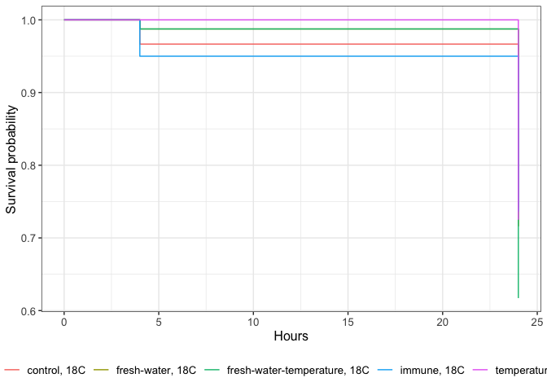
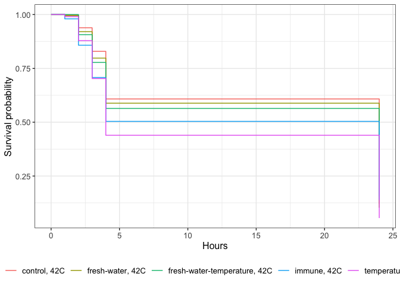

# Set up

Set up workspace, set options, and load required packages.

    knitr::opts_chunk$set(echo = TRUE, warning = FALSE, message = FALSE)

Load libraries.

    library(tidyverse)
    library(ggplot2)
    library(survival)
    library(readxl)
    library(ggsurvfit)
    library(gtsummary)
    library(cardx)
    library(cowplot)

# Read data

Read in data.

    data<-read_excel("data/survival/survival_resazurin.xlsx")

Turn into long format.

    data<-data%>%
      pivot_longer(names_to="time", values_to="status", cols=`0`:`24`)%>%
      mutate(time=as.numeric(time))

Create data frames with control and high temperature subsets.

    control<-data%>%filter(temperature=="18C")
    stress<-data%>%filter(temperature=="42C")

# Generate Kaplan Meier survival curves

## Control temperature 18C

    s1 <- survfit(Surv(time, status) ~ hardening, data = control)
    str(s1)

    ## List of 18
    ##  $ n        : int [1:5] 360 240 240 240 240
    ##  $ time     : num [1:30] 0 1 2 3 4 24 0 1 2 3 ...
    ##  $ n.risk   : num [1:30] 360 300 240 180 120 60 240 200 160 120 ...
    ##  $ n.event  : num [1:30] 0 0 0 0 4 14 0 0 0 0 ...
    ##  $ n.censor : num [1:30] 60 60 60 60 56 46 40 40 40 40 ...
    ##  $ surv     : num [1:30] 1 1 1 1 0.967 ...
    ##  $ std.err  : num [1:30] 0 0 0 0 0.017 ...
    ##  $ cumhaz   : num [1:30] 0 0 0 0 0.0333 ...
    ##  $ std.chaz : num [1:30] 0 0 0 0 0.0167 ...
    ##  $ strata   : Named int [1:5] 6 6 6 6 6
    ##   ..- attr(*, "names")= chr [1:5] "hardening=control" "hardening=fresh-water" "hardening=fresh-water-temperature" "hardening=immune" ...
    ##  $ type     : chr "right"
    ##  $ logse    : logi TRUE
    ##  $ conf.int : num 0.95
    ##  $ conf.type: chr "log"
    ##  $ lower    : num [1:30] 1 1 1 1 0.935 ...
    ##  $ upper    : num [1:30] 1 1 1 1 0.999 ...
    ##  $ t0       : num 0
    ##  $ call     : language survfit(formula = Surv(time, status) ~ hardening, data = control)
    ##  - attr(*, "class")= chr "survfit"

Plot the survival function

    survfit2(Surv(time, status) ~ hardening+temperature, data = control) %>% 
      ggsurvfit() +
      labs(
        x = "Hours",
        y = "Survival probability"
      )

Estimate survival at 24 hours.

    summary(survfit(Surv(time, status) ~ hardening, data = control), times = 24)

    ## Call: survfit(formula = Surv(time, status) ~ hardening, data = control)
    ## 
    ##                 hardening=control 
    ##         time       n.risk      n.event     survival      std.err lower 95% CI 
    ##      24.0000      60.0000      18.0000       0.7411       0.0543       0.6420 
    ## upper 95% CI 
    ##       0.8555 
    ## 
    ##                 hardening=fresh-water 
    ##         time       n.risk      n.event     survival      std.err lower 95% CI 
    ##      24.0000      40.0000      12.0000       0.7159       0.0703       0.5906 
    ## upper 95% CI 
    ##       0.8679 
    ## 
    ##                 hardening=fresh-water-temperature 
    ##         time       n.risk      n.event     survival      std.err lower 95% CI 
    ##       24.000       40.000       16.000        0.617        0.076        0.485 
    ## upper 95% CI 
    ##        0.786 
    ## 
    ##                 hardening=immune 
    ##         time       n.risk      n.event     survival      std.err lower 95% CI 
    ##      24.0000      40.0000      13.0000       0.7362       0.0655       0.6184 
    ## upper 95% CI 
    ##       0.8765 
    ## 
    ##                 hardening=temperature 
    ##         time       n.risk      n.event     survival      std.err lower 95% CI 
    ##      24.0000      40.0000      11.0000       0.7250       0.0706       0.5990 
    ## upper 95% CI 
    ##       0.8775

Estimated survival is ~87% in control temperature.

Use a log rank model to determine statistical differences in curves.

    survdiff(Surv(time, status) ~ hardening, data = control)

    ## Call:
    ## survdiff(formula = Surv(time, status) ~ hardening, data = control)
    ## 
    ##                                     N Observed Expected (O-E)^2/E (O-E)^2/V
    ## hardening=control                 360       18     19.1   0.06234   0.11188
    ## hardening=fresh-water             240       12     12.7   0.04156   0.06630
    ## hardening=fresh-water-temperature 240       16     12.7   0.84156   1.34252
    ## hardening=immune                  240       13     12.7   0.00584   0.00932
    ## hardening=temperature             240       11     12.7   0.23442   0.37396
    ## 
    ##  Chisq= 1.5  on 4 degrees of freedom, p= 0.8

    # Call:
    # survdiff(formula = Surv(time, status) ~ hardening, data = control)
    # 
    #                                     N Observed Expected (O-E)^2/E (O-E)^2/V
    # hardening=control                 360       18     19.1   0.06234   0.11188
    # hardening=fresh-water             240       12     12.7   0.04156   0.06630
    # hardening=fresh-water-temperature 240       16     12.7   0.84156   1.34252
    # hardening=immune                  240       13     12.7   0.00584   0.00932
    # hardening=temperature             240       11     12.7   0.23442   0.37396
    # 
    #  Chisq= 1.5  on 4 degrees of freedom, p= 0.8 

There is no difference in survival at 18C at p=0.8.

Analyze again with a Cox proportional hazards model.

    coxph(Surv(time, status) ~ hardening, data = control)

    ## Call:
    ## coxph(formula = Surv(time, status) ~ hardening, data = control)
    ## 
    ##                                      coef exp(coef) se(coef)      z     p
    ## hardeningfresh-water              0.02005   1.02025  0.37269  0.054 0.957
    ## hardeningfresh-water-temperature  0.36099   1.43475  0.34368  1.050 0.294
    ## hardeningimmune                   0.07687   1.07991  0.36398  0.211 0.833
    ## hardeningtemperature             -0.06777   0.93447  0.38271 -0.177 0.859
    ## 
    ## Likelihood ratio test=1.57  on 4 df, p=0.8147
    ## n= 1320, number of events= 70

    # coxph(formula = Surv(time, status) ~ hardening, data = control)
    # 
    #                                      coef exp(coef) se(coef)      z     p
    # hardeningfresh-water              0.02005   1.02025  0.37269  0.054 0.957
    # hardeningfresh-water-temperature  0.36099   1.43475  0.34368  1.050 0.294
    # hardeningimmune                   0.07687   1.07991  0.36398  0.211 0.833
    # hardeningtemperature             -0.06777   0.93447  0.38271 -0.177 0.859
    # 
    # Likelihood ratio test=1.57  on 4 df, p=0.8147
    # n= 1320, number of events= 70  

    coxph(Surv(time, status) ~ hardening, data = control) %>% 
      tbl_regression(exp = TRUE) 

<table class="gt_table" data-quarto-disable-processing="false" data-quarto-bootstrap="false">
  <thead>
    <tr class="gt_col_headings">
      <th class="gt_col_heading gt_columns_bottom_border gt_left" rowspan="1" colspan="1" scope="col" id="&lt;span class='gt_from_md'&gt;&lt;strong&gt;Characteristic&lt;/strong&gt;&lt;/span&gt;"><strong>Characteristic</strong></th>
      <th class="gt_col_heading gt_columns_bottom_border gt_center" rowspan="1" colspan="1" scope="col" id="&lt;span class='gt_from_md'&gt;&lt;strong&gt;HR&lt;/strong&gt;&lt;/span&gt;&lt;span class=&quot;gt_footnote_marks&quot; style=&quot;white-space:nowrap;font-style:italic;font-weight:normal;line-height: 0;&quot;&gt;&lt;sup&gt;1&lt;/sup&gt;&lt;/span&gt;"><strong>HR</strong>1</th>
      <th class="gt_col_heading gt_columns_bottom_border gt_center" rowspan="1" colspan="1" scope="col" id="&lt;span class='gt_from_md'&gt;&lt;strong&gt;95% CI&lt;/strong&gt;&lt;/span&gt;&lt;span class=&quot;gt_footnote_marks&quot; style=&quot;white-space:nowrap;font-style:italic;font-weight:normal;line-height: 0;&quot;&gt;&lt;sup&gt;1&lt;/sup&gt;&lt;/span&gt;"><strong>95% CI</strong>1</th>
      <th class="gt_col_heading gt_columns_bottom_border gt_center" rowspan="1" colspan="1" scope="col" id="&lt;span class='gt_from_md'&gt;&lt;strong&gt;p-value&lt;/strong&gt;&lt;/span&gt;"><strong>p-value</strong></th>
    </tr>
  </thead>
  <tbody class="gt_table_body">
    <tr><td headers="label" class="gt_row gt_left">hardening</td>
<td headers="estimate" class="gt_row gt_center"> </td>
<td headers="conf.low" class="gt_row gt_center"> </td>
<td headers="p.value" class="gt_row gt_center"> </td></tr>
    <tr><td headers="label" class="gt_row gt_left">    control</td>
<td headers="estimate" class="gt_row gt_center">—</td>
<td headers="conf.low" class="gt_row gt_center">—</td>
<td headers="p.value" class="gt_row gt_center"> </td></tr>
    <tr><td headers="label" class="gt_row gt_left">    fresh-water</td>
<td headers="estimate" class="gt_row gt_center">1.02</td>
<td headers="conf.low" class="gt_row gt_center">0.49, 2.12</td>
<td headers="p.value" class="gt_row gt_center">>0.9</td></tr>
    <tr><td headers="label" class="gt_row gt_left">    fresh-water-temperature</td>
<td headers="estimate" class="gt_row gt_center">1.43</td>
<td headers="conf.low" class="gt_row gt_center">0.73, 2.81</td>
<td headers="p.value" class="gt_row gt_center">0.3</td></tr>
    <tr><td headers="label" class="gt_row gt_left">    immune</td>
<td headers="estimate" class="gt_row gt_center">1.08</td>
<td headers="conf.low" class="gt_row gt_center">0.53, 2.20</td>
<td headers="p.value" class="gt_row gt_center">0.8</td></tr>
    <tr><td headers="label" class="gt_row gt_left">    temperature</td>
<td headers="estimate" class="gt_row gt_center">0.93</td>
<td headers="conf.low" class="gt_row gt_center">0.44, 1.98</td>
<td headers="p.value" class="gt_row gt_center">0.9</td></tr>
  </tbody>
  
  <tfoot class="gt_footnotes">
    <tr>
      <td class="gt_footnote" colspan="4">1 HR = Hazard Ratio, CI = Confidence Interval</td>
    </tr>
  </tfoot>
</table>

Control is the reference level. No differences in survival at 18C.

# Generate Kaplan Meier survival curves

## Stress temperature 42C

    s2 <- survfit(Surv(time, status) ~ hardening, data = stress)
    str(s2)

    ## List of 18
    ##  $ n        : int [1:5] 360 240 240 240 240
    ##  $ time     : num [1:30] 0 1 2 3 4 24 0 1 2 3 ...
    ##  $ n.risk   : num [1:30] 360 300 240 180 120 60 240 200 160 120 ...
    ##  $ n.event  : num [1:30] 0 1 14 21 32 48 0 1 12 16 ...
    ##  $ n.censor : num [1:30] 60 59 46 39 28 12 40 39 28 24 ...
    ##  $ surv     : num [1:30] 1 0.997 0.939 0.829 0.608 ...
    ##  $ std.err  : num [1:30] 0 0.00334 0.01641 0.03167 0.06351 ...
    ##  $ cumhaz   : num [1:30] 0 0.00333 0.06167 0.17833 0.445 ...
    ##  $ std.chaz : num [1:30] 0 0.00333 0.01594 0.03004 0.0559 ...
    ##  $ strata   : Named int [1:5] 6 6 6 6 6
    ##   ..- attr(*, "names")= chr [1:5] "hardening=control" "hardening=fresh-water" "hardening=fresh-water-temperature" "hardening=immune" ...
    ##  $ type     : chr "right"
    ##  $ logse    : logi TRUE
    ##  $ conf.int : num 0.95
    ##  $ conf.type: chr "log"
    ##  $ lower    : num [1:30] 1 0.99 0.909 0.779 0.537 ...
    ##  $ upper    : num [1:30] 1 1 0.969 0.882 0.689 ...
    ##  $ t0       : num 0
    ##  $ call     : language survfit(formula = Surv(time, status) ~ hardening, data = stress)
    ##  - attr(*, "class")= chr "survfit"

Plot the survival function

    survfit2(Surv(time, status) ~ hardening+temperature, data = stress) %>% 
      ggsurvfit() +
      labs(
        x = "Hours",
        y = "Survival probability"
      )

Estimate survival at 24 hours.

    summary(survfit(Surv(time, status) ~ hardening, data = stress), times = 24)

    ## Call: survfit(formula = Surv(time, status) ~ hardening, data = stress)
    ## 
    ##                 hardening=control 
    ##         time       n.risk      n.event     survival      std.err lower 95% CI 
    ##      24.0000      60.0000     116.0000       0.1216       0.0323       0.0722 
    ## upper 95% CI 
    ##       0.2048 
    ## 
    ##                 hardening=fresh-water 
    ##         time       n.risk      n.event     survival      std.err lower 95% CI 
    ##      24.0000      40.0000      83.0000       0.1029       0.0363       0.0516 
    ## upper 95% CI 
    ##       0.2054 
    ## 
    ##                 hardening=fresh-water-temperature 
    ##         time       n.risk      n.event     survival      std.err lower 95% CI 
    ##      24.0000      40.0000      83.0000       0.1551       0.0418       0.0914 
    ## upper 95% CI 
    ##       0.2631 
    ## 
    ##                 hardening=immune 
    ##         time       n.risk      n.event     survival      std.err lower 95% CI 
    ##      24.0000      40.0000      97.0000       0.1386       0.0376       0.0814 
    ## upper 95% CI 
    ##       0.2360 
    ## 
    ##                 hardening=temperature 
    ##         time       n.risk      n.event     survival      std.err lower 95% CI 
    ##      24.0000      40.0000     109.0000       0.0549       0.0236       0.0236 
    ## upper 95% CI 
    ##       0.1277

Estimated stress survival is 12-26%. Temperature hardened is the lowest.

Use a log rank model to determine statistical differences in curves.

    survdiff(Surv(time, status) ~ hardening, data = stress)

    ## Call:
    ## survdiff(formula = Surv(time, status) ~ hardening, data = stress)
    ## 
    ##                                     N Observed Expected (O-E)^2/E (O-E)^2/V
    ## hardening=control                 360      116    133.1     2.195     5.048
    ## hardening=fresh-water             240       83     88.7     0.370     0.756
    ## hardening=fresh-water-temperature 240       83     88.7     0.370     0.756
    ## hardening=immune                  240       97     88.7     0.771     1.577
    ## hardening=temperature             240      109     88.7     4.632     9.470
    ## 
    ##  Chisq= 13.9  on 4 degrees of freedom, p= 0.007

    # Call:
    # survdiff(formula = Surv(time, status) ~ hardening, data = stress)
    # 
    #                                     N Observed Expected (O-E)^2/E (O-E)^2/V
    # hardening=control                 360      116    133.1     2.195     5.048
    # hardening=fresh-water             240       83     88.7     0.370     0.756
    # hardening=fresh-water-temperature 240       83     88.7     0.370     0.756
    # hardening=immune                  240       97     88.7     0.771     1.577
    # hardening=temperature             240      109     88.7     4.632     9.470
    # 
    #  Chisq= 13.9  on 4 degrees of freedom, p= 0.007 

There is a significant difference in survival at p=0.007.

Analyze again with a Cox proportional hazards model.

    coxph(Surv(time, status) ~ hardening, data = stress)

    ## Call:
    ## coxph(formula = Surv(time, status) ~ hardening, data = stress)
    ## 
    ##                                     coef exp(coef) se(coef)     z       p
    ## hardeningfresh-water             0.08431   1.08797  0.14377 0.586 0.55759
    ## hardeningfresh-water-temperature 0.04540   1.04644  0.14380 0.316 0.75224
    ## hardeningimmune                  0.20959   1.23317  0.13763 1.523 0.12780
    ## hardeningtemperature             0.40947   1.50602  0.13343 3.069 0.00215
    ## 
    ## Likelihood ratio test=11.11  on 4 df, p=0.02538
    ## n= 1320, number of events= 488

    # Call:
    # coxph(formula = Surv(time, status) ~ hardening, data = stress)
    # 
    #                                     coef exp(coef) se(coef)     z       p
    # hardeningfresh-water             0.08431   1.08797  0.14377 0.586 0.55759
    # hardeningfresh-water-temperature 0.04540   1.04644  0.14380 0.316 0.75224
    # hardeningimmune                  0.20959   1.23317  0.13763 1.523 0.12780
    # hardeningtemperature             0.40947   1.50602  0.13343 3.069 0.00215
    # 
    # Likelihood ratio test=11.11  on 4 df, p=0.02538
    # n= 1320, number of events= 488 

    coxph(Surv(time, status) ~ hardening, data = stress) %>% 
      tbl_regression(exp = TRUE) 

<table class="gt_table" data-quarto-disable-processing="false" data-quarto-bootstrap="false">
  <thead>
    <tr class="gt_col_headings">
      <th class="gt_col_heading gt_columns_bottom_border gt_left" rowspan="1" colspan="1" scope="col" id="&lt;span class='gt_from_md'&gt;&lt;strong&gt;Characteristic&lt;/strong&gt;&lt;/span&gt;"><strong>Characteristic</strong></th>
      <th class="gt_col_heading gt_columns_bottom_border gt_center" rowspan="1" colspan="1" scope="col" id="&lt;span class='gt_from_md'&gt;&lt;strong&gt;HR&lt;/strong&gt;&lt;/span&gt;&lt;span class=&quot;gt_footnote_marks&quot; style=&quot;white-space:nowrap;font-style:italic;font-weight:normal;line-height: 0;&quot;&gt;&lt;sup&gt;1&lt;/sup&gt;&lt;/span&gt;"><strong>HR</strong>1</th>
      <th class="gt_col_heading gt_columns_bottom_border gt_center" rowspan="1" colspan="1" scope="col" id="&lt;span class='gt_from_md'&gt;&lt;strong&gt;95% CI&lt;/strong&gt;&lt;/span&gt;&lt;span class=&quot;gt_footnote_marks&quot; style=&quot;white-space:nowrap;font-style:italic;font-weight:normal;line-height: 0;&quot;&gt;&lt;sup&gt;1&lt;/sup&gt;&lt;/span&gt;"><strong>95% CI</strong>1</th>
      <th class="gt_col_heading gt_columns_bottom_border gt_center" rowspan="1" colspan="1" scope="col" id="&lt;span class='gt_from_md'&gt;&lt;strong&gt;p-value&lt;/strong&gt;&lt;/span&gt;"><strong>p-value</strong></th>
    </tr>
  </thead>
  <tbody class="gt_table_body">
    <tr><td headers="label" class="gt_row gt_left">hardening</td>
<td headers="estimate" class="gt_row gt_center"> </td>
<td headers="conf.low" class="gt_row gt_center"> </td>
<td headers="p.value" class="gt_row gt_center"> </td></tr>
    <tr><td headers="label" class="gt_row gt_left">    control</td>
<td headers="estimate" class="gt_row gt_center">—</td>
<td headers="conf.low" class="gt_row gt_center">—</td>
<td headers="p.value" class="gt_row gt_center"> </td></tr>
    <tr><td headers="label" class="gt_row gt_left">    fresh-water</td>
<td headers="estimate" class="gt_row gt_center">1.09</td>
<td headers="conf.low" class="gt_row gt_center">0.82, 1.44</td>
<td headers="p.value" class="gt_row gt_center">0.6</td></tr>
    <tr><td headers="label" class="gt_row gt_left">    fresh-water-temperature</td>
<td headers="estimate" class="gt_row gt_center">1.05</td>
<td headers="conf.low" class="gt_row gt_center">0.79, 1.39</td>
<td headers="p.value" class="gt_row gt_center">0.8</td></tr>
    <tr><td headers="label" class="gt_row gt_left">    immune</td>
<td headers="estimate" class="gt_row gt_center">1.23</td>
<td headers="conf.low" class="gt_row gt_center">0.94, 1.62</td>
<td headers="p.value" class="gt_row gt_center">0.13</td></tr>
    <tr><td headers="label" class="gt_row gt_left">    temperature</td>
<td headers="estimate" class="gt_row gt_center">1.51</td>
<td headers="conf.low" class="gt_row gt_center">1.16, 1.96</td>
<td headers="p.value" class="gt_row gt_center">0.002</td></tr>
  </tbody>
  
  <tfoot class="gt_footnotes">
    <tr>
      <td class="gt_footnote" colspan="4">1 HR = Hazard Ratio, CI = Confidence Interval</td>
    </tr>
  </tfoot>
</table>

Control is the reference level. There is a significant difference
between control and temperature hardening survival.

# Generate plots

Set theme.

    my_theme<-theme_classic()

Control

    plot1<-survfit2(Surv(time, status) ~ hardening, data = control) %>% 
      ggsurvfit() +
      labs(
        x = "Hours",
        y = "Survival probability",
        title="18°C"
      )+
      ylim(0,1)+
      my_theme+
      geom_text(x=10, y=0.2, label="Cox PH p=0.8")+
      theme(legend.position="none")

Stress

    plot2<-survfit2(Surv(time, status) ~ hardening, data = stress) %>% 
      ggsurvfit() +
      labs(
        x = "Hours",
        y = "Survival probability",
        title = "42°C"
      )+
      ylim(0,1)+
      my_theme+
      geom_text(x=10, y=0.2, label="Cox PH p=0.025")+
      geom_text(x=10, y=0.15, label="Temperature vs control p=0.002")+
      geom_text(x=10, y=0.10, label="All others vs control p>0.05")+
      theme(legend.position="right")

Assemble plot

    plots<-plot_grid(plot1, plot2, rel_widths=c(0.65,1), ncol=2)

    ggsave(plots, filename="figures/survival/KMcurves.png", width=10, height=4)
